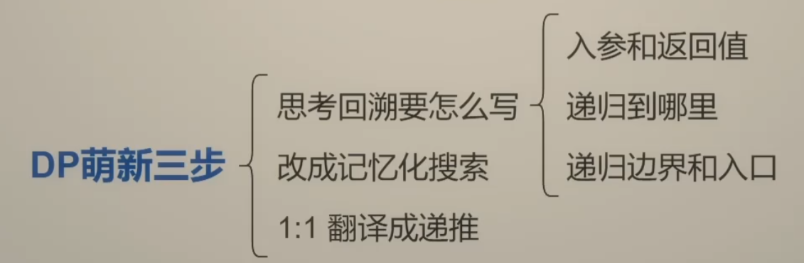
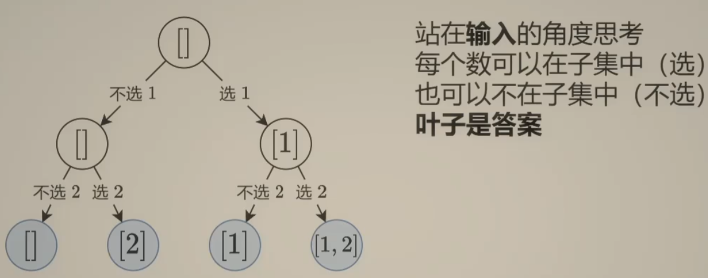
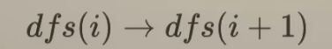
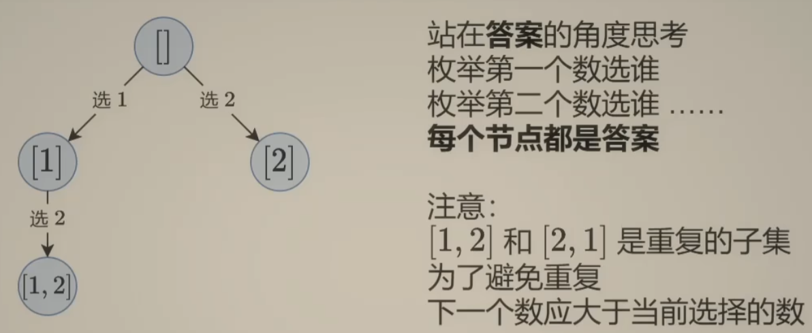
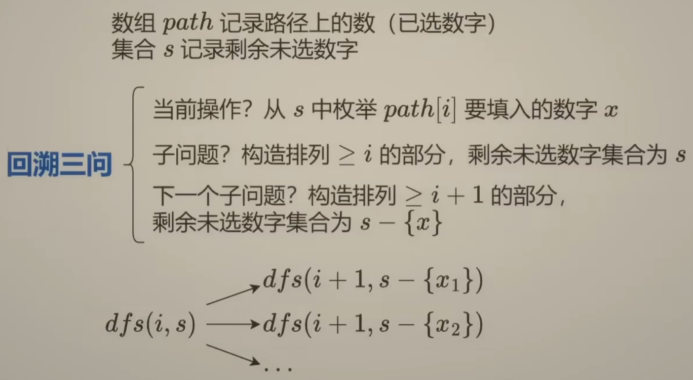
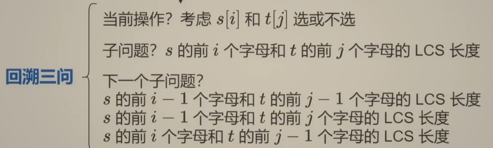
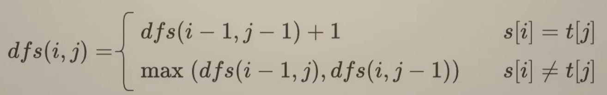
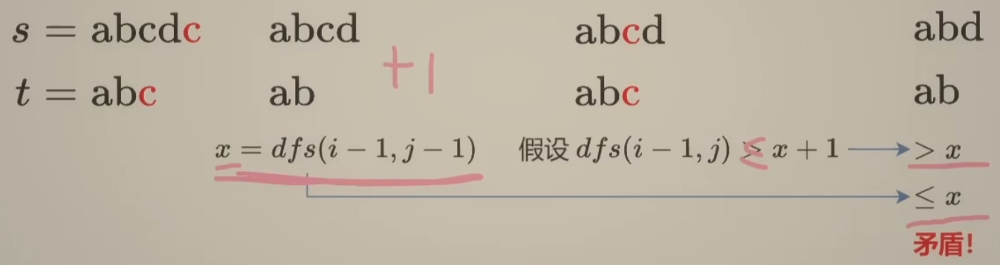
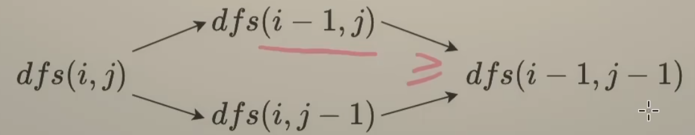

 

2.detach()和.data

参考：https://blog.csdn.net/baidu_35692628/article/details/136271999

detach()就是返回一个新的tensor，并且这个tensor是从当前的计算图中分离出来的。但是返回的tensor和原来的tensor是共享内存空间的。

```
a = torch.tensor([1.0, 2.0, 3.0], requires_grad = True)
a = a.detach() # 会将requires_grad 属性设置为False
print(a.requires_grad)# ->False
```

如果A网络的输出被喂给B网络作为输入， 如果我们希望在梯度反传的时候只更新B中参数的值，而不更新A中的参数值，这时候就可以使用detach()

```python3
a = A(input)
a = a.deatch() # 或者a.detach_()进行in_place操作
out = B(a)
loss = criterion(out, labels)
loss.backward()
```

如果希望修改A的参数， 而不希望修改B的参数， 那么就需要手动将B中参数的requires_grad属性设置为False

```text
for param in B.parameters():
    param.requires_grad = False
```

**区别：**Tensor.data不能被autograd追踪到，如果你修改了Tensor.data返回的新Tensor，原来的Tensor也会改变， 但是这时候的微分并没有被追踪到，那么当你执行loss.backward()的时候并不会报错，但是<u>求的梯度就是错误的</u>！因此， 如果你使用了Tensor.data，那么切记一定不要随便修改返回的新Tensor的值。如果你使用的是Tensor.detach()方法，当你修改他的返回值并进行求导操作，会报错。 因此，Tensor.detach()是安全的。

##### 3.view和reshape区别

**实现方式：**

`reshape`：创建一个新的张量，**其元素与原始张量共享内存空间**，在一个张量上的修改会影响到另一个张量

`view`:不会创建一个新的张量，而是返回一个与原始张量共享数据存储的**新视图**。**原始张量和新的视图张量上的元素被修改，它们会互相影响，因为它们共享相同的数据**

**内存连续性：**

`reshape`：不保证新张量在内存中的连续性。

`view`:如果原始张量在内存中是连续存储的，那么新视图张量也会保持连续性，否则会返回一个不连续的张量

**是否支持自动计算维度：**

`reshape`：可以通过将某个维度指定为**-1**，让 PyTorch 自动计算该维度的大小。

`view`需要手动计算新视图张量的大小。**当对不连续的张量进行形状变换时，PyTorch 会自动将其复制为连续的张量，这可能会导致额外的内存开销。为了避免这种情况，你可以使用 contiguous() 方法将张量变为连续的。**

**性能影响：**

`reshape`：大多数情况下，reshape 和view一样高效，但在需要复制数据的情况下，reshape 的开销会增加。这可能会导致内存使用量的增加，但不会直接增加模型的参数或 FLOPs。

`view`只是对张量形状的重新解释而不涉及数据的复制或移动，因此它的**开销非常低**，不会增加参数或 FLOPs。


# 常见函数

##### 0 常见python数据操作

```python
# 运算
'''
除   /            print(3/2)  # 1.5
整除   //         print(3//2) # 1
取模   %


'''
# 字符
'''
初始化：s_example = 'xwp_123{）徐文品'
查：s[-1:-6:-2]
首字母大写：s_example.capitalize()
字母转大写：s_example.upper()
去掉两端的空白符(空格，\t，....)：s_example.strip() / username=input().strip()
替换：s_example.replace('xwp', 'wwl')
切割：s_example.split('_')
'''
# 列表
'''
初始化：list_example=['a', ',', 'xwp', 123, [123],[9,[5]]]
增：list_example.append("wwl")
插入：list_example.insert(0,"wwl")
合并：list_example.extend([1,2,3])
删：ret=list_example.pop(-1) / ret=list_example.remove(2) 
查：(list[6][-1])
排序：list_example.sort()
清空 list_example.clear()
'''
# 元组
# 字典
'''
新增：dic['wwx'] = 'wudi'  
删除：dic.pop('wwx')
'''
# 集合
'''
初始化：set_example = set()
增：set_example.add(?)
删：set_example.remove(?)  /  set_example.discard(?)
复制：set_example.copy()
交集：set_example.intersection(set_example1) /  set_example & set_example1
并集：set_example | set_example1
差集：set_example - set_example1
去重：set(list_example[])
子集：set_example1.issubset(set_example2) / set_example1 <= set_example2       1是否是2的子集
集合重置 set_example.clear()
'''
# 推导式
'''
集合推导式、
[表达式 for 变量 in 列表 if 条件]
[out_exp_res for out_exp in input_list if condition]
'''
# 迭代器
# 生成器
# lambda
'''
lambda 参数列表: 表达式
'''
# 装饰器
# 多线程
```

##### 1 enumerate(sequence, [start=0])

多用于在for循环中得到计数，利用它可以同时获得索引和值

坑：以列表为例。虽然指定开始，但是列表还是从头开始，只是索引变了

##### 2 sort/join/startswith/endwith

```python
sort() #对字符串排序
join() #对字符串列表进行拼接
startswith()
endwith()
```

##### 3 set()

- 原列表使用set()之后，会对列表去重，并变成set对象，type不变。set对象可以进行并集\交集\....
- 可以使用set()来避免存储到重复的==O(1).列表检查需要O(n)起步。因为集合在内部使用哈希表（hash table）来存储元素。

##### 4 数据类型互转

```python
#  字符 ->  unicode编码
ord('a')
#  数字 ->  字符
str(1)
# 字符拼接
''.join(strs)
```

#####  5 zip()

`zip()`函数接受任意数量的迭代器作为输入，并返回一个迭代器，该迭代器生成的是由**所有输入迭代器中位置对应的元素**组成的元组。

```python
# [[1,2,3],[4,5,6],[7,8,9]] => [(1, 4, 7), (2, 5, 8), (3, 6, 9)] => [(3, 6, 9), (2, 5, 8), (1, 4, 7)]
print(list(zip(*matrix)))  # 转置矩阵,元组也可以像列表一样切片操作
print(list(zip(*matrix))[::-1])   # 转置矩阵再将行的顺序会被颠倒
```

##### 6 collections

```python
# defaultdict：定义字典
from collections import defaultdict
d = collections.defaultdict(int/list)   ## v的数据类型int/list格式 
# Counter：对 列表元素 进行计数统计
c = Counter(list('programming'))
结果==>Counter({'r': 2, 'g': 2, 'm': 2, 'p': 1, 'o': 1, 'a': 1, 'i': 1, 'n': 1})
# OrderedDict()：对字典排序
from collections import OrderedDict
OrderedDict(sorted(d.items(), key=lambda t: t[0]))# 按照key排序的字典
OrderedDict(sorted(d.items(), key=lambda t: t[1]))# 按照value排序的字典
OrderedDict(sorted(d.items(), key=lambda t: len(t[0])))# 按照key的长度排序的字典
# namedtuple:命名元组
import collections 
Point = collections.namedtuple("Point1", ["x", "y"])
p = Point(1,2)
print(p, p.x, p.y)
结果==>Point1(x=1, y=2) 1 2
# deque：高效实现插入和删除操作的双向列表，适合用于队列和栈
from collections import deque
tmp = collections.deque("a")
tmp.append("b") # 在右边添加元素
tmp.appendleft("c")  # 在左边添加元素 
tmp.extend(["B", "BB", "BBB"])  # 添加可迭代对象(拼接) 
tmp.extendleft(["C", "CC", "CCC"]) # 在左侧添加可迭代对象(拼接) 
tmp.insert(1, "123")  # 在某个位置，添加上某个元素
tmp.pop()  # 弹出右边第一个，注意 pop() 内部不能有参数
tmp.popleft()# 弹出左边第一个，注意 pop() 内部不能有参数
```


##### ????
#####  injector
1. 依赖注入管理
自动管理类之间的依赖关系
在创建对象时自动注入所需的依赖项
避免手动创建和管理复杂的对象依赖链
2. 单例模式管理
通过 @singleton 装饰器确保某些服务只创建一次实例
在整个应用生命周期中复用对象实例
3. 服务注册和提供
在 xxxModule 中定义核心服务

#####  pydantic

##### callback
当程序运行是，一般情况下，应用程序会时常通过API调用库里所预先备好的函数。但是有些库函数却要求应用先传给它一个函数，好在合适的时候调用，以完成目标任务。这个被传入的、后又被调用的函数就称为回调函数（callback function）
简单例子
```
def my_callbcak(args):
    print(*args)

def caller(args, func):
    func(args)

caller((1,2), my_callbcak)

结果：
# 1 2
```
##### @wraps(func)
Python装饰器（decorator）在实现的时候，被装饰后的函数其实已经是另外一个函数了（函数名等函数属性会发生改变），为了不影响，Python的functools包中提供了一个叫wraps的decorator来消除这样的副作用。
```
from functools import wraps   
def my_decorator(func):
    def wrapper(*args, **kwargs):
        '''decorator'''
        print('Calling decorated function...')
        return func(*args, **kwargs)
    return wrapper  
 
@my_decorator 
def example():
    """Docstring""" 
    print('Called example function')
print(example.__name__, example.__doc__)
# ('wrapper', 'decorator')

from functools import wraps   
def my_decorator(func):
    @wraps(func)
    def wrapper(*args, **kwargs):
        '''decorator'''
        print('Calling decorated function...')
        return func(*args, **kwargs)
    return wrapper  
 
@my_decorator 
def example():
    """Docstring""" 
    print('Called example function')
print(example.__name__, example.__doc__)
# ('example', 'Docstring')
```
带上参数的回调函数
```
def appy_async(func, args, *, callback):
    result = func(*args)
    #异步执行的函数 同时将执行后返回到这个早从这个函数跳出去
    callback(result)
 
def add(x ,y):
    return x + y
 
class ResultHandler(object):
    def __init__(self):
        self.sequence = 0
 
    def handle(self, result):
        self.sequence += 1
        print("[{}] Got: {}".format(self.sequence, result))
 
resultHandler = ResultHandler()
appy_async(add, (2,3), callback=resultHandler.handle)
```
使用闭包代替上面的类来实现
```
def apply_async(func, args, *, callback):
    result = func(*args)
    callback(result)
  
def add(x ,y):
    return x + y
  
def make_handler():
    sequence = 0
    def handler(result):
        nonlocal sequence
        sequence += 1
        print("[{}] Got:{}".format(sequence, result))
    return handler
  
handler = make_handler()
apply_async(add, (2,3), callback=handler)
```
使用协程
```
def apply_async(func, args, *, callback):
    result = func(*args)
    callback(result)

def add(x, y):
    return x + y

def make_handler():
    sequence = 0
    while True:
        result = yield
        sequence += 1
        print("[{}] Got:{}".format(sequence, result))

handle = make_handler()
next(handle)
apply_async(add, (2,3), callback=handle.send)
```

# 算法

## 滑动窗口

定长

不定长

多指针

## 二分算法

二分答案

最小化最大值

最大化最小值

第K小

## 常用数据结构

- [ ] 前缀和

- [ ] 差分

- [ ] 栈

- [ ] 队列

- [ ] 堆

  ```
  堆队列中，索引为 k 的元素与其周围元素之间的关系:

  它的第一个子结点是 2*k + 1。
  它的第二个子结点是 2*k + 2。
  它的父结点是 (k - 1) // 2。
  ```

  ```python
  import heapq   # 使用列表实现小根堆操作
  '''
  heapq.heapify(x)  # 将list x 转换成堆，原地，线性时间内。
  ===== heapq 模块中的其他基本操作假设列表已经是堆 =====
  pq=[]   # 下面item可以等于（1，2，3,...），但是heapq相关操作都针对第一个判断

  heapq.heappush(pq,item)  # 将 item 的值加入 heap 中，保持堆的不变性。
  heapq.heappop(pq)  # 弹出并返回 heap 的最小的元素，保持堆的不变性。
  heapq.heappushpop(pq,item)  # 将 item 放入堆中，然后弹出并返回 heap 的最小元素。
  heapq.heapreplace(pq,item) # 弹出并返回 heap 中最小的一项，同时推入新的 item。
  heapq.nlargest(n, iterable, key=None)  # 从 iterable 所定义的数据集中返回前 n 个最大元素组成的列表。
  heapq.nsmallest(n, iterable, key=None)  # 从 iterable 所定义的数据集中返回前 n 个最小元素组成的列表。
  '''
  ```

  ​

- [ ] 字典树

- [ ] 并查集

- [ ] 树状数组

- [ ] 线段树


## 链表、二叉树与一般树

前后指针

快慢指针

DFS

BFS

直径

LCA

## 单调栈

- [ ] 基础

  【思想】

  重复利用计算过的子数组之和，从而降低区间查询需要累加计算的次数。

  【例题】560

  【解答模板】

  ```
  for 数组循环 {
      while 单调栈条件不成立 {
          pop(单调栈)

          // 结合题意计算
          ...
      }
      数组index入单调栈
  }
  ```

- [ ] 矩形面积

- [ ] 贡献法

- [ ] 最小字典序


## 贪心算法

- [x] 基本贪心策略

  【思想】找局部最优解=不走下坡路

  【技巧】题目中有`最大`，可以考虑用贪心

  【个人理解】每次选择，我就想 最大可能 接近 目标！

  【例题】53/

- [ ] 反悔

- [ ] 区间

- [ ] 字典序

- [ ] 数学

- [ ] 思维

- [ ] 脑筋急转弯

- [ ] 构造


## 动态规划

【思想】

①dp数组含义；②递推公式；③dp数组初始化；④遍历顺序；⑤打印dp数组



【个人理解】

- [ ] 入门

- [ ] 背包

  【 **0-1背包问题**】

  ```python
  def 0_1_knapsack(capacity: int, w: List[int], v: List[int]) -> int:
  	n=len(w)
      @cache # 缓存dfs(i, c)的结果
  	def dfs(i,c):
          # 没有物品可选了
          if i < 0: 
              return 0
          # 当前剩余容量c小于第i个物品的重量w[i]，跳过当前，继续找
          if c<w[i]: 
              return dfs(i-1,c) 
          return max(dfs(i-1,c),dfs(i-1,c-w[i])+v[i])
      return dfs(n-1, capacity) # 从最后一个物品开始（倒着选）

  	#伪代码
  	n=len(w)
      f = [[0]*(target+1) for _ in range(n+1)]
      f[0][0] = ?
      
      for i,x in enumerate(nums):
          for c in range(target+1):
              if c<x:
                  f[i+1][c]=f[i][c]
              else:
                  f[i+1][c]=max(f[i][c], f[i][c-x])
      retur f[n][target]
  ```

  $dfs(i, c) = max(dfs(i-1, c), dfs(i-1, c-w[i]) + v[i])$

  变形体：

  恰好装满capacity, 求方案数/最大/最小价值和

  $dfs(i, c) = dfs(i-1, c) + dfs(i-1, c-w[i]) + v[i]$

  至少装满capacity, 求方案数/最小价值和

  【 **完全背包问题** 】

  ```python
  def wanquan_knapsack(capacity: int, w: List[int], v: List[int]) -> int:
  	n=len(w)
      @cache # 缓存dfs(i, c)的结果
  	def dfs(i,c):
          # 没有物品可选了
          if i < 0: 
              return 0
          # 当前剩余容量c小于第i个物品的重量w[i]，跳过当前，继续找
          if c<w[i]: 
              return dfs(i-1,c) 
              # 与0-1背包不同在于，当前物品选完还能选，所以是i
          return max(dfs(i-1,c),dfs(i,c-w[i])+v[i])
      return dfs(n-1, capacity) # 从最后一个物品开始（倒着选）
  ```

  变形体：

  恰好装满capacity, 求方案数/最大/最小价值和

  恰好装满capacity, 求最小价值和 

  $dfs(i, c) = min(dfs(i-1, c) , dfs(i-1, c-w[i]) + v[i])$

  至少装满capacity, 求方案数/最小价值和

- [ ] 状态机

- [ ] 划分

- [ ] 区间

- [ ] 状压

- [ ] 数位

- [ ] 数据结构优化

- [ ] 树形

- [ ] 博弈

- [ ] 概率期望


## 网格图

DFS

BFS

综合应用

## 位运算

基础

性质

拆位

试填

恒等式

思维

## 图论算法

- [x] 概念：

  度、出度、入度、连通图（无向图）、强连通图（有向图）、连通分量（无向图）、强连通分量（有向图）、、

- [ ] DFS

  ​

- [ ] BFS

- [ ] 拓扑排序

- [ ] 最短路

- [ ] 最小生成树

- [ ] 二分图

- [ ] 基环树

- [ ] 欧拉路径


## 数学算法

数论

组合

概率期望

博弈

计算几何

随机算法


==阶段 1（max：中等难度的中等题）==

- [x] 数组：二分法、快慢指针283、双指针、滑动窗口209、前缀和、哈希


- [x] 矩阵：


- [x] 字符串：

- [ ] 初级数据结构 ：

- [x] 列表：54(学习转置)

- [x] 链表：快慢指针27/140/141、双指针、哨兵节点(方便删除头结点)、

- [x] 栈：单调栈

- [x] 单向队列：

- [x] 双向队列：deque()

  【例题】239

- [x] 哈希表:

- [x] 双指针：

- [x] 二分查找：704

- [ ] 堆：

- [x] 树：二叉树、DFS、BFS

- [x] 递归（基本可以抽象成树的思想来做）：

  【思想】子问题与原问题相似

  【技巧】

  【个人理解】

  【例题】

- [ ] 分治（基本可以抽象成树的思想来做）

- [ ] 回溯（基本可以抽象成树的思想来做）：

  【**子集型回溯 思想**】

  定义：每个元素都可以 <u>选/不选</u>

  

  回溯三问：当前操作？枚举第$i$个数选/ 不选: for j in range(n)

  ​		   子问题？从下标$≥i$的数字中构造子集:
  		   下一个子问题？构造字符串$≥i+1$的部分: dfs(i + 1)
  

  $i$表示当前根节点，$≥i$表示子树

  

  回溯三问：当前操作？枚举$j≥i$要填入的字母: for j in range(i, n)

  ​		   子问题？从下标$≥i$的数字中构造子集
  		   下一个子问题？构造字符串$≥j+1$的部分: dfs(j + 1)

  【**例题**】

  组合题很多

  53/46/78

  【**组合型回溯 思想**】

  【**排列型回溯 思想**】

  

  ```
          n = len(nums)
          if n == 0:
              return

          path = []
          ans = []
          flag = [0] * n  # 标记是否被访问过

          def dfs(i):
              if i == n:
                  ans.append(path[:])
                  return

              for num in range(n): # 遍历当前层所有元素
                  if flag[num] != 1: # 设置path加入的条件
                      path.append(nums[num])
                      flag[num] = 1
                      dfs(i + 1)
                      flag[num] = 0 # 递归结束，释放标记
                      path.pop()

          dfs(0)
          return ans
  ```

  ​

------

==阶段 2（max：高等难度的中等题和高频出现的困难题）==

- [ ] 排序：二分、

- [x] 贪心

  【思想】找局部最优解=不走下坡路

  【技巧】题目中有`最大`，可以考虑用贪心

  【个人理解】每次选择，我就想 最大可能 接近 目标！

  【例题】53/

- [x] 滑动窗口：定长、不定长438、

- [x] 一维前缀和（前缀异或放在下一小节的位运算中学）

- [x] 单调栈基础：

  【思想】

  重复利用计算过的子数组之和，从而降低区间查询需要累加计算的次数。

  【例题】560

- [ ] 并查集

- [ ] 图论入门：概念 + DFS + BFS + 拓扑 + Prim + Kruskal + Dijkstra + Floyd。DFS / BFS 中先做常规题，后做网格题。

- [x] 动态规划基础：斐契那波数、爬楼梯、                              线性、区间、背包基础（背包的种类很多）、状态机、树形（打家劫舍那几道题）

  【思想】

  ①dp数组含义；②递推公式；③dp数组初始化；④遍历顺序；⑤打印dp数组

  

  【个人理解】

  【经典例题】背包问题、打家劫舍、股票问题、子序列问题

  【 **0-1背包问题**】

  ```python
  def 0_1_knapsack(capacity: int, w: List[int], v: List[int]) -> int:
  	n=len(w)
      @cache # 缓存dfs(i, c)的结果
  	def dfs(i,c):
          # 没有物品可选了
          if i < 0: 
              return 0
          # 当前剩余容量c小于第i个物品的重量w[i]，跳过当前，继续找
          if c<w[i]: 
              return dfs(i-1,c) 
          return max(dfs(i-1,c),dfs(i-1,c-w[i])+v[i])
      return dfs(n-1, capacity) # 从最后一个物品开始（倒着选）

  	#伪代码
  	n=len(w)
      f = [[0]*(target+1) for _ in range(n+1)]
      f[0][0] = ?
      
      for i,x in enumerate(nums):
          for c in range(target+1):
              if c<x:
                  f[i+1][c]=f[i][c]
              else:
                  f[i+1][c]=max(f[i][c], f[i][c-x])
      retur f[n][target]
  ```

  $dfs(i, c) = max(dfs(i-1, c), dfs(i-1, c-w[i]) + v[i])$

  变形体：

  恰好装满capacity, 求方案数/最大/最小价值和

  $dfs(i, c) = dfs(i-1, c) + dfs(i-1, c-w[i]) + v[i]​$

  至少装满capacity, 求方案数/最小价值和

  ​

  【 **完全背包问题** 】

  ```python
  def wanquan_knapsack(capacity: int, w: List[int], v: List[int]) -> int:
  	n=len(w)
      @cache # 缓存dfs(i, c)的结果
  	def dfs(i,c):
          # 没有物品可选了
          if i < 0: 
              return 0
          # 当前剩余容量c小于第i个物品的重量w[i]，跳过当前，继续找
          if c<w[i]: 
              return dfs(i-1,c) 
              # 与0-1背包不同在于，当前物品选完还能选，所以是i
          return max(dfs(i-1,c),dfs(i,c-w[i])+v[i])
      return dfs(n-1, capacity) # 从最后一个物品开始（倒着选）
  ```

  变形体：

  恰好装满capacity, 求方案数/最大/最小价值和

  恰好装满capacity, 求最小价值和 

  $dfs(i, c) = min(dfs(i-1, c) , dfs(i-1, c-w[i]) + v[i])$

  至少装满capacity, 求方案数/最小价值和

  【 **线性DP问题** 】

  

  

  s[t]=s[j]时不考虑dfs(i-i, j)和dfs(i, j-i)，是因为：

  

  s[t]=s[j]时不考虑dfs(i-i, j-1)，是因为：

  

  ```python
  @cache
  def dfs(i, j):
      if i < 0 or j < 0:
          return 0
      if text1[i]==text2[j]:
          return dfs(i-1, j-1) + 1
      return max(dfs(i-1, j), dfs(i, j-1))

  # 注意内外循环
  f = [[0] *(n+1) for _ in range(m+1)]
  # print(f)
  for i,x in enumerate(text1):
      for j,y in enumerate(text2):
          if x == y :
              f[i+1][j+1] = f[i][j] + 1
          else:
              f[i+1][j+1] = max(f[i][j+1], f[i+1][j])

  # print(f)
  return f[-1][-1]
  ```

  ​

- [ ] 字典树

- [ ] 有序集合

- [ ] 会手写二叉堆、KMP、红黑树的实现（这些先学会、平时忘了没事，考前复习背一遍，不难的）

- [ ] 知晓高级树的基本性质（比如 B 树，B+ 树的应用场景，不要求精通）

------

==阶段 3（max：低级难度的困难题，依然以中等题为主）==

- [ ] 二维前缀和

- [ ] 差分数组

- [ ] 位运算

- [ ] 单调栈模拟

- [ ] 动态规划进阶（普通的二维变一维优化，还有多种进阶背包比如状态压缩、博弈，但除去与下一小节知识结合的部分，比如单调队列优化）

  ​

- [ ] 图论中的 BellmanFord, SPFA, A 星 这几个算法，但考察频率很低，个人倾向于跳过。

- [ ] 树的 Morris 遍历

------

==阶段 4（max：不限，一般是面试官没看中你然后出的劝退题，你做出来会有转机）==

- [ ] 图论进阶 (强连通分量、基环树、网络流、二分匹配、欧拉回路)
    我的《图论进阶》没有与这些知识点完全对应，并且强连通分量被我放在了《图论入门》。

- [ ] 单调队列
- [ ] 数学（比如最大公约数、组合数学）
- [ ] 线段树
- [ ] 树状数组
- [ ] 滚动哈希
- [ ] KMP 变形应用
- [ ] Manacher 算法
- [ ] 动态规划的多种进阶优化方式（严格来说，可能会作为 follow up，在周赛中除第四题外没写这种优化方式也能过)


# Transformers

#### AutoConfig 、AutoTokenizer、AutoModel from_pretrained()

```python
AutoConfig.from_pretrained()
'''
pretrained_model_name_or_path:指定要加载的预训练模型的名称或路径。
cache_dir:指定用于缓存预训练模型配置文件的目录路径。
force_download:如果设置为 `True`，将强制重新下载模型配置，覆盖任何现有的缓存。
resume_download:如果设置为 True，则在下载过程中重新开始下载，即使部分文件已经存在。
proxies:用于指定代理服务器的设置。代理服务器允许您在访问互联网资源时通过中继服务器进行请求，这对于在受限网络环境中使用 Transformers 库来加载模型配置信息非常有用。
revision:指定要加载的模型的 Git 版本（通过提交哈希）。
return_unused_kwargs:如果将此参数设置为 True，函数将返回未使用的配置参数。这对于识别和检查传递给函数的不受支持或未识别的参数很有用。
trust_remote_code:在使用 Hugging Face Transformers 库时控制是否信任从远程下载的配置文件。
'''

AutoTokenizer.from_pretrained()
'''
pretrained_model_name_or_path:
inputs:表示额外的位置参数
config:这个配置对象用于确定要实例化的分词器类
cache_dir:
force_download:
resume_download:
proxies:
revision:
subfolder:如果相关文件位于 huggingface.co 模型仓库的子文件夹内（例如 facebook/rag-token-base），请在这里指定。
use_fast:布尔值，指示是否强制使用 fast tokenizer
tokenizer_type:参数用于指定要实例化的分词器的类型
trust_remote_code:
padding_side：left/right：指定 tokenizer 添加填充标记(padding)的位置
'''

AutoModel.from_pretrained()
'''
pretrained_model_name_or_path:
model_args:直接传参的方式:("./models/bert-base-chinese", num_hidden_layers=3)
           指定配置类实例:("./models/bert-base-chinese", config=config)
trust_remote_code:
local_files_only:如果设置为True，将只尝试从本地文件系统加载模型。如果本地文件不存在，它将不会尝试从Hugging Face模型存储库下载模型文件。
use_auth_token:在默认情况下不使用身份验证令牌。
'''
```

#### Pipeline

如果只是想直接利用PLM完成下游任务，例如情感分类、机器问答等，你可以直接调用transformers中提供的Pipeline类

```python
'''
feature-extraction （获得文本的向量化表示）
fill-mask （填充被遮盖的词、片段）
ner（命名实体识别）
question-answering （自动问答）
sentiment-analysis （情感分析）
summarization （自动摘要）
text-generation （文本生成）
translation （机器翻译）
zero-shot-classification （零训练样本分类）
'''
pipeline("sentiment-analysis", model="uer/gpt2-chinese-poem")

# 例子
classifier_sent = pipeline('sentiment-analysis')
classifier_sent('I love you! ')
# 输出[{'label': 'POSITIVE', 'score': 0.9998782873153687}]

```

#### dataset

```python
load_dataset()
'''
加载在线数据集；加载数据集合集中的某一项任务；划分并划分数据集
'''
load_dataset("madao33/new-title-chinese")
'''
DatasetDict({
    train: Dataset({
        features: ['title', 'content'],
        num_rows: 5850
    })
    validation: Dataset({
        features: ['title', 'content'],
        num_rows: 1679
    })
})
'''
dataset = load_dataset("madao33/new-title-chinese", split="train") # 取训练集
dataset = load_dataset("madao33/new-title-chinese", split="train[10:100]") # 取切片
dataset = load_dataset("madao33/new-title-chinese", split="train[:50%]")  # 取百分比
dataset = load_dataset(..., split=["train[:50%]", "train[50%:]"]) # 取多个
boolq_dataset = load_dataset("super_glue", "boolq") # 加载数据集合集中的某一项任务
metric = load_metric("super_glue", "boolq")# 加载数据集合集中的某一项任务的求精度方法
boolq_dataset = load_dataset("super_glue", "boolq", split=["train[:50%]", "train[50%:]"])
```

- 查看数据集

```python
datasets["train"][:2] # 查看多条数据集
datasets["train"]["title"][:5] # 查看数据集里面的某个字段
datasets["train"].column_names # 查看所有的列
datasets["train"].features # 查看所有特征
```

- 数据集划分

```python
dataset = datasets["train"]
# 按照某一个类别进行比例划分
dataset.train_test_split(test_size=0.1, stratify_by_column="label"，seed=3407)
```

- 数据选取与过滤

```python
# 选取
datasets["train"].select([0, 1])
# 过滤
filter_dataset = datasets["train"].filter(lambda example: "中国" in example["title"])
```

- 数据映射

```python
def add_prefix(example):
    example["title"] = 'Prefix: ' + example["title"]
    return example
prefix_dataset = datasets.map(add_prefix)
prefix_dataset["train"][:10]["title"]

from transformers import AutoTokenizer
tokenizer = AutoTokenizer.from_pretrained("bert-base-chinese")
def preprocess_function(example):
    model_inputs = tokenizer(example["content"], max_length=512, truncation=True)
    labels = tokenizer(example["title"], max_length=32, truncation=True)
    # label就是title编码的结果
    model_inputs["labels"] = labels["input_ids"]
    return model_inputs
# batched=True加速映射过程;num_proc=4使用多进程;remove_columns除多余列
processed_datasets = datasets.map(preprocess_function, batched=True, num_proc=4,remove_columns=????)

### 数据预处理
from transformers import AutoTokenizer
tokenizer = AutoTokenizer.from_pretrained('bert-base-uncased')
tokenizer("Tsinghua University is located in Beijing.")
# {'input_ids': [101, 24529, 2075, 14691, 2118, 2003, 2284, 1999, 7211, 1012, 102], 'token_type_ids': [0, 0, 0, 0, 0, 0, 0, 0, 0, 0, 0], 'attention_mask': [1, 1, 1, 1, 1, 1, 1, 1, 1, 1, 1]}

def preprocess_function(examples):
    return tokenizer(examples['sentence'], truncation=True, max_length=512)
preprocess_function(dataset['train'][:2])
# {'input_ids': [[101, 5342, 2047, 3595, 8496, 2013, 1996, 18643, 3197, 102], [101, 3397, 2053, 15966, 1010, 2069, 4450, 2098, 18201, 2015, 102]], 'token_type_ids': [[0, 0, 0, 0, 0, 0, 0, 0, 0, 0], [0, 0, 0, 0, 0, 0, 0, 0, 0, 0, 0]], 'attention_mask': [[1, 1, 1, 1, 1, 1, 1, 1, 1, 1], [1, 1, 1, 1, 1, 1, 1, 1, 1, 1, 1]]}
encoded_dataset = dataset.map(preprocess_function, batched=True)
encoded_dataset['train'][0]
# {'attention_mask': [1, 1, 1, 1, 1, 1, 1, 1, 1, 1],
# 'idx': 0,
# 'input_ids': [101, 5342, 2047, 3595, 8496, 2013, 1996, 18643, 3197, 102],
# 'label': 0,
# 'sentence': 'hide new secretions from the parental units ',
# 'token_type_ids': [0, 0, 0, 0, 0, 0, 0, 0, 0, 0]}
```

- 保存与加载

```python
processed_datasets_name.save_to_disk("./processed_data")
```

#### TrainingArguments

```python
# https://blog.csdn.net/duzm200542901104/article/details/132762582
TrainingArguments()
'''
output_dir:模型预测和检查点输出的目录
overwrite_output_dir (`bool`, *optional*, defaults to `False`):True，在输出目录output_dir已经存在的情况下将删除该目录并重新创建。
do_train (`bool`, *optional*, defaults to `False`):是否进行训练。Trainer没有直接使用此参数，它应用在我们写的training/evaluation脚本。
do_eval (`bool`, *optional*)
do_predict (`bool`, *optional*, defaults to `False`)
evaluation_strategy (`str` or [`~trainer_utils.IntervalStrategy`], *optional*, defaults to `"no"`)
per_device_eval_batch_size (`int`, *optional*, defaults to 8):每一个GPU/TPU 或者CPU核心评估的批次大小
gradient_accumulation_steps (`int`, *optional*, defaults to 1):在执行向后/更新过程之前，用于累积梯度的更新步骤数。
logging_steps (`int`, *optional*, defaults to 500):如果 `logging_strategy="steps"`，则两个日志中更新step的数量
num_train_epochs(`float`, *optional*, defaults to 3.0):要执行的训练epoch的次数（如果不是整数，将执行停止训练前的最后一个epoch的小数部分百分比）。
'''
```

#### torchrun

```python
'''
--nnodes：节点数量（多少台机器参与分布式训练）。
--node_rank：当前节点的排名（即当前机器在所有节点中的位置）。
--nproc_per_node：每个节点上的进程数量（通常等于GPU数量）。
--master_addr：主节点地址（用于进程间的通信）。
--master_port：主节点端口（用于进程间的通信）。
'''
# 假设你有 2 台机器，每台机器上有 4 个 GPU，你希望使用所有 GPU 进行训练。你可以使用如下命令启动分布式训练任务：
#主节点上运行
torchrun --nnodes=2 --node_rank=0 --nproc_per_node=4 --master_addr='主节点IP' --master_port=12345 training.py --arg1 --arg2
#从节点上运行
torchrun --nnodes=2 --node_rank=1 --nproc_per_node=4 --master_addr='主节点IP' --master_port=12345 training.py --arg1 --arg2
```

