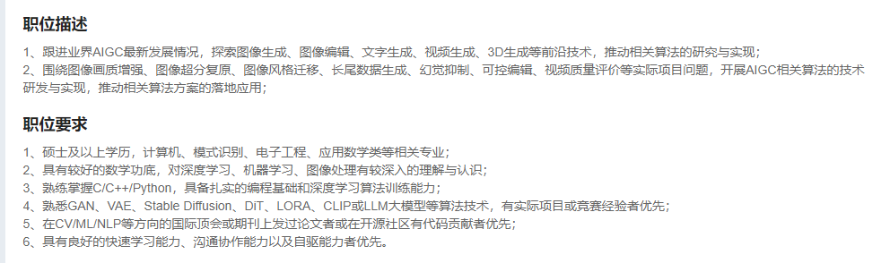
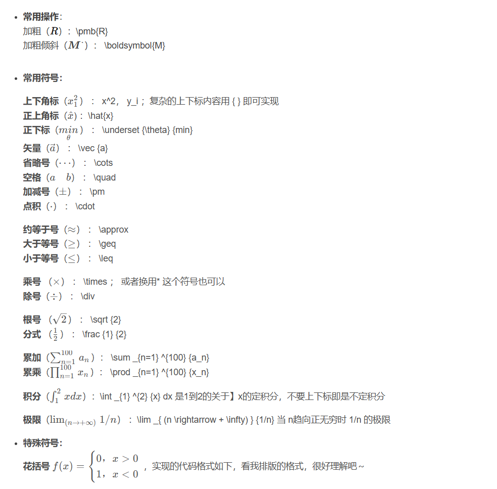

⭐ :arrow_down:

<a name ="RAG">RAG</a>

ctrl+1~6   一级标题--六级标题

ctrl+shift+k    代码块

- 粘贴为纯文本：Ctrl+Shift+V

ctrl+shift+m   公式块

ctrl+shift+q   引用

ctrl+shift+[   有序列表

ctrl+shift+]   无序列表

ctrl+shift+x   任务列表

ctrl+[   减少缩进

ctrl+]   增加缩进

ctrl+b/i/u    加粗/斜体/下划线

alt+shift+5   ~~删除线~~

## 一：菜单栏[#](https://www.cnblogs.com/keep--fighting/p/17800701.html#%E4%B8%80%EF%BC%9A%E8%8F%9C%E5%8D%95%E6%A0%8F)

- 文件：alt+F
- 编辑：alt+E
- 段落：alt+P
- 格式：alt+O
- 视图：alt+V
- 主题：alt+T
- 帮助：alt+H

## 二：文件[#](https://www.cnblogs.com/keep--fighting/p/17800701.html#%E4%BA%8C%EF%BC%9A%E6%96%87%E4%BB%B6)

- 新建：Ctrl+N
- 新建窗口：Ctrl+Shift+N
- 打开：Ctrl+O
- 快速打开：Ctrl+P
- 保存：Ctrl+S
- 另存为：Ctrl+Shift+S
- 偏好：Ctrl+,
- 关闭：Ctrl+W

## 三：编辑[#](https://www.cnblogs.com/keep--fighting/p/17800701.html#%E4%B8%89%EF%BC%9A%E7%BC%96%E8%BE%91)

- 撤销：Ctrl+Z
- 重做：Ctrl+Y
- 剪切：Ctrl+X
- 复制：Ctrl+C
- 粘贴：Ctrl+V
- 复制为MarkDown：Ctrl+Shift+C
- 粘贴为纯文本：Ctrl+Shift+V
- 全选：Ctrl+A
- 选中当前行/句：Ctrl+L
- 选中当前格式文本：Ctrl+E
- 选中当前词：Ctrl+D
- 跳转到文首：Ctrl+Home
- 跳转到所选内容：Ctrl+J
- 跳转到文末：Ctrl+End
- 查找：Ctrl+F
- 查找下一个：F3
- 查找上一个：Shift+F3
- 替换：Ctrl+H

## 四：段落[#](https://www.cnblogs.com/keep--fighting/p/17800701.html#%E5%9B%9B%EF%BC%9A%E6%AE%B5%E8%90%BD)

- 标题：Ctrl+1/2/3/4/5
- 段落：Ctrl+0
- 增大标题级别：Ctrl+=
- 减少标题级别：Ctrl+-
- 表格：Ctrl+T
- 代码块：Ctrl+Shift+K
- 公式块：Ctrl+Shift+M
- 引用：Ctrl+Shift+Q
- 有序列表：Ctrl+Shift+[
- 无序列表：Ctrl+Shift+]
- 增加缩进：Ctrl+]
- 减少缩进：Ctrl+[

## 五：格式[#](https://www.cnblogs.com/keep--fighting/p/17800701.html#%E4%BA%94%EF%BC%9A%E6%A0%BC%E5%BC%8F)

- 加粗：Ctrl+B
- 斜体：Ctrl+I
- 下划线：Ctrl+U
- 代码：Ctrl+Shift+`
- 删除线：Alt+Shift+5
- 超链接：Ctrl+K
- 图像：Ctrl+Shift+I
- 清除样式：Ctrl+

## 六：视图[#](https://www.cnblogs.com/keep--fighting/p/17800701.html#%E5%85%AD%EF%BC%9A%E8%A7%86%E5%9B%BE)

- 显示隐藏侧边栏：Ctrl+Shift+L
- 大纲视图：Ctrl+Shift+1
- 文档列表视图：Ctrl+Shift+2
- 文件树视图：Ctrl+Shift+3
- 源代码模式：Ctrl+/
- 专注模式：F8
- 打字机模式：F9
- 切换全屏：F11
- 实际大小：Ctrl+Shift+0
- 放大：Ctrl+Shift+=
- 缩小：Ctrl+Shift+-
- 应用内窗口切换：Ctrl+Tab
- 打开DevTools：Shift+F12