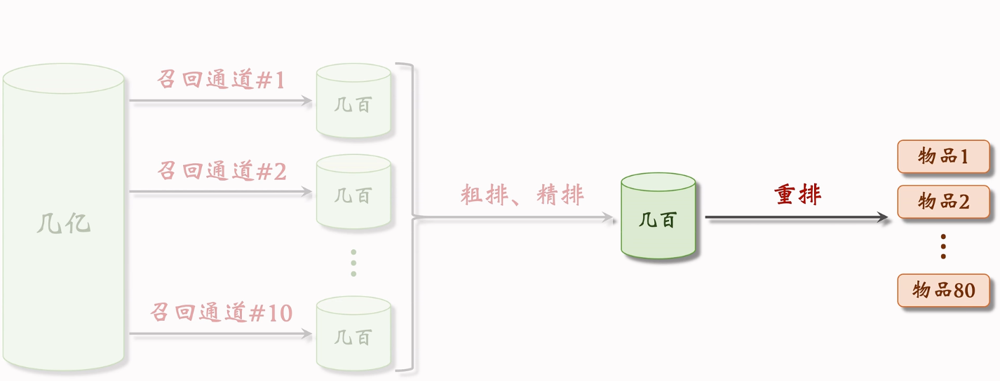
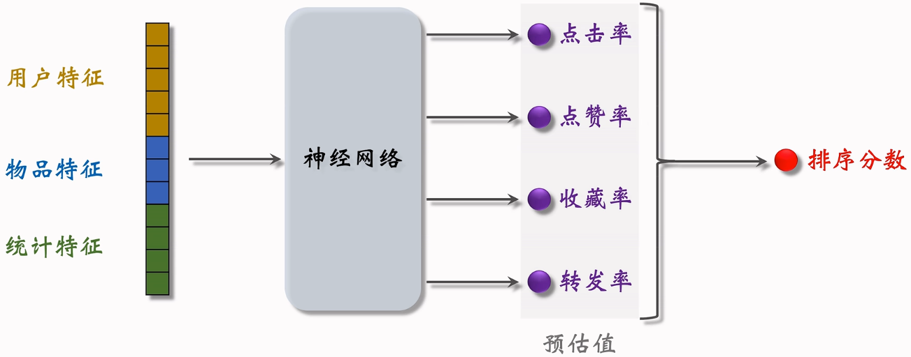
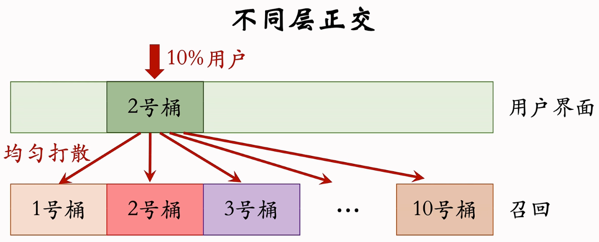
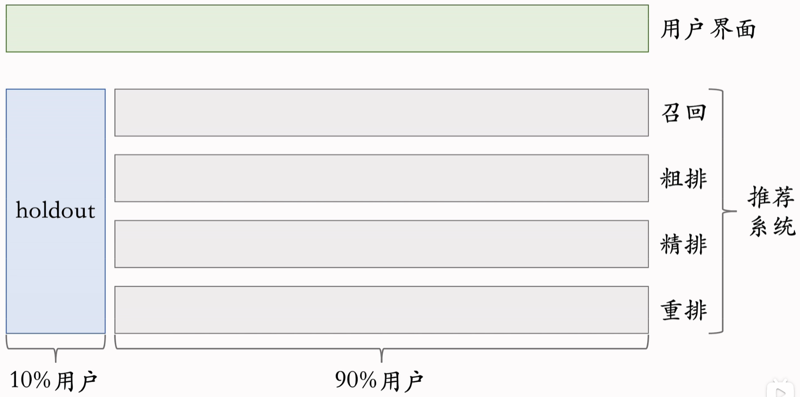
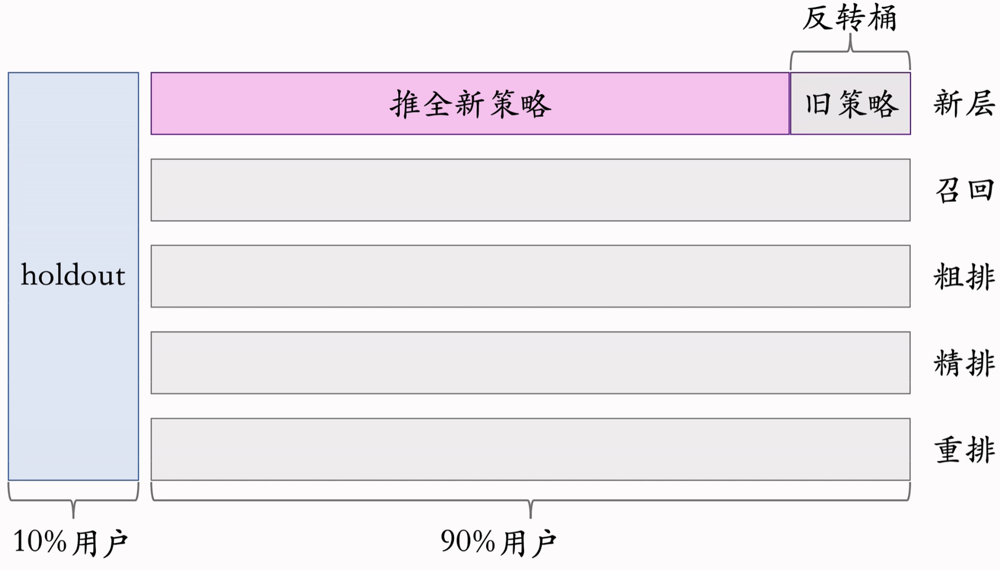
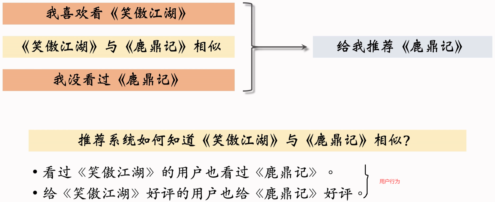
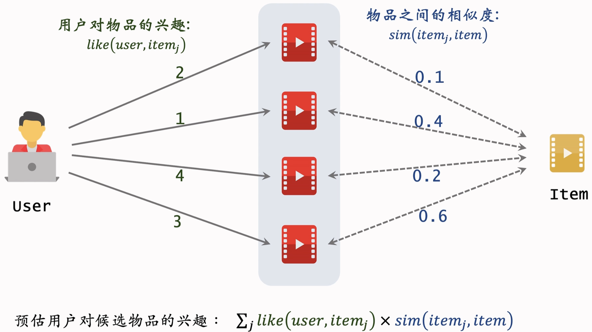
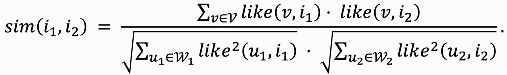

# 推荐系统

## 1 基础

### 1.1  消费指标

点击率 = 点击次数/曝光率
点赞率 = 点赞次数/点击次数
收藏率 = 收藏次数/点击次数
转发率 = 转发次数/点击次数
阅读完成率 = 滑动到底次数、点击次数×$f$(笔记长度)

### 1.2 北极星指标

用户规模：日活用户数(DAU)、月活用户数(MAU)
消费：人均使用推荐的时长、人均阅读笔记的数量
发布：发布渗透率、人均发布率

### 1.3 推荐系统的链路

【流程】

(几亿物品)=>召回=>(几千物品)=>粗排=>(几百物品)=>精排=>(几百物品)=>重排=>(几十物品)

【定义】

召回：用多条通道，取回几千篇笔记。

召回通道：协同过滤、双塔模型、关注的作者等等

粗排：用小规模神经网络，给几千篇笔记打分，选出分数最高的几百篇。

精排：用大规模神经网络，给几百篇笔记打分

重排：	做多样性抽样(比如MMR、DPP)，从几百篇中选出几十篇。【依据：精排分数大小、多样性】

​		然后，用规则打散相似的笔记。

​		插入广告、运营推广内容，根据生态要求调整排序。

### 1.4 A/B测试

【概念】

- 召回团队实现了一种 GNN 召回通道，离线实验结果正向。
- 下一步是做线上的小流量 A/B 测试，考察新的召回通道对线上指标的影响。
- 模型中有一些参数，比如 GNN的深度取值∈{1,2,3})，需要用 A/B 测试选取最优参数。

#### 1.4.1 随机分桶

假如分b=10个桶，那么每个桶就有10%的用户。

如何分桶呢？首先用哈希函数把用户 ID 映射成某个区间内的整数，然后把这些整数均匀随机分成b个桶。

如果我们需要考察GNN 召回通道对业务指标的影响？那么我们就可以把{1，2，3}作为实验组，GNN召回通道深度不一样；{4}作为对照组，不使用GNN。

GNN需要计算每个桶的业务指标，比如DAU、人均使用推荐的时长、点击率等等

如果**某个**实验组指标**显著优于**对照组，则说明对应的策略有效，**值得推全**。

#### 1.4.2 分层实验

目标：解决流量不够用的问题。分层实验:召回、粗排、精排、重排、用户界面、广告…
(例如 GNN 召回通道属于召回层。

- 分层实验:召回、粗排、精排、重排、用户界面、广告（例如 GNN 召回通道属于召回层。)
- 同层互斥：GNN实验占了召回层的4个桶，其他召回实验只能用剩余的6个桶。【不允许两个实验同时影响一位用户】
- 不同层正交：每一层独立随机对用户做分桶。每一层都可以独立用 100%的用户做实验。但是不同层，是正交的。【不同层实验可以同时有重叠的用户】
- 

#### 1.4.3 Holdout 机制

- 每个实验(召回、粗排、精排、重排)独立汇报对业务指标的提升。
- 公司**考察一个部门(比如推荐系统)在一段时间内对业务指标总体的提升**。
- 取10%的用户作为 holdout桶，推荐系统使用剩余90%的用户做实验，两者互斥。
- 10% holdout 桶 vs 90% 实验桶的 diff(需要归一化)为整个部门的业务指标收益。

#### 1.4.4 实验推全

- 每个考核周期结束之后，清除holdout桶，让推全实验从90%用户扩大到100%用户
- 重新随机划分用户，得到holdout桶和实验桶，开始下一轮考核周期
- 新的 holdout 桶与实验桶各种业务指标的 diff 接近 0
- 随着召回、粗排、精排、重排实验上线和推全，diff会逐渐扩大。

#### 1.4.5 反转实验

有的指标(点击、交互、点赞、完播率)立刻收到新策略影响，有的指标(留存)有滞后性，需要长期观测。

实验观测到显著收益后尽快推全新策略。目的是腾出桶供其他实验使用，或需要基于新策略做后续的开发

尽快推全有好处，把实验保留很久也有好处，这是矛盾的，通常用**反转实验**解决矛盾，做到尽快推全，也可以长期观测实验指标。

具体做法：在推全的新层中开一个旧策略的桶（反转桶），长期观测新旧策略的diff。

## 2 召回，Retrieval

### 2.1 基于物品的协同过滤，ItemCF

#### 2.1.1 基本思想

如果用户喜欢物品item1，而且物品item1与 item2相似，那么用户很可能喜欢物品item2

#### 2.1.2 实现

like()计算：例如：每个物品的点赞、转发、收藏、关注都各算一分

物品相似度：两个物品的的受众重合度越高，两个物品越相似

计算两个物品相似度：物品$i_1,i_2$，用户$W_1,W_2$，交集$V=W_1 \cap W_2$，

​					$sim(i_1,i_2)=(|V|/\sqrt(|W_1|· |W_2|))∈[0,1]$

计算两个物品相似度(考虑用户Like)(余弦相似度)：

2.1.3 完整流程

为了线上实时推荐