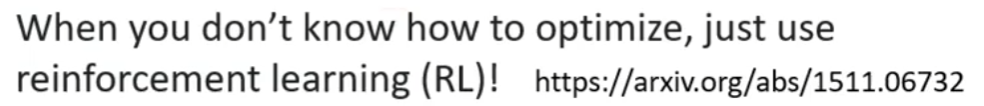
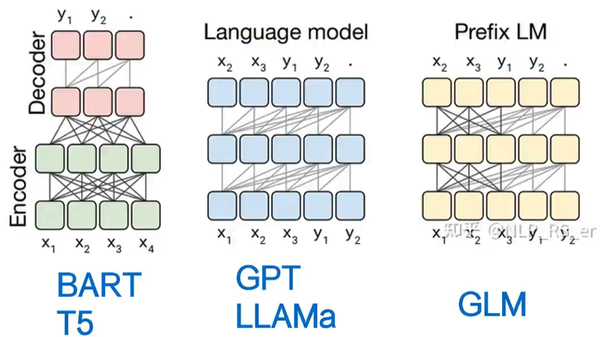

## 1.如何去做optimazation?

## 2.LLM

### 2.1 Transformer

为了提高训练稳定性，模型对每个transformer子层的输入进行归一化，而不是对输出归一化。归一化函数使用RMSNorm

为了提高性能，用SwiGLU激活函数取代了ReLU，维度变为$2/3$

将绝对位置嵌入替换为旋转位置嵌入(RoPE)

### 2.2 提高训练速度

使用`xformer`库的因果多头注意力来减少内存使用和模型运行时间，并使用`FlashAttention`的`backward`。其通过不存储注意力权重和不计算由于语言建模任务的因果性质而被掩盖的key/query分数来实现（Llama1）

通过利用模型和序列的并行性来减少模型的内存使用（Llama1）

使用`all_reduce`重叠了激活的计算和gpu之间的通信（Llama1）

| 模型            | 结构           | 位置编码  | 激活函数 | LayerNorm      |
| --------------- | -------------- | --------- | -------- | -------------- |
| 原生Transformer | Encoder-Deoder | Sinsoidal | ReLU     | Post LN        |
| BERT            | Encoder        | 绝对位置  | GeLU     | Post LN        |
| Llama           | Casual Decoder | RoPE      | SwiGLU   | Pre RMS Norm   |
| ChatGLM-6B      | Prefix Decoder | RoPE      | GeGLU    | Post Deep Norm |
| Bloom           | Casual Decoder | ALiBi     | GeLU     | Pre LN         |

### 2.3 提升推理

使用了分组查询注意力（`GQA`）来提高更大模型的推理可扩展性。（Llama2）