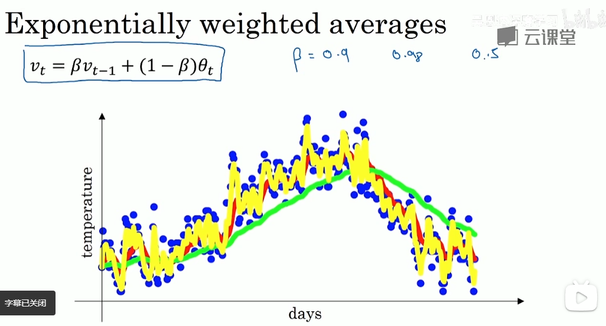
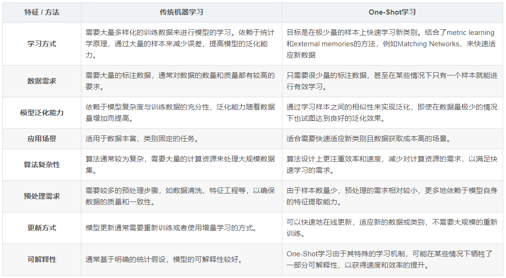
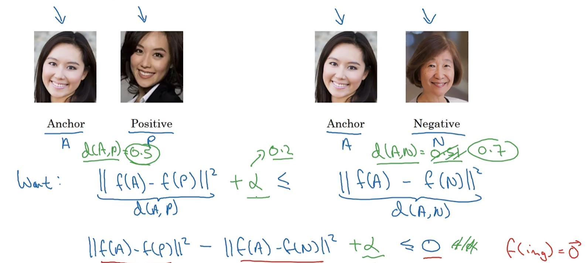

# 1. 广播机制

## 1.1 一般广播规则（维数一样）

条件：

维度大小一样；

维度大小不一样，那么其中对应位置维度大小必须为1。

```python
a = torch.ones(4,1,6)
b = torch.ones(1,5,6)
print((a+b).shape)  # torch.Size([4, 5, 6])
```

## 1.2 特殊广播规则（维数不一样）

向右对齐进行比较。PyTorch 会自动修正维度的数量，并根据广播规则匹配每个维度的大小。【从右往左匹配】
如果维度大小一样，继续往左比较。
如果维度大小不一样，那么其中一个维度大小必须是1。没有维度的自动补充为1进行比较。

```python
a = torch.ones(4,1,6)
b = torch.ones(2,2,1,5,6)
print((a+b).shape)  # torch.Size([2, 2, 4, 5, 6])
```

# 2. 正则化

## 2.1 **什么是正则化？**

正则化是机器学习和统计建模中用于防止过度拟合并提高模型泛化能力的技术。

正则化在训练过程中对模型引入额外的约束或惩罚，旨在控制模型的复杂性并避免过度依赖训练数据中的特定特征或模式。通过这样做，正则化有助于在很好地拟合训练数据和很好地推广到新数据之间取得平衡。

最常用的正则化技术： L1 正则化 (Lasso)、L2 正则化 (Ridge) 和弹性网络正则化（L1 和 L2 正则化的组合）。

在处理有限数据、高维数据集或具有许多参数的模型时，正则化特别有用。

## 2.2 深度学习中的 L1 和 L2 正则化

L1和L2正则化也可以应用于深度学习中，以对抗过度拟合并提高神经网络模型的泛化能力。

在深度学习中，L1 和 L2 正则化通常通过将相应的惩罚项添加到损失函数中来纳入训练过程。正则化项乘以正则化参数 ( λ) 以控制正则化的强度。

对于深度学习中的L1正则化，正则化项是神经网络中所有权重的绝对值之和。这鼓励模型中的稀疏性，有效地将一些权重设置为零并执行特征选择。L1 正则化有助于降低模型的复杂性并提高其可解释性。
对于深度学习中的L2正则化，正则化项是神经网络中所有权重的平方值之和。它会惩罚较大的权重值并鼓励较小的权重，从而防止任何一种权重主导模型。L2 正则化有助于控制模型的容量并减少数据中噪声的影响。

# 3. **指数移动平均EMA**

**定义：**模型权重在最后的n步内，会在实际的最优点处抖动，所以我们取最后n步的平均，能使得模型更加的鲁棒。相比对权重变量直接赋值而言，移动平均得到的值在图像上更加平缓光滑，抖动性更小，不会因为某次的异常取值而使得滑动平均值波动很大。

**作用：**使得模型在测试数据上更加健壮，有更好的鲁棒性，在一定程度上提高最终模型在测试数据上的表现（例如accuracy、FID、泛化能力...）。
**公式：**

：前 t -1 次更新的所有参数平均数，也称为“ 影子权重（shadow weights）”。

：t 时刻的模型权重weights。

：是一个常数，我们认为它是一个调节取前多少次参数平均的“权重参数”，在代码中一般写为decay，**一般设为0.9-0.999**。

(红色=0.9，绿色=0.98，黄色=0.5)



Vt ： 表示取前1/(1-)次权重的平均数据

# **4.one-shot学习**

**定义：**One-Shot学习是**计算机视觉领域中一种学习范式**，它允许机器学习模型**仅凭一个样本就能识别并学习一个新的类别**。

**区别：**学习方式、数据需求、算法复杂、应用场景、算法泛化能力、预处理方式、更新方式、可解释性



**应用：**罕见疾病诊断、个性化推荐、物体识别与追踪、人脸识别

**主流算法或技术：**

度量学习（Metric Learning）：在One-Shot Learning场景下，由于模型必须基于非常有限的样本对新类别进行识别或分类，因此学习一个**有效的度量函数**来度量样本间的相似性变得尤为重要。<u>度量学习通过优化样本在特征空间中的表示，确保同类样本聚集而不同类样本分离，为One-Shot Learning任务提供了强大的基础。</u>
孪生网络（Siamese Networks）： Siamese Networks 是一种特殊的神经网络架构，常用于度量输入数据之间的相似性。网络包含两个或多个共享权重的子网络，这些子网络对不同的输入进行编码，然后通过一个对比函数（如欧式距离、余弦相似度等）来计算两者的相似度。这种结构非常适合处理需要判断“相同”或“不同”的一对一对比任务，如验证两个人脸是否属于同一人。

经典损失：Triplet损失




# 5. TP、TN、FP、FN、Sensitivity、Specificity

**真阳性**（True Positive, TP）：模型预测为正类（阳性），且实际标签也是正类。【模型正确地识别出了正样本。】

**真阴性**（True Negative, TN）：模型预测为负类（阴性），且实际标签也是负类。【模型正确地识别出了负样本。】

**假阳性**（False Positive, FP）：模型预测为正类，但实际标签是负类。【模型错误地将负样本预测为正样本。】（错误地报警）

**假阴性**（False Negative, FN）：模型预测为负类，但实际标签是正类。【模型错误地将正样本预测为负样本。】（漏了报警）

**Precision**=TP/(TP+FP)【**模型预测为正类的样本**中实际为正类的比例。】

**Sensitivity/Recall=**TP/(TP+FN)【**实际为正类的样本**中被正确预测为正类的比例。】

**Specificity**=TN/(TN+FP)【实际为负类的样本中被正确预测为负类的比例。】【也就是对**假阳性**考验】

6.