# 1.简介

预测输入的任何部分从其他部分 —> Masked token prediction

​                                                              Next sentence prediction

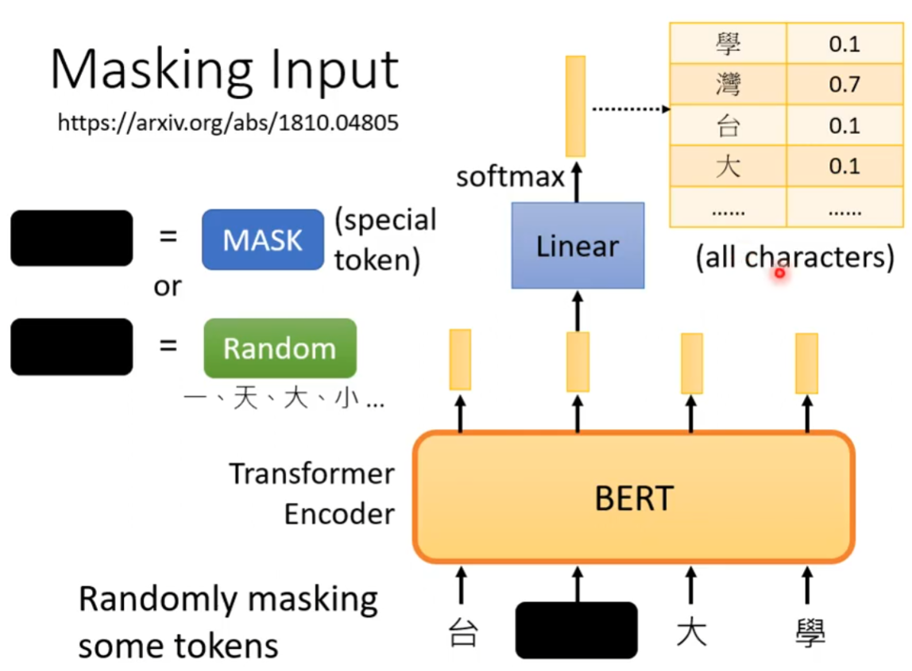

# 2.知识储备

## 2.1 Word2Vec

### 2.1.1 Skip-gram

使用中心词预测周围词

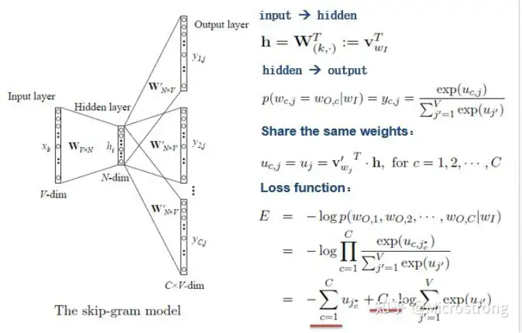

### 2.1.2 CBOW

使用周围词预测中心词

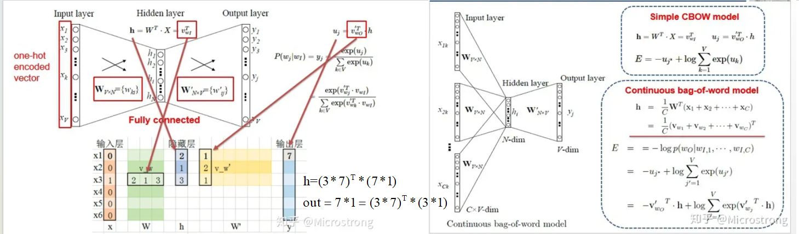

# 2.Pre-trained Language Models(PLMs)

- **Autoregressive pre-trained: GPT系列**
- **MLM-based pre-trained: BERT系列**

##### 2.1 下游任务中的数据稀缺(**Data scarcity**)

###### 2.1.1 数据有效的微调 => **Prompt tuning**

Prompt tuning比Fine-tuning会有更好的表现是因为：【它融入了人类的知识；它没有引入新的参数】

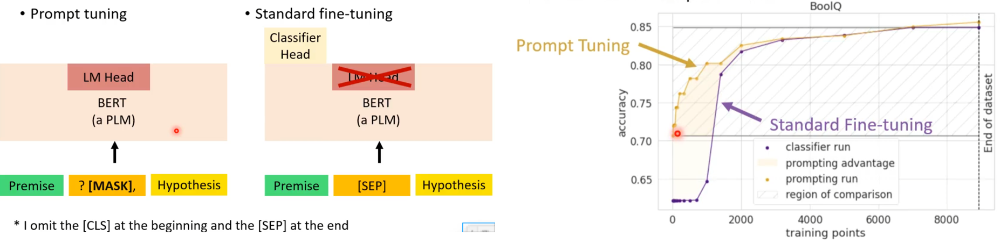

###### 2.1.2 数据有效的微调 => **Few shot Learning**

代表：**LM-BFF**(prompt+demonstraton)

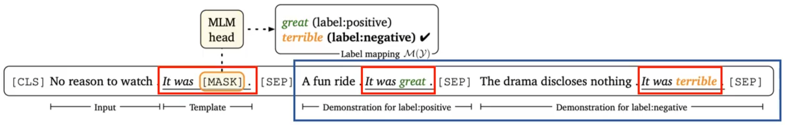

###### 2.1.3 数据有效的微调 => **Semi-supervised Learning**

代表：**Pattern-Exploiting Training**(PET)

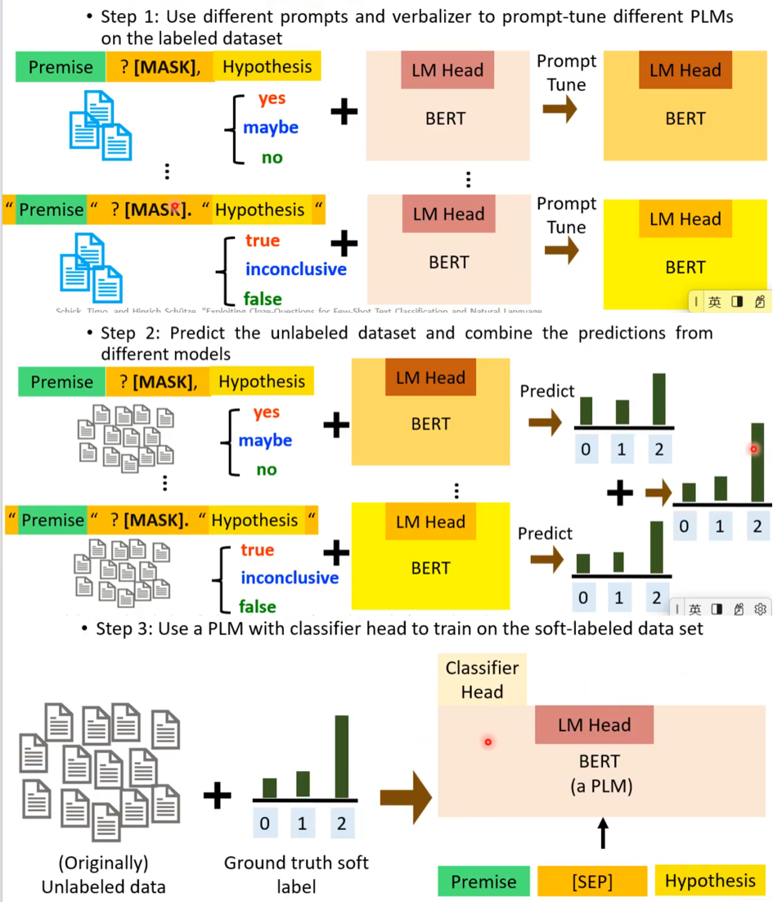

###### 2.1.4 数据有效的微调 => **Zero shot Learning**

##### 2.2 PLM模型巨大

###### 2.2.1 有效参数微调 => Adapter/ LORA/Prefix Tuning/Soft/hard Prompting

【好处】：大大减少特定于任务的参数；不太容易过度匹配训练数据，也能在out-of-domain表现更好；在small数据集上是个不错选择。

在微调期间，只更新adapters和classifier head

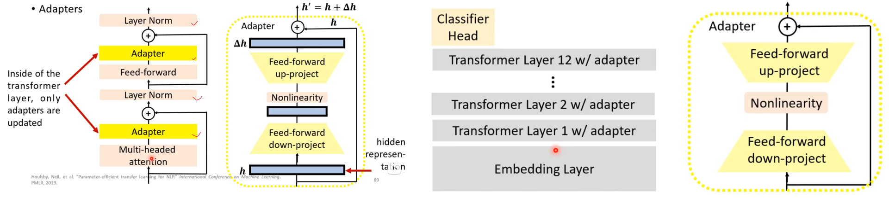

【LORA】：低秩适应模型。在微调期间，只更新LORA

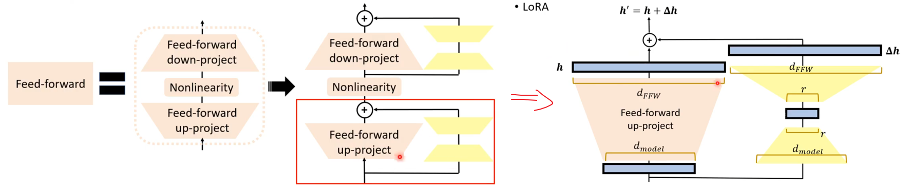

【Prefix Tuning】：<u>插入在**每个**Transformer内</u>。在微调期间，只更新prefix里的key和value

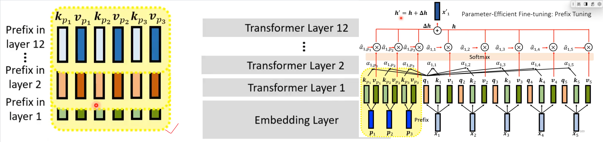

【soft  prompt】：<u>插入在input layer内(embedding layer后)。</u>在微调期间，只更新prefix里的key和value

【hard prompt】：<u>将prompt插入在输入的句子中</u>。在微调期间，只更新prefix里的key和value

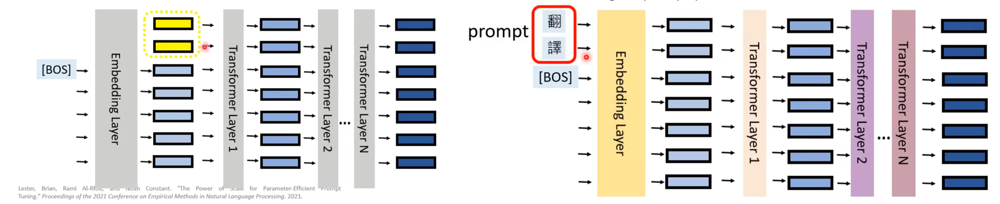

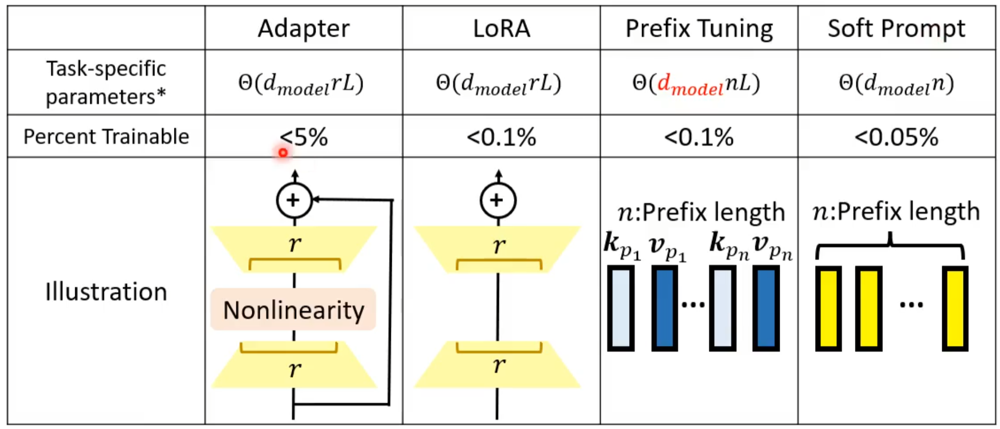

###### 2.2.2 Early Exit

推理阶段，在每个Transformer后都加入一个classifier head

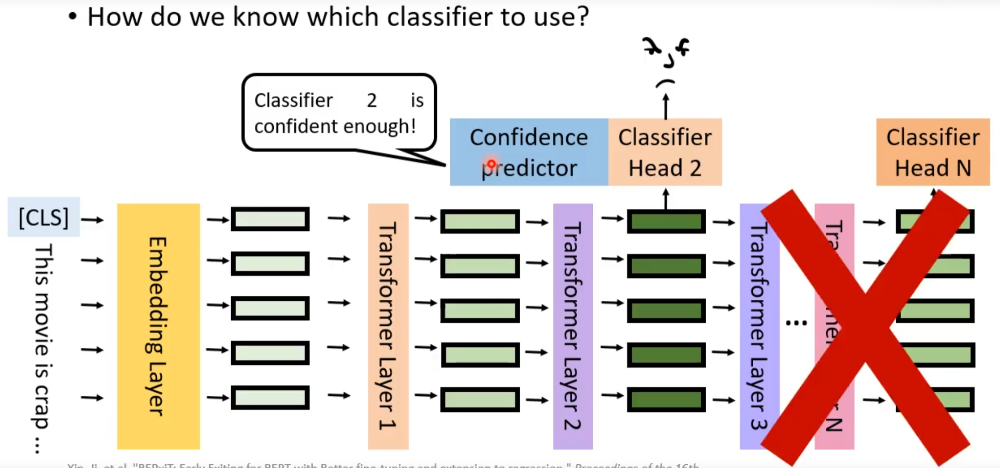

# 3. BERT应用 

## 3.1 case 1—语句分析

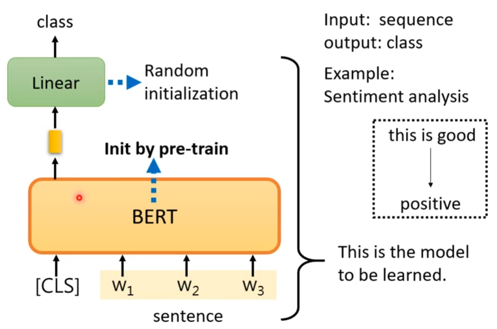

## 2.2 case 2—词性标注

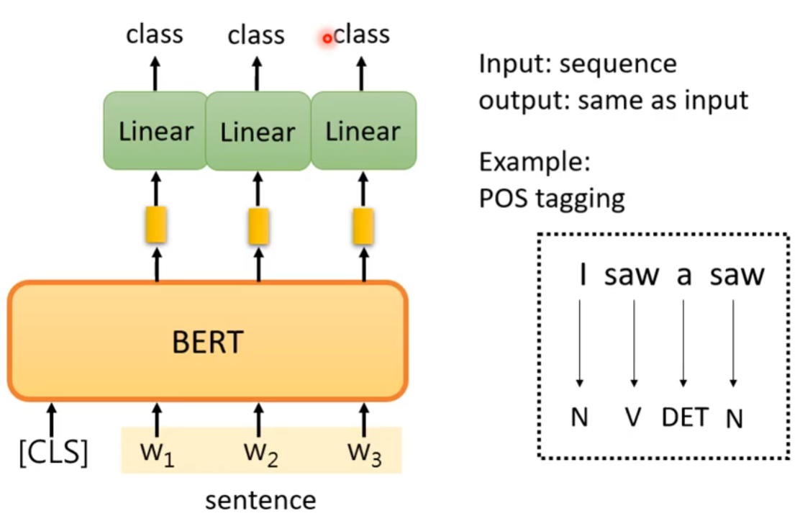

## 2.3 case 3—自然语言推理

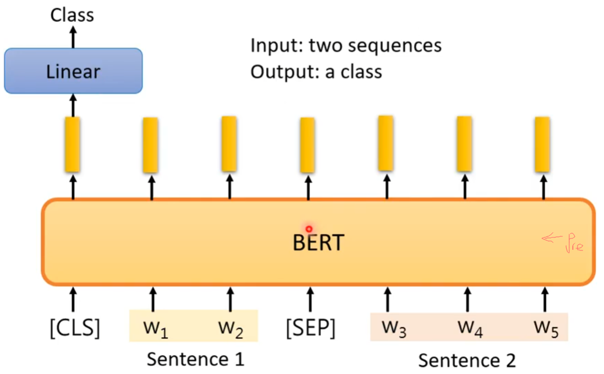

## **2.4 case 4—Extraction-based QA**

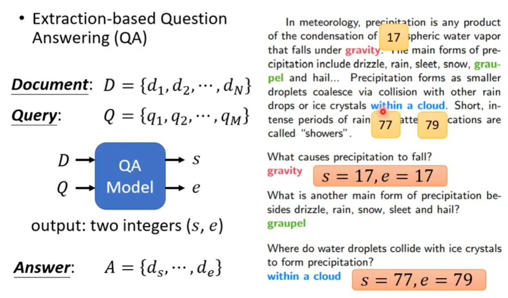

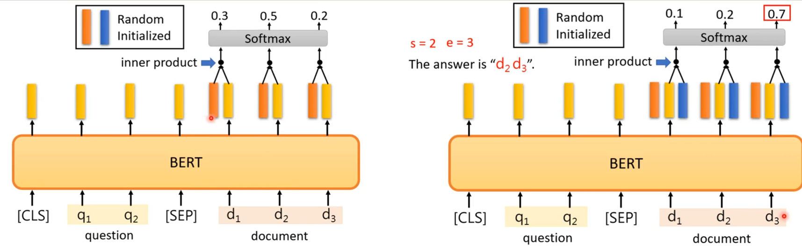

   