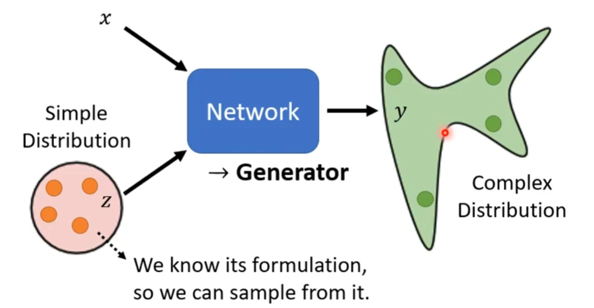
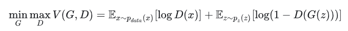
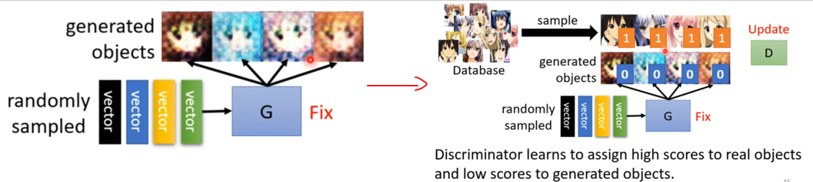
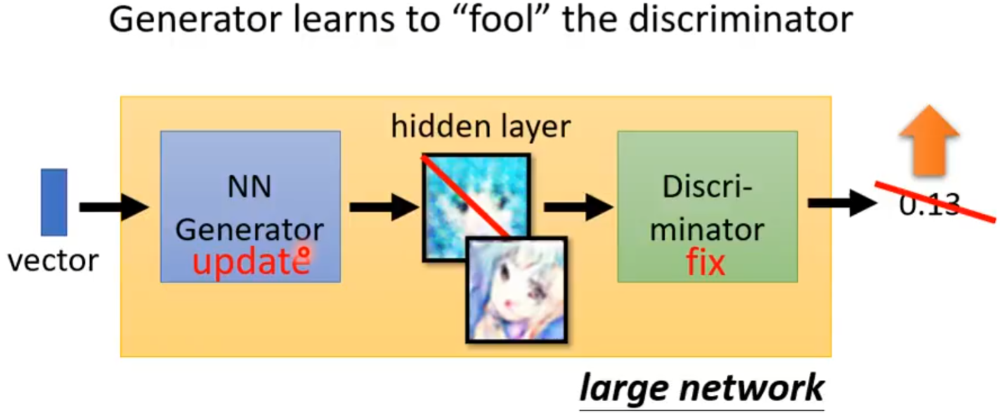
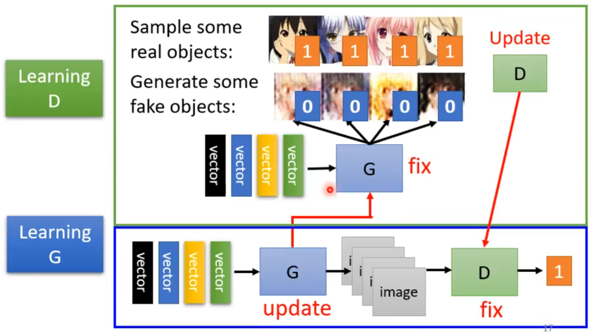
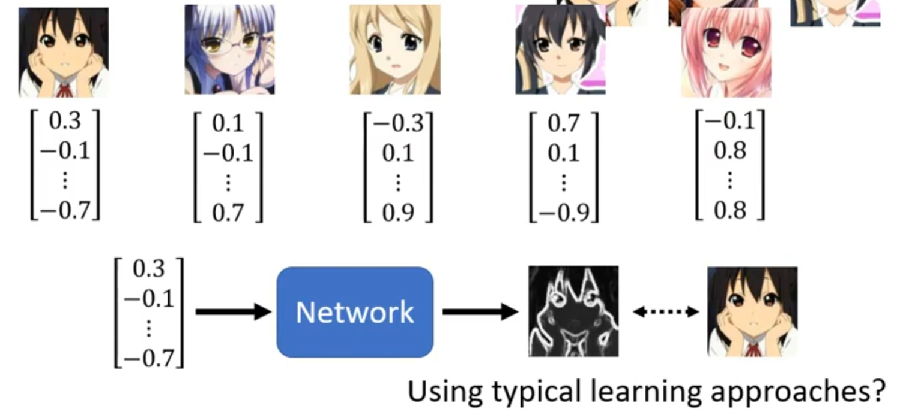
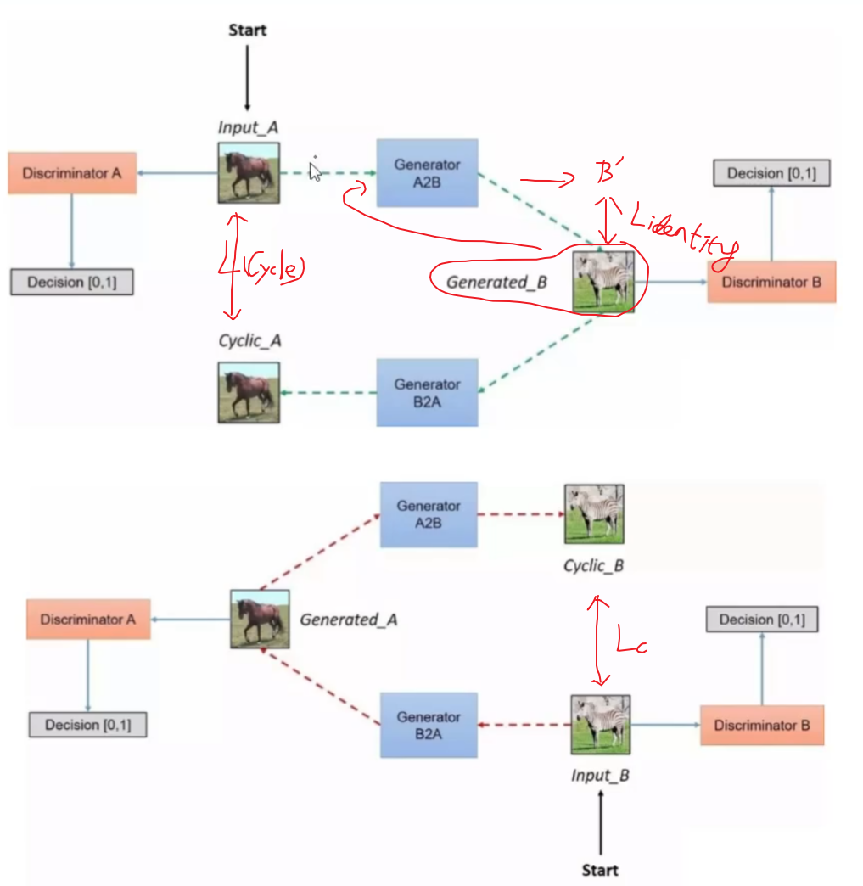

# 1.概念及定义

生成对抗网络（Generative Adversarial Network, GAN）是一种通过两个**神经网络**相互博弈的方式进行学习的生成模型。生成对抗网络能够在**不使用标注数据**的情况下来进行生成任务的学习。

生成器和判别器相互对抗、不断学习，最终目的**使得判别器无法判断生成器的输出结果是否真实**。

【例如，生成器可以看作货币造假者，目的是制造足够以假乱真的假币；判别器可以看作[验钞机](https://zhida.zhihu.com/search?q=%E9%AA%8C%E9%92%9E%E6%9C%BA&zhida_source=entity&is_preview=1)，负责判断钞票是否为假币，它能够随着假币质量的提高而不断升级，保持对假币的识别能力。】

distribution？ 同样地输入有不同的输出，尤其在任务需要“创造力”（画画，Chatbot）。

# 2. 组成

**generator(生成器)**

**discriminator(判别器)**

D和G两名玩家按照极小化极大估值函数 V(G,D) 进行博弈的过程，V越大越好：

# 3. 算法

3.1 初始化**generator(G)**和**discriminator(D)**
3.2 每个训练迭代中：

step1:定住G，update D.

step2: 定住D，update G.(G学习去“欺骗”D)

反复循环训练：

# 4.评估标准

4.1 Inception Score(IS) 大

 4.2 Frechet Inception Distance(FID) 小

# 5. 训练技巧

## 5.1  JS divergence问题

5.1.1 Wasserstein distance   —>让D∈1-Lipschitz足够平滑  —>  **Spectral Normalization**

5.2  优化算法可以使用RMSProp、SGD.(Adam时，discriminator的loss会崩掉)

5.3 对应图片的方法GAN，但分配的随机向量会很难训练

—> Generative Latent Optimization(GLO),https://arxiv.org/abs/1707.05776  

​        Gradient Origin Networks, https://arxiv.org/abs/2007.02798

## 5.4 Mode Collapse问题

## 5.5 Mode Dropping问题

# 6. Network及变体及应用

**DCGAN**(Deep Convolutional GAN)：将卷积神经网络（CNN）引入了 GAN 模型架构，取代了传统的全连接层，从而更适合处理高维的图像数据。在CV种常用。【==图像生成、视频生成==】

**CGAN**(Conditional GAN)：G(z)-->G(z,y) D(X)-->D(X,y)【==有条件的图像生成、图像翻译==】

**Pix2Pix**：直接学习图像到图像的映射，尤其适合成对的图像转换任务。【图像到==图像转换==(素描到彩色图像、卫星图像到地图)】

**CycleGAN**：引入了循环一致性损失，使得 GAN 能够在没有成对图像的情况下，学习不同领域的图像转换。【==无监督图像到图像转换==】

  

**StyleGAN**：引入了样式控制和分层生成方法，使得图像生成的控制力更强，能够细粒度地调整生成图像的特定特征。它通过逐层控制图像生成过程中的特定属性（如面部结构、发型等），生成图像更具灵活性和多样性。【==高质量图像生成==（尤其在==人脸生成领域==）】

**LSGAN**（Least Squares GAN）：通过使用最小二乘损失函数代替交叉熵损失，使得生成器能够生成更逼真的样本，同时减少了判别器过于强大的情况，提升了图像质量。【==高质量图像生成，减少模糊样本==】

**WAGAN**(Wasserstein GAN)：通过 Wasserstein 距离（而不是 JS 散度）来衡量生成器和判别器之间的差距，WGAN 改进了原始 GAN 中的训练不稳定性问题，并能够在极端条件下生成更高质量的图像。【==生成稳定性提升==】

**WGAN-GP**(Wasserstein GAN with Gradient Penalty)：在 WGAN 的基础上，引入了梯度惩罚项，使得判别器的梯度更加平滑。【==进一步生成稳定性提升==】

**BigGAN**：BigGAN 在原始 GAN 的基础上，结合了先进的训练技巧，如大批次训练和类条件控制，显著提高了生成图像的分辨率和质量。它被认为是目前生成高分辨率图像最强大的变体之一。【==生成大规模、高分辨率图像==】

**SeqGAN**：将 GAN 的思想引入文本生成任务，克服了文本序列生成中的离散性问题。SeqGAN 使用强化学习的方法，使得生成器能够在生成整个文本序列后获得奖励，适应了 NLP 任务中的序列特性。【==自然语言生成、序列生成==】

