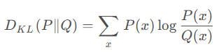
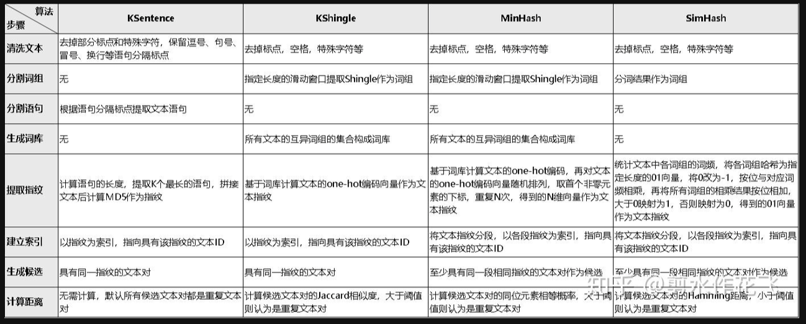
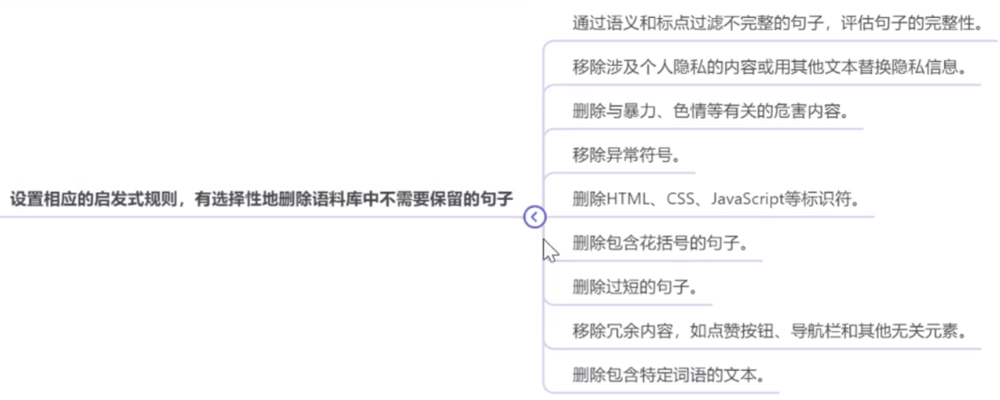
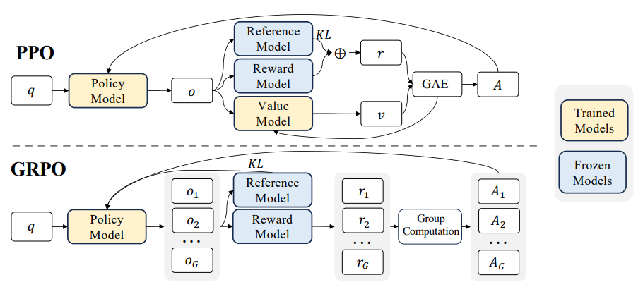

[TOC]


#     1 基础

## 1.0 Linux常用命令

- 复制文件夹：cp -r 源文件夹 目标文件夹

- 创建文件：sudo gedit __.txt

- 创文件夹：mkdir ____

- 杀死进程并禁用自启动：pkill -f your_process_name

- GPU间的互联结构：nvidia-smi topo -m

- 环境包冲突检查：pip check

- 实时流量监控工具：yum install -y iftop ==> iftop 

- 查看对deepspeed 的环境配置：ds_report

- 查看文件占用：du -sh *

- ？

- ？

- conda环境相关命令：

  pip install numpy==1.26.4 -i https://pypi.tuna.tsinghua.edu.cn/simple

  conda env export > chatglm_env.yaml

  conda env create -f environment.yaml（复现）

- chatbox

- ？

- ？

- ？

- ​

## 1.1 GPU原理  

BV1LY4y1d7cL

### 1.1.1 数据位宽及运算

**1 Byte = 8 bit**

【常见】


int8、int16、int32、bp16、tf32、fp16、fp32   S表示正负；E表示范围；M表示精度

tf32(A100新格式)可以替代fp32，可以全程tf32训练或bf16/tf32混合训练

【训练】

一般使用bp16、tf32、fp16

【推理】

CV => int8为主；NLP => fp16为主；大模型 => int8/fp16混合；

### 1.1.2 计算分解及强度

强度(一个数据被算多少次)=C/D


### 1.1.3 计算指标及大模型计算量计算方法

GPU： MACs=OPS(算力)/2

模型：flops、mac

训练算力需求=模型参数量 * 6 * 训练token量

**【Example】**

LLAMA-6B，数据类型Int8

模型参数： 6B*1 bytes =6GB

梯度： 同上 6GB

优化器参数：AdamW 2倍模型参数量 = 12GB

Llama的架构(hidden_size = 4096, intermediate_size=11008, num_hidden_layers = 32,context_length=2048)

每个样本需要：（4096+11008）*2048*32*1 bytes =990MB

A100（80GB）大概可以在Int8京都下 batch_size=50：    24GB+990*50≈80GB

### 1.1.4 GPU和CPU区别

CPU通过降低DRAM Latency提高内存利用率；GPU通过提高Threads提高内存利用率

### 1.1.5 GPU通讯原理

NVLink NVSwitch

### 1.1.6 显存分析⭐

模型状态(model states)。对于大型模型来说，大部分显存消耗都是被模型状态占用的，主要包括三部分：**优化器的状态**(Optimizer States)、**梯度**(Gradients)、**参数**(Parameters)。三者简称为 OGP。

残余状态(residual states)。剩余状态（residual states）: 除了模型状态之外的显存占用，包括激活值（activation）、各种临时缓冲区（buffer）以及无法使用的显存碎片（fragmentation）

**【Example】**

① nB 模型**推理**需要多少显存？

考虑模型参数都是fp16，2n G 的显存能把模型加载。

① nB 模型**训练**需要多少显存？

考虑模型参数都是fp16，16n G 的显存能把模型加载。16/8=2

参数×2nG + 梯度×2nG + 优化器( AdamW, fp32)×8nG + 激活值(max_len、batch size=1)×(≈max_len/512)nG = 12nGB+

### 1.1.7 训练时间分析⭐

$\text{训练时间}=\frac{8*模型参数量*token数量}{\text{GPU数量} \times \text{每个GPU的峰值FLOPS} \times \text{GPU利用率}}$

**【Example】**

对于GPT-3-175B模型，在300B tokens的数据上训练，使用1024张A100 GPU，A100的峰值性能为312TFlops，设GPU利用率为0.45

$\text{训练时间} = \frac{8 \times 175 \times 10^9 \times 300 \times 10^9}{1024 \times 312 \times 10^{12} \times 0.45} \approx 2921340 \text{秒} \approx 34 \text{天} $


对于标准的卷积层，FLOPs 计算公式如下：

$\text{FLOPs} = 2 \times C_{\text{in}} \times H_{\text{out}} \times W_{\text{out}} \times K_h \times K_w \times C_{\text{out}}$

征图尺寸，由公式计算：

$H_{\text{out}} = W_{\text{out}} = \frac{H_{\text{in}} - K_h + 2P}{S} + 1$


## 1.2 概念

scaling 法则

GGUF (GPT-Generated Unified Format)模型:是由 llama.cpp 定义的一种高效存储和交换大模型预训练结果的二进制格式。

SVD分解


## 1.3 架构


**Encoder 在抽取序列中某一个词的特征时能够看到整个序列中所有的信息，即上文和下文同时看到；**
**Decoder 中因为有 mask 机制的存在，使得它在编码某一个词的特征时只能看到自身和它之前的文本信息。**

- Encoder模型

**双向**注意力。代表：BERT

适合理解任务（如文本分类、问答、命名实体识别）

计算高效，适合短序列或资源受限场景；但生成能力弱，不适合长文本生成

- Encoder-Decoder(序列到序列模型)

**输入双向**注意力，**输出单向**注意力。代表：T5、Flan-T5、BART

适合需要双向理解和生成的任务（如翻译、摘要）

兼具理解和生成能力，灵活性强；但计算成本高，适合云端部署。

- Causal  Decoder(自回归/因果模型)

从左到右的单向注意力。代表：GPT系列、LLaMA、BLOOM、OPT

适合生成任务（如对话、内容创作），推理速度快，适合实时应用（如聊天机器人），但理解能力较弱。

- Prefix(前缀) Decoder(生成模型)


**输入双向**注意力，**输出单向**注意力。代表：GLM、ChatGLM、U-PaLM

适合理解（分类、填空）

### 1.3.1 Transformer模型

#### Ⅰ attention

######├─Scaled Dot-Product Attention
这是Transformer模型中最常用的Attention机制，用于计算查询向量（Q）与键向量（K）之间的相似度得分，然后使用注意力权重对值向量（V）进行加权求和。

######├─Multi-Head Attention


这是Transformer中的一个改进，通过同时使用多组独立的注意力头（多个QKV三元组），并在输出时将它们拼接在一起。这样的做法允许模型在不同的表示空间上学习不同类型的注意力模式。

######├─Multi Query Attention


【代表】PaLM 、ChatGLM2 、Falcon

【问题】MHA在推理阶段会反复加载巨大的KV cache，导致内存开销大，限制了性能

【核心】在所有注意力头上共享 key 和 value

###### ├─Grouped Query Attention


【代表】LLaMA2-34B/70B

【特点】

GQA是最佳性能(MQA)和最佳模型质量(MHA)之间的一个很好的权衡。

使用GQA，可以获得与MHA几乎相同的模型质量，同时将处理时间提高3倍，达到MQA的性能。这对于高负载系统来说可能是必不可少的。

介于MHA 和MQA 之间， 多个key 和value。

###### ├─Multi-Head Latent Attention


【核心】通过**低秩联合压缩**技术，减少 K 和 V 矩阵的存储和计算开销。

【特点】Multi-Head Latent Attention (MLA) 通过低秩联合压缩技术，显著减少了推理时的键值缓存和训练时的激活内存，同时保持了与MHA相当的性能。MLA 的核心在于对键、值和查询矩阵进行低秩压缩，并通过旋转位置编码引入位置信息，从而在高效推理的同时捕捉输入序列中的复杂特征。

【流程】


【参考】

MLA：https://zhuanlan.zhihu.com/p/15153745590

###### ├─[Flash Attention][39]


HBM是一种高带宽内存接口，用于3D堆叠的SDRAM，具有较高的带宽和较低的功耗。
SRAM是一种静态随机访问存储器，用于高速缓存等内部存储器，具有更快的访问速度和更低的延迟，但成本更高且占用更多芯片空间。

tiling 的基本思路：不直接对整个输入序列计算注意力，而是将其分为多个较小的块，逐个对这些块进行计算，增量式地进行 softmax 计算，减少全局内存访问次数。计算过程中只需要更新某些中间变量，不需要计算整个注意力权重矩阵。

recomputation 的基本思路：基于 tiling 技巧，在反向传播过程中不保留整个注意力权重矩阵，而是只保留前向过程中 tiling 的某些中间变量，然后在反向传播过程中重新计算注意力权重矩阵。recomputation 可以看作是一种基于 tiling 的特殊的 gradient 

【核心】

1-5：主要在初始化和进行切分；
6-7：遍历K，V的每一块（**Outer Loop**）；
8：遍历Q的每一块 (**Inner Loop**)；
9：将分块后的QKV的小块加载到SRAM (Copy Block to SRAM)；（使用tiling平铺(分块计算)和recomputation重新计算）
10：计算Sij (Compute Block on SRAM)；
11：计算Sij mask (Compute Block on SRAM)；
12：计算(m,l)统计量 (Compute Block on SRAM)；
13：计算(m,l)统计量 (Compute Block on SRAM)；
14：dropout (Compute Block on SRAM)
15：计算Oi并写入HBM (Output to HBM)
16：把li,mi写入HBM (Output to HBM)

【FlashAttention对MQA和GQA如何处理?】
对MQA和GQA采用Indexing的方式，而不是直接repeat。index思想就是通过传入KV_head索引到GPUKernel中，然后根据内存地址直接从内存中读取KV

【代码】
https://github.com/shreyansh26/FlashAttention-PyTorch/blob/master/flash_attention.py

```python
import torch

NEG_INF = -1e10  # -infinity
EPSILON = 1e-10

Q_LEN = 6
K_LEN = 6
Q_BLOCK_SIZE = 3
KV_BLOCK_SIZE = 3
P_DROP = 0.2

Tr = Q_LEN // Q_BLOCK_SIZE
Tc = K_LEN // KV_BLOCK_SIZE

Q = torch.randn(1, 1, Q_LEN, 4, requires_grad=True).to(device='cpu')
K = torch.randn(1, 1, K_LEN, 4, requires_grad=True).to(device='cpu')
V = torch.randn(1, 1, K_LEN, 4, requires_grad=True).to(device='cpu')

O = torch.zeros_like(Q, requires_grad=True)
l = torch.zeros(Q.shape[:-1])[..., None]
m = torch.ones(Q.shape[:-1])[..., None] * NEG_INF

# step 4
Q_BLOCKS = torch.split(Q, Q_BLOCK_SIZE, dim=2)
K_BLOCKS = torch.split(K, KV_BLOCK_SIZE, dim=2)
V_BLOCKS = torch.split(V, KV_BLOCK_SIZE, dim=2)

# step 5
O_BLOCKS = list(torch.split(O, Q_BLOCK_SIZE, dim=2))
l_BLOCKS = list(torch.split(l, Q_BLOCK_SIZE, dim=2))
m_BLOCKS = list(torch.split(m, Q_BLOCK_SIZE, dim=2))

# step 6
for j in range(Tc):
    # step 7
    Kj = K_BLOCKS[j]
    Vj = V_BLOCKS[j]
    # step 8
    for i in range(Tr):
        # step 9
        Qi = Q_BLOCKS[i]
        Oi = O_BLOCKS[i]
        li = l_BLOCKS[i]
        mi = m_BLOCKS[i]

        # step 10
        S_ij = torch.einsum('... i d, ... j d -> ... i j', Qi, Kj)

        # step 11
        mask = S_ij.ge(0.5)
        S_ij = torch.masked_fill(S_ij, mask, value=0)
        
        # step 12
        m_block_ij, _ = torch.max(S_ij, dim=-1, keepdims=True)
        P_ij = torch.exp(S_ij - m_block_ij)
        l_block_ij = torch.sum(P_ij, dim=-1, keepdims=True) + EPSILON
        P_ij_Vj = torch.einsum('... i j, ... j d -> ... i d', P_ij, Vj)

        # step 13
        mi_new = torch.maximum(m_block_ij, mi)

        li_new = torch.exp(mi - mi_new) * li + \
                 torch.exp(m_block_ij - mi_new) * l_block_ij

        # step 14
        m = torch.nn.Dropout(p=P_DROP)
        P_ij_Vj = m(P_ij_Vj)

        # Step 15
        O_BLOCKS[i] = (li / li_new) * torch.exp(mi - mi_new) * Oi \
                      + (torch.exp(m_block_ij - mi_new) / li_new) * P_ij_Vj
        print(f'-----------Attention : Q{i}xK{j}---------')
        print(O_BLOCKS[i].shape)
        print(O_BLOCKS[0])
        print(O_BLOCKS[1])
        print('\n')

        # step 16
        l_BLOCKS[i] = li_new
        m_BLOCKS[i] = mi_new

O = torch.cat(O_BLOCKS, dim=2)
l = torch.cat(l_BLOCKS, dim=2)
m = torch.cat(m_BLOCKS, dim=2)
```


###### ├─Flash Attention v2

相比Flash Attention v1，改进：

- 进一步减少attention中的非乘法运算。

- 提出序列长度这个维度上的并行计算

- 优化了QKV计算时for循环的顺序，从而减少了不同warp间共享内存的读写时间。

  

###### ├─Page Attention

虚拟显存技术，仿照操作系统对内存的页管理。


sharing KV Blocks


###### ├─Transformer-XL

一种改进的Transformer模型，通过使用循环机制来扩展Self-Attention的上下文窗口，从而处理更长的序列依赖性。

###### ├─Relative Positional Encoding

传统的Self-Attention机制在处理序列时并未直接考虑位置信息，而相对位置编码引入了位置信息，使得模型能够更好地处理序列中不同位置之间的关系。


#### Ⅱ layer_normalization

######  ├─Batch Norm

允许较大LR；减弱对初始化的强依赖性；让隐藏层的数值更稳定；有轻微的正则化作用（相当于给隐藏层加入噪声，类似Dropout）

###### ├─Group Norm

为了解决BN对较小的mini-batch size效果差的问题。

###### ├─Layer Norm

LN用于RNN效果比较明显，但是在CNN上，效果不如BN。


###### ├─RMS Norm

与layerNorm相比，主要区别在于去掉了减去均值的部分。比LN RMS Norm 的计算速度更快。效果基本相当， 甚至略有提升。


```python
import torch
import torch.nn as nn
class RMSNorm(nn.Module):
	def _init_(self, dim: int, eps: float = le-8):
		super()._init_()
		self.eps = eps
		self.gamma= nn.Parameter(torch.ones(dim)) #可学习缩放参数
	def forward(self, x: torch.Tensor)-> torch.Tensor:
		#计算输入x的均方根（沿最后一个维度）
		rms = x.pow(2).mean(dim=-1, keepdim=True).sqrt().add(self.eps)
		#归一化并应用缩放
		return x / rms * self.gamma
```

###### ├─Instance Norm

最初用于图像的风格化迁移。在图像风格化中，生成结果主要依赖于某个图像实例。

###### ├─pRMSNorm

RMS具有线性特征，所以提出可以用部分数据的RMSNorm来代替全部的计算，pRMSNorm表示使用前p%的数据计算RMS值。

###### ├─Deep Norm

对Post-LN的的改进（在执行Layer Norm 之前，up-scale 了残差连接 (alpha>1）。在具备 Post-LN 的良好性能 的同时又有 Pre-LN 的稳定训练。

  

#### Ⅲ 位置编码

###### ├─ Position Encoding 

$$
PE_{pos,2i}=sin(pos/10000^{2i/d_{model}})\\
PE_{pos,2i+1}=cos(pos/10000^{2i/d_{model}})
$$

###### ├─ 相对位置编码

###### ├─ RoPE

【目标】RoPE 是一种位置编码方法，旨在通过旋转矩阵将位置信息编码到词向量中，从而更好地捕捉序列中的相对位置关系。

【应用场景】适用于需要处理长序列的模型（如 LLaMA、GPT 等）。

【图形化理解】

$\theta$角度会随着”dog“绝awda对位置变化而旋转。”dog“后面单词的出现不会引起$\theta$旋转


当我们在句子开头或结尾添加词语时，只要两个词语之间的距离保持不
变，两个向量之间的点积就会保持不变。


【公式理解】

为了保持self-attention计算公式不变,即 输入端 = 内积+softmax。

输入端，输出端，softmax不变情况下，对内积进行操作。

。现在问题就是如何在制作内记得情况下，让内积结果和相对位置有关，和绝对位置无关。可以写成公式：

$\langle f_q(q_m, m), f_k(k_n, n) \rangle = g(q_m, k_n, m - n)$

左边内积，右边标量，为了建立桥梁，作者想到了复数:

$f_q(q_m, m) = q_me^{im\theta} = (W_q x_m) e^{im\theta}$

$f_q(a_m, m)^{\top} = \begin{bmatrix} \cos(m\theta) & -\sin(m\theta) \\ \sin(m\theta) & \cos(m\theta) \end{bmatrix} \begin{bmatrix} q_m^{(1)} \\ q_m^{(2)} \end{bmatrix}$

从而得到一个旋转矩阵，并从2维推广到高维


【进制编码理解—β进制编码】

假设有一个1000以内（不包含1000）的整数n要作为条件输入到模型中，那么要以哪种方式比较好呢？

① 作为一维浮点向量输入——>然而0～999这涉及到近千的跨度，对基于梯度的优化器来说并不容易优化得动。（一个简单的线性层y = w * n + b，w很小，输出变化微弱；如果w很大，可能导致数值不稳定）
② 缩放到0～1之间——>也不大好，因为此时相邻的差距从1变成了0.001，模型和优化器都不容易分辨相邻的数字。
③ 将整数n以一个10进制三维向量[a,b,c]来输入，a,b,c分别是n的百位、十位、个位。这样，我们既缩小了数字的跨度，又没有缩小相邻数字的差距，代价了增加了输入的维度。刚好，神经网络擅长处理高维数据。（8进制、6进制甚至2进制）

在③基础上，假设我们还是用三维10进制表示训练了模型，模型效果还不错。然后突然来了个新需求，将n上限增加到2000以内，那么该如何处理呢？

直接外推——>由于某些维度的训练数据不充分，所以直接进行外推通常会导致模型的性能严重下降。——>线性内插(n/k)——>进制转换(不用新增维度，又能保持相邻差距) 


【参考学习】

https://www.bilibili.com/video/BV1aC4y1Z7GS

https://blog.csdn.net/weixin_46039722/article/details/141318082

https://zhuanlan.zhihu.com/p/690610231

https://kexue.fm/archives/9675

├─ NTK-aware

如果输入维度较低且缺乏相应的嵌入，深度神经网络将难以学习高频信息高频成分。**NTK-aware插值用于解决 RoPE 嵌入插值时丢失高频信息的问题。**

###### ├─ Dynamic NTK（Neural Tangent Kernel）

目标：通过动态调整位置编码的插值因子，平衡模型在短序列和长序列上的性能。

应用场景：适用于需要动态调整上下文窗口的模型。

###### ├─ [YaRN](https://openreview.net/pdf?id=wHBfxhZu1u)（Yet Another RoPE Extension）

目标：Yarn 是一种改进的 RoPE 扩展方法，旨在更高效地扩展上下文窗口。

方法：动态NTK插值 + NTK-by-parts 插值

应用场景：适用于需要**大幅扩展上下文窗口**的模型（如 LLaMA 2/3）。

#### Ⅳ tokenize分词

Tokenizer有三种粒度：word词粒度/char字符粒度/subword子词粒度字符粒度

- word词粒度分词：


① 优点：词的边界和含义得到保留；
② 缺点：1）词表大，稀有词学不好；2）OOV（可能超出词表外的词）；3）无法处理单词形态关系和词缀关系，会将两个本身意思一致的词分成两个毫不相同的ID，在英文中尤为明显，如：cat， cats。

###### ├─ NLTK、spaCy

- char字符粒度分词：


① 优点：词表极小；
② 缺点：1）无法承载丰富的语义，英文中尤为明显，但中文却是较为合理，中文中用此种方式较多。2）序列长度大幅增长；

###### ├─ Transformers 库、PyTorch库自带

- subword子词粒度字符粒度

###### ├─Byte-Pair Encoding, BPE

【代表模型】LLaMA、BART、RoBERTa、XLM

【参考】https://martinlwx.github.io/zh-cn/the-bpe-tokenizer/

【流程】

1. 准备足够的训练语料以及期望的词表vocab大小；

2. 将每个单词拆分成字符粒度，并在单词末尾添加 '</w>'。

3. 统计相邻/连续字符对出现的频率（词频统计），将最高频率的合并成新子词并更新vocab（词表合并）

   ```python
   pair = max(pair_freq, key=pair_freq.get) #输出值最大的key
   ```

4. 重复3.直到vocab达到设定上限或者train的迭代次数达到设定上限

###### ├─Byte-lebel BPE，BBPE

【代表模型】GPT-2

【思想】将BPE的从字符级别扩展到子节（Byte）级别。BPE的一个问题是**如果遇到了unicode编码，基本字符集可能会很大**。BBPE可将基础字符集的大小锁定在256(2^8)。好处是可以跨语言共用词表，显著压缩词表的大小。坏处就是，对于类似中文这样的语言，一段文字的序列长度会显著增长。

###### ├─WordPiece

【代表模型】BERT

【流程】


【联系与区别】

与BPE训练相似，区别在于：

1. WordPiece不再使用最高频率的pair，而是用score来筛选需要合并的

2. WordPiece不再在单词末尾添加 '</w>'，而是在单词的除开头字符都填充##

   ```python
   score=(freq_of_pair)/(freq_of_first_element × freq_of_second_element)
   # “word” ===>   w, ##o, ##r, ##d
   ```

###### ├─Unigram LM, ULM

【代表模型】fast XLNet、fast ALBERT、fast Reformer

【联系与区别】

与BPE 以及 WordPiece不同，BPE 以及 WordPiece都是初始化小词表再不断增加到设定的词汇量，而ULM是初始一个大的词汇表，再通过语言模型评估不断减少词表中使得unigram loss最小的p%的词元（不删除基本词元），直到设定的词汇量。

- 计算比较耗时，可以采用更高效的Viterbi算法

###### ├─SentencePiece

【代表模型】T5、ALBERT、ChatGLM、BLOOM

【思想】把空格当作特殊字符处理，再用BPE或者unigram来构造词汇表


【参考】

https://blog.csdn.net/qq_55841287/article/details/145093477

#### Ⅴ 激活函数

###### ├─ Sigmod

$\sigma(x)=\frac{1}{1+e^{-x}}$

每个输出值是独立事件的概率；输出值之间不互斥；适合二分类；不需要对输出归一化

###### ├─ Softmax

$Softmax(x_i)=\frac{e^{x_i}}{\sum_{j=1}^ne^{x_j}}$

输出是一组互斥类别的概率分布；输出值之间互斥；适合多分类；输出会自动归一化，总和为 1

###### ├─ Swish


【特点】

**平滑性**：Swish函数是连续且平滑的，这有助于提高模型的稳定性和收敛速度。
**非单调性**：Swish函数是非单调的，这意味着它在某些区间内是递增的，而在其他区间内是递减的。这种特性使得Swish能够捕捉到更复杂的模式。
**可学习性**：通过引入可学习参数β，Swish函数能够在训练过程中自适应地调整，从而提高模型性能。
**近似ReLU**：当β趋向于无穷大时，Swish函数近似于ReLU函数；当β趋向于0时，Swish函数近似于线性函数

###### ├─ GeLU⭐


$GeLU=x\Phi(x)$,$\Phi(x)$表示标准正态分布的累积分布函数

【特点】

**缓解梯度消失**：在处理负数时不会像ReLU一样将输入裁剪到0，能够减少了训练过程中出现的梯度消失问题。
**加速收敛**：GELU函数在激活函数的非线性变换中引入了类似于sigmoid函数的变换，这使得GELU函数的输出可以落在一个更广的范围内，有助于加速模型的收敛速度。

###### ├─ GLU


【特点】

**信息选择性**：GLU通过门控机制，使得模型能够选择性地通过信息，从而提高模型的表达能力。
**非线性增强**：GLU结合了线性变换和非线性激活，从而增强了模型的非线性特性，使得模型能够学习复杂的模式。
**信息过滤**：通过门控机制，GLU能够过滤掉不重要的信息，从而增强模型的表现。

###### ├─ SwiGLU⭐

$SwiGLU(a, b)=Swish(a)\otimes\sigma(b)$

【特点】

**信息选择性**：SwiGLU通过门控机制，使得模型能够选择性地通过信息，从而提高模型的表达能力。
**平滑激活**：Swish通过引入Sigmoid函数，使得激活函数在输入的正负区间内都具有平滑性，从而提高模型的稳定性。
**非单调性**：Swish的非单调性使得SwiGLU能够捕捉到更复杂的模式，比ReLU等单调激活函数更具表现力。

#### Ⅵ Loss函数

###### ├─ 熵, CE, KL散度

熵(Entropy)是用来衡量一组数据中的不确定性或信息量的指标。


交叉熵(Cross-Entropy)是一种用来衡量两个概率分布之间差异的指标，常用于评估模型输出$Q(x_i)$与真实标签$P（x_i）$之间的差异。


KL(Kullback-Leibler Divergence)散度，也称为相对熵，是衡量两个概率分布 P
和 Q之间的差异程度。使用分布 Q 来近似分布 P 时所损失的信息。


【联系】


【区别】

假如需要描述一个事情，CE代表：**你总共需要说多少话**，才能描述清楚；KL散度代表：因为你对那个地方了解不够清楚，而**多说的那些话**；熵代表：即使你完全了解那个地方，**最少也要说多少话**才能描述清楚。y

物理意义：KL散度衡量两个概率分布之间的差异；CE关注的是使用一个编码对另一个分布进行编码的效率；

取值范围：KL≥0，当且仅当P=Q，KL=0

对称性：KL是非对称的，使用Q来近似P所损失的信息与使用P来近似Q所损失的信息是不同的。


【参考】

https://blog.csdn.net/u014386899/article/details/136700246

http://xhslink.com/a/rQJJRmOHpmi6

###### ├─ Softmax CE

多分类的分类损失函数采用 Softmax 交叉熵 （Softmax Cross Entropy） 损失函数。Softmax 函数可以将输出值归一化为概率分布， 用于多分类问题的输出层。

#### Ⅶ 优化器

###### ├─ Adam

计算梯度的一阶指数滑动平均：$m_t = \beta_1m_{t-1} + (1-\beta_1)g_t$，$g_t$为梯度

计算梯度的二阶指数滑动平均：$v_t = \beta_2v_{t-1} + (1-\beta_2)g_t^2$

对计算得到的指数滑动平均值进行消偏:

$\hat{m}_t = \frac{1}{1-\beta^t_1}m_t$，$\hat{v}_t = \frac{1}{1-\beta^t_2}v_t$

Adam的更新公式：$\theta_{t+1}=\theta_t-\eta\frac{\alpha\hat{m}_t}{\sqrt{\hat{v}_t}+\epsilon}$ ，$\theta$为参数

AdamW：梯度更新中加入$\lambda\theta_{t-1}$是L2正则化莫不是权重衰减，他认为权重衰减是：$\theta_{t+1}=\theta_t-\eta(\frac{\alpha\hat{m}_t}{\sqrt{\hat{v}_t}+\epsilon}+\lambda\theta_{t-1})$


### 1.3.2 解码策略

在自然语言任务中，给定预训练的大模型（比如GPT）输入文本生成输出文本。为了生成输出文本，需要让模型逐个预测每个 token ，直到达到一个终止条件（如一个标点符号或一个最大长度）。在每一步，模型会给出一个概率分布，表示它对下一个单词的预测。**那么，应该如何从这个概率分布中选择下一个单词呢？**以下是几种常用的方法：


##### Ⅰ Greedy Decoding

直接选择概率最高的单词。这种方法简单高效，但是可能会导致生成的文本过于单调和重复。**输出可能会陷入重复循环**。

##### Ⅱ Random Sampling

按照概率分布随机选择一个单词。这种方法可以增加生成的多样性，但是可能会**导致生成的文本不连贯和无意义**。

##### Ⅲ Beam Search

Beam(束宽) Search 是一种宽度优先搜索算法，通过保留多个候选序列来探索可能的输出空间，这与贪心算法每次只选择一个当前最优序列不同，可以将贪心算法当成一个候选序列下的 Beam Search。

具体来讲，每一步生成时，Beam Search 会保留束宽 k 个最有可能的候选序列（k=1即贪心），并为每个候选序列计算它们的累积概率或对数概率。在每一步搜索时，Beam Search 会生成所有可能的下一个词汇，并从中选择得分最高的 k 个序列继续下一步。所以，束宽越大，搜索空间越广，计算成本越高。

这种方法可以平衡生成的质量和多样性，但是可能会**导致生成的文本过于保守和不自然**。


```
output_ids = model.generate(input_ids, num_beams=3, max_length=200)
```

##### Ⅳ Top-k Sampling

Top-k 采样是对前面“贪心策略”的优化，它从排名前 k 的 token 中进行抽样，允许其他分数或概率较高的token 也有机会被选中。在很多情况下，这种抽样带来的随机性有助于提高生成质量。**k 越大，生成的多样性越高，但是生成的质量越低；k 越小，生成的质量越高，但是生成的多样性越低**。

优点：根据不同的输入文本动态调整候选单词的数量；通过调整 k 的大小来控制生成的多样性和质量；可以与其他解码策略【温度调节（Temperature Scaling）、重复惩罚（Repetition Penalty）、长度惩罚（Length Penalty）】结合使用。

缺点：生成的文本不符合常识或逻辑；生成的文本过于简单或无聊，没有考虑其他低概率但有意义或创意的单词。

```python
# \STD_Deep_Learning\LLM\Sampling
```

##### Ⅴ Top-p Sampling/Nucleus(核) Sampling

top-k 有一个缺陷，那就是“k 值取多少是最优的？”  于是出现了动态设置 token 候选列表大小策略

top-p 采样只从**累积概率超过某个阈值 p** 的最小单词集合中进行随机采样，而不考虑其他低概率的单词。

```python
# \STD_Deep_Learning\LLM\Sampling
```

##### VI Temperature Sampling

本质上就是在 Softmax 函数上添加了温度（T）这个参数。**越低的温度使模型对其首选越有信心,更具确定性;而高于1的温度会降低信心,不那么确定。**


##### Ⅶ  Joint(联合) Sampling

通常是将 **` top-k->top-p->Temperature` 联合起来使用**。

例如，先用top-k =3选中三个候选token；然后再用top-p保留累计概率达到阈值的token；接着使用Temperature=0.7进行归一化。

Ⅷ Speculative Decoding

投机采样（Speculative Decoding）是一种用于加速大型语言模型（LLM）推理的技术。

【步骤】

利用一个小型的近似模型（Draft Model）根据当前上下文快速生成一系列可能的后续token，不要求准确，但它应该能够覆盖大部分可能的合理输出。

然后这些候选token被送入目标大模型（Target LLM）并行验证。大模型评估这些token的概率，然后选择最佳或者概率高的token。

选择后，将其添加当当前上下文中，更新上下文状态，为下一个token做准备，直至生成结束。

【优点】

效率提升：由于大模型对输入序列并行地执行推理，它只需要进行较少次数的forwardpass就可以生成大量的tokens。虽然大模型的总计算量不变，但由于大模型处理一个token和多个token的延迟相似，这种方法比大模型逐个生成token的速度要快得多。

##### Ⅸ Speculative Decoding, 投机采样⭐

投机采样（Speculative Decoding）是Google[1]和DeepMind[2]在2022年同时发现的大模型推理加速方法——计算访存比优化

【核心思想】

通过 **“草稿模型预测+主模型验证”** 的协同机制，**减少大模型（如LLM）的推理步数**。

【步骤】

1）用小模型/近似模型/n-gram做自回归采样连续生成 $\gamma$个tokens。

2）把生成的$\gamma$个tokens和前缀拼接一起送进大模型执行一次forwards（并行验证）。

3）使用大、小模型logits结果做比对，如果发现某个token小模型生成的不好，重新采样这个token。重复步骤1。

4）如果小模型生成结果都满意，则用大模型采样下一个token。重复步骤1。

【为什么投机采样和自回归采样等价？】

p(x’) > q(x’)说明大模型在token x’上概率大于小模型，则大模型对生成token x’更有把握，说明小模型生成的问题不大可以保留x’。

如果p(x’) ≤ q(x’)则小模型更有把握，大模型就以1-p(x)/q(x)为概率概率拒绝，并重新采样。因为接收的概率更偏向q(x)大的位置，重新采样的概率应该更偏向p(x)大的位置，所以是norm(max(0, p(x)-q(x))。

【加速效果】

$E(\#generated tokens) = \frac{1-\alpha^{1+\gamma}}{1-\alpha}$

一次迭代可以接收小模型的tokens数为#generated tokens。

$\alpha$是反应大模型模型p，q性质的量。

### 1.3.3 MOE


【MOE特点】

相同参数，计算代价变小，显存占用不变，推理成本低。

**灵活性强**：MoE模型能够根据不同任务需求，动态调整专家的选择，使得模型的适应性和灵活性非常强。

**扩展性好**：相同计算代价下，可以增大网络参数规模，性能更好。

**多任务学习能力**：

可能有专家**负载不均衡**问题，训练难度增大。

###### ├─  [Outrageously Large Neural Networks][30]


###### ├─  [GShard][31]

MoE跨设备分片

###### ├─  [Switch Transformer][32]

简化了MoE的routing算法

###### ├─  [ST-MOE][33]

提出了Router z-loss，解决了负载均衡损失可能会导致稳定性问题，提高稀疏模型的训练稳定性，同时保持或稍微提高模型质量。


【组成】n个专家网络$E$ + 1一个门控网络$G$

【优点】

- 训练速度更快，效果更好**。**
- 相同参数，推理成本低**。**
- 扩展性好，允许模型在保持 计算成本不变的情况下增加参数数量，这使得它能够扩展到非常大的模型规模，如万亿参数模型。
- 多任务学习能力：MoE在多任务学习中具备很好的新能（比如Switch Transformer在所有101种语言上都显示出了性能提升，证明了其在多任务学习中的有效性）。

【缺点】

- 训练稳定性：MoE在训练过程中可能会遇到稳定性问题。
- 通信成本：在分布式训练环境中，MoE的专家路由机制可能会增加通信成本，尤其是在模型规模较大时。
- 模型复杂性：MoE的设计相对复杂，可能需要更多的工程努力来实现和优化。
- 下游任务性能：MoE由于其稀疏性，使得在Fine-tuning过程中容易出现过拟合。

【发现】

Encorder 中不同的专家倾向于专注于特定类型的 token 或浅层概念。例如，某些专家可能专门处理标点符号，而其他专家则专注于专有名词等。与此相反，Decorder 中的专家通常具有较低的专业化程度。

增加更多专家可以提升处理样本的效率和加速模型的运算速度，但这些优势随着专家数量的增加而递减。

出现过拟合现象：稠密模型设定一个较低的 dropout 率，而为稀疏模型设置一个更高的 dropout 率，以此来优化模型性能。

一种可行的 Fine-Tuning 策略是尝试冻结所有非专家层的权重。实践中，这会导致性能大幅下降，可以尝试相反的方法：**仅冻结 MoE 层的参数**(可以在保持模型效果的同时加快训练速度,尤其稀疏模型往往更适合使用较小的 batch size 和较高的学习率)

###### ├─  Share MOE


【组成】

1. 专家头包括 **Share**专家和**Router**专家；2,64

2. **Share 专家** 是一直激活的，即输入的 token 都会被 Share 专家头计算。

3. **Router 专家头** 会先和上图中的 $u_t$ 计算亲和度（代码中直接用一个 Linear 层进行投影），选择 top-k 各专家进行推理。（代码中推理计算 top-k 时，会先将 N 各专家进行分组为 `n_groups`，将每个组中 top-2 各专家的亲和力加起来，算出亲和力最高的 `top_k_group` 个组，然后在这些组里选 top-k 个专家）。

4. 最终将所有的 Share 输出和 Router 专家进行亲和度加权相加，得到 MoE 层的输出。

   


# 2 技术⭐⭐⭐

## 2.0 Prompt工程

### 应用场景

### Input-ouput

*提供示例在解决某些任务时是有用的。当零样本提示和少样本提示不足时，这可能意味着模型所学到的内容不足以在任务上表现良好*。

#### Zero-shot Prompting(零样本提示)

在prompt中不加任何和任务相关的示例


#### Few-shot Prompting(少量样本提示)

在prompt中加入和推理任务相同的推理样例


### Chain-of-Thought Prompting, CoT⭐

*chain of thoughts(CoT)技术通过引导大模型先给出推理过程，再给出最终答案。本质是将复杂任务分解成简单任务*

#### zero-shot CoT

在zero-shot的基础上添加指令：“**一步一步的思考给出答案**”。


总结：

zero-shotCoT在没有太多样例的时候用于提示时特别有用。

#### few-shot CoT


总结：

通过在Few-shot样本中加入推理过程，可以引导模型在解码过程中，先给出推理过程，再得到最终答案。

类似中间推理过程的加入，可以显著提高模型在常识推理，数学问题，符号推理等复杂推理问题上的模型表现。(**先推理再回答选项的效果显著优于先回答选项再给出推理过程**)

#### [Auto CoT](https://www.chatgpthero.io/wp-content/uploads/2023/12/2210.03493.pdf)

阶段一: 问题聚类：将给定数据集中的问题分成几个类别。

阶段二: 演示抽样：从每个聚类中选择一个代表性问题，使用zero-shot CoT技术生成其推理链。


#### [CoT-Self Consistency](https://export.arxiv.org/pdf/2203.11171v4.pdf)

通过few-shotCoT技术，采样多个不同的推理路径，并利用这些生成结果选择最一致的答案，即全局最优的答案，有助于提高算术和常识推理任务中的性能。


#### Least to Most

- 将一个复杂的问题分解成一系列更简单的子问题。
- 解决每个子问题。
- 解决每个子问题时都可以利用先前解决的子问题的答案。

### Automatic Prompt Enginer

【本质】：引导LLM将复杂任务分解


#### Tree of Thoughts, ToT

#### Graph of Thoughts, GoT

#### Algorithm of Thoughts, AoT


生成知识提示(Generate Knowledge Prompting)


#### CO-STAR 框架⭐


【**来源**】2023首届GPT-4提示工程大赛冠军https://www.jiqizhixin.com/articles/2024-05-14-4

【**工作方式**】

- (C) 上下文（Context）：提供与任务有关的背景信息。这有助于 LLM 理解正在讨论的具体场景，从而确保其响应是相关的。
- (O) 目标（Objective）：定义你希望 LLM 执行的任务。明晰目标有助于 LLM 将自己响应重点放在完成具体任务上。
- (S) 风格（Style）：指定你希望 LLM 使用的写作风格。这可能是一位具体名人的写作风格，也可以是某种职业专家（比如商业分析师或 CEO）的风格。这能引导 LLM 使用符合你需求的方式和词语给出响应。
- (T) 语气（Tone）：设定响应的态度。这能确保 LLM 的响应符合所需的情感或情绪上下文，比如正式、幽默、善解人意等。
- (A) 受众（Audience）：确定响应的目标受众。针对具体受众（比如领域专家、初学者、孩童）定制 LLM 的响应，确保其在你所需的上下文中是适当的和可被理解的。
- (R) 响应（Response）：提供响应的格式。这能确保 LLM 输出你的下游任务所需的格式，比如列表、JSON、专业报告等。对于大多数通过程序化方法将 LLM 响应用于下游任务的 LLM 应用而言，理想的输出格式是 JSON。

【**案例**】


【**使用分隔符为 prompt 设置分节**】

① 用特殊字符当分隔符

分隔符是一种特殊 token（###(示例)###、===(回答)===、<<<(具体内容)>>>），可帮助 LLM 分辨 prompt 的哪些部分应被视为单个含义单元。需要说明的是，如果任务很简单，那么分隔符对 LLM 的响应质量的影响不大。但是，任务越复杂，使用分隔符分节对 LLM 响应的影响就越大。

例子：https://www.jiqizhixin.com/articles/2024-05-14-4

② 用 XML 标签当分隔符

XML 标签是使用尖括号括起来的成对标签，包括开始和结束标签。比如 <tag> 和 </tag>。这很有效，因为 LLM 在训练时就看过了大量用 XML 标注的网络内容，已经学会了理解其格式。

为了达到更好的效果，在 XML 标签中使用的名词应该与指令中用于描述它们的名词一样。

例子：https://www.jiqizhixin.com/articles/2024-05-14-4

【**使用 LLM 防护围栏创建系统提示**】

==仅适用于具有 System Prompt（系统提示）功能的 LLM，如ChatGPT*==

System Prompts ：是附加的额外 prompt，其作用是指示 LLM 理应的行为方式。之所以说这是额外附加的，是因为它位于「普通」prompt（也被称为用户 prompt）之外。总结：使用 System Prompts 提供你希望 LLM 在整个聊天过程中全程记住的指令。

System Prompts 中的指令通常包含以下类别：

- 任务定义，这样 LLM 在聊天过程中能一直记得要做什么。
- 输出格式，这样 LLM 能一直记得自己应该如何响应。
- 防护围栏，这样 LLM 能一直记得自己不应该如何响应。防护围栏（Guardrails）是 LLM 治理方面一个新兴领域，是指为 LLM 配置的可运行操作的边界。

System Prompts、System Messages 和 Custom Instructions三者联系和区别。
System Prompts 和 System Messages 是通过 ChatGPT 的 Chat Completions API 以程序化方式使用该 LLM 时使用的术语。
另一方面，Custom Instructions 是通过 https://chat.openai.com/ 的用户界面使用 ChatGPT 时的术语。

【**仅使用 LLM 分析数据集，不使用插件或代码**】

① LLM 不擅长的数据集分析类型

描述性统计数值计算：以定量方式总结数值列，使用的度量包括均值或方差。
相关性分析：获得列之间的精确相关系数。
统计分析：比如假设测试，可以确定不同数据点分组之间是否存在统计学上的显著差异。
机器学习：在数据集上执行预测性建模，可以使用的方法包括线性回归、梯度提升树或神经网络。

② LLM 擅长的数据集分析类型

异常检测：基于一列或多列数值识别偏离正常模式的异常数据点。
聚类：基于列之间的相似特征对数据点进行分组。
跨列关系：识别列之间的综合趋势。
文本分析（针对基于文本的列）：    基于主题或情绪执行分类。
趋势分析（针对具有时间属性的数据集）：识别列之中随时间演进的模式、季节变化或趋势。


### 其它prompt技术

- **索引每一步的中间输出**：在为 LLM 提供逐步过程时，我们给出了每一步的中间输出结果，其中用的大写变量名指代。然后，可以通过加方括号的形式 [变量名] 索引这些中间输出。

- **设置 LLM 的响应的格式**：可以利用上中间输出的变量名，更方便地指定报告的结构，生成markdwon、文本、dpf。

- **将任务指令与数据集分离开**：有助于 LLM 清晰理解每一部分，降低遗漏信息的可能性；

- 除了CO-STAR，还有APE/CARE/RACE/COAST/CRISPE/RISE/TRACE/ROSES/LangGPT

- ChatGPT 帮你写 Prompt

  ```
  1. I want you to become my Expert Prompt Creator. Your goal is to help me craft the best possible prompt for my needs. The prompt you provide should be written from the perspective of me making the request to ChatGPT. Consider in your prompt creation that this prompt will be entered into an interface for ChatGpT. The process is as follows:1. You will generate the following sections:

  Prompt: {provide the best possible prompt according to my request)

  Critique: {provide a concise paragraph on how to improve the prompt. Be very critical in your response}

  Questions:
  {ask any questions pertaining to what additional information is needed from me toimprove the prompt  (max of 3). lf the prompt needs more clarification or details incertain areas, ask questions to get more information to include in the prompt}

  2. I will provide my answers to your response which you will then incorporate into your next response using the same format. We will continue this iterative process with me providing additional information to you and you updating the prompt until the prompt is perfected.Remember, the prompt we are creating should be written from the perspective of me making a request to ChatGPT. Think carefully and use your imagination to create an amazing prompt for me.
  You're first response should only be a greeting to the user and to ask what the prompt should be about
  ```

- ？

- ？

### Prompt攻击

#### 攻击方式

- 奶奶漏洞。

用套路把AI 绕懵。

example：奶奶还会给我念Office365的序列号哄我入睡

- Prompt 注入。

用户输入的 prompt 改变了系统既定的设定，使其输出违背设计意图的内容。

#### 防范措施

- Prompt 注入分类器

机场安检的思路，先把危险 prompt 拦截掉。

- 直接在输入中防御

「墙上刷口号」

## 2.1 Prompt-learning（提示学习）

Prompt-learning是一个综合全面的框架，需要考虑到PLMs，下游任务，人类的先验知识

### 2.1.1 Template构造

用于向LLM发送请求时的格式化文本模板。它定义了如何构造问题、如何组织输入数据以及期望的输出格式


### 2.1.2 Verbalizer构造

一种将任务标签或类别名称转化为预训练模型可以理解的标签形式的方法或工具。


Template和Verbalizer例子：

Template： Albert Einstein is a ___

Verbalizer:   person/scholar →scientist...

### 2.1.3 Learning Strategy（训练范式）

从零开始学习:arrow_down::arrow_down::arrow_down::arrow_down::arrow_down::arrow_down:

① BERT之后：pre-training   ==>  fine-tuning出各种任务的模型

② T5：pre-training   ==>  fine-tuning(统一的范式text-to-text)

③ GPT：pre-training   ==>  prompt 和 in-context做zero/few-shot任务

Prompt-learning之后:arrow_down::arrow_down::arrow_down::arrow_down::arrow_down::arrow_down:

④ pre-training   ==>  添加一些 soft prompts   ==>  **冻结模型只训练prompt的embeddings**（Delta Tuning角度）

⑤ pre-training   ==>  prompting组织数据   ==>  **fine-tuning所有的参数**（中小型模型，few-shot场景效果好）

⑥ **pre-training + prompted data**   ==>  zero-shot推理（效果好）


### 2.1.5  Pre-tranined Prompt Tuning

使用 Prompted 数据改进预训练模型阶段

##### ==**应用场景**==

few-shot场景；下游任务中数据稀缺

【步骤】把soft prompts(连续的，随机初始化的伪tokens)插入到PLM，在预训练中就让它训练；

【代表】[QH-PPT][2]、

【理论效果】好：让soft prompts的tokens有更好地初始化效果，使得下游任务和few-shot场景表现特别好

​                       坏：?

【实践效果】


### 2.1.6  Pre-tranined with Prompted Data

使用 Prompted 数据改进预训练模型阶段

##### ==**应用场景**==

few-shot场景；下游任务中数据稀缺

【步骤】?


### 2.1.7 CO-STAR 框架⭐


【**来源**】2023首届GPT-4提示工程大赛冠军https://www.jiqizhixin.com/articles/2024-05-14-4

【**工作方式**】

- (C) 上下文（Context）：提供与任务有关的背景信息。这有助于 LLM 理解正在讨论的具体场景，从而确保其响应是相关的。
- (O) 目标（Objective）：定义你希望 LLM 执行的任务。明晰目标有助于 LLM 将自己响应重点放在完成具体任务上。
- (S) 风格（Style）：指定你希望 LLM 使用的写作风格。这可能是一位具体名人的写作风格，也可以是某种职业专家（比如商业分析师或 CEO）的风格。这能引导 LLM 使用符合你需求的方式和词语给出响应。
- (T) 语气（Tone）：设定响应的态度。这能确保 LLM 的响应符合所需的情感或情绪上下文，比如正式、幽默、善解人意等。
- (A) 受众（Audience）：确定响应的目标受众。针对具体受众（比如领域专家、初学者、孩童）定制 LLM 的响应，确保其在你所需的上下文中是适当的和可被理解的。
- (R) 响应（Response）：提供响应的格式。这能确保 LLM 输出你的下游任务所需的格式，比如列表、JSON、专业报告等。对于大多数通过程序化方法将 LLM 响应用于下游任务的 LLM 应用而言，理想的输出格式是 JSON。

【**案例**】


【**使用分隔符为 prompt 设置分节**】

① 用特殊字符当分隔符

分隔符是一种特殊 token（###(示例)###、===(回答)===、<<<(具体内容)>>>），可帮助 LLM 分辨 prompt 的哪些部分应被视为单个含义单元。需要说明的是，如果任务很简单，那么分隔符对 LLM 的响应质量的影响不大。但是，任务越复杂，使用分隔符分节对 LLM 响应的影响就越大。

例子：https://www.jiqizhixin.com/articles/2024-05-14-4

② 用 XML 标签当分隔符

XML 标签是使用尖括号括起来的成对标签，包括开始和结束标签。比如 <tag> 和 </tag>。这很有效，因为 LLM 在训练时就看过了大量用 XML 标注的网络内容，已经学会了理解其格式。

为了达到更好的效果，在 XML 标签中使用的名词应该与指令中用于描述它们的名词一样。

例子：https://www.jiqizhixin.com/articles/2024-05-14-4

【**使用 LLM 防护围栏创建系统提示**】

==仅适用于具有 System Prompt（系统提示）功能的 LLM，如ChatGPT*==

System Prompts ：是附加的额外 prompt，其作用是指示 LLM 理应的行为方式。之所以说这是额外附加的，是因为它位于「普通」prompt（也被称为用户 prompt）之外。总结：使用 System Prompts 提供你希望 LLM 在整个聊天过程中全程记住的指令。

System Prompts 中的指令通常包含以下类别：

- 任务定义，这样 LLM 在聊天过程中能一直记得要做什么。
- 输出格式，这样 LLM 能一直记得自己应该如何响应。
- 防护围栏，这样 LLM 能一直记得自己不应该如何响应。防护围栏（Guardrails）是 LLM 治理方面一个新兴领域，是指为 LLM 配置的可运行操作的边界。

System Prompts、System Messages 和 Custom Instructions三者联系和区别。
System Prompts 和 System Messages 是通过 ChatGPT 的 Chat Completions API 以程序化方式使用该 LLM 时使用的术语。
另一方面，Custom Instructions 是通过 https://chat.openai.com/ 的用户界面使用 ChatGPT 时的术语。

【**仅使用 LLM 分析数据集，不使用插件或代码**】

① LLM 不擅长的数据集分析类型

描述性统计数值计算：以定量方式总结数值列，使用的度量包括均值或方差。
相关性分析：获得列之间的精确相关系数。
统计分析：比如假设测试，可以确定不同数据点分组之间是否存在统计学上的显著差异。
机器学习：在数据集上执行预测性建模，可以使用的方法包括线性回归、梯度提升树或神经网络。

② LLM 擅长的数据集分析类型

异常检测：基于一列或多列数值识别偏离正常模式的异常数据点。
聚类：基于列之间的相似特征对数据点进行分组。
跨列关系：识别列之间的综合趋势。
文本分析（针对基于文本的列）：    基于主题或情绪执行分类。
趋势分析（针对具有时间属性的数据集）：识别列之中随时间演进的模式、季节变化或趋势。

### 2.1.7 其它prompt技术

- **索引每一步的中间输出**：在为 LLM 提供逐步过程时，我们给出了每一步的中间输出结果，其中用的大写变量名指代。然后，可以通过加方括号的形式 [变量名] 索引这些中间输出。

- **设置 LLM 的响应的格式**：可以利用上中间输出的变量名，更方便地指定报告的结构，生成markdwon、文本、dpf。

- **将任务指令与数据集分离开**：有助于 LLM 清晰理解每一部分，降低遗漏信息的可能性；

- 除了CO-STAR，还有APE/CARE/RACE/COAST/CRISPE/RISE/TRACE/ROSES/LangGPT

- ReAct

  ​

  


​	https://www.bilibili.com/video/BV1WC411b7VM/?spm_id_from=333.337.search-card.all.click&vd_source=c6b28d97b8f1e14b8f636b80ac7b4ea5

- ?


### 2.1.9  Toolkit

#### ⅠOpenPrompt

【地址】https://github.com/thunlp/OpenPrompt


## 2.2 Delta Tuning（参数高效微调）

Delta Tuning，即参数高效微调方法，是指在预训练模型的基础上，仅对模型参数的一小部分进行微调，而其余部分保持不变，以降低计算和存储成本，同时保持或提升模型(在下游任务上的)性能的一种技术。==**在计算资源有限或涉及大型预训练模型的情况下特别有用**。==


 

### ==应用场景及实践==

预训练模型参数量越来越多，在训练下游任务时进行全量微调变得昂贵且耗时。

- 明确指出参数数量类型。
- 使用不同大小的模型进行评估。
- 和类似方法进行比较。
- 标准化PEFT测量基准。
- 重视代码清晰度，以最小化进行实现。
- **在参数量大于10B后，微调方法的效果可以接近全参数微调的效果。**

### 2.2.-1 相关概念

**微调步骤**：预训练模型选择 -> 数据准备 -> 构建任务特定的模型头 -> 参数初始化 -> 微调训练 -> 调整超参数 -> 评估和验证 -> 可选的后续微调(迭代微调)

**微调**：是一种迁移学习的方法，用于在一个预训练模型的基础上，通过在特定任务的数据上进行有监督训练，来适应该任务的要求并提高模型性能。

**参数高效微调**(Parameter-Efficient Fine-Tuning, PEFT)：是一种专注于只训练预训练模型参数的子集的微调方法。

**PEFT优点**：
① 减少计算和存储成本；
② 克服灾难性遗忘；
③ 低数据环境下更好的性能；
④ 可移植性；
⑤ 与完全微调相当的性能。

**技术**：
① <u>Selective Layer Tuning(选择性层调整)</u>：可以只微调层的一个子集，而不是微调模型的所有层，减少需要更新的参数数量；
② <u>Adapters(适配器)</u>;

③ <u>Sparse Fine-Tuning(稀疏微调)</u>：只涉及更改模型参数的一个子集;

④ <u>Low-Rank Approximations(低秩近似)</u>：一个参数较少但在任务中表现相似的模型来近似微调后的模型。

⑤ <u>Regularization Techniques(正则化技术)</u>：将正则化项添加到损失函数中，以阻止参数发生较大变化，从而以更“参数高效”的方式有效地微调模型。

⑥ <u>Task-specific Heads(任务特定的头)</u>：有时，在预先训练的模型架构中添加一个任务特定的层或“头”，只对这个头进行微调，从而减少需要学习的参数数量。

**当前高效微调技术存在的一些问题：**

① <u>参数计算口径不一致</u>：参数计算可以分为三类：可训练参数的数量、微调模型与原始模型相比改变的参数的数量、微调模型和原始模型之间差异的等级。例如，DiffPruning更新0.5%的参数，但是实际参与训练的参数量是200%。这为比较带来了困难。尽管可训练的参数量是最可靠的存储高效指标，但是也不完美（？）。Ladder-side Tuning使用一个单独的小网络，参数量高于LoRA或BitFit，但是因为反向传播不经过主网络，其消耗的内存反而更小。

② <u>缺乏模型大小的考虑</u>：已有工作表明，大模型在微调中需要更新的参数量更小（无论是以百分比相对而论还是以绝对数量而论），因此（基）模型大小在比较不同PEFT方法时也要考虑到（？）。

③ <u>缺乏测量基准和评价标准</u>：不同方法所使用的的模型/数据集组合都不一样，评价指标也不一样，难以得到有意义的结论。

④ <u>代码实现可读性差</u>。

**PEFT技术最佳实践**：

① 明确指出参数数量类型。
② 使用不同大小的模型进行评估。
③ 和类似方法进行比较。
④ 标准化PEFT测量基准。
⑤ 重视代码清晰度，以最小化进行实现。

### 2.2.0 综述

Delta Tuning: A Comprehensive Study of Parameter Efficient Methods for Pre-trained Language Models  

Scaling Down to Scale Up: A Guide to Parameter-Efficient Fine-Tuning

下表从参数高效方法类型、是否存储高效和内存高效、以及在减少反向传播成本和推理开销的计算高效五个维度比较了参数高效微调方法。


### 2.2.1 Addition(增量式) tuning   

##### Ⅰ [Adapter-Tuning][3]⭐

【步骤】在训练时，固定住原来预训练模型的参数不变，只对新增的 Adapter 结构和 Layer Norm 层进行微调，从而保证了训练的高效性。

【理论效果】好：?

​                       坏：?

【实践效果】


######  ├─[Adapter Fusion][35]

【步骤】

第一阶段：Single-Task Adapters(ST-A)：对于N个任务，模型都分别独立进行优化，各个任务之间互不干扰，互不影响。        Multi-Task Adapters(MT-A)：N个任务通过多任务学习的方式，进行联合优化。

第二阶段，为了避免通过引入特定任务参数而带来的灾难性遗忘问题，AdapterFusion提出了一个**共享多任务信息的结构**。

【理论效果】好：解决了灾难性遗忘、任务间干扰和训练不稳定的问题

​                       坏：增加模型整体参数量，降低了模型推理时的性能

【实践效果】


###### ├─AdapterDrop

##### Ⅱ [LST][4]

【步骤】?

【理论效果】好：?

​                       坏：?

【实践效果】


##### Ⅲ [Prefix-Tuning][5]⭐


【步骤】在模型的**每一层**添加k个额外可训练的soft prompts(连续的，随机初始化的伪tokens)，冻结PLM，只训练这些前缀参数;

【理论效果】好：可以为不同任务保存不同的前缀，微调成本也小；这种Prefix实际就是连续可微的Virtual Token（Soft Prompt/Continuous Prompt），相比离散的Token，更好优化，效果更好。

​                       坏：?

【适合】引导生成任务

【实践效果】


同时，为了防止直接更新Prefix的参数导致训练不稳定和性能下降的情况，在Prefix层前面加了**MLP结构**，训练完成后，只保留Prefix的参数。


【**对比**】Prefix-tuning也是要略优于Infix-tuning的。其中，Prefix-tuning形式为 [PREFIX; x; y]，Infix-tuning形式为 [x; INFIX; y]。

##### Ⅳ Prompt-Tuning⭐

【步骤】仅输入层**添加k个额外可训练的==soft prompts==(连续的，随机初始化的伪tokens)，冻结PLM，只训练这些前缀参数**；	
		**反向传播更新参数来学习prompts，而不是离散的prompts（人工设计prompts提示语加入到模型）**

【理论效果】好：与全参数微调一样；高效参数微调；

​                       坏：训练慢，在中小模型甚至会直接训练崩溃；对一些简单的NLU 任务还不错，但对硬序列标记任务（即序列标注）表现欠佳。

【实践效果】


Prompt Tuning 还提出了 Prompt Ensembling，也就是**在一个批次（Batch）里同时训练同一个任务的不同 prompt（即采用多种不同方式询问同一个问题）**，这样相当于训练了不同模型，比模型集成的成本小多了。


【模型】


##### Ⅴ [P-tuning][34]✔

相比Prefix Tuning，P-Tuning加入的可微的virtual token，但仅限于输入层，没有在每一层都加；另外，virtual token的**位置也不一定是前缀，插入位置可选**。（出发点：把传统人工设计模版中的真实token替换成可微的virtual token）

经过预训练的LM的词嵌入已经变得高度离散，如果随机初始化virtual token，容易优化到局部最优值，而这些virtual token理论是应该有相关关联的。因此，作者通过实验发现用一个prompt encoder来编码会收敛更快，效果更好。即用一个**LSTM/MLP**去编码这些virtual token以后，再输入到模型。

将提示转换为可学习嵌入，优化 NLU 任务（如分类、序列标注）


【优点】

- 避免人工设计提示模板的繁琐。
- 在小样本场景下表现优异，显著降低计算成本。

【缺点】

- 在超大规模模型（如10B+参数）或复杂任务（如序列标注）上效果不稳定。
- 仅作用于输入层，未充分利用模型的深层表示能力。

###### ├─P-tuning v2⭐

【动机】

缺乏规模通用性：Prompt Tuning在较小的模型（从100M到1B）上表现一般；

缺乏任务普遍性：尽管Prompt Tuning和P-tuning在一些 NLU 基准测试中表现出优势，但提示调优对硬序列标记任务（即序列标注）的有效性尚未得到验证。

缺少深度提示优化：在Prompt Tuning和P-tuning中，连续提示只被插入transformer第一层的输入embedding序列中。

【步骤】

参考==Prefix Tuning的深度提示优化==：每层加入Prompts tokens作为输入；

**移除重参数化的编码器**(如：Prefix Tuning中的MLP、P-Tuning中的LSTM)：重参数化的改进很小，尤其是对于较小的模型，同时还会影响模型的表现。

**针对不同任务采用不同的提示长度**；

**引入多任务学习**，先在多任务的Prompt上进行预训练，然后再适配下游任务。

**回归传统的分类标签范式，而不是映射器**。

【特点】

解决了Prompt Tuning无法在小模型上有效提升的问题；
移除了对模型效果改进较小的重参数化的编码器；
对于一些复杂的硬序列标记任务（即序列标注）取得了不错的效果。

【优点】

- 在复杂任务和大模型上效果显著优于原始P-tuning。
- 支持更广泛的下游任务，尤其在低资源场景下表现突出。

【缺点】

- 在超大规模模型（如10B+参数）或复杂任务（如序列标注）上效果不稳定。
- 仅作用于输入层，未充分利用模型的深层表示能力。

【区别】

P-Tuning认为是针对Prompt Tuning的改进，P-Tuning v2认为是针对Prefix Tuning的改进。

- **P-tuning**：提示位置仅输入层；适合生成任务（如文本续写）、小样本分类任务；适合中小规模模型；低资源时可能不稳定；实现简单
- **P-tuning v2**：提示位置每一层；适用于需要深层语义理解的任务（如NER、关系抽取）；适合超大模型；通过分层提示和正则化提升稳定性；实现复杂

### 2.2.2 Specification(指定式) tuning

【==**应用场景**==】?

##### Ⅰ [BitFit][6]

【步骤】冻结大部分 transformer-encoder 参数，只更新Q、K、V的bias参数跟特定任务的分类层参数

【理论效果】好：在简单任务上能达到与全参数微调差不多的效果

​                       坏：?

【实践效果】


### 2.2.3 Reparameterizatoin(重参数化式) tuning

模型的优化本质上可以用一个很少代价去完成

##### Ⅰ [LoRA][7]⭐✔


【原理】

作者认为模型是过参数化的，它们有更小的**内在维度**，模型主要依赖于这个低的内在维度（low intrinsic dimension）去做任务适配。假设模型在**适配任务时参数的改变量是低秩的**，由此引出低秩自适应方法LoRA，通过低秩分解来模拟参数的改变量，从而以极小的参数量来实现大模型的间接训练。

【目标层】

注意力层、线性层、嵌入层

【初始化】

A随机初始化矩阵，服从正态分布；B初始化为零矩阵。

**理由**：

- 这种初始化方法使得在训练初期，新增的部分$\bigtriangleup W = BA$对原始权重$W_{pretrained}$的影响为0，从而不会破坏预训练模型的初始性能。
- A矩阵服从正态分布：**确保初始梯度有效传播**（正态分布随机初始化有助于在训练初期确保梯度有效传播，避免梯度消失和爆炸的问题）；**提供足够的随机性**（正态分布的随机初始化为模型提供了足够的随机性，从而能过够探索更广泛的参数空间，增加了模型找到最优解的可能性）；
- B和A全部初始化为零矩阵，很容易导致梯度消失。
- 如果B和A全部初始化正态分布，那么在模型训练开始时，就会容易得到一个过大的偏移值$\bigtriangleup W$，从而引起太多噪声，导致难以收敛。

【初始化策略】

- 高斯初始化A + 零初始化B：适用于大多数任务，尤其是需要保留预训练知识的场景；当任务与预训练模型的领域接近，这种策略能快速收敛。
- Xavier初始化A + 零初始化B：适用于模型较深以及全连接层适配
- Kaiming 初始化A + 零初始化B：适用于视觉任务
- 高斯初始化A + 小随机值初始化 B：适用于风格迁移或生成特定风格文本任务
- 零初始化A + 零初始化B：容易梯度消失和爆炸

【公式与代码】

  $W' = W + (\alpha / \gamma)A·B$

```python
from peft import LoraConfig, TaskType
'''
支持目标模块peft包  -> TRANSFORMERS_MODELS_TO_LORA_TARGET_MODULES_MAPPING 
r 和 lora_alpha 决定了 LoRA 的低秩分解程度及其影响范围。
target_modules 决定了 LoRA 应用于哪些层，通常是模型的关键参数层。
lora_dropout 和 bias 提供了额外的正则化和训练细节控制。
modules_to_save 则可以灵活地控制哪些部分需要保存，确保推理时模型可以正确加载。
'''
lora_config = LoraConfig(
    task_type=TaskType.CAUSAL_LM,  # 微调模型为自回归模型
    r=16,  # LoRA 低秩分解的秩
    lora_alpha=32,  # LoRA 缩放因子
    target_modules=["query", "value"],  # 目标模块
    lora_dropout=0.1,  # Dropout 概率
    bias="none",  # 不训练 bias
    modules_to_save=["classifier"],  # 额外保存分类器模块
    init_lora_weights=True,  # 初始化 LoRA 层权重
    inference_mode=False  # 允许训练
)
```

【优点】

参数少、训练和推理效率高、模块化和可移植性强、易于实现和扩展；

【缺点】

性能可能略低于全参数微调、低秩假设的sww局限性、需要调参、初始化敏感性

出现”侵入维度“：MIT在研究不同微调方法如何改变模型时，发现LORA微调模型中会出现一些与预训练权重矩中的奇异向量近似正交的奇异向量。

【调参】

$r$：调整根据数据量和任务难度调整，小数据就r小，大数据就r大

$\alpha$：调参等效于LR调整。

【有效性】

低秩假设：在微调过程中，模型权重的变化通常集中在某些特定的方向上（即低维子空间），而不是整个高维空间。

参数高效：LoRA 仅训练少量参数，冻结预训练权重，减少计算和内存需求，适合资源受限场景。

泛化能力：低秩更新捕捉任务特定特征，避免对预训练权重的大幅扰动，保留原模型的泛化能力，减少过拟合风险。微调后，LoRA 仍能保持预训练模型的通用性，适合多任务适配。

工业验证：工业实践表明，LoRA 在 SFT、DPO 和 RLHF 中效果显著

【实践效果】

- LoRA 仅能够让模型学会输出的格式，完全无法获取新知识，同时增大数据集的规模对 LoRA 无效。
- 模型在相关领域上有充分的预训练得分基础上，即使 LoRA 并不能让模型学会新的知识，它也比全量微调强。


###### ├─[AdaLoRA][38]

【思想】对LoRA的一种改进，它根据重要性评分动态分配参数预算给权重矩阵，将关键的增量矩阵分配高秩以捕捉更精细和任务特定的信息，而将较不重要的矩阵的秩降低，以防止过拟合并节省计算预算。

LoRA中已指出不同模块在模型中的重要性不同，与之对应的不同重要性的模块最好拥有不同的秩。于是，AdaLoRA对每个模块的秩自适应调整。具体讲，AdaLoRA基于SVD的形式参数化增量更新，这种基于SVD的参数化形式可以在规避SVD复杂的计算的同时高效裁剪不重要的奇异值，从而降低计算量。

【理论效果】好：在简单任务上能达到与全参数微调差不多的效果

​                       坏：?

【实践效果】

###### ├─[IA$^3$][37]✔


【步骤】IA3（通过抑制和放大内部激活注入适配器）使用学习向量重新调整内部激活。 这些学习到的向量被注入到典型的基于transformer的架构中的**key， value 和 feedforward 层**中。原始权重保持冻结，这些学习到的向量是微调期间唯一可训练的参数。

【理论效果】好：相比LoRA更少的参数；使用 IA3 微调的模型的性能与完全微调的模型的性能相当。IA3 不会增加任何推理延迟，因为适配器（adapter）权重可以与基础模型合并。

​                       坏：?

【实践效果】

###### ├─DLoRA

将预训练权重矩阵分解为 幅度 和 方向 两部分，分别对其进行LoRA

###### ├─QLoRA⭐

###### ├─[LongLoRA](https://arxiv.org/pdf/2309.12307)⭐


【解决什么问题】解决长上下文注意力机制计算量很大的问题

【方法/如何解决的问题】shift short attention (S^2 attention，移位短注意力）替换dense global attention

pattern-1中，运用局部注意力，将token分组，分别引用MHA，随着上下文长度的增加，模型的PPL也会变得更大。原因是在不同的组之间没有信息交换，部分信息丢失。

于是pattern-2中采用组大小一半的移位操作(最后和开头拼接)，确保相邻组之间顺利的信息交换

### 2.2.4 Unifield(统一/混合) tuning

##### Ⅰ [MAM Adapter][7]⭐

【步骤】根据权重矩阵的重要性得分，在权重矩阵之间自适应地分配参数预算(动态更新增量矩阵的R)。

【理论效果】好：

​                       坏：

【实践效果】


##### Ⅱ [UniPELT][36]

【步骤】将不同的PELT方法作为子模块，并通过门控机制学习激活最适合当前数据或任务的方法。


### 2.2.n-1  Toolkit

##### ⅠOpenDelta

【地址】https://github.com/thunlp/OpenDelta

##### Ⅱ delta_residual

【地址】https://github.com/Handicraft-Computing-Team/delta_residual

##### Ⅲ 常用包

peft、


## 2.3 分布式训练并行技术

近年来，随着Transformer、MOE架构的提出，使得深度学习模型轻松突破上万亿规模参数，传统的单机单卡模式已经无法满足超大模型进行训练的要求。因此，我们需要基于单机多卡、甚至是多机多卡进行分布式大模型的训练。

而利用AI集群，使深度学习算法更好地从大量数据中高效地训练出性能优良的大模型是分布式机器学习的首要目标。为了实现该目标，一般需要根据硬件资源与数据/模型规模的匹配情况，考虑对计算任务、训练数据和模型进行划分，从而进行分布式存储和分布式训练。因此，分布式训练相关技术值得我们进行深入分析其背后的机理。

### 2.3.-1 基本概念

- 节点编号（node_rank）：分配给系统中每个节点的唯一标识符，用于区分<u>不同计算机</u>之间的通信。
- 全局进程编号（rank）：分配给整个系统中的每个进程的唯一标识符，用于区分<u>不同进程</u>之间的通信。
- 局部进程编号（local_rank）：分配给单个节点内的每个进程的唯一标识符，用于区分<u>同一节点内的不同进程</u>之间的通信。
- 全局总进程数（word_size）：在整个系统中运行的<u>所有进程的总数</u>，用于确定可以并行完成多少工作以及需要完成任务所需的资源数量。
- 主节点（master_ip+master_port）：在分布式计算环境中，主节点负责协调所有其他节点和进程的工作，为了确定主节点，我们需要知道它的IP地址和端口号。主节点还负责监控系统状态、处理任务分配和结果汇总等任务，因此是整个系统的关键部分。

### 2.3.0 策略选择⭐⭐

可视化参考！！！！！：

https://wdndev.github.io/llm_interview_note/#/04.%E5%88%86%E5%B8%83%E5%BC%8F%E8%AE%AD%E7%BB%83/6.%E5%A4%9A%E7%BB%B4%E5%BA%A6%E6%B7%B7%E5%90%88%E5%B9%B6%E8%A1%8C/6.%E5%A4%9A%E7%BB%B4%E5%BA%A6%E6%B7%B7%E5%90%88%E5%B9%B6%E8%A1%8C

https://zhuanlan.zhihu.com/p/598714869


##### Ⅰ 单机单卡

① 如果可以在单张GPU上训练：正常使用。
② 如果无法在单张GPU上训练：

- ZeRO + Offload CPU + NVMe(可选)；
- 启用以**内存为中心的平铺**(MCT)；

③ 如果最大层无法放置在单张GPU上训练：

- ZeRO + 启用MCT。它允许您通过自动分割层并按顺序执行来运行任意大的层。 MCT 减少了 GPU 上实时参数的数量，但不影响激活内存。

##### Ⅱ 单机多卡

① 如果可以在单张GPU上训练：

- DDP
- ZeRO：可能会更快，也可能不会更快，具体取决于所使用的情况和配置。

② 如果无法在单张GPU上训练：

- PP 
- ZeRO
- TP

使用 NVLINK 或 NVSwitch ==>    pp$\approx$ZeRO$\approx$TP

不使用 NVLINK 或 NVSwitch ==> pp$＞$ZeRO/TP

##### Ⅲ 多级多卡

① 服务器节点间网络通信速度较快：

- ZeRO：因为它几乎不需要对模型进行任何修改。（https://github.com/RapidAI/Open-Llama）
- PP+DP：
- PP+DP+TP：通信较少，但需要对模型进行大量更改。(TP优于PP优于DP)

② 服务器节点间网络通信速度较慢**并且**GPU 内存仍然不足：

- PP+DP+TP+ZeRO-1

- PP + ZeRO 2/3【不推荐】。PP 需要累积梯度（accumulate gradients），但 ZeRO2 需要对梯度进行分块（chunk）。 即使能够实现，也没有真正的性能提升。PP + ZeRO 2 实际上比 ZeRO2（无 PP）更慢且内存效率低。如果用户内存不足，用户可以使用 ZeRO3 代替 ZeRO2 + PP。ColossalAI 还是提供了 ZeRO 3 + PP + TP 一起组合的方案。

  （https://github.com/HuangLK/transpeeder）

### 2.3.1 多卡通信

【P2P】

这种模式只有一个sender和receiver，可以进一步分成：1）阻塞型P2P, (e.g. PyTorch的 `torch.distributed.send/recv`）；2）非阻塞型P2P, (e.g. PyTorch中的 `torch.distributed.isend/irecv`）

【Collective Communication】

**broadcast：**一个sender给其它所有receiver发送相同的数据；

**Reduce：**一个receiver接收其它senders发送过来的数据，并对这些数据做了reduction操作 (e.g. reduce_sum)；

**scatter：**一个sender给其它所有receiver发送部分数据；

**gather：**一个receiver接收其它senders发送过来的数据，组合成完整数据；

**All Gather：**gather操作的extension，等价于gather + broadcast；

**All Reduce：**reduce操作的extension，等价于reduce + broadcast；

**Reduce Scatter：**?

**Ring All_Reduce：**（下面）。


https://zhuanlan.zhihu.com/p/617133971

### 2.3.2 Data Parallelisms, 数据并行

##### Ⅰ DataParallel, DP

【步骤】① 先将**参数服务器**中的参数 `Broadcast` 到其余多个显卡上(**同步**)；然后将数据切分划分到不同显卡上；

​	       ② 然后进行前向传播（FP）和反向传播（BP），获取梯度   `Gradient`；

​	       ③ 然后对这些       `Gradient` 规约得到 `  Gradient*` ；

​	       ④ 将本次的参数和   `  Gradient*` 送入优化器对模型参数进行更新；


##### Ⅱ DistributedDataParallel, DDP, 分布式数据并行

【步骤】① 初始时候，每张显卡都有相同的模型参数；然后将数据切分划分到不同显卡上；
	       ② 然后进行前向传播（FP）和反向传播（BP），获取梯度   `Gradient`；
	       ③ 然后对这些      `   Gradient` 进行All Ruduce规约得到 `  Gradient*` ，然后告诉所有显卡；
	       ④ 将本次的参数和   `  Gradient*` 送入优化器对模型参数进行更新；


##### Ⅲ DP与DDP区别

- DP是单进程多线程的，只能在单机上工作；DDP是多进程的，可以在多级多卡上工作。DP通常比DDP慢，主要原因有：1）DP是单进程的，受到GIL（全局解释器锁，只允许一个线程保持 Python 解释器的控制权）的限制；2）DP每个step都需要拷贝模型，以及划分数据和收集输出；
- DDP可以与模型并行相结合；
- DP的通信成本随着卡数线性增长，DDP支持Ring-All Reduce，通信成本是固定的。


##### Ⅳ Ring-All Reduce

ring scatter-reduce + all-gather

ring scatter-reduce阶段：将数据partition成N 份，其中N 是通信节点数；进行`N-1` 次send / receive数据传输

all-gather阶段：`N-1` 次sends and receives操作来完成ring all_gather操作


完整的数据是K bytes，传输1 byte的耗时为b，由于一共进行了`2(N-1)` 次data transfer，然后每一次data transfer，每个GPU都是send`K/N` 个bytes，同时也recive`K/N` bytes。所以完成一次ring all_reduce的耗时为`2(N-1)*K/N* b` = `2(1-1/N)Kb`

【优点】减少通信开销；降低网络带宽需求；可扩展性；负载均衡

【局限性】减少了通信开销带了一定通讯延迟；同步瓶颈；实现复杂度（需要进行环形拓扑的管理和通信控制）

### 2.3.3 Model Parallelisms, 模型并行

##### Ⅰ Tensor Parallesim, 张量并行

【步骤】① 初始时候，每张显卡都有相同的数据；然后将**模型线性层参数**切分划分到不同显卡上；

​	       ② 然后进行前向传播（FP）和反向传播（BP），获取梯度   `Gradient`；

​	       ③ 然后对这些      `   Gradient` 进行All Gather规约得到 `  Gradient*` ，然后告诉所有显卡；

​	       ④ 将本次的参数和   `  Gradient*` 送入优化器对模型参数进行更新；


##### Ⅱ  Pipeline Parallelism, 流水线并行

###### Paper - [Gpipe][9] 

① 切分micro-batchc

【核心思想】在模型并行的基础上，进一步引入数据并行的办法，即把原先的数据再划分成若干个batch，送入GPU进行训练。未划分前的数据，叫`mini-batch`。在`mini-batch`上再划分的数据，叫`micro-batch`。

【如图所示】第一个下标表示GPU编号，第二个下标表示micro-batch编号。每一行表示一个GPU。每一列表示timestep。
图(b)含义：我在GPU0上做完一次forward，然后将GPU0上最后一层的输入传给GPU1，继续做forward，直到四块GPU都做完forward后，我再依次做backward。等把四块GPU上的backward全部做完后，最后一个时刻我统一更新每一层的梯度。


### 2.3.4 算力优化技术⭐⭐

##### Ⅰ  Mixed Precision Training, 混合精度训练


##### Ⅱ  Offloading⭐

【步骤】

① 先把梯度`Gradient`从GPU传到CPU;
② 在CPU上进行优化状态；(使用OpenMP + SIMD)
③ 将优化的结果重新传回我们的显卡上


##### Ⅲ  Overlapping

【步骤】

????????

##### Ⅳ  Checkpointing

【步骤】

① FP：

- 将每个 Hidden States(即checkpoint，即每个TransFormer的输入/输出)保存起来;
- 其余的中间结果全部释放。

② BP:

- 如何对每个TransFormer里面的线性层进行计算呢？我们进行一个**重计算**，通过TransFormer每个大层的输入，重新进行FP，临时得到每个线性层的结果，然后就可以进行BP。
- BP结束，获取到梯度后，释放相应的checkpoint和临时计算结果。


##### Ⅴ  Zero Redundancy Optimizer, [ZeRO-1/2/3][8], 零冗余优化占用空间⭐

将模型参数、优化器状态、梯度分布到不同设备，减少显存冗余。

【**Zero-1** 步骤】（显存消耗减少 4 倍，通信量与数据并行相同）

① 每个GPU加载相同的完整模型参数 + 将<u>优化器</u>状态按 **GPU数量分片**，每个GPU仅存储自身负责的分片。
② FP：将数据均匀分配到各GPU，各GPU独立执行前向传播，生成Loss。
③ BP：各GPU独立计算本地   `Gradient`；通过 **AllReduce（如NCCL）** 对所有GPU的梯度求平均（保持参数一致性）。
④ 各GPU仅更新自己负责的参数状态分片
⑤ 最后使用**All Gather**收集和拼接所有更新的参数，然后告诉所有的显卡。

【**Zero-2** 步骤】（显存消耗减少 8 倍，通信量与数据并行相同）

① 每个GPU加载相同的完整模型参数 + 将 <u>梯度和优化器</u>状态 按 **GPU数量分片**，每个GPU仅存储自身负责的分片。
② FP：将数据均匀分配到各GPU，各GPU独立执行前向传播，生成Loss。（不涉及其他 GPU 的通信）
③ BP：各GPU独立计算本地   `Gradient`；通过 **AllReduce（如NCCL）** 聚合数据并同步对所有GPU的梯度求平均（保持参数一致性）
④ 各GPU仅更新自己负责的参数状态分片
⑤ 最后使用**All Gather**收集和拼接所有更新的参数，然后告诉所有的显卡。

【**Zero-3** 步骤】

① 将 <u>参数、梯度和优化器</u>状态 按 **GPU数量分片**，每个GPU仅存储自身负责的分片。
② FP：将数据均匀分配到各GPU，需要**All Gather**通过收集和拼接所有更新的参数，然后各GPU独立执行前向传播，生成Loss。（不涉及其他 GPU 的通信）
③ BP：各GPU独立计算本地   `Gradient`；通过 **AllReduce（如NCCL）** 对所有GPU的梯度求平均（保持参数一致性）
④ 各GPU仅更新自己负责的参数状态分片
⑤ 最后使用All Gather收集和拼接所有更新的参数，然后告诉所有的显卡。

【Zero-总图】


【实现参考】https://docs.oneflow.org/master/cookies/zero.html

##### Ⅵ  Zero Redundancy Optimizer, [ZeRO-R][8], 零冗余优化剩余空间⭐

##### Ⅶ Fully Sharded Data Parallel, FSDP, 全切片数据并行技术

### 2.3.5 Sequence Parallelism, 序列并行

###### Paper - [RSA][10]

【目标】解决输入长度限制

### 2.3.6 多维混合并行

##### Ⅰ参考2.3.0

### 2.3.7 自动并行

##### Ⅰ  Semi-auto

###### Mesh-TensorFlow

###### GShard

###### GSPMD

##### Ⅱ  Auto

###### OptCNN

###### Flexflow

###### Unity

###### Alpa

### 2.3.8 MOE并行, EP

##### Ⅰ MOE+数据并行


##### Ⅱ MOE+模型并行


##### Ⅲ MOE+数据并行+模型并行

##### Ⅳ MOE+ZeRO增强的数据并行

##### N DeepSpeed 中的 MOE 并行⭐

[代码参考实现][https://wdndev.github.io/llm_interview_note/#/04.%E5%88%86%E5%B8%83%E5%BC%8F%E8%AE%AD%E7%BB%83/8.moe%E5%B9%B6%E8%A1%8C/8.moe%E5%B9%B6%E8%A1%8C]

### 2.3.n-1  Toolkit⭐

##### ⅠDeepspeed训练框架

【核心技术】Zero：在deepspeed中通过`zero_optimization.stage=0/1/2/3` 设置，卸载通过`zero_optimization.offload_optimizer.device`设置

【混合精度】在训练过程中同时使用FP16（半精度浮点数）和FP32（单精度浮点数）两种精度的技术。为了防止梯度消失和模型不稳定的问题：动态精度缩放、混合精度优化器。


==【训练流程】==

```python
##################     ds_config.json     ##################
{
    "bf16": {
    "enabled": "auto"
  },
    "fp16": {
        "enabled": true,#是否启用FP16
        "loss_scale": 0,#损失缩放因子，用于避免数值不稳定。如果为 0，表示启用动态损失缩放。
        "loss_scale_window": 1000,#动态损失缩放的窗口大小。窗口内未发生溢出时，增加损失缩放值。
        "initial_scale_power": 16,#初始损失缩放值
        "hysteresis": 2,#用于动态损失缩放的滞后参数，控制缩放值降低的速度。
        "min_loss_scale": 1#动态损失缩放的最小值
    },
 
    "optimizer": {
        "type": "AdamW",
        "params": {
            "lr": 3e-5,
            "betas": [0.8, 0.999],#Adam算法的两个一阶和二阶动量参数
            "eps": 1e-8,#防止分母为零的数值稳定性常数。
            "weight_decay": 3e-7#权重衰减系数，用于L2正则化，防止过拟合。
        }
    },
 
    "scheduler": {
        "type": "WarmupLR",
        "params": {
            "warmup_min_lr": 0,#预热期间的最小学习率
            "warmup_max_lr": 3e-5,#预热期间的最大学习率
            "warmup_num_steps": 500#预热步数
        }
    },
 
    "zero_optimization": {
        "stage": 3,#ZeRO优化的阶段
        "offload_optimizer": {#优化器状态的卸载配置
            "device": "cpu",#将优化器状态卸载到的设备
            "pin_memory": true#是否为卸载到CPU的内存启用页锁定
        },
        "offload_param": {#模型参数的卸载配置
            "device": "cpu",
            "pin_memory": true
        },
        "overlap_comm": true,#是否启用通信与计算的重叠
        "contiguous_gradients": true,#是否在内存中存储连续的梯度，减少碎片化
        "sub_group_size": 1e9,#子组大小，用于分布式张量的划分
        "reduce_bucket_size": 1e6,#还原时使用的通信桶大小（单位：字节）
        "stage3_prefetch_bucket_size": 0.94e6,#Stage 3优化的预取桶大小（单位：字节）
        "stage3_param_persistence_threshold": 1e4,#Stage 3参数持久化的阈值（单位：字节）
        "stage3_max_live_parameters": 1e9,#活动参数的最大数量（单位：字节）
        "stage3_max_reuse_distance": 1e9,#参数重用的最大距离（单位：字节）
        "stage3_gather_16bit_weights_on_model_save": true#在保存模型时是否将权重收集为16位浮点数。
    },
 
    "steps_per_print": 2000,#控制每隔多少步打印一次日志
    "wall_clock_breakdown": false#是否启用详细的时间分析.true表示启用，会显示训练各部分的耗时。
}
```

##### Ⅱ Megatron训练框架

【地址】https://github.com/NVIDIA/Megatron-LM

##### Ⅲ mesh-tensorflow训练框架

【地址】https://github.com/tensorflow/mesh

##### Ⅳ fairscale训练框架

【地址】https://github.com/facebookresearch/fairscale

##### Ⅹ BMTrain

【地址】https://github.com/OpenBMB/BMTrain


## 2.4 LLM训练优化技术

- FlashAttention V1、V2
- 混合精度训练
- 重计算
- MQA / GQA
- 梯度累积

## 2.5 LLM对齐技术

对齐：使大模型的行为符合人类意图和价值观，引导大模型按照人类的需求和期望进化的核心步骤。

### PPO

### DPO

### ORPO

## 2.6 LLM推理框架


[**vLLM**](https://github.com/vllm-project/vllm)：适用于大批量Prompt输入，并对推理速度要求高的场景；

[**Text generation inference**](https://github.com/huggingface/text-generation-inference)：依赖HuggingFace模型，并且不需要为核心模型增加多个adapter的场景；

[**CTranslate2**](https://github.com/OpenNMT/CTranslate2)：可在CPU上进行推理；

[**OpenLLM**](https://github.com/bentoml/OpenLLM)：为核心模型添加adapter并使用HuggingFace Agents，尤其是不完全依赖PyTorch；

[**Ray Serve**](https://docs.ray.io/en/latest/serve/index.html)：稳定的Pipeline和灵活的部署，它最适合更成熟的项目；

[**MLC LLM**](https://github.com/mlc-ai/mlc-llm)：可在客户端（边缘计算）（例如，在Android或iPhone平台上）本地部署LLM；

[**DeepSpeed-MII**](https://github.com/microsoft/DeepSpeed-MII)：使用DeepSpeed库来部署LLM；

### 2.6.0 应用策略⭐

**高吞吐量批处理**：vLLM、DeepSpeed-Inference，搭配 NVIDIA GPU。

**低延迟实时应用**：TensorRT-LLM、Speculative Decoding，结合 H100/A100。

**边缘/消费级设备**：llama.cpp、ONNX Runtime。

**跨平台灵活性**：Hugging Face Transformers、ONNX Runtime。

**专用硬件场景**：SambaNova、Grok 等，针对特定任务定制。

### 2.6.1 [vLLM](https://arxiv.org/pdf/2309.06180) ⭐✔


【==适用场景==】需要高吞吐量的批处理任务，如离线数据生成或对话系统。

【功能】

[**Continuous batching**](https://www.anyscale.com/blog/continuous-batching-llm-inference)：有iteration-level的调度机制，每次迭代batch大小都有所变化，因此vLLM在大量查询下仍可以很好的工作。

[**PagedAttention**](https://vllm.ai/)：受操作系统中虚拟内存和分页的经典思想启发的注意力算法，这就是模型加速的秘诀。

**Offload、FP8 KV Cache 量化**


【优点】

① **文本生成的速度**： 实验多次，发现vLLM的推理速度是最快的；
② **高吞吐量服务**： 支持各种解码算法，比如parallel sampling, beam search等；
③ **与OpenAI API兼容**： 如果使用OpenAI API，只需要替换端点的URL即可；

【缺点】

① **添加自定义模型**：虽然可以合并自己的模型，但如果模型没有使用与vLLM中现有模型类似的架构，则过程会变得更加复杂。例如，增加Falcon的支持，这似乎很有挑战性；
② **缺乏对适配器（LoRA、QLoRA等）的支持**：当针对特定任务进行微调时，开源LLM具有重要价值。然而，在当前的实现中，没有单独使用模型和适配器权重的选项，这限制了有效利用此类模型的灵活性。
③ **缺少权重量化**：有时，LLM可能不需要使用GPU内存，这对于减少GPU内存消耗至关重要。

### 2.6.2 TGI, text_generation_inference


【功能】

① **内置服务评估**： 可以监控服务器负载并深入了解其性能；
② **使用flash attention（和v2）和Paged attention优化transformer推理代码**： 并非所有模型都内置了对这些优化的支持，该技术可以对未使用该技术的模型可以进行优化；

【优点】

① **所有的依赖项都安装在Docker中**： 会得到一个现成的环境；
② **支持HuggingFace模型**：轻松运行自己的模型或使用任何HuggingFace模型中心；
③ **对模型推理的控制**：该框架提供了一系列管理模型推理的选项，包括精度调整、量化、张量并行性、重复惩罚等；

【缺点】

① **缺乏对适配器的支持**：需要注意的是，尽管可以使用适配器部署LLM（可以参考[https://www.youtube.com/watch?v=HI3cYN0c9ZU](https://link.zhihu.com/?target=https%3A//www.youtube.com/watch%3Fv%3DHI3cYN0c9ZU)），但目前还没有官方支持或文档；
② **从源代码（Rust+CUDA内核）编译**： 对于不熟悉Rust的人，将客户化代码纳入库中变得很有挑战性；
③ **文档不完整**：所有信息都可以在项目的自述文件中找到。尽管它涵盖了基础知识，但必须在问题或源代码中搜索更多细节；

### 2.6.3 CTranslate2

【功能】

① **在CPU和GPU上快速高效地执行**：得益于内置的一系列优化：层融合、填充去除、批量重新排序、原位操作、缓存机制等。推理LLM更快，所需内存更少；
② **动态内存使用率**： 由于CPU和GPU上都有缓存分配器，内存使用率根据请求大小动态变化，同时仍能满足性能要求；
③ **支持多种CPU体系结构**： 该项目支持x86–64和AArch64/ARM64处理器，并集成了针对这些平台优化的多个后端：英特尔MKL、oneDNN、OpenBLAS、Ruy和Apple Accelerate；

【优点】

① **并行和异步执行**：可以使用多个GPU或CPU核心并行和异步处理多个批处理；
② **Prompt缓存**：在静态提示下运行一次模型，缓存模型状态，并在将来使用相同的静态提示进行调用时重用；
③ **磁盘上的轻量级**：量化可以使模型在磁盘上缩小4倍，而精度损失最小；

【缺点】

① **没有内置的REST服务器**：尽管仍然可以运行REST服务器，但没有具有日志记录和监控功能的现成服务
② **缺乏对适配器的支持**

### 2.6.4 DeepSpeed-MII⭐

【==适用场景==】**适用场景**：混合云环境或需要超大规模模型推理的场景。

【功能】

① **多个副本上的负载均衡**：这是一个非常有用的工具，可用于高效处理大量用户。负载均衡器在各个副本之间分配索引请求，从而节省了数千个应用程序的响应时间。
② **持久性非部署**：目标环境的部署不是永久性的，需要经常更新的，这在资源效率、安全性、一致性和易管理性等关键情况下，是非常重要的。

Continuous batching、Offload

【优点】

① **支持多个开源支持模型库**：如Hugging Face、FairSeq、EluetherAI等；
② **量化延迟和降低成本**：可以显着降低非常昂贵的语言模型的推理成本；
③ **Native和Azure集成**：微软开发的MII框架提供了与云系统的集成；

【缺点】

① **支持模型数量有限**： 不支持Falcon、LLaMA2等语言模型；
② **缺乏对适配器的支持**

### 2.6.5 OpenLLM

【功能】

① **适配器支持**： 可以将要部署的LLM连接多个适配器，这样可以只使用一个模型来执行几个特定的任务；
② **支持不同的运行框架**： 比如Pytorch（pt）、Tensorflow（tf）或Flax（亚麻）；
③ **HuggingFace Agents**： 连接HuggingFace上不同的模型，并使用LLM和自然语言进行管理；

【优点】

① **良好的社区支持**： 不断开发和添加新功能；
② **集成新模型**： 可以添加用户自定义模型；
③ **量化**： OpenLLM支持使用bitsandbytes[12]和GPTQ[13]进行量化；
④ **LangChain集成**： 可以使用LangChian与远程OpenLLM服务器进行交互；

【缺点】

① **缺乏批处理支持**： 对于大量查询，这很可能会成为应用程序性能的瓶颈；
② **缺乏内置的分布式推理**：如果你想在多个GPU设备上运行大型模型，你需要额外安装OpenLLM的服务组件Yatai；

### 2.6.6 Ray Serve

【功能】

① **监控仪表板和Prometheus度量**： 可以使用Ray仪表板来获得Ray集群和Ray Serve应用程序状态；
② **跨多个副本自动缩放**： Ray通过观察队列大小并做出添加或删除副本的缩放决策来调整流量峰值；
③ **动态请求批处理**： 当模型使用成本很高，为最大限度地利用硬件，可以采用该策略；

【优点】

① **文档支持**： 开发人员几乎为每个用例撰写了许多示例；
② **支持生产环境部署**：这是本列表中所有框架中最成熟的；
③ **本地LangChain集成**： 您可以使用LangChian与远程Ray Server进行交互；

【缺点】

① **缺乏内置的模型优化**： Ray Serve不专注于LLM，它是一个用于部署任何ML模型的更广泛的框架，必须自己进行优化；
② **入门门槛高**： 该库功能多，提高了初学者进入的门槛；

### 2.6.7 MLC LLM

如果需要在iOS或Android设备上部署应用程序，这个库正是你所需要的。它将允许您快速地以本机方式编译模型并将其部署到设备上。但是，如果需要一个高负载的服务器，不建议选择这个框架。


【功能】

① **平台本机运行时**： 可以部署在用户设备的本机环境上，这些设备可能没有现成的Python或其他必要的依赖项。应用程序开发人员只需要将MLC编译的LLM集成到他们的项目中即可；
② **内存优化**： 可以使用不同的技术编译、压缩和优化模型，从而可以部署在不同的设备上；

【优点】

① **所有设置均可在JSON配置中完成**： 在单个配置文件中定义每个编译模型的运行时配置；
② **预置应用程序**： 可以为不同的平台编译模型，比如C++用于命令行，JavaScript用于web，Swift用于iOS，Java/Kotlin用于Android；

【缺点】

① 使用LLM模型的功能有限：不支持适配器，无法更改精度等，该库主要用于编译不同设备的模型；
② 只支持分组量化： 这种方法表现良好，但是在社区中更受欢迎的其他量化方法（bitsandbytes和GPTQ）不支持；
③ **复杂的安装**： 安装需要花几个小时，不太适合初学者开发人员；

### 2.6.8 TensorRT-LLM⭐

【==适用场景==】需要高吞吐量的批处理任务，如离线数据生成或对话系统。

【功能】

**Continuous batching、Offload、FP8和INT8 KV Cache 量化、**

【优点】与 NVIDIA 硬件深度集成，性能极高；支持广泛的开源模型（如 LLaMA、Mistral）。

【缺点】依赖 NVIDIA GPU，成本较高。

## 2.7 LLM推理优化技术

在衡量大模型推理服务性能时，通常关注吞吐和延迟这两个指标。

### 2.7.1 推理优化

#### 2.7.1.1 KV Cache

在不影响任何计算精度的前提下，通过空间换时间的思想，提高推理性能。


【步骤】

一个典型的带有 KV cache优化的生成大模型的推理过程包含了两个阶段：
**预填充阶段：**输入一个prompt序列，为每个transformer层生成key cache和value cache(KV cache)。
**解码阶段：**使用并更新KVcache，一个接一个地生成token，当前生成的token词依赖于之前已经生成的token。

【调用】model.generate时`use_cache`参数设置为True


【参考】

https://www.zhihu.com/question/653658936/answer/3569365986
https://blog.csdn.net/qq_35229591/article/details/142334265

### 2.7.2 推理服务请求调度优化

#### 2.7.2.1 Dynamic Batching

动态批处理是指允许将一个或多个推理请求组合成单个批次（必须动态创建）以最大化吞吐量的功能。

不使用动态批处理：所有请求都会按顺序处理，这意味着需要 `5X ms` 处理所有请求。这个过程非常浪费，因为每个批处理可以比顺序处理执行更多的数据。

动态批处理：将请求打包到 GPU 内存中，从而显著加快的速度( `3X ms`) 。

使用延迟：以在一个批处理中收集更多推理请求，则需要 `2.5X ms` 处理所有请求。


#### 2.7.2.2 Continuous Batching⭐

Continuing Batching，（也叫 Inflight batching 或 Iteration batching），是指请求在到达时一起批量处理，但它不是等待批次中所有序列都完成，而是**当一个输入提示生成结束**之后，就会在其位置将新的输入Prompt插入进来，从而比静态批处理具备更高的 GPU 利用率。


https://zhuanlan.zhihu.com/p/719610083

#### 2.7.2.3 Chunked Prefill, 分块预填充

为了增加整体吞吐，最直接的方法就是将计算受限的Prefill阶段和内存受限的Decode阶段混合执行。然而，在实际使用场景中，输入的提示词往往包括数千个token。把耗时长的Prefill阶段与Decode混合执行，将导致TBT延迟的增加。

这个问题的根本原因在于**Prefill阶段执行时长明显大于Decode阶段**。分块预填充技术通过将Prefill阶段拆分为多个小块，每次迭代只执行一个Prefill块，从而缩短每次混合执行中的Prefill部分的时间，避免延长Decode阶段。而且就算是把Prefill拆分了，其计算需求也足够大，能通过混合执行，减少Decode阶段的GPU计算资源浪费。

**chunked-prefill在缓解高并发下，decode阶段部分请求的token会等待较长时间才输出的情况，是有效果的。**

### 2.7.3 低显存推理优化

#### 2.7.3.1 Offload技术

Offload 技术（也叫 混合部署 或 混合推理）将对象卸载到外部资源或将其分布在多种设备上以减少主设备的内存负载，常用用于在GPU显存有限的设备上优化内存使用。比如：将GPU显存中的权重卸载到CPU内存、NVMe/Disk。

对于推理场景下，Offload的对象有以下两种：

权重

KV Cache

#### 2.7.3.2 KV Cache 量化

###### ├─ KIVI

###### ├─ KVQuant

【参考】

https://juejin.cn/post/7420231738558627874

#### 2.7.3.3 PagedAttention

#### 2.7.3.4 ZeRO系列

### 2.7.4 访存优化

#### 2.7.4.1 FlashAttention

#### 2.7.4.2 Speculative Decoding，投机采样

### 2.7.5 解码优化

Speculative Decoding及其变体


## 2.8 LLM压缩

### 2.8.-1 实施步骤

① 基础模型准备

**训练完整模型**：确保模型已经使用 FP32 精度完成训练并达到基线性能。

**保存模型参数**：提取模型的权重和架构。

② 数据校准

**校准数据集：**使用一小部分训练集或代表性样本来统计激活值分布。这些样本应覆盖任务的主要数据特性。

**统计分布范围：**计算权重和激活值的最小值和最大值，确定量化范围。

③ 权重量化

④ 激活值量化

⑤ 模型优化和部署

⑥ 效果评估

**压缩率：**通过存储大小变化评估模型压缩效果。

​					$压缩率=1 - \frac{量化后模型大小}{量化前模型大小}$

**性能测试：**在验证集上测试模型的精度，比较量化前后的性能差异。

**推理速度：**测量量化模型的推理时间，验证是否提升推理速度。

**硬件适配性：**测试功耗和延迟，确保量化模型适合目标部署环境。

**数值稳定性：**通过模拟实际部署环境，验证量化模型在不同输入分布下的数值稳定性。

### 2.8.0 预备知识

##### ⅠKullback-Leibler divergence, KLD

##### Ⅱ 线性量化

==MinMax量化==，保留所有值范围，公式：

$\mathbf{X}_{\mathbf{Q}}^{i}=\alpha \hat{\mathbf{X}}_{\mathbf{Q}}^{i}=\alpha\left\lfloor\frac{\mathbf{X}_{\mathbf{R}}^{i}-\beta}{\alpha}\right\rceil+\beta$

 其中，$\mathbf{X}_{\mathbf{Q}}​$和 $\mathbf{X}_{\mathbf{R}}​$分别表示量化的变量和全精度的变量。$i​$ 指的是张量中的第$i​$ 个元素。$\alpha​$是缩放因子，$\beta​$是零点（zero-point）值。 对于对称量化，$\alpha = \frac{max(|\mathbf{X}_\mathbf{R}|)}{2^{N-1} - 1} \times 1, \beta = 0​$。对于非对称量化，$\alpha = \frac{max(\mathbf{X}_\mathbf{R})-min(\mathbf{X}_\mathbf{R})}{2^{N} - 1} , \beta = min(\mathbf{X}_\mathbf{R})​$。$N​$是bit位数。


==截断量化==，截断异常值有助于提高精度并为中间值分配更多位，公式：

$\mathbf{X}_{\mathbf{Q}}^{i}=\alpha \hat{\mathbf{X}}_{\mathbf{Q}}^{i}=\alpha\left\lfloor\text{Clip}(\frac{\mathbf{X}_{\mathbf{R}}^{i}-\beta}{\alpha},0,1)\right\rceil+\beta$

 其中$\alpha$和零点值$\beta$可以通过统计计算或通过梯度学习。

##### Ⅲ 非线性量化

Quantile Quantization， ==分位数量化==，使用分位数将张量分成了大小相同的若干个块，这样我们得到更加均匀的量化特征。图左，例如4 bit，就需要找到15个分位数来将正态分布曲线面积分为16份。两个分位数的中点便是模型量化到这个区间映射的值 $q_i$ 。但通过正态分布曲线面积确定分位数很困难。

图右，可以将Cumulative Normal Distribution Funtion（CDF的反函数）曲线的y轴等分16份。两个分位数的中点便是 $q_i$ 。因为0，1的CDF反函数会无穷大，所以计算区间从[0,1]=>[1-offset, offset]。$q_i = \frac{1}{2}({Q_x(\frac{i}{2^k+1}) + Q_x(\frac{i+1}{2^k+1})})$

归一化常数$N=max(|T|)$，将输入张量$T$转化为目标量化数据类型的范围内；从 $q_i$集合的$Q_j^{\text{map}}$中找到一个最接近$\frac{T_i}{N}$的量化值。

$T_i^Q = \arg \min_{j=0}^{2n} \left| Q_j^{\text{map}} - \frac{T_i}{N} \right|$


==分块k位量化==。在量化过程中，状态张量被分块处理，通过每个块的最大值进行归一化，最后得到的是最近的值以及它所在块的最大值。在反量化时，我们根据存储的量化后的低精度的值以及它所在块的最大值恢复到高精度的值。


##### Ⅳ 梯度检查点

##### Ⅴ per-tensor、per-token、per-channel


https://zhuanlan.zhihu.com/p/666234324

##### Ⅵ RTN, 舍入到近邻(量化基线)

直接对训练数据应用 PTQ，即$Q(x)=INT((x-Z)/S)-Z$。对于对称量化，$S=max(abs(x))$,$Z=0$；非对称量化，$S=max(x)-min（x）$,$Z=min(x)$。

##### N 综述

QAT：

PTQ：GPTQ -> AWQ

​           LLM.int8() -> SmoothQuant

​           SpQR -> 

https://arxiv.org/pdf/2402.13116 

### 2.8.1 Knowledge Distillation, KD, 知识蒸馏

##### Ⅰ Standard KD

使学生模型学习LLM所拥有的常见知识，如输出分布和特征信息。

###### ├─ paper - [MINILLM][11]

最小化前向 KLD 的标准蒸馏方法不是最优的，因为教师的输出分布包含的模式比学生的模式多，而前向 KLD 迫使学生分布高估教师分布的低概率区域。

因此，作者提出了 MINILLM 来最小化教师和学生分布之间的反向 KLD，**防止学生高估教师分布中的低概率区域**，从而产生比标准 KD 模型更精确的响应，具有更高的整体质量，更低的曝光偏差、更好的校准和更高的长文本生成性能，具有良好的生成多样性。


序列级 KD 迫使学生记住教师模型生成的所有样本，而 MINILLM 则根据教师模型的反馈改进其生成的文本。

###### ├─ paper - [GKD][12]

探索了自回归模型的蒸馏，这里白盒生成 LLM 是一个子集。 该方法确定了两个关键问题：训练期间的输出序列与学生在部署期间生成的输出序列之间的分布不匹配，以及模型under-specification，其中学生模型可能缺乏与教师分布相匹配的表达能力。GKD 通过在训练期间对学生的输出序列进行采样来处理分布不匹配，它还通过优化替代散度（逆向 KL）来解决模型under-specification的问题。

##### Ⅱ EA-based KD

In-Context Learning distillation

MT-COT

Fine-tune-CoT

DISCO

SCOTT

SOCRATIC CoT

Lion

ICL:In-context Learning Distillation: Transferring Few-shot Learning Ability of Pre-trained Language Models
MT-COT:Explanations from Large Language Models Make Small Reasoners Better
Fine-tune CoT:Large language models are reasoning teachers
Specializing Smaller Language Models towards Multi-Step Reasoning
Distilling Step-by-Step! Outperforming Larger Language Models with Less Training Data and Smaller Model Sizes
SOCRATIC CoT:Distilling Reasoning Capabilities into Smaller Language Models
DISCO:Distilling Counterfactuals with Large Language Models
SCOTT: Self-Consistent Chain-of-Thought Distillation
Lion: Adversarial Distillation of Closed-Source Large Language Model

### 2.8.2 Model Quantization, 量化

模型量化（quantization）也被叫做模型的低精度表示，指的是在不大幅降低模型效果的前提下使用更低的精度来表示模型中的参数，从而缩减模型的体积和训练模型时占用的显存。量化的本质是函数映射。

##### Ⅰ Quantization Aware Training, QAT, 量化感知训练

【挑战、困难】

- LLM需要经过预训练；在 ==zero-shot 生成==方面表现出色；==> 量化后保持这种能力至关重要
- 选择合适的微调数据集（==QAT 数据域太窄或者与原始预训练数据分布存在显著不同==，则可能会损害模型的性能）。
- LLM训练及其复杂，因此，很难准确地==复现原始的训练设置==。
- LLM 表现出独特的权重和激活分布，其特点是**存在大量的异常值**，这是它们与较小的模型的不同之处。 

【策略选择】选择使用全精度的小模型，还是选择具有类似推理成本的较大的量化模型？

- 使用8比特量化的大模型应该优于较小的全精度模型，并且 PTQ 方法足以满足这种情况。
- 使用 LLM-QAT 量化的 4 比特的模型应该优于类似大小的 8 比特模型。

###### ├─ paper - [LLM-QAT][13] -  

**① data free**

【步骤】

图(a)中，从词汇表中随机化第一个Token：<start>，并让预训练模型生成下一个Token：<out1>，然后将生成的Token附加到起始Token以生成新的输出：<out2>。 重复这个迭代过程，直到达到句子Token的结尾或最大生成长度。

【细节】

每次PLM会生成softmax后的token分布。作者发现==最初的几个Token在确定预测趋势至关重要==，所以对前 3~5 个Token确定性地选择 top-1 预测，后面剩余Token选择随机采样。


**② KV Cache的量化感知训练**

训练的初始阶段，任何基于裁剪的方法都是不利于LLM性能，作者选择保留这些异常值。==保留异常值对于大语言模型的性能至关重要。==

==对于 LLaMA 模型，激活和权重主要表现出对称分布，这使得使用对称量化成为最佳选择。==

针对KV有效的量化，采用per-token 激活量化和 per-channel 权重量化。


----

###### ├─ paper - [QLoRA][19] - NF4+DQ

是一种用于高效微调大型语言模型（LLMs）的技术，结合了**量化**和**低秩适配器（LoRA）**的优点。它的目标是在保留模型性能的同时，大幅减少计算资源需求，使得微调大型模型变得更加高效和实用。

【流程】

将预训练的大型语言模型加载，并量化为低精度表示，权重保持冻结状态，不参与更新；

在关键层（如 Transformer 的投影层）中，插入低秩矩阵 A和 B，用于学习特定任务的微调更新；

微调阶段：反量化模型精度，仅训练低秩适配器（A,B），不更新模型主干参数。

推理阶段：量化后的模型权重与适配器共同工作，提供任务特定的输出。

【特点】

节省内存，但增加运行时间成本

**① 4-bit NormalFloat Quantization, 4位标准浮点数量化**

```
量化值集合Q = [-1.0, -0.6961928009986877, -0.5250730514526367, -0.39491748809814453, -0.28444138169288635, -0.18477343022823334, -0.09105003625154495, 0.0, 0.07958029955625534, 0.16093020141124725,0.24611230194568634, 0.33791524171829224, 0.44070982933044434, 0.5626170039176941, 0.7229568362236023, 1.0]
```

结合了分位数量化和分块量化。例子：
一个input_tensor有16个值，分成4块。然后取每个块绝对值的最大值，并保存一个量化常数$c_i$。然后input_tensor对应值除以对应块的$c_i$得到一个值，在$Q$中找到与其最接近的值和索引$i$，最后这个值量化成$i$。

在反量化时，我们以量化结果作为索引，从$Q$中查找到它对应的分位数，再乘以为每个块保存的量化常数$c_i$，便可以得到最终结果。


**② Double Quantization, 双重量化**

量化后的参数只有4bit的精度，但是这个量化常量的精度是float32。对这个量化常数再做一次8bit的量化，在进行量化常数的量化时，QLoRA以每256个量化常数为一组再做一次量化。

**③ Paged Optimizer, 分页优化**

分页优化是针对梯度检查点做的进一步优化，以防止在显存使用峰值时发生显存OOM的问题。QLoRA分页优化其实就是当显存不足是，将保存的部分梯度检查点转移到CPU内存上，和计算机的内存数据转移到硬盘上的常规内存分页一个道理。


##### Ⅱ Post Training Quantization, PTQ, 训练后量化

###### 挑战、困难

- 激活比权重更难量化；
- 异常值让激活量化更困难；（激活异常值比大多数激活值大约 100 倍。 如果我们使用 INT8 量化，大多数值将被清零。）
- 异常值持续存在固定的通道（channel）中。

------

###### ├─ paper - [GPTQ][21] - W2/3/4A16权重量化

首先，使用 Cholesky 分解中 Hessian 矩阵的逆，在给定的step中对连续列的块（粗体）进行量化，并在step结束时更新剩余的权重（蓝色）。量化过程在每个块内递归应用：白色中间列表示当前正在被量化。


创新：取消OBS贪心算法；Lazy Batch-Updates(延迟批处理)；Cholesky 分解求海森矩阵的逆；

---

###### ├─ paper - [LLM.int8()][20] - W8A16权重量化 

采用混合精度分解的量化方法。**对绝大部分权重和激活用8bit量化**。对离群值的几个维度保留16bit的高精度矩阵乘法。

【步骤】
① 从输入X的隐含状态中，按列提取离群值 (离群特征，即大于某个阈值的值)。

② 对离群值进行 FP16 矩阵运算，对非离群特征进行量化，做 INT8 矩阵运算；

③ 反量化常规值的矩阵乘结果，并与离群值矩阵乘结果相加，获得最终的 FP16 结果。


---

###### ├─ paper - [SmoothQuant][25] - W8A8激活量化

【动机】==新出现的离群特征（Emergent Features）的分布是有规律的。通常，这些离群特征只分布在 Transformer 层的少数几个维度。==针对这个问题，LLM.int8()采用了混合精度分解计算的方式。虽然能确保精度损失较小，但由于需要运行时进行异常值检测、scattering 和 gathering，导致它比 FP16 推理慢。
【核心思想】**将较难量化的激活迁移到权重上**。


---

###### ├─ paper - [AWQ][26]、AutoAWQ - W4A16/W4A8-FP8权重量化

【动机】作者认为：不同权重对大模型性能影响不同，通过跳过这1%的显著权重不进行量化，可以大大减少量化误差。找到显著的权重通道，需要根据激活分布而不是权重分布。与较大激活幅度(activation magnitudes)相对应的权重通道更加突出，因为它们处理了更重要的特征。


---

###### ├─ paper - [SpQR][27] - W3/4A16权重量化

【工作原理】虽然，之前在 LLM.int8 已经观察到**异常值输入特征**，但作者首次证明，**与输入特征异常值不同，输出隐藏维度(权重)异常值仅出现在特定输出隐藏维度的小片段中。**识别和隔离异常值权重（这些权重会导致特别大的量化误差），并以更高的精度存储它们，同时将所有其他权重压缩到3-4位，并实现小于1%的精度损失。

【贡献】提出量化算法隔离此类异常值并以 SpQR 格式有效地对给定模型进行编码；
		开发了一种基于压缩稀疏行（CSR）格式的专门稀疏矩阵乘法算法。
		为了使用 SpQR 进行逐个token生成，我们将这种稀疏算法与 3-4 比特权重的密集量化矩阵乘法结合起来。

---

###### ├─ paper - ZeroQuant系列 - 激活量化

[ZeroQuant - W8A8][28]【贡献】

我们在权重和激活上都应用了细粒度的硬件友好量化方案，即权重的group-wise量化和激活的token-wise量化

**提出了一种新的逐层知识蒸馏方法（LKD），用于INT4/INT8混合精度量化，其中神经网络通过蒸馏逐层量化，迭代次数最少，甚至无需访问原始训练数据。**

开发了一个高度优化的推理后端，消除量化/反量化算子昂贵的计算成本。

[ZeroQuant-V2][29]【贡献】

INT8纯权重量化可以作为标准一种降低LLM内存成本的方法，其准确性的下降可以忽略不计(模型越大下降越多)；INT4仅权重量化的精度大幅下降会随着模型大小的增加而减弱

揭示当前的方法使用 INT4 权重 或 INT4 权重和INT8激活 进行量化都无法达到原始模型质量；

**提出了一种称为低秩补偿（LoRC）的优化方法，该方法采用低秩矩阵以最小的模型参数大小的增加来提升模型质量的恢复，目标是使用低秩矩阵实现误差矩阵 $E$ 的近似**


[ZeroQuant-FP - W8A8-FP8][29]【贡献】

==深入探讨了浮点 (FP) 量化的可行性，特别关注 FP8 和 FP4 作为潜在解决方案。==

【发现】对于 LLMs，参数超过10B，FP8 激活始终优于其INT8激活，性能优势变得更加明显；
		对于权重量化，FP4 表现出与 INT4 相当（即使不是更优）的性能，从而简化了在 H100 等支持 FP 的硬件上的部署。

**为了减轻权重和激活之间的差异引起的精确对齐的开销**，提出了两个权重量化的缩放建议，与标准 W4A8 模型相比，它们对模型性能的影响可以忽略不计。

【优化方案】应用FGQ（细粒度权重量化），对激活进行 token-wise 量化，LoRC（低秩补偿）

① 将 FP4 转换为 FP8 方案


Ⅲ 评估指标

Perplexity, PPL：用于验证量化模型是否能够在其训练域的不同样本上保留模型的输出分布。

Zero/Few-shot：衡量模型在下游任务上的能力是否得到保留。

敏感性分析：研究模型输出对输入或模型参数的变化的响应程度，以评估模型的鲁棒性、稳定性和对某些特定变量的依赖性。

### 2.8.3 Model Pruning, 剪枝

非结构化剪枝
├─  SparseGPT

├─ LoRAPrune

├─ Wanda

├─ Flash-LLM

结构化剪枝
├─ LLM-Pruner

├─ LLM-Shearing

├─ SliceGPT

├─ LoSparse

## 2.8. 低秩分解

ZeroQuant-FP（低秩分解+量化）

LoRAPrune（低秩分解+剪枝）

## 2.9 LLM检索增强生成技术

### 2.9.0 基本概念

简单来说，就是给 LLM 提供外部数据库，对于用户问题 ( Query )，通过一些信息检索 ( Information Retrieval, IR ) 的技术，先从外部数据库中检索出和用户问题相关的信息，然后让 LLM 结合这些相关信息来生成结果。下图是一个检索增强 LLM 的简单示意图。

RAG是一种通过检索外部知识库来获得额外语料，并使用ICL(In-Context-Learning，上
下文学习来改进LLM生成效果的范式

### 2.9.1 解决什么问题

① **长尾知识**：对于一些<u>相对通用和大众的知识</u>，LLM 通常能<u>生成比较准确的结果</u>，而对于一些<u>长尾知识</u>，LLM 生成的<u>回复通常并不可靠</u>。LLM 对基于事实的问答的准确性和预训练数据中相关领域文档数量的关系，发现有很强的相关性，即预训练数据中相关文档数量越多，LLM 对事实性问答的回复准确性就越高。（长尾知识：那些不常见、比较晦涩或极为特定的信息，这些信息不经常出现或众所周知）

为了提升 LLM 对长尾知识的学习能力，容易想到的是<u>在训练数据加入更多的相关长尾知识，或者增大模型的参数量</u>，虽然这两种方法确实都有一定的效果，上面提到的论文中也有实验数据支撑，但这两种方法是<u>不经济的</u>，即需要一个很大的训练数据量级和模型参数才能大幅度提升 LLM 对长尾知识的回复准确性。而<u>通过检索的方法把相关信息在 LLM 推断时作为上下文 ( Context ) 给出</u>，既能<u>达到一个比较好的回复准确性，也是一种比较经济的方式</u>。

② **私有数据**：通用的 LLM 预训练阶段利用的大部分都是公开的数据，<u>不包含私有数据，因此对于一些私有领域知识是欠缺的</u>。比如问 ChatGPT 某个企业内部相关的知识，ChatGPT 大概率是不知道或者胡编乱造。虽然可以在预训练阶段<u>加入私有数据或者利用私有数据进行微调</u>，但<u>训练和迭代成本很高</u>。此外，通过一些特定的攻击手法，可以让 LLM 泄漏训练数据，如果训练数据中包含一些私有信息，就很可能会发生隐私信息泄露。

如果<u>把私有数据作为一个外部数据库，让 LLM 在回答基于私有数据的问题时，直接从外部数据库中检索出相关信息，再结合检索出的相关信息进行回答</u>。这样就不用通过预训练或者微调的方法让 LLM 在参数中记住私有知识，既<u>节省了训练或者微调成本，也一定程度上避免了私有数据的泄露风险</u>。

③ **数据新鲜度**：LLM 中学习的知识来自于训练数据，有一些知识或者信息更新得很频繁，<u>LLM 通过从预训练数据中学到的这部分信息就很容易过时。</u>
<u>把频繁更新的知识作为外部数据库，供 LLM 在必要的时候进行检索，就可以实现在不重新训练 LLM 的情况下对 LLM 的知识进行更新和拓展，从而解决 LLM 数据新鲜度的问题。</u>

④ **来源验证和可解释性**：通常情况下，LLM 生成的输出不会给出其来源，比较难解释为什么会这么生成。<u>通过给 LLM 提供外部数据源，让其基于检索出的相关信息进行生成，就在生成的结果和信息来源之间建立了关联，因此生成的结果就可以追溯参考来源，可解释性和可控性就大大增强。</u>

### 2.9.2 RAG关键模块

- **数据和索引模块**：将多种来源、多种类型和格式的外部数据转换成一个统一的文档对象 ( Document Object )，便于后续流程的处理和使用。文档对象除了包含原始的文本内容，一般还会携带文档的元信息 ( Metadata )，可以用于后期的检索和过滤。
- **查询和检索模块**：如何准确高效地检索出相关信息
- **响应生成模块**：如何利用检索出的相关信息来增强 LLM 的输出


RAG 的流程：

离线步骤：文档加载->切分->向量化->灌库

在线步骤：问题->向量化->检索->Prompt->LLM->回复

##### Ⅰ 业务数据 ==> 信息提取

##### Ⅱ 提取的信息如何合理切分？

设置适当的块间重叠、多粒度文档块切分、基于语义的文档切分、文档块摘要

##### Ⅲ Chunks选择什么技术嵌入向量数据库？

基于新语料微调嵌入模型、动态表征。

##### Ⅳ 如何从向量数据库合理的检索？

RAG Fusion

【技术原理】当接收用户query 时，让大模型生成5-10 个相似的query，然后每个query去匹配5-10 个文本块，接着对所有返回的文本块再做个倒序融合排序， 如果有需求就再加个精排，最后取Top K 个文本块拼接至prompt。

【优点】增加了相关文本块的召回率；对用户的query 自动进行了文本纠错、分解长句等功能

【缺点】无法从根本上解决理解用户意图的问题。

##### Ⅴ 检索结果 ==> Ranking?

Diversity Ranker：专注于根据文档的多样性进行重新排序

LostInTheMiddleRanker ：在上下文窗口的开始和结束之间交替放置最佳文档

##### Ⅵ 用户查询问题是否需要重写和扩展？

重写：通过添加中间 LLM 调用轻松实现

《Query Expansion by Prompting Large Language Models》

##### Ⅶ 用户查询问题和检索结果怎么设计prompt？

### 2.9.3 RAG vs SFT

|            | RAG                                                          | SFT传统方法                                                  |
| ---------- | ------------------------------------------------------------ | ------------------------------------------------------------ |
| 数据       | ==动态数据==。 RAG 不断查询外部源，确保信息保持最新，而无需频繁的模型重新训练。 | ==(相对)静态数据==，并且在动态数据场景中可能很快就会过时。 SFT 也不能保证记住这些知识。 |
| 外部知识库 | RAG 擅长利用外部资源。通过在生成响应之前==从知识源检索相关信息==来增强 LLM 能力。 它非常适合文档或其他结构化/非结构化数据库。 | SFT 可以对 LLM 进行==微调以对齐预训练学到的外部知识==，但对于频繁更改的数据源来说可能不太实用。 |
| 模型定制   | RAG 主要关注信息检索，擅长整合外部知识，但可能==无法完全定制模型的行为或写作风格==。 | SFT 允许==根据特定的语气或术语调整LLM 的行为、写作风格或特定领域的知识。== |
| 缓解幻觉   | RAG 本质上不太容易产生幻觉，因为每个回答都建立在检索到的证据上。 | SFT 可以通过将模型基于特定领域的训练数据来帮助减少幻觉。 但当面对不熟悉的输入时，它仍然可能产生幻觉。 |
| 透明度     | RAG 系统通过将响应生成分解为不同的阶段来提供透明度，提供对数据检索的匹配度以提高对输出的信任。 | SFT 就像一个==黑匣子==，使得响应背后的推理更加不透明。       |
| 相关技术   | RAG 需要==高效的检索策略和大型数据库相关技术==。另外还需要保持外部数据源集成以及数据更新。 | SFT 需要==准备和整理高质量的训练数据集、定义微调目标以及相应的计算资源==。 |

### 2.9.4 RAG评估及评估框架

主要有两种方法来评估 RAG 的有效性： **独立评估**和**端到端评估**。

【关键指标】上下文相关性、答案的准确性、答案的相关性

【关键能力】RGB基准：抗噪声能力、拒绝无效回答能力、信息综合能力和反事实稳健性

#### 2.9.4.1 独立评估

独立评估涉及对检索模块和生成模块 （即阅读和合成信息） 的评估。

（1）检索模块：

​	介绍：评估 RAG 检索模块的性能通常使用一系列指标，这些指标用于衡量系统（如搜 索引擎、推荐系统或信息检索系统） 在根据查询或任务排名项目的有效性。
	评价指标： 命中率 (Hit Rate)、平均排名倒数 (MRR)、归一化折扣累积增益 (NDCG) 、精确度 (Precision) 等。

（2）生成模块：

​	介绍：生成模块指的是将**检索到的文档与查询相结合**， 形成增强或合成的输入。这与最 终答案或响应的生成不同， 后者通常采用端到端的评估方式。

​	评价指标： 关注**上下文相关性**， 即检索到的文档与查询问题的关联度。

#### 2.9.4.2 端到端评估

介绍：对 RAG 模型对特定输入生成的最终响应进行评估，涉及**模型生成的答案与输入 查询**的相关性和一致性。

无标签的内容评估：

评价指标： **答案的准确性**、**相关性**和无害性

有标签的内容评估：

评价指标： 准确率 (Accuracy) 和精确匹配 (EM)

#### 2.9.4.3 RAGAS评估框架

基于简单手写提示的评估框架， 通过这些提示全自动地衡量答案的准确性、 相关性和上下文相关性。

【算法原理】

**答案忠实度评估faithfulness**： 利用大语言模型 (LLM) 分解答案为多个陈述， 检验每个陈述与上下文 的一致性(<u>生成的回答是否忠实于提供的上下文</u>)。最终， 根据支持的陈述数量与总陈述数量的比例，计算出一个“忠实度得分”。
**答案相关性评估answer_relevancy**：使用大语言模型 (LLM)创造可能的问题， 并分析这些问题与原始问题 的相似度。答案相关性得分是通过计算所有生成问题与原始问题相 似度的平均值来得出的。
**上下文相关性评估**： 运用大语言模型 (LLM) 筛选出直接与问题相关的句子(<u>考察检索到的上下文与输入查询的匹配程度</u>)， 以这些句子占上下文总句子数量的比例来确定上下文相关性得分(context_precision、context_recall、context_entity_recall)。

【实现参考】
https://docs.ragas.io/en/latest/getstarted/evals/

https://blog.csdn.net/m0_59235945/article/details/143027480

#### 2.9.4.4 ARES评估框架

是自动化评价 RAG 系统在上下文相关性、答案忠实度和答案相关性三个方面的性能。ARES减少了评估成本，通过使用少量的手动标注数据和合成数据，并应用预测 驱动推理 (PDR) 提供统计置信区间，提高了评估的准确性。

【算法原理】

**生成合成数据集**： ARES 首先使用语言模型从目标语料库中的文档生成合成问题和答案， 创 建正负两种样本。
**训练大语言模型 (LLM) 裁判**： 然后， ARES 对轻量级语言模型进行微调， 利用合成数据集 训练它们以评估上下文相关性、答案忠实度和答案相关性。
**基于置信区间对RAG 系统排名**： 最后， ARES 使用这些裁判模型为 RAG 系统打分， 并结 合手动标注的验证集, 采用 PPI 方法生成置信区间， 从而可靠地评估 RAG 系统的性能。

【实现参考】

https://github.com/stanford-futuredata/ARES

### 2.9.5 RAG架构优化策略

### 2.9.6 RAG索引优化策略

嵌入优化

反复调整向量存储中检索文档的长度

混合检索

重新排名

### 2.9.7 RAG索引数据优化策略

提升索引数据的质量：清洗

添加元数据

输入查询与文档对齐

提示压缩

### 2.9.8 RAG方法

#### GraphRAG

【动机】知识图谱可以减少基于嵌入的语义搜索所导致的不准确性。

【定义】是一种基于知识图谱的检索增强技术，通过构建图模型的知识表达，将实体和关系之间的联系用图的形式进行展示，然后利用大语言模型 LLM进行检索增强。

【思想】对用户输入的query提取实体，然后构造子图形成上下文，最后送入大模型完成生成

【排序优化】

基于知识图谱召回的方法可以和其他召回方法一起融合，但这种方式在图谱规模很大时其实是有提升空间的。突出的缺点在于：
• 子图召回的多条路径中可能会出现多种不相关的。
• 实体识别阶段的精度也有限，采用关键词提取还比较暴力，方法也值得商榷。
• 这种方式依赖于一个基础知识图谱库，如果数据量以及广度不够，有可能会引入噪声。

因此，还可以再加入路径排序环节，可参考**先粗排后精排**的方式，同样走过滤逻辑。

## 2.10 数据集工程


**Pipeline：**(1)语言过滤、(2)启发式过滤、(3)数据质量、(4)领域相关、(5)去重、(6)去除有毒数据、(7)数据混合。

### 数据集格式

- #### SFT的数据集格式


```python
# 多轮对话ShareGPT/vicuna
{"conversations":[
   {'from': 'human',
    'value': '採用....applicable.'},
   {'from': 'gpt',
    'value': '《聖經語...的不'},
   {'from': 'human', 'value': '繼續'},
   {'from': 'gpt',
    'value': '同...含義。'}
    ]
  },
 {"conversations":[
   ...
  ]
},

# 指令Alpaca
{
    "instruction": "If you are a doctor, please answer the medical questions based on the patient's description.",
    "input": "Halt",
    "output": "Heor."
}
```

- #### RM(奖励模型)的数据集格式


输入数据：(字符串形式或者tokenized)文本序列

**奖励数据**：奖励数据是与输入数据对应的奖励或评分。奖励可以是一个实数值，表示对输入数据的评价。也可以是一个离散的标签，表示对输入数据的分类。奖励数据可以是人工标注的、人工评估、强化学习得到的。

数据集格式：数据集可以以文本文件（如CSV、JSON等）或数据库的形式存储。

- #### PO数据格式


常见：投票、排序、打分


```python
Input,Reward
"This is a sentence.",0.8
"Another sentence.",0.2
...
```

DPO/OPRO(强化学习)的数据格式

```json
{
    "system":"",
    "history":[],
    "question":"...",
    "response_chosen":"...",
    "response_rejected":"...",
}
```

### 数据处理工具

#### data-juicer

https://github.com/alibaba/data-juicer

### 数据集收集

#### SFT数据筛选策略

##### 构造SFT数据

###### ├─ [self-instruct](https://arxiv.org/pdf/2212.10560)


【步骤】

① 利用PLM扩展初始人工编写的种子指令。
输入：种子指令文件(seed_instructions.jsonl)
输出：自动生成的指令文件 (machine_generated_instructions.jsonl)

② 识别并标记指令是否为分类任务。
输入：自动生成的指令文件 (machine_generated_instructions.jsonl)
输出：指令分类标签文件 (is_clf_or_not_davinci_template_1.jsonl)

③ 为每个指令生成具体的输入输出对（实例）。
输入：自动生成的指令文件 (machine_generated_instructions.jsonl)
	    指令分类标签文件 (is_clf_or_not_davinci_template_1.jsonl)
输出：实例文件 (machine_generated_instances.jsonl)

④ 准备用于微调的数据集。

https://www.zhihu.com/tardis/bd/art/701600502?source_id=1001

##### 筛选高质量sft数据

==高质量，有噪声 都对模型训练有帮助==

（1） sft数据的清洗

清洗大模型生成的sft数据的方法：https://github.com/gururise/AlpacaDataCleaned/tree/main/tools
检查数据集的input是否存在潜在问题。
询问 GPT-3.5 对于给定的指令和输入是否正确、对应。
检查数据集中是否有合并的指令。
检查output是否有问题，如阅文的角色灵感场景，是否有截断现象、输出是否符合字典要求等

（2）通过IFD指标筛选sft数据

###### ├─ [From Quantity to Quality](https://arxiv.org/pdf/2308.12032)

提出一个指令跟随难度（Instruction-Following Difficulty，IFD）指标，通过该指标来筛选具有增强LLM指令调优潜力的数据样例（樱桃数据，cherry data），而模型仅使用原始数据5%-10%的cherry数据就可以达到全量数据微调的效果，甚至可以有所提高。


【==启发思想==】

清洗sft数据后可以通过计算IFD，自动化筛选出IFD top-k数据进行微调

【步骤】

①利用少量（文中是1k）进行模型sft初学；

②利用初学模型计算所有原始数据中IFD指标;

- 条件回答分数，CAS↑：模型对指令Q生成答案A的难易程度（CAS越高表示给定的指令，越难生成对应的target部分）
- 直接答案分数，DAS↑：Brief Experience model模型对答案续写，计算DAS（DAS越高表示预训练的LLM越不容易生成该文本）
- 指令跟随难度，IFD↑：指令跟随难度指标，数值越大表明该条指令数据的难度越高，对模型微调更有利。

③利用cherry数据进行模型重训练得到最终的sft model

④ 获取中间置信度的数据：

对类中心的数据点排序->如果某个类数据不够，全采->获取这个类别的的置信度，置信度来自于样本的ppl值->获取最低的ppl阈值和最大的阈值->将最低阈值和最大阈值之间的数据作为中间数据上->如果中间阈值过滤数据量不够采样数量，则全部使用->否则切分成n份进行采样

###### ├─ [SuperFiltering](https://arxiv.org/pdf/2402.00530)

###### ├─ [MoDS](https://arxiv.org/pdf/2402.18191)

###### ├─ [CaR](https://github.com/IronBeliever/CaR)

###### ├─ [Nuggets](https://arxiv.org/pdf/2312.10302)

###### ├─ [LESS](https://arxiv.org/pdf/2402.04333)

#### Pretrain数据筛选策略

##### Pretrain数据


##### 清洗pretrain数据流程

##### 评估pretrain数据质量

###### ├─ When Less is More


### 数据去重

跨数据包去重策略: 哈希、MinHash + LSH 或语义嵌入实现

###### ├─ KSentence

###### ├─ KShingle

###### ├─ MinHash

###### ├─ SimHash



### 

### 数据过滤


基于人为设定的规则过滤

【方法】粗糙集、Ripper、决策树和Boosting

【特点】方法效率较高，规则库可以共享，推广性很强。但是，规则库庞大需要维护，规则更新时效差，在无规则的平台适用度低。

基于统计机器学习的过滤技术

【方法】朴素贝叶斯、逻辑回归、支持向量机、KNN、神经网络、随机森林

【特点】准确率较高、速度较快、人工成本低


制定文档质量评估标准，过滤低质量内容

保留数学、代码等低资源领域知识

###### ├─ Language Filtering

###### ├─ Metric Filtering

###### ├─ Statistic Filtering

###### ├─ Keyword Filtering



### 隐私保护

###### ├─ Detect Personality Identifiable Information(PII)

###### ├─ rRemove PII


### 数据生成

###### ├─ Bonito

【参考】

https://zhuanlan.zhihu.com/p/686770442

https://github.com/BatsResearch/bonito

### 数据配比

【==经验==】训通用大模型就少混点，训特定能力就着重多混合点！

多模态训练中——通用：垂直=7:3或5:5
文生文场景——一般通用：垂直=4：1

###### 


### 指令数据筛选

###### ├─ [MoDS][42]

###### ├─ [IFD][43]

###### ├─ [DEITA][41]

数据筛选方法综合考虑的复杂度、质量和多样性

DEITA能够在训练样本数量少于现有最先进开源模型10倍的情况下，实现更优或至少可比的性能。

### 领域大模型预训练应用哪些数据集比较好？⭐

- 领域特定文本数据集：收集与目标领域相关的文本数据集，例如专业领域的论文、报告、文档、书籍等。这些数据集可以提供领域内的专业术语、上下文和特定领域的知识。
- 领域内的网页内容：从目标领域相关的网页抓取文本内容。可以通过爬虫技术从相关网站上获取与目标领域相关的网页文本数据。
- 领域内的新闻文章：收集与目标领域相关的新闻文章。新闻文章通常包含了领域内的最新信息和事件，可以帮助模型了解领域内的动态和趋势。
- 行业报告和白皮书：获取与目标领域相关的行业报告、白皮书和研究文献。这些文献通常包含了领域内的专业分析、统计数据和趋势预测，可以帮助模型了解行业背景和发展趋势。
- 社交媒体数据：收集与目标领域相关的社交媒体数据，如推特、微博、论坛等。社交媒体上的内容通常反映了人们在目标领域中的讨论、观点和问题，可以帮助模型了解领域内的热点和用户需求。
- 领域内的对话数据：获取与目标领域相关的对话数据，如客服对话、问答平台数据等。这些对话数据可以帮助模型学习领域内的常见问题、解决方案和用户需求。

## 2.11 部署

### Docker

安装教程：https://blog.csdn.net/magic_ll/article/details/139985543

### Ollama 

#### 裸机部署

下载：curl -fsSL https://ollama.com/install.sh | sh  

查看是否安装成功：ollama -v      （出现版本号说明安装成功）

查看服务状态：systemctl status ollama     （running 就没问题了）

修改配置：vim /etc/systemd/system/ollama.service

修改后：systemctl daemon-reload   +    systemctl restart ollama

#### Docker部署

**安装**

docker run -d --gpus=all -v ollama:/root/.ollama -p 11434:11434 --name ollama ollama/ollama 

```
docker run：用于创建并启动一个新的 Docker 容器。
-d：表示以分离模式（后台）运行容器。
-v ollama:/root/.ollama：将宿主机上的 ollama 目录挂载到容器内的 /root/.ollama 目录，便于数据持久化。
-p 11434:11434：将宿主机的 11434 端口映射到容器的 11434 端口，使外部可以访问容器服务。
–name ollama：为新创建的容器指定一个名称为 ollama，便于后续管理。
–restart always：容器在退出时自动重启，无论是因为错误还是手动停止。
ollama/ollama：指定要使用的 Docker 镜像，这里是 ollama 镜像。
```

**进入容器**

docker exec -it ollama /bin/bash   

```
exec：在运行中的容器中执行命令。
-it：表示以交互模式运行，并分配一个伪终端。
ollama：容器的名称。
/bin/bash：要执行的命令，这里是打开一个 Bash shell。
除此之后还有
docker exec -it ollama [ollama run qwen2:0.5b]
ollama serve # 启动ollama
ollama create # 从模型文件创建模型
ollama show  # 显示模型信息
ollama run  # 运行模型，会先自动下载模型
ollama pull  # 从注册仓库中拉取模型
ollama push  # 将模型推送到注册仓库
ollama list  # 列出已下载模型
ollama ps  # 列出正在运行的模型
ollama cp  # 复制模型
ollama rm  # 删除模型
```

#### 自定义模型

ollama本身不支持PyTorch or Safetensors 类型，需要通过 llama.cpp 进行转换、量化处理成 GGUF 格式。转化代码：https://github.com/ggerganov/llama.cpp

#### API服务

一键启动 REST API 服务： ollama serve 

#### Open WebUI界面搭建

已经部署 Ollama，故采用如下命令：

```python
docker run -d -p 3000:8080 --add-host=host.docker.internal:host-gateway -v open-webui:/app/backend/data --name open-webui --restart always ghcr.io/open-webui/open-webui:main   
# --add-host=host.docker.internal:host-gateway 是为了添加一个主机名映射，将 host.docker.internal 指向宿主机的网关，方便容器访问宿主机服务
```

在打开主机 3000 端口的防火墙之后，浏览器中输入：`http://your_ip:3000/`，注册账号使用。

【教程参考】

https://blog.csdn.net/Gaga246/article/details/145795600

### Xinference

**安装** 

 pip install xinference

**配置xinference**

XINFERENCE_HOME=/opt/ai-platform/lldataset/240/modelscope XINFERENCE_MODEL_SRC=modelscope xinference-local --host 0.0.0.0 --port 9997 

**Docker部署xinference**

```
docker run -e XINFERENCE_MODEL_SRC=modelscope -p 9998:9997 \
--gpus all xprobe/xinference:<your_version> xinference-local -H 0.0.0.0 --log-level debug 
将 <your_version> 替换为 Xinference 的版本，比如 v0.10.3，可以用 latest 来用于最新版本。
```

**大模型的终端命令启动**

```
xinference launch --model-engine Transformers -n qwen2-instruct -s 7 -f pytorch
使用的 模型引擎为 Transformers、模型格式使用 pytorch、模型大小为7B

查看 http://localhost:9997
```

**终端测试**

```
curl -X 'POST' \
  	'http://localhost:9997/v1/chat/completions' \
  	-H 'accept: application/json' \
  	-H 'Content-Type: application/json' \
  	-d '{
    	"model": "qwen2-instruct",
    	"messages": [
      	{
        	"role": "user",
        	"content": "请生成一段关于人工智能的介绍。"
      	}
    	]
  	}'

```

**停止模型并释放资源**

```
xinference terminate --model-uid "qwen2-instruct"
```

【教程参考】

https://blog.csdn.net/Gaga246/article/details/145795600

| 特性     | Ollma                        | Xinference                                               |
| -------- | ---------------------------- | -------------------------------------------------------- |
| 模型类型 | 专注于LLMs,embedding         | 只是多种模型类型（LLMs,embedding，reranker，图像，音频） |
| 硬件支持 | CPU,GPU                      | CPU,GPU                                                  |
| 易用性   | 非常简单易用，一键安装       | 相对复杂，但功能强大，可定制性更高                       |
| 扩展性   | 较弱，面向单机使用           | 更强，支持分布式部署                                     |
| API兼容  | 部分兼容OpenAI               | 完全 兼容OpenAI                                          |
| 使用场景 | 快速体验本地LLMs，轻量级应用 | 多样化模型需求，企业级应用，需要更高可定制性             |

### Chatbox

### Dify


## 2.12 Reinforcement Learning, 强化学习

### 基本概念

Random variable, 随机变量, $X$：值取决于Random Event(随机事件)的结果。而小写$x$表示对X的观测值。

Probability Density Function (PDF)，概率密度函数：对于连续的概率密度函数，积分之和为1。离散的则累加。

**state and action**：简单理解就是state就是当前这张图片,action就是这个智能体agent能做出的动作集合。


**policy  $\pi$**：根据观测到的状态，做出决策，控制agent运动


**reward $R$**：实现最终目标要给予足够的奖励，也要设置惩罚项，依赖$S$和$A$

**state transition**：执行一个动作之后，就会产生一个new state。状态转移的随机性来自环境((程序)。

**agent environment interaction**：环境告诉agent所处state $s_t$，agent看到$s_t$之后执行action $a_t$，环境回更新$s_{t+1}$同时给agent奖励 $r_t$。

**Radomness**：① action具有随机性，根据 $\pi$ 的概率对action随机抽样。

​			②state transitions具有随机性，环境发根据状态转移函数随机抽样。 


**trajectory**，轨迹：(state, action, reward)

**Return**，回报(未来的累计奖励)：$U_t=R_t+R_{t+1}+R_{t+2}+R_{t+3}+...$，$U_t$是未来奖励的总和，依赖于未来所有的$S$和$A$

**Discounted return**，折扣汇报（未来的累计奖励）：$U_t=R_t+\gamma R_{t+1}+\gamma^2 R_{t+2}+\gamma^3 R_{t+3}+...$，$\gamma$是折扣率

**Value Functions**：

① 动作价值函数Action-value function：$Q_{\pi}(s_t,a_t)=\mathbb{E}[U_t|S_t=s_t, A_t = a_t]$

$Q_{\pi}$表明agent处于S，做出动作A是否明智（打分）。【期望的作用就是将未来的所有进行一个概率计算，就像抛硬币，未来有很多种很可能，但是正反期望概率0.5】

② 优化动作价值函数，Optimal action-value function：$Q^{⭐}(s_t,a_t)=max(Q_{\pi}(s_t,a_t))$

③ 状态价值函数，state-value function：$V_{\pi}(s_t)=\mathbb{E}_A[Q_{\pi}(s_t,A)$

$V_{\pi}$在state s下，期望的回报。

④优势函数，Advantage Function：$A_\theta(s,a)=Q_\theta(s,a)-V_\theta(s)$

在state s 下，做出Action a。比其他动作能带来多少优势。【做出某个具体动作 - 在这个状态动作期望值】

| Value-based |  Policy-based   | Actor-Critic |
| :---------: | :-------------: | :----------: |
| Q-learning  | Policy Gradient |     A2C      |
|    Saras    |                 |              |
|     DQN     |                 |              |

【参考学习】

https://newfacade.github.io/notes-on-reinforcement-learning/13-gae.html

### 蒙特卡罗算法

基于采样的方法，给定策略$\pi$，让智能体与环境进行交互，就会得到很多条轨迹。 每条轨迹都有对应的回报，把每条轨迹的回报进行平均，就可以知道某一个策略下面对应状态的价值。


我们可以对本次更新进行如下解读：$−∇_θlog⁡π_θ(a_t|s_t)$是从状态下选择动作的（对数）概率增长最快的方向$s_t$.这告诉我们：

- 如果返回$R(τ)$很高，它会提高（状态，动作）组合的概率。
- 否则，它会降低（状态，动作）组合的概率。

### Policy Gradient, 策略梯度

根据智能体学习的不同，可将其分为Value-based方法、Policy-based方法以及Actor-Critic方法。

Q-learning、Saras和DQN都是基于价值去学习，虽然这种强化学习方法在很多领域都获得较多的应用，但是它的局限性也是比较明显。①这类算法基本上都是**处理离散动作**，建立简单的Q表，很难对连续动作进行处理，更无法建立庞大的Q表；②基于价值的方法使用值函数去近似Q值，虽然可以较高效率地解决连续状态空间的问题，但动作依然只是离散的，动作选择的策略也是不会变化的，通常是一个确定性的策略，但有些实际问题需要的最优策略并不是确定性的，而是随机策略，比如石头剪刀布，如果按照一种确定性策略出拳，那么当别人抓住规律时，你就会输。所以需要引入一个新的方法去解决以上问题，比如策略梯度的方法。

在基于策略的方法中，我们直接学习近似$π^∗$。 

- 这个想法是将策略参数化。例如，使用神经网络$π_θ$，该策略将输出动作的概率分布（随机策略）。
- 我们的目标是利用梯度上升最大化参数化策略的性能。为此，我们定义一个目标函数$J(θ)$，即**预期累积奖励**，我们想要找到值$θ$**最大化该目标函数**。


【优点】

- 策略梯度方法可以学习**随机策略**，而价值函数则不能。
- 策略梯度方法在**高维动作空间**和**连续动作空间**中更有效。
- 策略梯度方法具有**更好的收敛特性**。

【缺点】

- 通常，策略梯度方法会收敛到**局部最大值**而不是全局最大值。
- 策略梯度逐渐变慢：训练可能需要更长的时间。
- 策略梯度可以具有较高的方差。

【策略梯度公式】

$\nabla_{\theta} J(\theta) = \mathbb{E}_{(s_t, a_t) \sim \pi_{\theta}} \left[ A_{\pi_{\theta}}(s_t, a_t) \nabla_{\theta} \log \pi_{\theta}(a_t | s_t) \right]$

$\mathbb{E}_{(s_t, a_t) \sim \pi_{\theta}}$：状态-动作对 $(s_t, a_t)$的期望，遵循策略 $\pi_{\theta}$，即从策略 $\pi_{\theta}$ 采样。

$A_{π_{θ}}(st,at)$: 优势函数，衡量动作 $a_t$ 在状态 $s_t$ 下相对于策略 $\pi_{\theta}$ 的相对价值。

$\log \pi_{\theta}(a_t | s_t)$：动作 $a_t$ 在状态 $s_t$ 下的概率。


其它变形：


### GAE

【定义】

**GAE（Generalized Advantage Estimation，广义优势估计）**：描述了一个优势估计器，具有两个独立的参数γ和λ，这两者都对使用近似值函数时的偏差-方差权衡有所贡献。

【公式】

$\hat{A}_t^{\text{GAE}(\gamma,\lambda)}(\tau) = (1 - \lambda)(\hat{A}_t^{(1)} + \lambda\hat{A}_t^{(2)} + \lambda^2\hat{A}_t^{(3)} + \cdots)= \sum_{l=0}^{\infty} (\gamma\lambda)^l \delta_{t+l}^V$

$\delta_{t+l}^V=r_t+\gamma V(s_{t+1}-V(s_{t})$

 $\lambda=0(蒙特卡罗汇报)$：采样次数少，偏差小，方差大；

 $\lambda=1(时序差分)$：采样次数多，偏差大，方差小


### RLHF

【定义】

**RLHF(Reinforcement Learning from Human Feedback，人类反馈强化学习)**：RLHF是一种结合人类反馈与强化学习的技术，用于引导大模型的行为更符合人类期望。其核心在于利用人类反馈生成奖励信号，通过强化学习优化模型。RLHF 是一个**复杂**且通常**不稳定**的过程（首先要拟合一个反映人类偏好的奖励模型，然后使用强化学习微调大型无监督语言模型以最大化这个估计的奖励，而不会偏离原始模型太远） 。

【流程】

**环节一：生成答案并打分**—提供奖励信号、细粒度评分、约束行为

1.调用 actor_model生成answer，并token化；（[batch_size * seq_len]）

2.reward_model对这个answer进行打分；（[batch_size * 1]）

3.critic_model对每个token进行打分；（[batch_size * seq_len]）

4.actor_model和reference_model对生成的句子进行一遍正向传播，并计算KL散度

关键要点：`reward_model` 的准确性直接影响奖励信号的质量；KL 散度的平衡程度需调整得当，过高会限制生成质量，过低可能导致模型生成过于随机化。

性能贡献：中等（奖励信号和评分精度决定后续优化效果，但本环节不直接优化模型参数）

**环节二：修正reward**—平衡模型行为，限制偏差

我们不能让 actor_model 偏离 reference_model 太远，因此我们要给rewards矩阵添加一个惩罚项。

5.最后一个token的计算方法是 Reward_score + KL_penalty

   前面的所有的token 的计算方法是 0 + KL_penalty (除了最后一个token，前置token的reward初始值都是0，但是要加上惩罚项）

关键要点：惩罚项（KL_penalty）的设计需权衡，过强可能损失生成的多样性，过弱则无法有效约束模型。

性能贡献：较小（仅为奖励信号引入约束，对生成内容无直接优化作用。）

**环节三：计算优势函数$A_t$和状态价值函数$Q$**—提供细粒度反馈信号，用于指导优化

优势函数通常用于评估在特定状态下采取某个动作比遵循当前策略（Policy）更好或更差的程度。主要用途是优化策略，帮助模型明确地了解哪些动作（哪个Token）在当前状态（已生成的token）下是有利的。get_advantages_and_returns() /compute advantages()函数

关键要点：优势函数的计算必须准确，否则会误导优化；Q 的评估需要结合critic_model 和奖励信号的准确性。

性能贡献：较大（明确的优势函数帮助模型聚焦有效的优化方向，显著影响生成质量。）

**环节四：更新Actor_model**—强化学习优化 actor_model，提升生成质量

6.利用最新的actor模型（Actor_model 只要训了一条语料，就会变成一个新的模型），重新估算一遍语言模型目标token的logits，然后利用advantages矩阵进行loss计算：

- 输入是<u>新的actor模型的语言模型logits</u>，<u>旧的actor模型的语言模型logits</u>，<u>advantages矩阵</u>
- 在clip_loss，和原始loss之间，选择一个最小的loss进行返回

关键要点：advantages 矩阵提供的反馈是否准确直接影响优化效果；使用 clip_loss 防止模型过度偏离初始策略，保障生成的稳定性。

性能贡献：最大（直接负责优化生成模型，是影响性能的核心环节）

**环节五：更新Critic_model**—提高价值信号的准确性，为策略优化提供支持

7.同理，利用最新的critic模型，重新<u>估算一遍Q矩阵</u>，然后利用returns矩阵（其实就是<u>真实的Q矩阵</u>）进行loss计算：

输入是新的critic模型计算的Q矩阵，旧的critic模型计算的Q矩阵，returns矩阵
在clip_loss，和原始loss之间，选择一个最小的loss进行返回

关键要点：Q 矩阵的准确性是优化 actor_model 的基础；returns 的估算需结合实际奖励和优势函数，确保优化方向正确。

性能贡献：中等（提供可靠评估信号是优化的前提，但对生成内容的直接影响有限）


【RLHF对模型性能提升的影响机制】

① **融合人类偏好与深度学习的表达能力：**通过人类反馈，模型能够学习到更加符合人类审美或实用标准的行为，从而增强实际应用中的表现。

② **细化目标优化：**传统预训练模型的目标是最大化语言模型的对数似然，RLHF通过奖励模型引入一个更具体的优化目标（人类偏好），使模型输出更加贴近实际需求。

③ **强化决策能力：**强化学习让模型能够更智能地选择输出策略，而不仅仅是基于最大概率生成。

④ **纠正原始模型的潜在缺陷：**通过人类反馈和强化学习，模型可以逐步修正一些不符合用户需求的偏差，如生成有害内容、不连贯回答等。

【参考学习】

https://blog.csdn.net/m0_59614665/article/details/141313659

### PPO



【**定义**】

**PPO（Proximal Policy Optimization，近端策略优化）**：基于策略梯度的强化学习算法，旨在解决传统策略梯度方法（如 REINFORCE）中步长难以控制、训练不稳定的问题。它通过引入剪切概率比（Clipped Surrogate Objective）或 KL 散度惩罚，确保策略更新不会过于激进，从而保持训练的稳定性。

On policy：(小明能根据老师的批评和表扬，调整自己的行为)

Off policy：（同学们参考老师批评和表扬小明的言行，调整自己的行为）

【适用场景】动态任务、复杂奖励

【**核心思想**】

传统策略梯度方法（如 REINFORCE）直接优化期望回报，但更新步长可能过大，导致策略震荡或不收敛。通过限制策略更新幅度，保持新策略与旧策略之间的相似性，从而实现稳定的训练。

【**适用场景**】适用于有明确奖励信号的任务（如游戏、机器人控制）

【**优化目标**】

通过最大化累积奖励来优化策略，使用优势函数评估动作价值。

【**公式**】

策略梯度公式+重要性采样：
$$
\nabla_{\theta} J(\theta) = \mathbb{E}_{(s_t, a_t) \sim \pi_{\theta}} \left[ A_{\pi_{\theta}}(s_t, a_t) \nabla_{\theta} \log \pi_{\theta}(a_t | s_t) \right]\\
= \mathbb{E}_{(s_t, a_t) \sim \pi_{\theta'}} \left[ \frac{\pi_\theta(s_t,a_t)}{\pi_{\theta'}(s_t,a_t)}A_{\pi_{\theta}}(s_t, a_t) \nabla_{\theta} \log \pi_{\theta}(a_t | s_t) \right]\\
（比喻：\theta'是固定的（小明），\pi_{\theta'}(s_t,a_t)小明行为。\pi_\theta(s_t,a_t)策略相同时，你的行为）\\
= \mathbb{E}_{(s_t, a_t) \sim \pi_{\theta'}} \left[ \frac{\pi_\theta(s_t,a_t)}{\pi_{\theta'}(s_t,a_t)}A_{\pi_{\theta}}(s_t, a_t) \frac{\nabla\pi_\theta(s_t,a_t)}{\pi_\theta(s_t,a_t)} \right]\\
（\nabla logf(x)=\frac{\nabla f(x)}{f(x)}）\\
= \mathbb{E}_{(s_t, a_t) \sim \pi_{\theta'}} \left[ \frac{\nabla\pi_\theta(s_t,a_t)}{\pi_{\theta'}(s_t,a_t)}A_{\pi_{\theta}}(s_t, a_t) \right]\\
= \mathbb{E}_{(s_t, a_t) \sim \pi_{\theta_{old}}} \left[ \frac{\nabla\pi_\theta(s_t,a_t)}{\pi_{\theta'}(s_t,a_t)}A_{\pi_{\theta}}(s_t, a_t) \right](\theta'=\theta_{old})\\
\mathcal{L}_{PPO}=-\nabla_{\theta} J(\theta)
$$
此时存在局限性：这个参考（小明）不能和你要训练的（周围学生）差距太大，不然你很难学到对你有用的经验和教训。(举例差距太大：小明考试交白卷，你交白卷几乎概率为0；比如小明是坏学生，上课不听课也没骂老师，老师表扬他，对你也没有意义，因为你不骂老师)

=====>给LOSS函数增加训练策略且不能跟参考策略分布相差太大约束

① 增加KL散度

$\mathcal{L}_{PPO}=-\nabla_{\theta} J(\theta) +\beta KL(\pi_{old}||\pi_\theta)$

② 增加CLIP截断函数，防止训练策略和参考策略偏差过大

$\mathcal{L}_{\text{PPO}}(\theta) = \mathbb{E}_t \left[ \min \left( r_t(\theta) \cdot A_t, \text{clip}(r_t(\theta), 1-\epsilon, 1+\epsilon) \cdot A_t \right) \right]$

$\text{clip}(r_t(\theta), 1-\epsilon, 1+\epsilon) $：$r_t(\theta)$的值在 $(1-\epsilon, 1+\epsilon) $之间就返回本身，超出范围就截断。$A_t>0$，则让$P_\theta$尽可能大


【**其他变形**】

$\mathcal{L}_{\text{PPO}}(\theta) = \mathbb{E}_t \left[ \min \left( r_t(\theta) \cdot A_t, \text{clip}(r_t(\theta), 1-\epsilon, 1+\epsilon) \cdot A_t \right) \right] - \beta \cdot \text{KL}(\pi_{\theta_{old}}||\pi_\theta)$

策略模型为$\pi_{\theta}$，旧策略为$\pi_{\theta_{\text{old}}}$，$s_t$是输入$x$，$a_t$是生成序列$y$。

奖励为$r_{\phi}(x, y)$：用于计算$A_t$。

$r_t(\theta) = \frac{\pi_{\theta}(a_t | s_t)}{\pi_{\theta_{\text{old}}}(a_t | s_t)} $：新旧策略的概率比。

$\text{clip}(r_t(\theta), 1-\epsilon, 1+\epsilon)$：将概率比限制在$[1-\epsilon, 1+\epsilon]$内，防止更新过大。

$A_t$：优势函数，估计当前动作的相对价值。

$\beta \cdot \text{KL}$：KL 散度惩罚项，控制新策略与旧策略的偏离，$\beta$是动态调整的超参数。

$\epsilon$：剪切范围超参数，通常设为 0.1 或 0.2。

【**训练流程**】

**基准模型(Reference LLM)**：LM_head=hidden_size × vocab_size

**训练模型(Actor LLM)**：【负责生成动作】模型结构=基准模型。也是PPO优化目标。LM_head=h_s × v_s

**奖励模型(Reward LLM)**：先通过AutoModelForSequenceClassification加载模型，再通过RewardTrainer训练出一个奖励模型。 Score_head=h_s × 1

如果想要输出每个token的Reward:


**状态价值模型(State-Value Model,critic_model)**：【指导策略更新方向】对每个状态评估价值，即截止到目前token序列预测到序列生成结束后，这个问答序列期望回报是多少。Value_head=h_s × 1

**问题**：直接加载四个大模型，显存爆炸。

**解决**：  LORA可以表示   合并的训练模型+状态价值模型，奖励模型


【**存在问题**】

① 资源消耗方面

- **模型数量多**：PPO通常需要同时加载多个模型
- **GPU利用率低**：由于模型是在线采样，在policy过batch samples的时候，reward model会空置。反之亦然，导致GPU在部分时间处于闲置状态。

② 训练稳定方面

- **对超参数敏感**：PPO算法的收敛稳定性一般，超参数的选择对训练结果影响较大，需要经验丰富的人员进行调参，增加了训练的难度和成本。
- **奖励模型问题**：奖励模型的准确性至关重要，其打分精准度会影响PPO的收敛效果，但奖励分布不均衡等问题较常见，如Bradley-Terry模型容易对简单样本过拟合，忽略困难样本，导致梯度不稳定。

③ 流程和实现方面

- **算法流程复杂**：需要构建反映人类偏好的奖励模型等，整个流程较为复杂，涉及多个步骤和组件的协同工作，增加了实现和维护的难度。
- **与奖励学习阶段存在不一致**：在RLHF中，奖励模型是通过比较不同响应来训练的，但PPO的强化学习微调阶段是针对单个非比较性奖励进行优化，这种不一致在语言生成等任务中可能会引发问题。

【**学习参考**】

https://www.bilibili.com/video/BV1iz421h7gb
https://www.bilibili.com/video/BV1rixye7ET6

### [DPO][44]⭐


【定义】

**DPO（Direct Preference Optimization，直接偏好优化）**：DPO 是一种离线优化方法，是一种直接从偏好数据优化策略的方法，跳过了显式训练奖励模型的步骤。它基于一个理论洞察：偏好数据隐含了一个最优策略，可以通过直接调整策略模型的参数来匹配偏好，而无需中间的奖励模型。

DPO相较于RLHF更容易实现、易于训练、效果更好、稳定、高效、计算量小。

【适用场景】静态任务、高质量数据、奖励信号难以定义但易于获取人类偏好的任务（如对话生成、内容推荐）

【优化目标】

直接优化策略以匹配人类偏好，无需显式奖励函数。

【公式】

DPO 的作者观察到，奖励函数r(x,y) 可以用策略 $\pi_\theta(y|x)$ 本身来表示。


 $\mathcal{L}_{DPO}(\pi_\theta;\pi_{ref}) = - \mathbb{E} _{(x,y_w,y_l)~D}[log\sigma(\beta log\frac{\pi_\theta(y_w|x)}{\pi_{ref}(y_l|x)}-\beta log\frac{\pi_\theta(y_l|x)}{\pi_{ref}(y_w|x)})]$

$y_w$：偏好数据；$y_l$：非偏好数据；

$π_θ(y∣x)$：当前策略模型的概率。

$π_{ref}(y∣x)$ ：参考模型（通常是初始预训练模型）的概率。

$\beta$ ：超参数，控制偏好信号的强度，通常设为 0.1-1.0。

$\sigma$ ：Sigmoid 函数，将对数概率差映射到 [0, 1]，表示偏好概率。

$\frac{\pi_\theta(y_l|x)}{\pi_{ref}(y_w|x)}$：策略与参考模型的对数概率比，等价于奖励的估计。

公式推导参考：
https://www.bilibili.com/video/BV1pM4m1U75K/?spm_id_from=333.337.search-card.all.click&vd_source=fcf3d044d57136e0274af3ffb6b32a96

https://www.cnblogs.com/lemonzhang/p/17910358.html

【训练方法】


[参数理解](./webpage/DPO.html)

```python
######################## 具体查看DPOConfig ########################
'''
model:DPO 训练器期望 AutoModelForCausalLM 模型。
ref_model:用于隐式奖励计算和损失。如果没有提供参考模型，训练器将创建一个与要优化的模型具有相同架构的参考模型。
args:配置训练DPO参数，像max_prompt_length、beta、loss_type、save_safetensors....
data_collator:用于训练的数据整理器。
train_dataset:
eval_dataset:
processing_class:用于处理数据的处理类,如tokenizer
model_init:
compute_metrics:
callbacks:
optimizers:
preprocess_logits_for_metrics:在计算度量之前用于预处理 logits 的函数。
peft_config:

args:
beta:DPO 损失的温度参数,通常[0.1, 0.5]，=0意味着忽略参考模型。
loss_type:["hinge", "ipo", "bco_pair", "sppo_hard", "nca_pair", "apo_zero", "apo_down"]
'''
# 简易实现
training_args = DPOConfig(
    beta=0.1,
)
dpo_trainer = DPOTrainer(
    model,
    ref_model,
    args=training_args,
    train_dataset=train_dataset,
    tokenizer=tokenizer,  # for visual language models, use tokenizer=processor instead
)
dpo_trainer.train()
dpo_trainer.save_model()
```

【存在问题】

「好答案」和「坏答案」被采样的概率同时在变低，只不过坏答案降低的比好答案更多。
这样一来，虽然「好坏答案」之间的概率差变大了，但这个过程中「好答案」被采样的概率也降低了
这种情况在chosen和rejected答案有大部分内容相同，仅有少部分内容不同时较为常见

1. 对偏好数据质量的强依赖性：DPO的性能高度依赖偏好数据的质量和多样性。可能导致模型在真实场景中表现不稳定
2. 泛化能力受限：DPO的优化目标直接拟合现有偏好数据，可能过度适应训练集中的特定模式，而非学习通用的“优质回答”原则。
3. 多轮对话场景的挑战：DPO通常针对单轮偏好数据优化，而多轮对话需要维护上下文一致性，这对偏好数据的标注和模型训练提出了更高要求。

##### ├─ RPO

##### ├─ TDPO

##### ├─ IPO

##### ├─ KTO

【核心思想】分别建模人类对“好结果”和“坏结果”的感知，优化策略以最大化期望收益并最小化期望损失

【适用场景】数据稀疏、行为对齐

### [ORPO](https://arxiv.org/abs/2403.07691)


【定义】

ORPO（，比值偏好优化）：不需要参考模型（ref_model）的优化方法，通过ORPO，LLM可以同时学习SFT和对齐，将两个过程整合为单一步骤，缓解模型灾难性遗忘问题。

【公式】

$\mathcal{L}_{ORPO}(\pi_\theta;\pi_{ref}) = \mathbb{E} _{(x,y_w,y_l)~D}[\mathcal{L}_{SFT}+\lambda \mathcal{L}_{OR}]$

$\mathcal{L}_{SFT}=MSE=\frac{1}{N}\sum_{i=1}^N(y_i-\hat{y}_i)^2$

$\mathcal{L}_{OR}=-log\sigma \left( log\frac{odds_\theta(y_w|x)}{odds_\theta(y_l|x)}\right)$

$odds_\theta(y|x)=\frac{P_\theta(y|x)}{1-P_\theta(y|x)}$

【存在问题】

需要偏好数据集进行ORPO训练

### [GRPO](https://arxiv.org/pdf/2402.03300)


【定义】

**GRPO（Group Relative Policy Optimization，群组相对策略优化）**：GRPO 是多智能体强化学习算法，用群体相对奖励衡量个体表现，消除绝对奖励干扰，专注优化群体内相对表现。

【相比PPO改进】

1. **消除Critic模型**。PPO需要Critic模型评估每个动作（生成的 token 或序列）的预期回报，计算优势函数（Advantage）。GRPO则改用**组内相对比较**来估计优势。

2. **组的相对优势估计**。PPO采用广义优势估计GAE来计算相对优势。GRPO简化了这一过程。GRPO 针对每个 Prompt 生成一组输出（例如 4-8 个响应），然后用奖励模型对所有输出评分，然后组内减去baseline,计算相对优势。

3. **更高效的计算和内存使用**。PPO 需要为**每个 token** 或序列计算奖励和价值估计，计算量和内存需求随序列长度增加而增加。GRPO 只依赖奖励模型对一组完整输出评分，**不需要 token 级别**的价值估计。

4. **KL散度直接融入损失函数**。PPO使用KL散度防止Actor_Model偏离参考模型太远。GRPO则将KL加入到损失函数中，来平衡性能和策略稳定。

5. **适合复杂推理任务**。GRPO 鼓励模型生成多样化输出并从中学习最佳策略，提升了推理能力和输出质量。

   PPO优点：业内成熟，广泛应用于 RLHF

   ​	缺点：资源需求高，训练复杂不稳定

   GRPO优点：高效、简单，显著降低训练成本，同时在推理任务中表现更优。

   ​	缺点：依赖组内多输出的质量，可能对奖励模型的设计更敏感。

【公式】
$$
J_{\text{GRPO}}(\theta) = \frac{1}{G} \sum_{i=1}^{G} \frac{1}{|o_i|} \sum_{t=1}^{|o_i|}\left[ \min \left( \frac{\pi_{\theta}(o_{i,t} | q_i, o_{i, <t})}{\pi_{\text{old}}(o_{i,t} | q_i, o_{i, <t})} \hat{A}_{i,t}, \text{clip}\left( \frac{\pi_{\theta}(o_{i,t} | q_i, o_{i, <t})}{\pi_{\text{old}}(o_{i,t} | q_i, o_{i, <t})},1 - \epsilon, 1 + \epsilon\right) \hat{A}_{i,t} \right) \\ - \beta D_{\text{KL}}[\pi_{\theta} \| \pi_{\text{ref}}] \right]\\
D_{KL}[\pi_\theta||\pi_{ref}]=\frac{\pi_{ref}(o_{i,t} | q_i, o_{i, <t})}{\pi_{\theta}(o_{i,t} | q_i, o_{i, <t})} -log\frac{\pi_{ref}(o_{i,t} | q_i, o_{i, <t})}{\pi_{\theta}(o_{i,t} | q_i, o_{i, <t})} -1\\
A_i = (r_i - mean)/std\\
r_t = r_{\varphi}(q, o_{\leq t}) - \beta \log \frac{\pi_{\theta}(o_t | q, o_{<t})}{\pi_{\text{ref}}(o_t | q, o_{<t})}
$$
其中：
- $G $是每个提示的生成次数。

- $o_i$是第$i$个提示的生成，$|o_i|$ 表示序列长度。

- $q_i $是提示。

- $\pi_{\theta}$ 是策略模型。

- $\pi_{\text{old}}$是更新前的策略模型。

- $\pi_{\text{ref}}$ 是参考策略。

- $\hat{A}_{i,t}$是第$ i$ 个生成中第$t$个 token 的优势估计。

- $\epsilon$ 和 $\beta$是超参数。

  https://www.bilibili.com/video/BV1enQLYKEA5

【最大化目标 】最大化策略模型对优质输出的信心以及最小化对劣质输出的信心;

l两个正则化要素：一个隐式正则化要素是用min和clip限制策略比值范围防止新旧策略差别过大；另一个显式正则化就是KL散度用于约束新策略和原始策略或者说参考模型差异过大

【流程】

查询q输入到策略模型，组内生成多个输出o；

每个o会送入参考模型计算KL散度，也会送入奖励模型生成每个样本的奖励r；

根据组内奖励计算均值和标准差，然后计算每个样本的相对奖励，然后结合KL进行策略优化。


【参考】

https://mp.weixin.qq.com/s?__biz=MzI1MjQ2OTQ3Ng==&mid=2247652938&idx=2&sn=960b4585fe71c3353580785fb62f282a&chksm=e9ef9fc1de9816d78d927f129c964dc2795117a51d49382cc25e78963426696f4a362a33fe2a&scene=27

### [VeRL框架](https://arxiv.org/pdf/2409.19256)

【参考】

https://zhuanlan.zhihu.com/p/27676081245

### OpenRLHF框架

# 模型⭐⭐

|          | autoregressive自回归模型（AR模型） | **autoencoding自编码模型（AE模型）** | encoder-decoder（S2S模型）               | 全都要 |
| -------- | ---------------------------------- | ------------------------------------ | ---------------------------------------- | ------ |
| 代表模型 | GPT、Llama                         | BERT、                               | T5                                       | GLM    |
| 任务     | 生成任务                           |                                      | **条件生成任务**，比如文本摘要、机器翻译 |        |

## 3.1 [BERT系列][14]

#### 模型架构及技术细节


- **Token Embeddings:** 分词后的Token被映射到一个高维空间，形成Token Embeddings。通过查找一个预训练的嵌入矩阵来实现，该矩阵为每个Token提供一个固定大小的向量表示。
- **Position Embeddings:** Transformer模型本身不具有处理序列中Token位置信息的能力，因此需要位置嵌入来提供这一信息。
- **Segment Embeddings:** 由于BERT能够处理两个句子作为输入（例如，在句子对分类任务中），因此需要一种方法来区分两个句子。该向量的取值在模型训练过程中自动学习。
- 遮蔽语言模型（MLM）通过随机遮蔽输入词元并预测被遮蔽的词元，实现了深度双向表示的学习，有助于模型捕获丰富的上下文信息，**但预训练与微调间存在不匹配，通过混合使用[MASK]、随机词元和原词元来缓解这一问题。**
- 下一句预测（NSP）任务通过预测句子对是否连续，**帮助BERT模型理解句子间的关系**，对问答和自然语言推理等任务非常有益，且BERT将所有参数转移到下游任务以初始化模型参数。
- 激活函数：`GeLU`


https://blog.csdn.net/2401_84033492/article/details/137657486

#### 变种

##### ├─ [RoBERTa][15]

【贡献】

- 使用更大的 batch-size，更大的数据集，做更充分的训练；
- 使用的数据中具有更大的 sequence length，而不是像 bert 中会掺杂一些短句；
- 实验结果表明，不使用NSP的效果要优于使用NSP
- 将静态 mask 机制改为动态 mask 机制；

##### ├─ [ALBERT][16]

【贡献】

- 对Embedding 层的参数做因式分解。ELMo 模型认为**靠近输入的层学到的是语法信息，离输入较远的层学到的是语义信息。**方法：embedding 权重矩阵的维度是`V * E`（这里的 E < H ），得到 embedding 的向量之后再通过一个 `E * H `的权重矩阵投影到 transformer 层的隐空间上。
- 跨层参数共享。**所有的 transformer 层共享相同的参数，也就是说实际上只有一个 transformer 层的权重**
- 将 NSP 任务换成了 sentence order prediction(SOP)任务（预测两句话有没有被交换过顺序）；

##### ├─ [spanBERT][17]

【贡献】

- 将token mask改成span mask。
- 增加由边界预测mask的任务（SBO）。
- 去掉NSP。

##### ├─ XLNet？

## 3.2 [Llama系列][18]

==**Meta AI 发布，7B、13B、33B 和 65B 四种参数规模的开源基座语言模型。（不可商用）**==

#### 模型架构及技术细节


- **训练数据量**： 750B（纯英文语料库）

- **模型结构**：与 GPT-2 类似，基于Transformer Decoder部分

- **分词器**：采用`BPE`，使用SentencePiece实现

- **位置编码**：`RoPE`。借助了<u>复数的思想</u>，出发点是<u>通过绝对位置编码的方式实现相对位置编码</u>。

- **正则化**：`RMSNorm`。<u>为了使得模型训练过程更加稳定</u>。LlamaRMSNorm = T5LayerNorm 

- **激活函数**：`SwiGLU`

  

- **优化器**：AdamW

#### 迭代

##### ├─ [Llama 2/Llama 2-chat][22]

==**Meta AI 发布，7B、13B、34B(X) 和 70B 四种参数规模的开源基座语言模型。（可商用）**==


Llama2与Llama1相比

① 训练数据量： 1.0T(7B/13B)，1.4T(33B/65B)   ==>   2.0T(7B/13B/34B/70B)，强调高质量数据集，更加注重安全和隐私问题

② 上下文长度：2048   ==>   4096

③ Attention技术：MHA   ==>   MHA有(7B/13B)，GQA有(34B/70B)

④ 发布Llama2-chat。在基准模型llama2上，引入SFT、RLHF(拒绝采样和PPO)

##### ├─ Llama 3

Llama3与Llama2相比

① 训练数据量： 2.0T(7B/13B/34B/70B)  ==>   15T(7B/13B/34B/70B)，强调高质量数据集

② 上下文长度：4096   ==>   8192

③ 分词器：sentencepiece   ==>   tiktoken

④ 词汇量：32K   ==>   128K

⑤ Attention技术：MHA(7B/13B)，GQA(34B/70B)   ==>   GQA(7B/13B/34B/70B)

⑥ 缩放定律：？

⑦ chat模型：SFT、拒绝采样、PPO   ==>   SFT、拒绝采样、PPO + 直接策略优化(DPO)

⑧ 性能提升；安全性增强；多语言支持；

##### ├─ Llama 3.1

==**Meta AI 发布，8B、70B 和 403B 三种参数规模的开源基座语言模型。（可商用）**==

多模态能力：理解和生成图像、视频和音频内容，实现了真正的跨媒体交互。

##### ├─ Llama 3.2


==**Meta AI 发布 小中型视觉LLM(11B、90B) 和边缘和端侧的轻量级纯文本模型 (1B、3B)。（可商用）**==

多模态能力：理解和生成图像、视频和音频内容，实现了真正的跨媒体交互。

#### 变种

##### ├─ [Alpaca][23]


第一步：构造175条self-instruct 种子示例任务。

第二步：基于上述种子任务，利用text-davinci-003爬取指令数据


第三步：使用爬取下来的52K指令 数据在LLaMA上进行精调，最终 得到Alpaca

## 3.3 [ChatGLM][24]系列

#### 模型架构及技术细节


- 原始输入文本是[x1,x2,x3,x4,x5,x6]，采样的两个文本片段是[x3]以及[x5,x6]，即Part B。那么mask后的文本序列是：x1,x2,[M],x4,[M]，即Part A；同时对Part B的片段进行shuffle。每个片段使用`[S]`填充在开头作为输入，使用`[E]`填充在末尾作为输出。

- **二维位置编码：**第一个位置id用来标记Part A中的位置，第二个位置id用来表示跨度内部的相对位置。

- **Attention mask的设计：**Part A tokens彼此可见，但不可见Part B tokens；Part B tokens可见Part A，可见自己过去的tokens，不可见未来tokens。（Part A双向Transformer，Part B单向）

- **采样方式：**文本片段的采样遵循泊松分布，重复采样，直到原始tokens中有15%被mask。

- **多目标预训练：**

  ​	文档级别-------从文档中采样一个文本片段进行mask，且片段长度为文档长度的50%～100%。这个目标用于长文本生成.
  	句子级别-------限制被mask的片段必须是完整句子。多个片段需覆盖原始tokens的15%。这个目标是用于预测完整句子或者段落的seq2seq任务。

  | BERT                                                        | XLNet                                                        | T5                                                           | UniLM                                                        |
  | ------------------------------------------------------------ | ------------------------------------------------------------ | ------------------------------------------------------------ | ------------------------------------------------------------ |
  | 1、无法捕捉mask tokens的相互依赖性。2、不能准确填充多个连续的tokens。为了推断长度为l的答案概率，BERT需要执行l次连续预测。 | 与GLM相同，使用自回归目标预训练。1、使用文本mask之前的原始位置编码，推理过程中，需要事先知晓或枚举答案长度，与BERT的问题相同。2、双流自注意力机制，使预训练时间成本增加了一倍。 | 使用类似的空格填充目标预训练encoder-decoder Transformer。在编码和解码阶段使用独立的位置编码，使用多个哨兵token来区分mask片段。而在下游任务中，仅使用一个哨兵token，造成模型能力的浪费以及预训练-微调的不一致。 | 通过改变双向、单向以及交叉注意力之间的注意力mask，统一不同的预训练目标。1、总是使用[mask] token替代mask片段，限制了它对mask片段及其上下文的依赖关系进行建模的能力。2、在下游任务微调时，自编码比自回归更加低效。 |


#### 迭代

##### ├─ ChatGLM 2

ChatGLM 2与ChatGLM 1相比

① 上下文长度：2k   ==>   32k

② Attention技术：Multi-Query Attention 技术

③ 位置编码：二维位置编码   ==>   RoPE

④ Attention mask选择：Part A([prefix_attention_mask](https://huggingface.co/THUDM/chatglm-6b/blob/main/modeling_chatglm.py#L963)),Part B是Causal Attention(原代码文件中的get_masks函数)   ==>   Part AB全部换成了Causal Attention

##### ├─ ChatGLM 3

ChatGLM 3与ChatGLM 2相比，模型架构完全一致。

① 词表大小：150528   ==>   65024

② 位置编码：每个GLMBlock一份提升为全局一份

③ FFN：GLU(1代，4096->16384/16384->4096)   ==>   MLP(2，3代，4096->27392/13696->4096)

## 3.4 Qwen

#### 模型架构及技术细节


- **模型结构**：与 GPT-2 类似，基于Transformer Decoder部分
- **分词器**：采用`BBPE`，使用SentencePiece 实现
- **位置编码**：`RoPE`。借助了<u>复数的思想</u>，出发点是<u>通过绝对位置编码的方式实现相对位置编码</u>。
- **正则化**：采用`Qwen2RMSNorm`。<u>为了使得模型训练过程更加稳定</u>。Qwen2RMSNorm = LlamaRMSNorm = T5LayerNorm 
- **注意力机制**：`Qwen2FlashAttention2` 和 `Qwen2SdpaAttention`：两种注意力机制的变体，分别是基于 Flash Attention 和 SDPA 的实现
- **激活函数**：SwiGLU

【参考】

https://zhuanlan.zhihu.com/p/695112177

#### 迭代

###### ├─ [Qwen]([2309.16609](https://arxiv.org/pdf/2309.16609))

- **嵌入和输出投影：** `untied embedding` 。而不是将 input embedding 和 output projection 的权重捆绑在一起。**做出此决定是为了以内存成本的价格获得更好的性能。**
- **分词器**：采用`BBPE`，使用SentencePiece 实现
- **位置编码**：`RoPE`
- **注意力机制：**`FlashAttention` +`启用bias`(**增强模型的外推能力**).
- **正则化**：`RMSNorm`。
- **激活函数**：`SwiGLU`
- **上下文长度扩展：**`NTK-aware`

├─ [Qwen2]()

① 模型架构优化：

- **注意力机制**：`Qwen2FlashAttention2` 和 `Qwen2SdpaAttention`：两种注意力机制的变体。
- **引入MOE**：更强的长上下文建模能力

② 训练数据：

- **数据多样性增强**：扩展了多模态数据（如图文对、音视频描述），支持更复杂的跨模态任务。
- **多语言支持**：新增对低资源语言的支持，提升小语种任务的性能。


├─ [Qwen2.5]([2412.15115](https://arxiv.org/pdf/2412.15115?))


## 3.5 [Deepseek][40]

#### 模型架构及技术细节


- **模型结构**：与 GPT-2 类似，基于Transformer Decoder部分

- **分词器**：采用`BBPE`，使用SentencePiece 实现

- **位置编码**：`RoPE`。借助了<u>复数的思想</u>，出发点是<u>通过绝对位置编码的方式实现相对位置编码</u>。

- **正则化**：采用`RMSNorm`。<u>为了使得模型训练过程更加稳定</u>。RMSNorm=Qwen2RMSNorm = LlamaRMSNorm = T5LayerNorm 

- **注意力机制**：`MLA`

- **激活函数**：SwiGLU

- **训练方法创新**：`MTP( Multi-Token Prediction)`

  

  代码：https://zhuanlan.zhihu.com/p/16323685381、https://github.com/deepseek-ai/DeepSeek-V3/tree/main/inference

- 专家负载均衡

  ① 对于每一个专家的亲和度（值越高越容易激活）加上一个偏置 b，如下图所示：

  

  ② 训练过程中，记录每个专家的负载率，通过调整偏置 b 进行循环，最终保证专家负载率平衡。

  【参考】

  https://zhuanlan.zhihu.com/p/16323685381

  【Deepseek-V3和Deepseek-R1区别】

  |                |                         Deepseek-V3                          |                         Deepseek-R1                          |
  | -------------- | :----------------------------------------------------------: | :----------------------------------------------------------: |
  | 核心目标与定位 | 通用型大语言模型，强调多任务能力和高效性， 适用于**广泛的自然语言处理任务**( 文本生成、翻译、对话、代码生成)。 | 专注于高级推理的模型，强调逻辑思维和问题解决能力。 **针对需要复杂推理的任务** |
  | 架构           |                        MLA+Share MoE                         |                        MLA+Share MoE                         |
  | 训练方法       |                   从R1中蒸馏了部分推理能力                   |                    基于V3采用大规模RL优化                    |
  | 优点           |       多任务能力强，性能均衡； 推理速度快，成本效益高        |     推理能力极强，接近 OpenAI o1； 支持多步推理和自验证      |
  | 缺点           |  在复杂推理任务中表现不如 R1； 长上下文任务中可能丢失细节。  | 响应速度慢，计算成本高； 在非推理任务（如创意写作）中可能不如 V3 流畅 |


#### 迭代

├─ [Deepseek V1]

数据清洗：去重（跨数据包去重策略）、过滤、混洗（平衡数据分布，增加代表性不足领域的数据量）

多步学习率调度器：通过多步学习率调度器取代余弦学习率调度器，从而实现80%的训练一阶段可复用。

├─ [Deepseek V2](https://arxiv.org/abs/2405.04434v2)

MLA

优势：
MTP目标可以增加训练信号，提高数据利用率；
MTP可能使模型能够提前规划其表示，从而更好地预测未来Token;


DeepseekMoE

辅助损失负载平衡：专家层面平衡损失、设备层面平衡损失、通信层面平衡损失

Token丢弃策略：在训练时，首先计算每台机器的平均计算预算，然后丢弃每台机器上亲和力最低的几个token，直到利用完每台机器的计算预算。为了保证训练和推理时的表现一样，还会保证10%的tokens不会被丢弃。

长文本扩展：在预训练好的DeepSeek-V2上，通过使用YaRN算法，将默认的上下文窗口长度从4K扩展到128K。通过在32K长度的文本上额外训练1000步，模型在大海捞针 (NIAH) 测试的表现。

GRPO：

├─ [Deepseek V3](https://arxiv.org/pdf/2412.19437)

无辅助损失的负载均衡策略

多Token预测(MTP)

高效的训练框架

**● DualPipe算法**

通过实验验证了DualPipe算法在减少流水线气泡和隐藏通信开销方面的效率。

**● 跨节点All-to-All通信**

测试了定制的跨节点All-to-All通信核的性能，确保高效的通信和计算重叠。

**● FP8混合精度训练框架**

├─ [Deepseek R1](https://arxiv.org/pdf/2501.12948?)

【构造】

1.deepseek进行预训练，得到<u>deepseek v3-base</u>

2.构造<u>少量long-cot数据</u>对deepseek v3-base进行sft，得到<u>sft model</u>(少量long-cot数据是通过deepseek r1-zero生成)

3.对sft model 进行强化学习得到<u>RL model</u>

4.对以上RL model进行拒绝采样，获取部分<u>推理数据A</u>

5.将 <u>推理数据A、V3的SFT数据、面向非推理数据的V3COT采样数据</u> 在<u>deepseek v3-base</u>进行混合训练得到 <u>sft model2</u>

6.对sft model2 进行价值对齐（有用性、无害性、多场景）的RLHF得到最终的<u>R1</u>

7.2-6迭代


├─ Deepseek Zero

【构造】

不经过SFT，直接RL，得到 zero


# 评估

## 数据集评估

数据多样性
数据平衡性
数据完整性
数据一致性
数据与任务的适合性
标注准确性

## 预训练评估

### 评估指标

#### 基础语言能力

##### PPL, Perplexity

【**定义**】可以看作是模型不确定性的度量，值越低表示模型越能准确地预测下一个单词。反映了模型对语言分布的掌握程度

【**公式**】

​	$PPL = \text{exp}(2^{-\frac{1}{N}\sum_{i=1}^Nlog_2P(w_i)})$

$N$：测试样本中的总token数。

$P(w_i)$：模型对第$i$个token的预测概率。

【困惑度和交叉熵的关系】

​	$PPL={2/e}^H$

- 交叉熵衡量的是模型预测分布与真实数据分布之间的不匹配程度。交叉熵值越小，表示模型预测越准确。
- 困惑度表示模型在预测下一个词时的平均不确定度。它是交叉熵的指数，因此也反映了模型的预测性能。困惑度越低，表示模型对下一个词的预测越有把握。

【**性质**】

对于高质量数据集，如果模型预测的PPL越小，则模型的性能越好。对于低质量数据集，则未必。

如果模型能够完美预测每个token，则PPL为1。

如果模型预测样本中每个token的概率无限接近于0，则PPL为无穷大

如果模型预测的为均匀分布，则PPL等于词表的大小。

同一模型和参数配置下，**文本长度对PPL的影响**。在理论上，PPL是归一化的指标，通常以每个token为单位计算，因此文本长度本身不应直接影响PPL的大小。然而，在实践中，文本长度可能间接影响PPL，原因包括：①**文本内容的多样性**（文本可能包含更多复杂的句式和稀有词汇，增加模型预测的难度，从而提高PPL）；②**上下文信息的利用**：对于一些模型，较长的上下文可以提供更多信息，有助于模型更准确地预测下一个词，可能降低PPL；

**受词汇表大小和分词方式影响**：不同的分词方法和词汇表规模会影响PPL的计算。较大的词汇表可能增加模型的PPL，因为稀有词的预测更具挑战性。

【**局限性**】无法直接反应生成文本的质量或逻辑性

##### TPA, Token prediction Accurary

【定义】模型预测下一个Token的准确率，常用于验证

【适用场景】常用于验证预训练阶段的局部优化效果

#### 下游任务表现

##### Zero-Shot/Few-Shot准确率

【适用场景】常用于评估其泛化能力

#### 知识掌握与推理

##### FA, Factual Accurary

【适用场景】通过问答任务（TriviaQA）验证模型对世界知识的掌握

##### 逻辑推理能力

数学推理(GSM8K)、常识推理任务(HellaSwag)中的准确率

#### 生成质量

##### 多样性、连贯性、相关性

人工或自动化指标（如BLEU、ROUGE）评估生成文本的质量。

#### 效率指标

##### 训练速度（Tokens/Sceond）

##### 显存占用与推理延迟

#### 安全性

对有害内容生成、偏见、幻觉(Hallucination)的抵抗能力，通过TruthfulQA等基准测试评估。

人类评估


## SFT评估

### 任务相关指标

#### 分类/判别任务

##### Accurary

##### F1-Score

对不平衡数据更鲁棒

##### AUC-ROC

评估模型对类别排序能力，适用于概率输出任务（如情感分析）。

#### 生成任务

##### BLEU

基于n-gram匹配，常用于机器翻译或文本摘要，但对语义多样性敏感。

##### ROUGE

通过召回率评估生成内容与参考文本的重叠度，适合长文本生成。

ROUGE-L：衡量模型生成文本与参考文本之间最长公共子序列

##### METEOR

引入词义匹配（如同义词）和句法结构，比BLEU更贴近人类评分。

#### 代码任务

##### Pass@k

##### CodeBLEU

### 通用指标

##### PPL

##### 指令遵循率

对用户指令（如格式、内容约束）的遵守程度，需人工或规则判定（如AlpacaEval)。

##### Distinct-n, 多样性

生成文本的词汇多样性，避免重复或模板化响应。

### 人类评估

##### 质量评分

由专家或众包人员打分（常用1-5 Likert量表）

##### 对比评估

（直接对比SFT前后模型输出的优劣（A/B Test）。

### 评估方法

#### 任务内测试

Zero-Shot：直接使用SFT后模型在测试集上预测，评估任务适配性。
Few-Shot：提供少量示例(In-Context Learning》，测试模型泛化能力。

#### 跨领域泛化测试

在未参与SFT的领域数据上测试模型表现，验证是否过拟合。

#### 能力退化检测

对比SFT前后模型在通用任务（如常识推理、多轮对话）上的表现，避免灾难性遗忘。

#### 对抗测试

构造边缘案例（如模糊指令、对抗性输入），测试模型鲁棒性。

### 常用Benchmark

| Benchmark  | 场景       | 评估重点                    | Qwen适配示例                      |
| ---------- | ---------- | --------------------------- | --------------------------------- |
| MMLU       | 多学科问答 | 57个学科领域的准确率        | 测试SFT后模型的知识广度和推理能力 |
| HumanEval  | 代码生成   | Python 函数生成的 Pass@k    | 评估代码生成和逻辑实现能力        |
| AlpacaEval | 指令跟随   | 对比 GPT-4 的胜率 (WinRate) | 验证指令理解与执行质量            |
| MT-Bench   | 多轮对话   | 多轮交互的连贯性和信息量    | 测试对话场景的SFT优化效果         |
| GSM8K      | 数学推理   | 多步骤数学问题解决准确率    | 验证逻辑推理能力提升              |
| TruthfulQA | 真实性     | 生成答案的真实性（避免幻觉) | 检测SFT 后模型的可靠性            |

### 评估实践：

将数据集分为分为：7：2：1

定量评估：ROUGE 指标、BLEU 指标、F1

定性评估：让医生评估

鲁棒性测试：没做（长文本处理）

对比：与基线模型比较性能。


## RAG评估

### 评估指标

#### 召回指标

##### 召回率@K

人工标注测试集，统计Top-K结果中的相关文档数

##### 准确率@K

基于测试问题，判断Top-K结果是否包含答案

##### 上下文召回率

##### 上下文相关性

衡量从知识库中检索出的上下文信息于用户问题的相关程度。

#### 排序指标

##### MRR， Mean Reciprocal Rank

【定义】平均倒数排序：相关文档的排名倒数的平均值。

##### NDCG@K, Normalized Discounted Cumulative Gain

【定义】同时结合了文档的相关性和它们的排名位置，用于衡量排序质量。

#### 生成指标

##### 答案准确性

使用Rouge-L/BLEU-4，或人工评分（0-5分制）

##### 答案相关性

人工标注（相关/部分相关/不相关）

#### 整体指标

回答完整性

平均响应时间


RLHF评估

Agent评估

Prompt评估

Benckmark

评估指标汇总


## 模型评估指标

预训练：用 Perplexity 和 MMLU 评估通用能力，目标 Perplexity < 6，MMLU > 70%。

SFT/DPO：用 BLEU、Win Rate 和 IFEval 评估生成质量，目标 Win Rate > 70%，IFEval > 90%。

推理优化：用 Latency（< 50ms/token）和 Throughput（> 500 TPS）优化部署。

安全监控：用 G-Eval 和 LlamaGuard 2 确保内容合规，评分 > 4/5。

### 

### 生成质量

#### BLEU/ROUGE/METEOR

用于评估生成任务（如翻译、摘要）的质量。

- BLEU（Bilingual Evaluation Understudy）：基于 n-gram 匹配，衡量生成文本与参考文本的相似度。<u>[0, 1]（1 最佳）</u>
- ROUGE（Recall-Oriented Understudy for Gisting Evaluation）：基于召回率，评估生成文本与参考文本的重叠。<u>[0, 1]（1 最佳）</u>
- METEOR：结合精确率、召回率和词干匹配，适合更复杂的生成任务。

#### HumanEval/CodeBLEU

评估代码生成的正确性和功能性。

- HumanEval：pass@1（第一个生成代码通过测试用例的比例），<u>典型值 70%-90%。</u>
- CodeBLEU：结合 BLEU、语法正确性和数据流分析，评估代码质量。<u>[0, 1]（1 最佳）</u>

#### Chatbot Arena Win Rate/IFEval

评估对话或指令遵循的质量。

- Win Rate：模型在偏好对中胜出的比例（如 Chatbot Arena 70%+）。
- IFEval：指令跟随评估，基于任务完成度评分（1-5 分）。

#### G-Eval/LlamaGuard 2

使用 LLM（如 GPT-4、LLaMA 3.1）评估生成内容的质量或安全性，打分 1-5 或二分类（安全/不安全）。

### 推理性能

#### Latency

#### Throughput

#### Memory Usage

### 任务特定表现

#### MMLU：多学科问答任务

#### TruthfulQA：安全性和事实性评估

#### Big-Bench Hard：高级推理任务

### 5.2 LLM幻觉

**【概念】**

在语言模型的背景下，幻觉指的是**一本正经的胡说八道**：看似流畅自然的表述，实则不符合事实或者是错误的。


**【有害性】**

LLMs的幻觉**可能会产生如传播错误信息或侵犯隐私等严重后果**。 比如在医疗应用中，对患者生成的报告如果存在幻觉可能导致错误诊断甚至影响生命安全。**幻觉影响了模型的可靠性和可信度**。

幻觉**不一定是有害的**，特别是在**一些需要创造力或灵感的场合**，比如写电影剧情，幻觉的存在可能带来一些奇思妙想，使得生成的文本充满想象力。==因此，对幻觉的容忍度取决于具体的应用场景。==


**【类型】**

内在幻觉：生成的内容与源内容相矛盾。
外部幻觉：生成的内容不能从源内容中得到验证，既不受源内容支持也不受其反驳。


**【什么LLM会产生幻觉？】**

① **源与目标的差异**：当我们在存在源与目标差异的数据上训练模型时，<u>模型产生的文本可能与原始源内容产生偏差</u>。这种差异，有时可能是在数据收集过程中不经意间产生的，有时则是故意为之。
② **无意识的源-目标差异**：这种差异的产生有多种原因。例如，数据可能是基于某种经验法则编制的，使得目标信息并不总是完全依赖源信息。举例来说，如果从两家不同的新闻网站获得相同事件的报道作为源与目标，目标报道中可能包含源报道没有的信息，从而导致二者不同。
③ **有意识的源-目标差异**：<u>某些任务在本质上并不追求源与目标的严格一致</u>，尤其是在需要多样性输出的情境下。
④ **训练数据的重复性**：训练过程中使用的数据，如果存在大量重复，可能导致模型在生成时过于偏好某些高频短语，这也可能引发“幻觉”。
⑤ **数据噪声的影响**：使用<u>充斥噪声的数据</u>进行训练，往往是导致“幻觉”出现的==关键因素==之一。
⑥ **解码过程中的随机性**：某些旨在<u>增加输出多样性的解码策略</u>，如top-k采样、top-p方法以及温度调节，有时会增加“幻觉”的产生。这往往是因为模型在选择输出词汇时引入了随机性，而没有始终选择最可能的词汇。
⑦ **模型的参数知识偏向**：有研究表明，模型在处理信息时，可能<u>更依赖其在预训练阶段所积累的知识，而忽略了实时提供的上下文信息</u>，从而偏离了正确的输出路径。
⑧ **训练与实际应用中的解码差异**：在常见的训练方法中，我们<u>鼓励模型基于真实数据预测下一个词汇</u>。但在实际应用中，模型则是<u>根据自己先前生成的内容进行预测</u>。这种方法上的差异，尤其在处理长文本时，可能会导致模型的输出出现“幻觉”。


**【LLM什么时候最容易产生幻觉？】**

【幻觉如何检测？】

（一）基于事实性检测

- 外部检索增强：基于**外部工具调用**，例如搜索引擎检索获得的结果来检查模型回答是否存在幻觉。
	 模型回答的不确定性：依赖回答的熵值（不确定性）来判断模型对问题是否可能存在幻觉（需要获得模型参数）；			      使用随机采样多次回答，或者对模型回答进行二次提问的方案判断模型多次回答之间是否存在不一致性（无需获得模型参数）。

（二）基于忠诚度检测

- 事实重叠：
  分类任务：直接使用NLI模型判断模型生成的回答是否可以被上文所support（NLI任务）；
    		   用规则或扰动构建弱监督数据直接训练一个忠诚度判别模型用于检测（模型微调）；

- QA任务：从模型回答中抽取多个事实，构建针对事实的问题，并基于同样的上文进行QA问答，通过对比QA结果和模型回答的重合度来判断模型是否幻觉

- 不确定性：基于上文使用回答的条件熵值来判断模型回答的不确定性（`Entropy`）；
    		   基于回答长度标准化的序列概率来评估模型回答的置信程度（`LogProb`）；
    		   使用模型多次回答之间的相似程度来判断模型的置信度（`相似度`）；

- 大模型Prompt：直接使用指令让大模型来评估回答是否遵从于上文。

  ​

**【幻觉如何缓解？】**

（一 ~ 三）：来自数据的幻觉的处理；（四、五）：来自训练的幻觉的处理；（六、七）：来自推理的幻觉的处理；

 （一）缓解数据错误和偏见

<u>降低错误</u>：构建**高质量低事实错误的预训练数据集**。

<u>降低偏见</u>：①重复偏见：使用SimHash、SemDeDup等消重技术对预训练数据进行消重；
		    ②社会偏见：通过检验并筛选更多样，平衡的预训练语料，能想到的就是更全面的数据打标和采样策略。

 （二）缓解知识边界

<u>模型编辑Model Edit</u>：①修改内部参数：直接修改模型参数进行知识修改的黑科技，先定位知识在参数中的位置再进行修改，例如ROME，MEMIT。
				      ②增加外部参数：通过外接模型或外接层，来进行知识判断和补充知识存储，不过知识范围的判断难度很高泛化性可能不好，方法有SERAC,T-Patcher, NKB等

<u>检索增强RAG</u>：①单次检索：传统Retrieve-then-Read
		  	   ②链式检索：适用多步问答例如当日成交量最高的板块换手率是多少代表有Self-ask，React
			   ③检索后处理：和以上流程不同，先让模型回答再进行检索然后对回答进行编辑，在==复杂问题检索效果较差的场景有更好的效果==，代表有RARR，PURR，CRITIC，LLM-Augmenter等 

（三）缓解知识召回问题

<u>召回取巧</u>：可以通过对训练数据中知识共现等导致知识召回有偏差的样本进行过滤，不过方法泛化性和效果都相对有限

<u>召回失败</u>：提高知识召回率，就像query-Document召回里面提高query的短文本召回一样，可以使用Chain-of-Thought等方案来提升Query上下文。

 （四）预训练问题

<u>注意力机制</u>：双向注意力改良的模型架构BATGPT
<u>预训练策略</u>：Attention-shapening正则器，通过把self-attention进行稀疏化正则处理，降低soft-attention向前传递的误差，类似L1正则。

 （五）对齐问题

<u>缓解SFT和预训练知识差异的方法</u>：可以对SFT样本中模型可能不确定的知识进行样本调整允许模型表达怀疑和拒绝，代表有R-tuning，不过这类方法的泛化性可能不及RLHF
<u>缓解RLHF带来的模型阿谀奉承</u>：可以通过优化RL的标注数据实现，要么使用大模型辅助人工达标，要么使用多人标注降低标注偏差

 （六）事实性增强解码

<u>解码策略</u>：①factual-nucleus：随着解码逐渐衰减top-p的p值，在保证生成通顺度的前提下，降低事实性的随机度。算是top-p和Greedy解码的折中版本
		   ②Inference-time-intervention：通过干预多头注意力机制中和事实性最相关的Top-K个Head的激活函数输出，引导模型解码更加真实
    		   ③DOLA：基于transformer不同层之间的残差连接，输出层的信息是依赖中间层逐级演化得到的，通过对比底层和高层对下一个token的预测概率分布的差异来进行解码，强调高层知识淡化低层知识

<u>后处理策略</u>：①Chain-of-Verification：利用模型自我修正能力，先让模型生成答案，再使用prompt让模型对答案进行多角度的校验提问，并回答这些提问，最后基于以上回答修正初始答案。
		       ②Self-Reflection：先让模型生成答案，再使用prompt让模型对答案进行反思，多轮迭代直到回答一致 

（七）忠诚度增强解码

①Context-aware Decode：每个token的解码概率由基于上文的条件解码概率，和不基于上文的无条件解码概率的边际差异决定，降低模型内化知识的影响提高上文的影响
②KL-guided-sampling：以上CAD的动态优化版本，基于无条件解码和条件解码的KL距离来动态调整P值，这里距离反映上文对模型推理的影响程度。算是CAD和top-p的折中版本
③Contrastive-Decoding：一个大模型和一个小模型进行同步解码，先用大模型的top-p/k作为候选token，再使用小模型生成的token概率分布作为“噪声分布”，从大模型分布中diff掉小模型的分布得到更准确的token预测。


### 5.3 推理性能测评

GenAI-Perf：一个命令行工具，用于测量通过推理服务提供生成式AI模型的吞吐量和延迟。GenAI-Perf 收集一组不同的指标来捕获推理服务的性能。


### 

# 应用

### 任务定制化

将大语言模型应用于特定的任务或领域，通过对<u>模型进行微调或迁移学习</u>，使其适应特定的应用场景。例如，将大语言模型用于自动文本摘要、机器翻译、对话系统等任务。

### 个性化交互

将大语言模型应用于个性化交互，通过<u>对用户输入进行理解和生成相应的回复</u>，实现更自然、智能的对话体验。这可以应用于智能助手、在线客服、社交媒体等场景。

### 内容生成与创作

利用<u>大语言模型的生成能力</u>，将其应用于内容生成和创作领域。例如，自动生成新闻报道、创意文案、诗歌等内容，提供创作灵感和辅助创作过程。

### 情感分析与情绪识别

通过大语言模型对文本进行情感分析和情绪识别，帮助企业或个人了解用户的情感需求和反馈，以改善产品、服务和用户体验。

### 知识图谱构建

利用大语言模型的文本理解能力，将其应用于知识图谱的构建和更新。通过对海量文本进行分析和提取，生成结构化的知识表示，为知识图谱的建设提供支持。

### 法律和合规应用

大语言模型可以用于法律和合规领域，例如自动生成法律文件、合同条款、隐私政策等内容，辅助法律专业人士的工作。

### 教育和培训应用

将大语言模型应用于教育和培训领域，例如智能辅导系统、在线学习平台等，为学生提供个性化的学习辅助和教学资源。

### 创新应用场景

探索和创造全新的应用场景，结合大语言模型的能力和创新思维，开拓新的商业模式和服务方式。例如，结合增强现实技术，实现智能导览和语音交互；结合虚拟现实技术，创建沉浸式的交互体验等。 应用模式变更需要充分考虑数据安全、用户隐私、道德和法律等因素，确保在合规和可持续发展的前提下进行应用创新。同时，与领域专家和用户进行密切合作，不断优化和改进应用模式，以满足用户需求和市场竞争。


# 参考文献

[1]: https://arxiv.org/pdf/2104.08691
[2]: https://arxiv.org/pdf/2109.04332
[3]: https://proceedings.mlr.press/v97/houlsby19a/houlsby19a.pdf
[4]: https://proceedings.neurips.cc/paper_files/paper/2022/file/54801e196796134a2b0ae5e8adef502f-Paper-Conference.pdf
[5]: https://aclanthology.org/2021.acl-long.353.pdf
[6]: BitFit:SimpleParameter-efficientFine-tuningforTransformer-basedMaskedLanguage-models
[7]: https://arxiv.org/pdf/2106.09685
[8]: https://arxiv.org/pdf/1910.02054	"参考：https://zhuanlan.zhihu.com/p/663517415"

[9]: https://proceedings.neurips.cc/paper_files/paper/2019/file/093f65e080a295f8076b1c5722a46aa2-Paper.pdf
[10]: https://arxiv.org/pdf/2105.13120
[11]: https://arxiv.org/pdf/2306.08543
[12]: https://arxiv.org/pdf/2306.13649	"ICLR24"
[13]: https://arxiv.org/pdf/2305.17888
[14]: https://arxiv.org/pdf/1810.04805	"BERT"
[15]: https://arxiv.org/pdf/1907.11692.pdf	"RoBERTa"
[16]: https://openreview.net/pdf?id=H1eA7AEtvS	"ALBERT"
[17]: https://direct.mit.edu/tacl/article-pdf/doi/10.1162/tacl_a_00300/1923170/tacl_a_00300.pdf
[18]: https://arxiv.org/pdf/2302.13971	"https://arxiv.org/pdf/2307.09288"
[19]: https://arxiv.org/pdf/2305.14314	"QLoRA"
[20]: https://arxiv.org/pdf/2208.07339	"LLM.int8()"
[21]: https://arxiv.org/pdf/2210.17323	"GPTQ"
[22]: https://arxiv.org/pdf/2307.09288	"llama2"
[23]: https://crfm.stanford.edu/2023/03/13/alpaca.html
[24]: https://arxiv.org/pdf/2406.12793?
[25]: https://proceedings.mlr.press/v202/xiao23c/xiao23c.pdf	"SmoothQuant"
[26]: https://proceedings.mlsys.org/paper_files/paper/2024/file/42a452cbafa9dd64e9ba4aa95cc1ef21-Paper-Conference.pdf	"AWQ"
[27]: https://arxiv.org/pdf/2306.03078	"SpQR"
[28]: https://proceedings.neurips.cc/paper_files/paper/2022/file/adf7fa39d65e2983d724ff7da57f00ac-Paper-Conference.pdf	"ZeroQuant"
[29]: https://arxiv.org/pdf/2303.08302	"ZeroQuant-V2"

[30]: https://openreview.net/pdf?id=B1ckMDqlg	"MOE"
[31]: https://openreview.net/pdf?id=qrwe7XHTmYb	"GShard"
[32]: https://www.jmlr.org/papers/volume23/21-0998/21-0998.pdf
[33]: https://arxiv.org/pdf/2202.08906
[34]: https://www.sciencedirect.com/science/article/pii/S2666651023000141
[35]: https://arxiv.org/pdf/2005.00247
[36]: https://arxiv.org/pdf/2110.07577
[37]: https://proceedings.neurips.cc/paper_files/paper/2022/file/0cde695b83bd186c1fd456302888454c-Paper-Conference.pdf	"IA3"
[38]: https://arxiv.org/pdf/2303.10512	"adalora"
[39]: https://arxiv.org/pdf/2205.14135	"flashattention"
[40]: https://arxiv.org/pdf/2412.19437	"deepseek"
[41]: https://arxiv.org/pdf/2312.15685	"DEITA"
[42]: https://arxiv.org/pdf/2311.15653
[43]: https://arxiv.org/abs/2308.12032
[44]: https://arxiv.org/pdf/2305.18290	"dpo"

# 跳转

[https://wdndev.github.io/llm_interview_note/#/04.%E5%88%86%E5%B8%83%E5%BC%8F%E8%AE%AD%E7%BB%83/6.%E5%A4%9A%E7%BB%B4%E5%BA%A6%E6%B7%B7%E5%90%88%E5%B9%B6%E8%A1%8C/6.%E5%A4%9A%E7%BB%B4%E5%BA%A6%E6%B7%B7%E5%90%88%E5%B9%B6%E8%A1%8C]: 