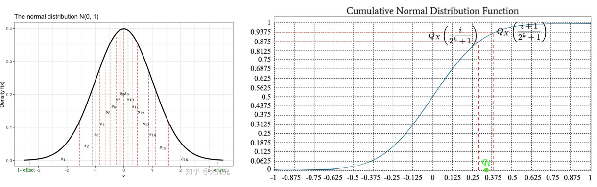

##  1 基础

### 1.0 Linux常用命令

- 复制文件夹：cp -r 源文件夹 目标文件夹
- 杀死进程并禁用自启动：pkill -f your_process_name

### 1.1 GPU原理  

BV1LY4y1d7cL

#### 1.1.1 数据位宽及运算

【常见】


int8、int16、int32、bp16、tf32、fp16、fp32   S表示正负；E表示范围；M表示精度

tf32(A100新格式)可以替代fp32，可以全程tf32训练或bf16/tf32混合训练

【训练】

一般使用bp16、tf32、fp16

【推理】

CV => int8为主；NLP => fp16为主；大模型 => int8/fp16混合；

#### 1.1.2 计算分解及强度

强度(一个数据被算多少次)=C/D


#### 1.1.3 计算指标及大模型计算量计算方法

GPU： MACs=OPS(算力)/2

模型：flops、mac

训练算力需求=模型参数量 * 6 * 训练token量

**Example:**

LLAMA-6B，数据类型Int8

模型参数： 6B*1 bytes =6GB

梯度： 同上 6GB

优化器参数：AdamW 2倍模型参数量 = 12GB

Llama的架构(hidden_size = 4096, intermediate_size=11008, num_hidden_layers = 32,context_length=2048)

每个样本需要：（4096+11008）*2048*32*1 bytes =990MB

A100（80GB）大概可以在Int8京都下 batch_size=50：    24GB+990*50≈80GB

#### 1.1.4 GPU和CPU区别

CPU通过降低DRAM Latency提高内存利用率；GPU通过提高Threads提高内存利用率

#### 1.1.5 GPU通讯原理

NVLink NVSwitch

#### 1.1.6 显存分析⭐

- 模型状态(model states)。对于大型模型来说，大部分显存消耗都是被模型状态占用的，主要包括三部分：**优化器的状态**(Optimizer States)、**梯度**(Gradients)、**参数**(Parameters)。三者简称为 OPG。
- 残余状态(residual states)。剩余状态（residual states）: 除了模型状态之外的显存占用，包括激活值（activation）、各种临时缓冲区（buffer）以及无法使用的显存碎片（fragmentation）

### 1.2 概念

### 1.3 架构


**Encoder 在抽取序列中某一个词的特征时能够看到整个序列中所有的信息，即上文和下文同时看到；**
**Decoder 中因为有 mask 机制的存在，使得它在编码某一个词的特征时只能看到自身和它之前的文本信息。**

Encoder-Decoder(序列到序列模型)
**输入双向**注意力，**输出单向**注意力。代表：T5、Flan-T5、BART

Causal(因果)  Decoder(自回归模型)
从左到右的单向注意力。代表：GPT系列、LLaMA、BLOOM、OPT

Prefix(前缀) Decoder(生成模型)

**输入双向**注意力，**输出单向**注意力。代表：GLM、ChatGLM、U-PaLM

#### 1.3.1 Transformer模型

##### Ⅰ attention

- **Scaled Dot-Product Attention:** 这是Transformer模型中最常用的Attention机制，用于计算查询向量（Q）与键向量（K）之间的相似度得分，然后使用注意力权重对值向量（V）进行加权求和。
- **Multi-Head Attention:**这是Transformer中的一个改进，通过同时使用多组独立的注意力头（多个QKV三元组），并在输出时将它们拼接在一起。这样的做法允许模型在不同的表示空间上学习不同类型的注意力模式。
- **Relative Positional Encoding:**传统的Self-Attention机制在处理序列时并未直接考虑位置信息，而相对位置编码引入了位置信息，使得模型能够更好地处理序列中不同位置之间的关系。
- **Transformer-XL:**一种改进的Transformer模型，通过使用循环机制来扩展Self-Attention的上下文窗口，从而处理更长的序列依赖性。
- **Multi Query Attention:**
- **Grouped Query Attention:**
  ​

##### Ⅱ layer_normalization

- **Batch Norm**：允许较大LR；减弱对初始化的强依赖性；让隐藏层的数值更稳定；有轻微的正则化作用（相当于给隐藏层加入噪声，类似Dropout）
- **Group Norm**：为了解决BN对较小的mini-batch size效果差的问题。
- **Layer Norm**：LN用于RNN效果比较明显，但是在CNN上，效果不如BN。
- **RMS Norm**：与layerNorm相比，主要区别在于去掉了减去均值的部分。
- **Instance Norm**：最初用于图像的风格化迁移。在图像风格化中，生成结果主要依赖于某个图像实例。
- **pRMSNorm**：RMS具有线性特征，所以提出可以用部分数据的RMSNorm来代替全部的计算，pRMSNorm表示使用前p%的数据计算RMS值。
- **Deep Norm**:对Post-LN的的改进。在具备 Post-LN 的良好性能 的同时又有 Pre-LN 的稳定训练。

##### Ⅲ 位置编码

- **绝对位置编码**—三角函数式位置编码
- **相对位置编码**—经典式
- **相对位置编码**—XLNET式
- **相对位置编码**—T5式
- **相对位置编码**—DeBERTa式

##### Ⅳ tokenize分词

- **Byte-Pair Encoding, BPE**—GPT-2、RoBERTa
- **WordPiece**—BERT
- **Unigram LM**—XLM
- **SentencePiece**—T5、ALBERT

##### Ⅴ token及模型参数

##### Ⅵ 激活函数

#### 1.3.2 解码策略

在自然语言任务中，给定预训练的大模型（比如GPT）输入文本生成输出文本。为了生成输出文本，需要让模型逐个预测每个 token ，直到达到一个终止条件（如一个标点符号或一个最大长度）。在每一步，模型会给出一个概率分布，表示它对下一个单词的预测。**那么，应该如何从这个概率分布中选择下一个单词呢？**以下是几种常用的方法：


##### Ⅰ Greedy Decoding

直接选择概率最高的单词。这种方法简单高效，但是可能会导致生成的文本过于单调和重复。**输出可能会陷入重复循环**。

##### Ⅱ Random Sampling

按照概率分布随机选择一个单词。这种方法可以增加生成的多样性，但是可能会导致生成的文本不连贯和无意义。

##### Ⅲ Beam Search

维护一个大小为 k 的候选序列集合，每一步从每个候选序列的概率分布中选择概率最高的 k 个单词，然后保留总概率最高的 k 个候选序列。这种方法可以平衡生成的质量和多样性，但是可能会导致生成的文本过于保守和不自然。

##### Ⅳ Top-k Sampling

Top-k 采样是对前面“贪心策略”的优化，它从排名前 k 的 token 中进行抽样，允许其他分数或概率较高的token 也有机会被选中。在很多情况下，这种抽样带来的随机性有助于提高生成质量。**k 越大，生成的多样性越高，但是生成的质量越低；k 越小，生成的质量越高，但是生成的多样性越低**。

优点：根据不同的输入文本动态调整候选单词的数量；通过调整 k 的大小来控制生成的多样性和质量；可以与其他解码策略【温度调节（Temperature Scaling）、重复惩罚（Repetition Penalty）、长度惩罚（Length Penalty）】结合使用。

缺点：生成的文本不符合常识或逻辑；生成的文本过于简单或无聊，没有考虑其他低概率但有意义或创意的单词。

```python
# \STD_Deep_Learning\LLM\Sampling
```

##### Ⅴ Top-p Sampling/Nucleus(核) Sampling

top-k 有一个缺陷，那就是“k 值取多少是最优的？”  于是出现了动态设置 token 候选列表大小策略

top-p 采样只从**累积概率超过某个阈值 p** 的最小单词集合中进行随机采样，而不考虑其他低概率的单词。

```python
# \STD_Deep_Learning\LLM\Sampling
```

##### VI Temperature Sampling

本质上就是在 Softmax 函数上添加了温度（T）这个参数。**越低的温度使模型对其首选越有信心,更具确定性;而高于1的温度会降低信心,不那么确定。**


##### Ⅶ  Joint(联合) Sampling

通常是将 **` top-k->top-p->Temperature` 联合起来使用**。

例如，先用top-k =3选中三个候选token；然后再用top-p保留累计概率达到阈值的token；接着使用Temperature=0.7进行归一化。

## **2 技术⭐⭐⭐**

### **2.0 Prompt【冻结】**

#### 2.1.1 Zero-shot Prompting(零样本提示)

#### 2.1.2 Few-shot Prompting(少量样本提示)

【==**应用场景**==】下游任务中数据稀缺

【定义】？

【代表】？

#### 2.1.3 思维链提示(Chain-of-Thought Prompting)⭐

【本质】将复杂任务分解成简单任务

【案例】Prompt:煮一个鸡蛋需要2分钟，煮5个鸡蛋需要几分钟?
Completion:煮一个鸡蛋需要2分钟，因此煮5个鸡蛋所需的时间是5个鸡蛋的煮时间之和。所以煮5个鸡蛋需要5x2=10分钟。.答案是10分钟。

#### 2.1.4 零样本CoT(Zero-shot CoT)

#### 2.1.5 自洽性/自一致性(Self-Consistency)

【案例】Prompt:我6岁的时候，我妹妹只有我的一半大。现在我70岁了，我妹妹多大了?
Completion:你的妹妹现在应该是64岁，因为当你6岁时，她只有3岁，相比之下，你已经增长到70岁，所以她应该比你小6岁。

#### 2.1.6 生成只是提示(Generate Knowledge Prompting)

#### 2.1.7 自动提示工程Automatic Prompt Enginer) 

**【本质】：引导LLM将复杂任务分解**

**【常见】：Tree of Thoughts(ToT)、Algorithm oT、Graph oT、Chain oT-SC**


#### 2.1.8 CO-STAR 框架⭐


【**来源**】2023首届GPT-4提示工程大赛冠军https://www.jiqizhixin.com/articles/2024-05-14-4

【**工作方式**】

- (C) 上下文（Context）：提供与任务有关的背景信息。这有助于 LLM 理解正在讨论的具体场景，从而确保其响应是相关的。
- (O) 目标（Objective）：定义你希望 LLM 执行的任务。明晰目标有助于 LLM 将自己响应重点放在完成具体任务上。
- (S) 风格（Style）：指定你希望 LLM 使用的写作风格。这可能是一位具体名人的写作风格，也可以是某种职业专家（比如商业分析师或 CEO）的风格。这能引导 LLM 使用符合你需求的方式和词语给出响应。
- (T) 语气（Tone）：设定响应的态度。这能确保 LLM 的响应符合所需的情感或情绪上下文，比如正式、幽默、善解人意等。
- (A) 受众（Audience）：确定响应的目标受众。针对具体受众（比如领域专家、初学者、孩童）定制 LLM 的响应，确保其在你所需的上下文中是适当的和可被理解的。
- (R) 响应（Response）：提供响应的格式。这能确保 LLM 输出你的下游任务所需的格式，比如列表、JSON、专业报告等。对于大多数通过程序化方法将 LLM 响应用于下游任务的 LLM 应用而言，理想的输出格式是 JSON。

【**案例**】


【**使用分隔符为 prompt 设置分节**】

① 用特殊字符当分隔符

分隔符是一种特殊 token（###(示例)###、===(回答)===、<<<(具体内容)>>>），可帮助 LLM 分辨 prompt 的哪些部分应被视为单个含义单元。需要说明的是，如果任务很简单，那么分隔符对 LLM 的响应质量的影响不大。但是，任务越复杂，使用分隔符分节对 LLM 响应的影响就越大。

例子：https://www.jiqizhixin.com/articles/2024-05-14-4

② 用 XML 标签当分隔符

XML 标签是使用尖括号括起来的成对标签，包括开始和结束标签。比如 <tag> 和 </tag>。这很有效，因为 LLM 在训练时就看过了大量用 XML 标注的网络内容，已经学会了理解其格式。

为了达到更好的效果，在 XML 标签中使用的名词应该与指令中用于描述它们的名词一样。

例子：https://www.jiqizhixin.com/articles/2024-05-14-4

【**使用 LLM 防护围栏创建系统提示**】

==仅适用于具有 System Prompt（系统提示）功能的 LLM，如ChatGPT*==

System Prompts ：是附加的额外 prompt，其作用是指示 LLM 理应的行为方式。之所以说这是额外附加的，是因为它位于「普通」prompt（也被称为用户 prompt）之外。总结：使用 System Prompts 提供你希望 LLM 在整个聊天过程中全程记住的指令。

System Prompts 中的指令通常包含以下类别：

- 任务定义，这样 LLM 在聊天过程中能一直记得要做什么。
- 输出格式，这样 LLM 能一直记得自己应该如何响应。
- 防护围栏，这样 LLM 能一直记得自己不应该如何响应。防护围栏（Guardrails）是 LLM 治理方面一个新兴领域，是指为 LLM 配置的可运行操作的边界。

System Prompts、System Messages 和 Custom Instructions三者联系和区别。
System Prompts 和 System Messages 是通过 ChatGPT 的 Chat Completions API 以程序化方式使用该 LLM 时使用的术语。
另一方面，Custom Instructions 是通过 https://chat.openai.com/ 的用户界面使用 ChatGPT 时的术语。

【**仅使用 LLM 分析数据集，不使用插件或代码**】

① LLM 不擅长的数据集分析类型

描述性统计数值计算：以定量方式总结数值列，使用的度量包括均值或方差。
相关性分析：获得列之间的精确相关系数。
统计分析：比如假设测试，可以确定不同数据点分组之间是否存在统计学上的显著差异。
机器学习：在数据集上执行预测性建模，可以使用的方法包括线性回归、梯度提升树或神经网络。

② LLM 擅长的数据集分析类型

异常检测：基于一列或多列数值识别偏离正常模式的异常数据点。
聚类：基于列之间的相似特征对数据点进行分组。
跨列关系：识别列之间的综合趋势。
文本分析（针对基于文本的列）：    基于主题或情绪执行分类。
趋势分析（针对具有时间属性的数据集）：识别列之中随时间演进的模式、季节变化或趋势。

#### 2.1.n 其它prompt技术

- **索引每一步的中间输出**：在为 LLM 提供逐步过程时，我们给出了每一步的中间输出结果，其中用的大写变量名指代。然后，可以通过加方括号的形式 [变量名] 索引这些中间输出。
- **设置 LLM 的响应的格式**：可以利用上中间输出的变量名，更方便地指定报告的结构，生成markdwon、文本、dpf。
- **将任务指令与数据集分离开**：有助于 LLM 清晰理解每一部分，降低遗漏信息的可能性；
- 除了CO-STAR，还有APE/CARE/RACE/COAST/CRISPE/RISE/TRACE/ROSES/LangGPT

### 2.1 Prompt-learning（提示学习）

Prompt-learning是一个综合全面的框架，需要考虑到PLMs，下游任务，人类的先验知识

#### 2.1.1 Template构造

用于向LLM发送请求时的格式化文本模板。它定义了如何构造问题、如何组织输入数据以及期望的输出格式


#### 2.1.2 Verbalizer构造

一种将任务标签或类别名称转化为预训练模型可以理解的标签形式的方法或工具。


Template和Verbalizer例子：

Template： Albert Einstein is a ___

Verbalizer:   person/scholar →scientist...

#### 2.1.3 Learning Strategy（训练范式）

从零开始学习:arrow_down::arrow_down::arrow_down::arrow_down::arrow_down::arrow_down:

① BERT之后：pre-training   ==>  fine-tuning出各种任务的模型

② T5：pre-training   ==>  fine-tuning(统一的范式text-to-text)

③ GPT：pre-training   ==>  prompt 和 in-context做zero/few-shot任务

Prompt-learning之后:arrow_down::arrow_down::arrow_down::arrow_down::arrow_down::arrow_down:

④ pre-training   ==>  添加一些 soft prompts   ==>  **冻结模型只训练prompt的embeddings**（Delta Tuning角度）

⑤ pre-training   ==>  prompting组织数据   ==>  **fine-tuning所有的参数**（中小型模型，few-shot场景效果好）

⑥ **pre-training + prompted data**   ==>  zero-shot推理（效果好）

#### 2.1.4  Prompt-Tuning

【==**应用场景**==】PLM模型巨大；

【步骤】在模型的**输入层**添加k个额外可训练的soft prompts(连续的，随机初始化的伪tokens)，冻结PLM，只训练这些前缀参数;

##### Ⅰ [geogle-soft prompts][1]⭐

【理论效果】好：与全参数微调一样；高效参数微调；

​                       坏：训练慢，在中小模型甚至会直接训练崩溃

【实践效果】


#### 2.1.5  Pre-tranined Prompt Tuning

【==**应用场景**==】few-shot场景；下游任务中数据稀缺

【步骤】把soft prompts(连续的，随机初始化的伪tokens)插入到PLM，在预训练中就让它训练；

【代表】[QH-PPT][2]、

【理论效果】好：让soft prompts的tokens有更好地初始化效果，使得下游任务和few-shot场景表现特别好

​                       坏：?

【实践效果】


#### 2.1.6  Pre-tranined with Prompted Data

【==**应用场景**==】few-shot场景；下游任务中数据稀缺

【步骤】?


#### 2.1.8 CO-STAR 框架⭐


【**来源**】2023首届GPT-4提示工程大赛冠军https://www.jiqizhixin.com/articles/2024-05-14-4

【**工作方式**】

- (C) 上下文（Context）：提供与任务有关的背景信息。这有助于 LLM 理解正在讨论的具体场景，从而确保其响应是相关的。
- (O) 目标（Objective）：定义你希望 LLM 执行的任务。明晰目标有助于 LLM 将自己响应重点放在完成具体任务上。
- (S) 风格（Style）：指定你希望 LLM 使用的写作风格。这可能是一位具体名人的写作风格，也可以是某种职业专家（比如商业分析师或 CEO）的风格。这能引导 LLM 使用符合你需求的方式和词语给出响应。
- (T) 语气（Tone）：设定响应的态度。这能确保 LLM 的响应符合所需的情感或情绪上下文，比如正式、幽默、善解人意等。
- (A) 受众（Audience）：确定响应的目标受众。针对具体受众（比如领域专家、初学者、孩童）定制 LLM 的响应，确保其在你所需的上下文中是适当的和可被理解的。
- (R) 响应（Response）：提供响应的格式。这能确保 LLM 输出你的下游任务所需的格式，比如列表、JSON、专业报告等。对于大多数通过程序化方法将 LLM 响应用于下游任务的 LLM 应用而言，理想的输出格式是 JSON。

【**案例**】


【**使用分隔符为 prompt 设置分节**】

① 用特殊字符当分隔符

分隔符是一种特殊 token（###(示例)###、===(回答)===、<<<(具体内容)>>>），可帮助 LLM 分辨 prompt 的哪些部分应被视为单个含义单元。需要说明的是，如果任务很简单，那么分隔符对 LLM 的响应质量的影响不大。但是，任务越复杂，使用分隔符分节对 LLM 响应的影响就越大。

例子：https://www.jiqizhixin.com/articles/2024-05-14-4

② 用 XML 标签当分隔符

XML 标签是使用尖括号括起来的成对标签，包括开始和结束标签。比如 <tag> 和 </tag>。这很有效，因为 LLM 在训练时就看过了大量用 XML 标注的网络内容，已经学会了理解其格式。

为了达到更好的效果，在 XML 标签中使用的名词应该与指令中用于描述它们的名词一样。

例子：https://www.jiqizhixin.com/articles/2024-05-14-4

【**使用 LLM 防护围栏创建系统提示**】

==仅适用于具有 System Prompt（系统提示）功能的 LLM，如ChatGPT*==

System Prompts ：是附加的额外 prompt，其作用是指示 LLM 理应的行为方式。之所以说这是额外附加的，是因为它位于「普通」prompt（也被称为用户 prompt）之外。总结：使用 System Prompts 提供你希望 LLM 在整个聊天过程中全程记住的指令。

System Prompts 中的指令通常包含以下类别：

- 任务定义，这样 LLM 在聊天过程中能一直记得要做什么。
- 输出格式，这样 LLM 能一直记得自己应该如何响应。
- 防护围栏，这样 LLM 能一直记得自己不应该如何响应。防护围栏（Guardrails）是 LLM 治理方面一个新兴领域，是指为 LLM 配置的可运行操作的边界。

System Prompts、System Messages 和 Custom Instructions三者联系和区别。
System Prompts 和 System Messages 是通过 ChatGPT 的 Chat Completions API 以程序化方式使用该 LLM 时使用的术语。
另一方面，Custom Instructions 是通过 https://chat.openai.com/ 的用户界面使用 ChatGPT 时的术语。

【**仅使用 LLM 分析数据集，不使用插件或代码**】

① LLM 不擅长的数据集分析类型

描述性统计数值计算：以定量方式总结数值列，使用的度量包括均值或方差。
相关性分析：获得列之间的精确相关系数。
统计分析：比如假设测试，可以确定不同数据点分组之间是否存在统计学上的显著差异。
机器学习：在数据集上执行预测性建模，可以使用的方法包括线性回归、梯度提升树或神经网络。

② LLM 擅长的数据集分析类型

异常检测：基于一列或多列数值识别偏离正常模式的异常数据点。
聚类：基于列之间的相似特征对数据点进行分组。
跨列关系：识别列之间的综合趋势。
文本分析（针对基于文本的列）：    基于主题或情绪执行分类。
趋势分析（针对具有时间属性的数据集）：识别列之中随时间演进的模式、季节变化或趋势。

#### 2.1.n-1 其它prompt技术

- **索引每一步的中间输出**：在为 LLM 提供逐步过程时，我们给出了每一步的中间输出结果，其中用的大写变量名指代。然后，可以通过加方括号的形式 [变量名] 索引这些中间输出。
- **设置 LLM 的响应的格式**：可以利用上中间输出的变量名，更方便地指定报告的结构，生成markdwon、文本、dpf。
- **将任务指令与数据集分离开**：有助于 LLM 清晰理解每一部分，降低遗漏信息的可能性；
- 除了CO-STAR，还有APE/CARE/RACE/COAST/CRISPE/RISE/TRACE/ROSES/LangGPT


#### 2.1.n  Toolkit

##### ⅠOpenPrompt

【地址】https://github.com/thunlp/OpenPrompt

#### 2.1.n Applications


### 2.2 Delta Tuning（参数高效微调）

Delta Tuning，即参数高效微调方法，是指在预训练模型的基础上，仅对模型参数的一小部分进行微调，而其余部分保持不变，以降低计算和存储成本，同时保持或提升模型性能的一种技术。


#### 2.2.0 综述

Delta Tuning: A Comprehensive Study of Parameter Efficient Methods for Pre-trained Language Models  

#### 2.2.1 Addition(增量式) tuning   

【==**应用场景**==】?

##### Ⅰ [Adapter-Tuning][3]⭐

【步骤】?

【理论效果】好：?

​                       坏：?

【实践效果】


##### Ⅱ [LST][4]

【步骤】?

【理论效果】好：?

​                       坏：?

【实践效果】


##### Ⅲ [Prefix-Tuning][5]⭐

【步骤】在模型的**每一层**添加k个额外可训练的soft prompts(连续的，随机初始化的伪tokens)，冻结PLM，只训练这些前缀参数;

【理论效果】好：?

​                       坏：?

【实践效果】


#### 2.2.2 Specification(指定式) tuning

【==**应用场景**==】?

##### Ⅰ [BitFit][6]

【步骤】只微调Q、K、V的bias

【理论效果】好：在简单任务上能达到与全参数微调差不多的效果

​                       坏：?

【实践效果】


#### 2.2.3 Reparameterizatoin(重参数化式) tuning

模型的优化本质上可以用一个很少代价去完成

【==**应用场景**==】?

##### Ⅰ [LoRA][7]⭐

【步骤】只微调Q、K、V的bias

【理论效果】好：在简单任务上能达到与全参数微调差不多的效果

​                       坏：?

【实践效果】


#### 2.2.4 Unifield(统一) tuning

##### Ⅰ [A Unifield View][7]

【步骤】只微调Q、K、V的bias

【理论效果】好：在简单任务上能达到与全参数微调差不多的效果

​                       坏：?

【实践效果】


#### 2.1.n-1  Toolkit

##### ⅠOpenDelta

【地址】https://github.com/thunlp/OpenDelta

##### Ⅱ delta_residual

【地址】https://github.com/Handicraft-Computing-Team/delta_residual


### 2.3 分布式训练并行技术

近年来，随着Transformer、MOE架构的提出，使得深度学习模型轻松突破上万亿规模参数，传统的单机单卡模式已经无法满足超大模型进行训练的要求。因此，我们需要基于单机多卡、甚至是多机多卡进行分布式大模型的训练。

而利用AI集群，使深度学习算法更好地从大量数据中高效地训练出性能优良的大模型是分布式机器学习的首要目标。为了实现该目标，一般需要根据硬件资源与数据/模型规模的匹配情况，考虑对计算任务、训练数据和模型进行划分，从而进行分布式存储和分布式训练。因此，分布式训练相关技术值得我们进行深入分析其背后的机理。

#### 2.3.0 策略选择⭐⭐

##### Ⅰ 单机单卡

① 如果可以在单张GPU上训练：正常使用。
② 如果无法在单张GPU上训练：

- ZeRO + Offload CPU + NVMe(可选)；
- 启用以**内存为中心的平铺**(MCT)；

③ 如果最大层无法放置在单张GPU上训练：

- ZeRO + 启用MCT。它允许您通过自动分割层并按顺序执行来运行任意大的层。 MCT 减少了 GPU 上实时参数的数量，但不影响激活内存。

##### Ⅱ 单机多卡

① 如果可以在单张GPU上训练：

- DDP
- ZeRO：可能会更快，也可能不会更快，具体取决于所使用的情况和配置。

② 如果无法在单张GPU上训练：

- PP
- ZeRO
- TP

使用 NVLINK 或 NVSwitch ==>    pp$\approx$ZeRO$\approx$TP

不使用 NVLINK 或 NVSwitch ==> pp$＞$ZeRO/TP

##### Ⅲ 多级多卡

① 服务器节点间网络通信速度较快：

- ZeRO：因为它几乎不需要对模型进行任何修改。
- PP+TP+DP：通信较少，但需要对模型进行大量更改。

② 服务器节点间网络通信速度较慢**并且**GPU 内存仍然不足：

- DP+PP+TP+ZeRO-1
- PP + ZeRO 2/3【不推荐】。PP 需要累积梯度（accumulate gradients），但 ZeRO2 需要对梯度进行分块（chunk）。 即使能够实现，也没有真正的性能提升。PP + ZeRO 2 实际上比 ZeRO2（无 PP）更慢且内存效率低。如果用户内存不足，用户可以使用 ZeRO3 代替 ZeRO2 + PP。ColossalAI 还是提供了 ZeRO 3 + PP + TP 一起组合的方案。

#### 2.3.1 Collective Communication

都是 **规约**操作，包括avg/sum/max等等

Reduce：经过③+④，参数放入一个卡，然后再   `Broadcast` 到其余多个显卡上。

All Reduce：经过③+④，参数放入所有显卡。

Reduce Scatter：经过③+④，参数放入所有显卡。只得到一部分的参数

All Gather：


#### 2.3.2 Data Parallelisms, 数据并行

##### Ⅰ DataParallel, DP

【步骤】① 先将**参数服务器**中的参数 `Broadcast` 到其余多个显卡上(**同步**)；然后将数据切分划分到不同显卡上；

​	       ② 然后进行前向传播（FP）和反向传播（BP），获取梯度   `Gradient`；

​	       ③ 然后对这些       `Gradient` 规约得到 `  Gradient*` ；

​	       ④ 将本次的参数和   `  Gradient*` 送入优化器对模型参数进行更新；

【】


##### Ⅱ DistributedDataParallel, DDP, 分布式数据并行

【步骤】① 初始时候，每张显卡都有相同的模型参数；然后将数据切分划分到不同显卡上；
	       ② 然后进行前向传播（FP）和反向传播（BP），获取梯度   `Gradient`；
	       ③ 然后对这些      `   Gradient` 进行All Ruduce规约得到 `  Gradient*` ，然后告诉所有显卡；
	       ④ 将本次的参数和   `  Gradient*` 送入优化器对模型参数进行更新；


#### 2.3.3 Model Parallelisms, 模型并行

##### Ⅰ **Tensor Parallesim**, 张量并行

【步骤】① 初始时候，每张显卡都有相同的数据；然后将**模型线性层参数**切分划分到不同显卡上；

​	       ② 然后进行前向传播（FP）和反向传播（BP），获取梯度   `Gradient`；

​	       ③ 然后对这些      `   Gradient` 进行All Gather规约得到 `  Gradient*` ，然后告诉所有显卡；

​	       ④ 将本次的参数和   `  Gradient*` 送入优化器对模型参数进行更新；


##### Ⅱ  **Pipeline Parallelism**, 流水线并行

###### Paper - [Gpipe][9] 

① 切分micro-batch**

【核心思想】在模型并行的基础上，进一步引入数据并行的办法，即把原先的数据再划分成若干个batch，送入GPU进行训练。未划分前的数据，叫`mini-batch`。在`mini-batch`上再划分的数据，叫`micro-batch`。

【如图所示】第一个下标表示GPU编号，第二个下标表示micro-batch编号。每一行表示一个GPU。每一列表示timestep。
图(b)含义：我在GPU0上做完一次forward，然后将GPU0上最后一层的输入传给GPU1，继续做forward，直到四块GPU都做完forward后，我再依次做backward。等把四块GPU上的backward全部做完后，最后一个时刻我统一更新每一层的梯度。


#### 2.3.4 算力优化技术

##### Ⅰ  Mixed Precision Training, 混合精度训练


##### Ⅱ  Offloading

【步骤】

① 先把梯度`Gradient`从GPU传到CPU;
② 在CPU上进行优化状态；(使用OpenMP + SIMD)
③ 将优化的结果重新传回我们的显卡上


##### Ⅲ  Overlapping

【步骤】

????????

##### Ⅳ  Checkpointing

【步骤】

① FP：

- 将每个 Hidden States(即checkpoint，即每个TransFormer的输入/输出)保存起来;
- 其余的中间结果全部释放。

② BP:

- 如何对每个TransFormer里面的线性层进行计算呢？我们进行一个**重计算**，通过TransFormer每个大层的输入，重新进行FP，临时得到每个线性层的结果，然后就可以进行BP。
- BP结束，获取到梯度后，释放相应的checkpoint和临时计算结果。


##### Ⅴ  Zero Redundancy Optimizer, [ZeRO-1/2/3][8], 零冗余优化占用空间⭐

将模型参数、优化器状态、梯度分布到不同设备，减少显存冗余。

【**Zero-1** 步骤】

① 先将参数服务器中的参数 `Broadcast` 到其余多个显卡上(同步)；然后将数据切分划分到不同显卡上；
② 然后进行FP和BP，获取梯度   `Gradient`；
③ 在BP结束后，然后对这些  `Gradient` 进行**Reduce Scatter规约**得到每张显卡各自的 `  Gradient*` ；
④ 每张显卡用对应参数和`  Gradient*` 送入优化器更新参数；
⑤ 最后使用All Gather收集和拼接所有更新的参数，然后告诉所有的显卡。


【**Zero-2** 步骤】

① 先将参数服务器中的参数 `Broadcast` 到其余多个显卡上(同步)；然后将数据切分划分到不同显卡上；② 然后进行FP和BP，获取梯度   `Gradient`；
③ 在BP过程中，在每次获取到`  Gradient*`之后就释放 `Gradient` 。
例如：有一个24层的Transformer,在24层的BP结束后，就用24层各卡的 `Gradient` 进行**Reduce Scatter**得到`  Gradient*` ，释放24层`Gradient` ，同理23层，22层...
④ 每张显卡用对应参数和`  Gradient*` 送入优化器更新参数；
⑤ 最后使用**All Gather**收集和拼接所有更新的参数，然后告诉所有的显卡。

【**Zero-3** 步骤】

① 先将参数服务器中的参数 `Broadcast` 到其余多个显卡上(同步)；然后将数据切分划分到不同显卡上；
② 把模型参数进行一个划分保留在各自显卡上。在FP过程中，把模型参数进行一个**All Gather**收集拼接
③ 在BP过程中，在每次获取到`  Gradient*`之后就释放 `Gradient` 。
例如：有一个24层的Transformer,在24层的BP结束后，就用24层各卡的 `Gradient` 进行**Reduce Scatter**得到`  Gradient*` ，释放24层`Gradient` ，同理23层，22层...
④ 每张显卡用对应参数和`  Gradient*` 送入优化器更新参数；
⑤ 更新的参数只会对应各自卡上的参数。

【Zero-总图】


【实现参考】https://docs.oneflow.org/master/cookies/zero.html

##### Ⅵ  Zero Redundancy Optimizer, [ZeRO-R][8], 零冗余优化剩余空间⭐

#### 2.3.5 Sequence Parallelism, 序列并行

###### Paper - [RSA][10]

【目标】解决输入长度限制

#### 2.3.6 多维混合并行

#### 2.3.7 自动并行

##### Ⅰ  Semi-auto

##### Ⅱ  Auto

#### 2.3. MOE并行

ⅠMOE

#### 2.3.n-1  Toolkit

##### ⅠBMTrain

【地址】https://github.com/OpenBMB/BMTrain


### 2.4 LLM训练优化技术

### 2.5 LLM对齐技术

### 2.6 LLM推理框架

### 2.7 LLM推理优化技术

大模型推理优化技术-KV Cache

https://blog.csdn.net/qq_35229591/article/details/142334265
https://blog.csdn.net/taoqick/article/details/137476233?utm_medium=distribute.pc_relevant.none-task-blog-2~default~baidujs_baidulandingword~default-4-137476233-blog-142334265.235^v43^control&spm=1001.2101.3001.4242.3&utm_relevant_index=7

大模型推理优化技术-KV Cache优化方法综述
大模型显存优化技术-PagedAttention
大模型底显存推理优化-Offload技术
大模型访存优化技术-FlashAttention
大模型显存优化技术-PagedAttention
大模型推理优化技术-Flash-Decoding
大模型显存优化技术-ZeRO系列
大模型解码优化-Speculative Decoding及其变体
大模型推理服务化调度优化技术-Dynamic batching/Continuous batching

### 2.8 LLM压缩

#### 2.8.0 预备知识

##### ⅠKullback-Leibler divergence, KLD

##### Ⅱ 线性量化

==MinMax量化==，保留所有值范围，公式：

$\mathbf{X}_{\mathbf{Q}}^{i}=\alpha \hat{\mathbf{X}}_{\mathbf{Q}}^{i}=\alpha\left\lfloor\frac{\mathbf{X}_{\mathbf{R}}^{i}-\beta}{\alpha}\right\rceil+\beta$

 其中，$\mathbf{X}_{\mathbf{Q}}​$和 $\mathbf{X}_{\mathbf{R}}​$分别表示量化的变量和全精度的变量。$i​$ 指的是张量中的第$i​$ 个元素。$\alpha​$是缩放因子，$\beta​$是零点（zero-point）值。 对于对称量化，$\alpha = \frac{max(|\mathbf{X}_\mathbf{R}|)}{2^{N-1} - 1} \times 1, \beta = 0​$。对于非对称量化，$\alpha = \frac{max(\mathbf{X}_\mathbf{R})-min(\mathbf{X}_\mathbf{R})}{2^{N} - 1} , \beta = min(\mathbf{X}_\mathbf{R})​$。$N​$是bit位数。


==截断量化==，截断异常值有助于提高精度并为中间值分配更多位，公式：

$\mathbf{X}_{\mathbf{Q}}^{i}=\alpha \hat{\mathbf{X}}_{\mathbf{Q}}^{i}=\alpha\left\lfloor\text{Clip}(\frac{\mathbf{X}_{\mathbf{R}}^{i}-\beta}{\alpha},0,1)\right\rceil+\beta$

 其中$\alpha$和零点值$\beta$可以通过统计计算或通过梯度学习。

##### Ⅲ 非线性量化

Quantile Quantization， ==分位数量化==，使用分位数将张量分成了大小相同的若干个块，这样我们得到更加均匀的量化特征。图左，例如4 bit，就需要找到15个分位数来将正态分布曲线面积分为16份。两个分位数的中点便是模型量化到这个区间映射的值 $q_i$ 。但通过正态分布曲线面积确定分位数很困难。

图右，可以将Cumulative Normal Distribution Funtion（CDF的反函数）曲线的y轴等分16份。两个分位数的中点便是 $q_i$ 。因为0，1的CDF反函数会无穷大，所以计算区间从[0,1]=>[1-offset, offset]。$q_i = \frac{1}{2}({Q_x(\frac{i}{2^k+1}) + Q_x(\frac{i+1}{2^k+1})})$

归一化常数$N=max(|T|)$，将输入张量$T$转化为目标量化数据类型的范围内；从 $q_i$集合的$Q_j^{\text{map}}$中找到一个最接近$\frac{T_i}{N}$的量化值。

$T_i^Q = \arg \min_{j=0}^{2n} \left| Q_j^{\text{map}} - \frac{T_i}{N} \right|$



==分块k位量化==。在量化过程中，状态张量被分块处理，通过每个块的最大值进行归一化，最后得到的是最近的值以及它所在块的最大值。在反量化时，我们根据存储的量化后的低精度的值以及它所在块的最大值恢复到高精度的值。


##### Ⅳ 梯度检查点

##### Ⅴ per-tensor、per-token、per-channel


https://zhuanlan.zhihu.com/p/666234324

##### Ⅵ RTN, 舍入到近邻(量化基线)

直接对训练数据应用 PTQ，即$Q(x)=INT((x-Z)/S)-Z$。对于对称量化，$S=max(abs(x))$,$Z=0$；非对称量化，$S=max(x)-min（x）$,$Z=min(x)$。

##### N 综述

QAT：

PTQ：GPTQ -> AWQ

​           LLM.int8() -> SmoothQuant

​           SpQR -> 

https://arxiv.org/pdf/2402.13116 

#### 2.8.1 Knowledge Distillation, KD, 知识蒸馏

##### Ⅰ Standard KD

使学生模型学习LLM所拥有的常见知识，如输出分布和特征信息。

###### paper - [MINILLM][11]

最小化前向 KLD 的标准蒸馏方法不是最优的，因为教师的输出分布包含的模式比学生的模式多，而前向 KLD 迫使学生分布高估教师分布的低概率区域。

因此，作者提出了 MINILLM 来最小化教师和学生分布之间的反向 KLD，**防止学生高估教师分布中的低概率区域**，从而产生比标准 KD 模型更精确的响应，具有更高的整体质量，更低的曝光偏差、更好的校准和更高的长文本生成性能，具有良好的生成多样性。


序列级 KD 迫使学生记住教师模型生成的所有样本，而 MINILLM 则根据教师模型的反馈改进其生成的文本。

paper - [GKD][12]

探索了自回归模型的蒸馏，这里白盒生成 LLM 是一个子集。 该方法确定了两个关键问题：训练期间的输出序列与学生在部署期间生成的输出序列之间的分布不匹配，以及模型under-specification，其中学生模型可能缺乏与教师分布相匹配的表达能力。GKD 通过在训练期间对学生的输出序列进行采样来处理分布不匹配，它还通过优化替代散度（逆向 KL）来解决模型under-specification的问题。

##### Ⅱ EA-based KD

ICL:In-context Learning Distillation: Transferring Few-shot Learning Ability of Pre-trained Language Models
MT-COT:Explanations from Large Language Models Make Small Reasoners Better
Fine-tune CoT:Large language models are reasoning teachers
Specializing Smaller Language Models towards Multi-Step Reasoning
Distilling Step-by-Step! Outperforming Larger Language Models with Less Training Data and Smaller Model Sizes
SOCRATIC CoT:Distilling Reasoning Capabilities into Smaller Language Models
DISCO:Distilling Counterfactuals with Large Language Models
SCOTT: Self-Consistent Chain-of-Thought Distillation
Lion: Adversarial Distillation of Closed-Source Large Language Model

#### 2.8.2 Model Quantization, 量化

模型量化（quantization）也被叫做模型的低精度表示，指的是在不大幅降低模型效果的前提下使用更低的精度来表示模型中的参数，从而缩减模型的体积和训练模型时占用的显存。量化的本质是函数映射。

##### Ⅰ Quantization Aware Training, QAT, 量化感知训练

【挑战、困难】

- LLM需要经过预训练；在 ==zero-shot 生成==方面表现出色；==> 量化后保持这种能力至关重要
- 选择合适的微调数据集（==QAT 数据域太窄或者与原始预训练数据分布存在显著不同==，则可能会损害模型的性能）。
- LLM训练及其复杂，因此，很难准确地==复现原始的训练设置==。
- LLM 表现出独特的权重和激活分布，其特点是**存在大量的异常值**，这是它们与较小的模型的不同之处。 

【策略选择】选择使用全精度的小模型，还是选择具有类似推理成本的较大的量化模型？

- 使用8比特量化的大模型应该优于较小的全精度模型，并且 PTQ 方法足以满足这种情况。
- 使用 LLM-QAT 量化的 4 比特的模型应该优于类似大小的 8 比特模型。

###### paper - [LLM-QAT][13] - 

**① data free**

【步骤】

图(a)中，从词汇表中随机化第一个Token：<start>，并让预训练模型生成下一个Token：<out1>，然后将生成的Token附加到起始Token以生成新的输出：<out2>。 重复这个迭代过程，直到达到句子Token的结尾或最大生成长度。

【细节】

每次PLM会生成softmax后的token分布。作者发现==最初的几个Token在确定预测趋势至关重要==，所以对前 3~5 个Token确定性地选择 top-1 预测，后面剩余Token选择随机采样。


**② KV Cache的量化感知训练**

训练的初始阶段，任何基于裁剪的方法都是不利于LLM性能，作者选择保留这些异常值。==保留异常值对于大语言模型的性能至关重要。==

==对于 LLaMA 模型，激活和权重主要表现出对称分布，这使得使用对称量化成为最佳选择。==

针对KV有效的量化，采用per-token 激活量化和 per-channel 权重量化。


----

###### paper - [QLoRA][19] - NF4+DQ

**① 4-bit NormalFloat Quantization, 4位标准浮点数量化**

```
Q = [-1.0, -0.6961928009986877, -0.5250730514526367, -0.39491748809814453, -0.28444138169288635, -0.18477343022823334, -0.09105003625154495, 0.0, 0.07958029955625534, 0.16093020141124725,0.24611230194568634, 0.33791524171829224, 0.44070982933044434, 0.5626170039176941, 0.7229568362236023, 1.0]
```

结合了分位数量化和分块量化。例子：
一个input_tensor有16个值，分成4块。然后取每个块绝对值的最大值，并保存一个量化常数$c_i$。然后input_tensor对应值除以对应块的$c_i$得到一个值，在$Q$中找到与其最接近的值和索引$i$，最后这个值量化成$i$。

在反量化时，我们以量化结果作为索引，从$Q$中查找到它对应的分位数，再乘以为每个块保存的量化常数$c_i$，便可以得到最终结果。


**② Double Quantization, 双重量化**

量化后的参数只有4bit的精度，但是这个量化常量的精度是float32。对这个量化常数再做一次8bit的量化，在进行量化常数的量化时，QLoRA以每256个量化常数为一组再做一次量化。

**③ Paged Optimizer, 分页优化**

分页优化是针对梯度检查点做的进一步优化，以防止在显存使用峰值时发生显存OOM的问题。QLoRA分页优化其实就是当显存不足是，将保存的部分梯度检查点转移到CPU内存上，和计算机的内存数据转移到硬盘上的常规内存分页一个道理。


##### Ⅱ Post Training Quantization, PTQ, 训练后量化

###### 挑战、困难

- 激活比权重更难量化；
- 异常值让激活量化更困难；（激活异常值比大多数激活值大约 100 倍。 如果我们使用 INT8 量化，大多数值将被清零。）
- 异常值持续存在固定的通道（channel）中。

------

###### paper - [GPTQ][21] - W4A16/W8A16

首先，使用 Cholesky 分解中 Hessian 矩阵的逆，在给定的step中对连续列的块（粗体）进行量化，并在step结束时更新剩余的权重（蓝色）。量化过程在每个块内递归应用：白色中间列表示当前正在被量化。


创新：取消OBS贪心算法；Lazy Batch-Updates(延迟批处理)；Cholesky 分解求海森矩阵的逆；

---

###### paper - [LLM.int8()][20] 

采用混合精度分解的量化方法。**对绝大部分权重和激活用8bit量化**。对离群值的几个维度保留16bit的高精度矩阵乘法。

【步骤】
① 从输入X的隐含状态中，按列提取离群值 (离群特征，即大于某个阈值的值)。

② 对离群值进行 FP16 矩阵运算，对非离群特征进行量化，做 INT8 矩阵运算；

③ 反量化常规值的矩阵乘结果，并与离群值矩阵乘结果相加，获得最终的 FP16 结果。


---

paper - [SmoothQuant][25] - W8A8

【动机】==新出现的离群特征（Emergent Features）的分布是有规律的。通常，这些离群特征只分布在 Transformer 层的少数几个维度。==针对这个问题，LLM.int8()采用了混合精度分解计算的方式。虽然能确保精度损失较小，但由于需要运行时进行异常值检测、scattering 和 gathering，导致它比 FP16 推理慢。
【核心思想】**将较难量化的激活迁移到权重上**。


---

###### paper - [AWQ][26]、AutoAWQ - Wint3/g128

【动机】作者认为：不同权重对大模型性能影响不同，通过跳过这1%的显著权重不进行量化，可以大大减少量化误差。找到显著的权重通道，需要根据激活分布而不是权重分布。与较大激活幅度(activation magnitudes)相对应的权重通道更加突出，因为它们处理了更重要的特征。


---

###### paper - [SpQR][27]

【工作原理】虽然，之前在 LLM.int8 已经观察到**异常值输入特征**，但作者首次证明，**与输入特征异常值不同，输出隐藏维度(权重)异常值仅出现在特定输出隐藏维度的小片段中。**识别和隔离异常值权重（这些权重会导致特别大的量化误差），并以更高的精度存储它们，同时将所有其他权重压缩到3-4位，并实现小于1%的精度损失。

【贡献】提出量化算法隔离此类异常值并以 SpQR 格式有效地对给定模型进行编码；
		开发了一种基于压缩稀疏行（CSR）格式的专门稀疏矩阵乘法算法。
		为了使用 SpQR 进行逐个token生成，我们将这种稀疏算法与 3-4 比特权重的密集量化矩阵乘法结合起来。

---

###### paper - ZeroQuant系列

[ZeroQuant - W8A8][28]【贡献】

我们在权重和激活上都应用了细粒度的硬件友好量化方案，即权重的group-wise量化和激活的token-wise量化

**提出了一种新的逐层知识蒸馏方法（LKD），用于INT4/INT8混合精度量化，其中神经网络通过蒸馏逐层量化，迭代次数最少，甚至无需访问原始训练数据。**

开发了一个高度优化的推理后端，消除量化/反量化算子昂贵的计算成本。

[ZeroQuant-V2][29]【贡献】

INT8纯权重量化可以作为标准一种降低LLM内存成本的方法，其准确性的下降可以忽略不计(模型越大下降越多)；INT4仅权重量化的精度大幅下降会随着模型大小的增加而减弱

揭示当前的方法使用 INT4 权重 或 INT4 权重和INT8激活 进行量化都无法达到原始模型质量；

**提出了一种称为低秩补偿（LoRC）的优化方法，该方法采用低秩矩阵以最小的模型参数大小的增加来提升模型质量的恢复，目标是使用低秩矩阵实现误差矩阵 $E$ 的近似**


[ZeroQuant-FP][29]【贡献】

==深入探讨了浮点 (FP) 量化的可行性，特别关注 FP8 和 FP4 作为潜在解决方案。==

【发现】对于 LLMs，参数超过10B，FP8 激活始终优于其INT8激活，性能优势变得更加明显；
		对于权重量化，FP4 表现出与 INT4 相当（即使不是更优）的性能，从而简化了在 H100 等支持 FP 的硬件上的部署。

**为了减轻权重和激活之间的差异引起的精确对齐的开销**，提出了两个权重量化的缩放建议，与标准 W4A8 模型相比，它们对模型性能的影响可以忽略不计。

【优化方案】应用FGQ（细粒度权重量化），对激活进行 token-wise 量化，LoRC（低秩补偿）

① 将 FP4 转换为 FP8 方案


##### Ⅲ 评估指标

Perplexity, PPL：用于验证量化模型是否能够在其训练域的不同样本上保留模型的输出分布。

Zero/Few-shot：衡量模型在下游任务上的能力是否得到保留。

敏感性分析：研究模型输出对输入或模型参数的变化的响应程度，以评估模型的鲁棒性、稳定性和对某些特定变量的依赖性。

#### 2.8.3 Model Pruning, 剪枝

非结构化剪枝

结构化剪枝

#### 2.8. 低秩分解


## 3 模型⭐⭐

|          | autoregressive自回归模型（AR模型） | **autoencoding自编码模型（AE模型）** | encoder-decoder（S2S模型）               | 全都要 |
| -------- | ---------------------------------- | ------------------------------------ | ---------------------------------------- | ------ |
| 代表模型 | GPT、Llama                         | BERT、                               | T5                                       | GLM    |
| 任务     | 生成任务                           |                                      | **条件生成任务**，比如文本摘要、机器翻译 |        |

### 3.1 [BERT系列][14]

#### 模型架构


- **Token Embeddings:** 分词后的Token被映射到一个高维空间，形成Token Embeddings。通过查找一个预训练的嵌入矩阵来实现，该矩阵为每个Token提供一个固定大小的向量表示。

- **Position Embeddings:** Transformer模型本身不具有处理序列中Token位置信息的能力，因此需要位置嵌入来提供这一信息。
- **Segment Embeddings:** 由于BERT能够处理两个句子作为输入（例如，在句子对分类任务中），因此需要一种方法来区分两个句子。该向量的取值在模型训练过程中自动学习。


https://blog.csdn.net/2401_84033492/article/details/137657486

#### 变种

##### [RoBERTa][15]

【贡献】

- 使用更大的 batch-size，更大的数据集，做更充分的训练；
- 使用的数据中具有更大的 sequence length，而不是像 bert 中会掺杂一些短句；
- 实验结果表明，不使用NSP的效果要优于使用NSP
- 将静态 mask 机制改为动态 mask 机制；

##### [ALBERT][16]

【贡献】

- 对Embedding 层的参数做因式分解。ELMo 模型认为**靠近输入的层学到的是语法信息，离输入较远的层学到的是语义信息。**方法：embedding 权重矩阵的维度是`V * E`（这里的 E < H ），得到 embedding 的向量之后再通过一个 `E * H `的权重矩阵投影到 transformer 层的隐空间上。
- 跨层参数共享。**所有的 transformer 层共享相同的参数，也就是说实际上只有一个 transformer 层的权重**
- 将 NSP 任务换成了 sentence order prediction(SOP)任务（预测两句话有没有被交换过顺序）；

##### [spanBERT][17]

【贡献】

- 将token mask改成span mask。
- 增加由边界预测mask的任务（SBO）。
- 去掉NSP。

##### XLNet？

### 3.2 [Llama系列][18]

==**Meta AI 发布，7B、13B、33B 和 65B 四种参数规模的开源基座语言模型。（不可商用）**==

#### 技术细节


- 训练数据量： 

- 模型结构：与 GPT-2 类似，基于Transformer Decoder部分

- 分词器：采用BPE，使用SentencePiece 实现

- 位置嵌入RoPE。借助了**复数的思想**，出发点是**通过绝对位置编码的方式实现相对位置编码**。

- 采用RMSNorm。**为了使得模型训练过程更加稳定**。LlamaRMSNorm = T5LayerNorm 

- 激活函数：SwiGLU

  

- 优化器：AdamW

#### 迭代

##### [Llama 2/Llama 2-chat][22]

==**Meta AI 发布，7B、13B、34B(X) 和 70B 四种参数规模的开源基座语言模型。（可商用）**==


Llama2与Llama1相比

① 训练数据量： 1.0T(7B/13B)，1.4T(33B/65B)   ==>   2.0T(7B/13B/34B/70B)，强调高质量数据集，更加注重安全和隐私问题

② 上下文长度：2048   ==>   4096

③ Attention技术：MHA   ==>   MHA有(7B/13B)，GQA有(34B/70B)

④ 发布Llama2-chat。在基准模型llama2上，引入SFT、RLHF(拒绝采样和PPO)

##### Llama 3

Llama3与Llama2相比

① 训练数据量： 2.0T(7B/13B/34B/70B)  ==>   15T(7B/13B/34B/70B)，强调高质量数据集

② 上下文长度：4096   ==>   8192

③ 分词器：sentencepiece   ==>   tiktoken

④ 词汇量：32K   ==>   128K

⑤ Attention技术：MHA(7B/13B)，GQA(34B/70B)   ==>   GQA(7B/13B/34B/70B)

⑥ 缩放定律：？

⑦ chat模型：SFT、拒绝采样、PPO   ==>   SFT、拒绝采样、PPO + 直接策略优化(DPO)

⑧ 性能提升；安全性增强；多语言支持；

##### Llama 3.1

==**Meta AI 发布，8B、70B 和 403B 三种参数规模的开源基座语言模型。（可商用）**==

多模态能力：理解和生成图像、视频和音频内容，实现了真正的跨媒体交互。

##### Llama 3.2


==**Meta AI 发布 小中型视觉LLM(11B、90B) 和边缘和端侧的轻量级纯文本模型 (1B、3B)。（可商用）**==

多模态能力：理解和生成图像、视频和音频内容，实现了真正的跨媒体交互。

#### 变种

##### [Alpaca][23]


第一步：构造175条self-instruct 种子示例任务。

第二步：基于上述种子任务，利用text-davinci-003爬取指令数据


第三步：使用爬取下来的52K指令 数据在LLaMA上进行精调，最终 得到Alpaca

### 3.3 [ChatGLM][24]系列

#### 技术细节


- 原始输入文本是[x1,x2,x3,x4,x5,x6]，采样的两个文本片段是[x3]以及[x5,x6]，即Part B。那么mask后的文本序列是：x1,x2,[M],x4,[M]，即Part A；同时对Part B的片段进行shuffle。每个片段使用`[S]`填充在开头作为输入，使用`[E]`填充在末尾作为输出。

- **二维位置编码：**第一个位置id用来标记Part A中的位置，第二个位置id用来表示跨度内部的相对位置。

- **Attention mask的设计：**Part A tokens彼此可见，但不可见Part B tokens；Part B tokens可见Part A，可见自己过去的tokens，不可见未来tokens。（Part A双向Transformer，Part B单向）

- **采样方式：**文本片段的采样遵循泊松分布，重复采样，直到原始tokens中有15%被mask。

- **多目标预训练：**

  ​	文档级别-------从文档中采样一个文本片段进行mask，且片段长度为文档长度的50%～100%。这个目标用于长文本生成.
  	句子级别-------限制被mask的片段必须是完整句子。多个片段需覆盖原始tokens的15%。这个目标是用于预测完整句子或者段落的seq2seq任务。

  | BERT                                                        | XLNet                                                        | T5                                                           | UniLM                                                        |
  | ------------------------------------------------------------ | ------------------------------------------------------------ | ------------------------------------------------------------ | ------------------------------------------------------------ |
  | 1、无法捕捉mask tokens的相互依赖性。2、不能准确填充多个连续的tokens。为了推断长度为l的答案概率，BERT需要执行l次连续预测。 | 与GLM相同，使用自回归目标预训练。1、使用文本mask之前的原始位置编码，推理过程中，需要事先知晓或枚举答案长度，与BERT的问题相同。2、双流自注意力机制，使预训练时间成本增加了一倍。 | 使用类似的空格填充目标预训练encoder-decoder Transformer。在编码和解码阶段使用独立的位置编码，使用多个哨兵token来区分mask片段。而在下游任务中，仅使用一个哨兵token，造成模型能力的浪费以及预训练-微调的不一致。 | 通过改变双向、单向以及交叉注意力之间的注意力mask，统一不同的预训练目标。1、总是使用[mask] token替代mask片段，限制了它对mask片段及其上下文的依赖关系进行建模的能力。2、在下游任务微调时，自编码比自回归更加低效。 |


#### 迭代

##### ChatGLM 2

ChatGLM 2与ChatGLM 1相比

① 上下文长度：2k   ==>   32k

② Attention技术：Multi-Query Attention 技术

③ 位置编码：二维位置编码   ==>   RoPE

④ Attention mask选择：Part A([prefix_attention_mask](https://huggingface.co/THUDM/chatglm-6b/blob/main/modeling_chatglm.py#L963)),Part B是Causal Attention(原代码文件中的get_masks函数)   ==>   Part AB全部换成了Causal Attention

##### ChatGLM 3

ChatGLM 3与ChatGLM 2相比，模型架构完全一致。

① 词表大小：150528   ==>   65024

② 位置编码：每个GLMBlock一份提升为全局一份

③ FFN：GLU(1代，4096->16384/16384->4096)   ==>   MLP(2，3代，4096->27392/13696->4096)


## 4 尝试

### 4.1 如何写好的Prompt?


【**要素分析**】

明确目标：知道想要让Agent做什么，对Agent的输入输出大致有个预期。

分析要素：思考Agent需要获取什么信息，才能实现我们的目标。

撰写Prompt：选择良好的框架开始下手，通过框架进行拆解、快速写作。

工具包神器1：Prompt框架——CO-STAR 框架

工具包神器2：Prompt结构优化

工具包神器3：引入案例

测试效果：主要原因是要想实现我们的预期目标，一次做对基本上不太可能，就需要反复验证和迭代。

【**如何判断prompt好与坏？**】

prompt不是越长越好，而是越合适越好。
当在设计prompt的时候不妨准备一些测试案例，提前构思好agent的预期效果，做到心中有数。
总的来说，prompt中必须要涉及到的内容有：需要完成的任务以及输出的要求。
在设计prompt时可以通过表格等方式梳理你的要素，更方便高质量prompt的写作。

## 参考文献

[1]: https://arxiv.org/pdf/2104.08691
[2]: https://arxiv.org/pdf/2109.04332
[3]: https://proceedings.mlr.press/v97/houlsby19a/houlsby19a.pdf
[4]: https://proceedings.neurips.cc/paper_files/paper/2022/file/54801e196796134a2b0ae5e8adef502f-Paper-Conference.pdf
[5]: https://aclanthology.org/2021.acl-long.353.pdf
[6]: BitFit:SimpleParameter-efficientFine-tuningforTransformer-basedMaskedLanguage-models
[7]: https://arxiv.org/pdf/2106.09685
[8]: https://arxiv.org/pdf/1910.02054	"参考：https://zhuanlan.zhihu.com/p/663517415"

[9]: https://proceedings.neurips.cc/paper_files/paper/2019/file/093f65e080a295f8076b1c5722a46aa2-Paper.pdf
[10]: https://arxiv.org/pdf/2105.13120
[11]: https://arxiv.org/pdf/2306.08543
[12]: https://arxiv.org/pdf/2306.13649	"ICLR24"
[13]: https://arxiv.org/pdf/2305.17888
[14]: https://arxiv.org/pdf/1810.04805	"BERT"
[15]: https://arxiv.org/pdf/1907.11692.pdf	"RoBERTa"
[16]: https://openreview.net/pdf?id=H1eA7AEtvS	"ALBERT"
[17]: https://direct.mit.edu/tacl/article-pdf/doi/10.1162/tacl_a_00300/1923170/tacl_a_00300.pdf
[18]: https://arxiv.org/pdf/2302.13971	"https://arxiv.org/pdf/2307.09288"
[19]: https://arxiv.org/pdf/2305.14314	"QLoRA"
[20]: https://arxiv.org/pdf/2208.07339	"LLM.int8()"
[21]: https://arxiv.org/pdf/2210.17323	"GPTQ"
[22]: https://arxiv.org/pdf/2307.09288	"llama2"
[23]: https://crfm.stanford.edu/2023/03/13/alpaca.html
[24]: https://arxiv.org/pdf/2406.12793?
[25]: https://proceedings.mlr.press/v202/xiao23c/xiao23c.pdf	"SmoothQuant"
[26]: https://proceedings.mlsys.org/paper_files/paper/2024/file/42a452cbafa9dd64e9ba4aa95cc1ef21-Paper-Conference.pdf	"AWQ"
[27]: https://arxiv.org/pdf/2306.03078	"SpQR"
[28]: https://proceedings.neurips.cc/paper_files/paper/2022/file/adf7fa39d65e2983d724ff7da57f00ac-Paper-Conference.pdf	"ZeroQuant"
[29]: https://arxiv.org/pdf/2303.08302	"ZeroQuant-V2"


[]: 