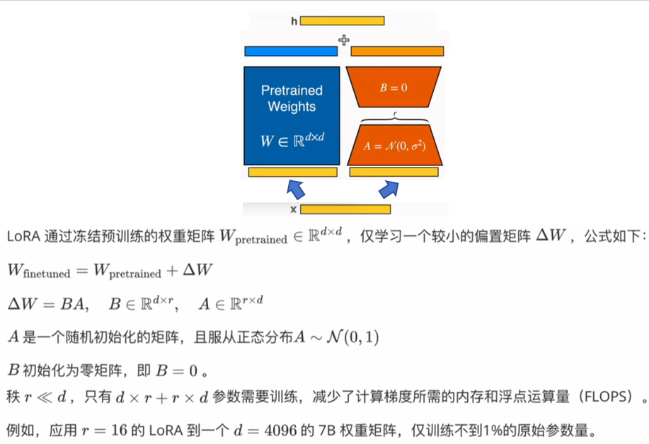
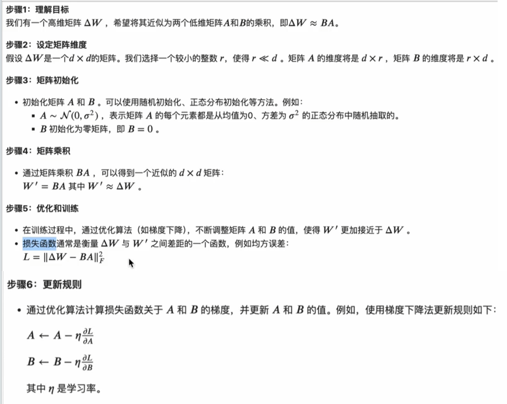

# 1 问题背景

- 对大模型微调需要大量的**计算资源和存储空间**。
- 在微调的过程中，直接修改预训练模型的所有参数可能会**破坏模型的原始性能**。
- 存储和部署微调后的大模型需要大量存储空间（**多个应用场景部署不同微调版本**）。
- 许多微调方法会**增加推理阶段的计算延迟**，影响模型的实时性应用。

# 2 LORA优势

- **存储与计算效率**:通过低秩适应(LORA)，可以显著减少所需存储的参数数量，并减少计算需求。
- **适应性与灵活性**:LORA方法允许模型通过只替换少量特定的矩阵A和B来快速适应新任务，显著提高任务切换的效率。
- **训练与部署效率**:LORA的简单线性设计允许在不引入推理延迟的情况下，与冻结的权重结合使用，从而提高部署时的操作效率。

# 3 LORA算法问题

## 3.1 <u>为什么需要低秩分解？</u>

- 现代预训练模型的参数是非常大且高维空间，但在微调参数更新主要集中在一个**低维子空间**中。
-  参数更新$\bigtriangleup W$ 可以在低维度中进行优化，高维参数空间中的大部分参数在微调前后几乎没有变化。
- 低秩分解使参数优化更高效，但如果参数更新实际上在高维子空间中发生，可能会导致重要信息遗漏和LoRA方法失效.

## 3.2 <u>AB矩阵初始化的理由？</u>

这种初始化方法使得在训练初期，新增的部分$\bigtriangleup W = BA$对原始权重$W_{pretrained}$的影响为0，从而不会破坏预训练模型的初始性能。

## 3.3 <u>A矩阵为什么服从正态分布？</u>

①**确保初始梯度有效传播**：正态分布随机初始化有助于在训练初期确保梯度有效全波，避免梯度消失和爆炸的问题。

②**提供足够的随机性**：正态分布的随机初始化为模型提供了足够的随机性，从而能过够探索更广泛的参数空间，增加了模型找到最优解的可能性。
③**平衡训练初期的影响**：正太分布初始化的值一般较小，结合B初始化为0矩阵，可以在寻来你初期确保新增的偏置矩阵对原始预训练权重的影响为0，从而避免破坏预训练模型的初始性能。

## 3.4 <u>为什么A服从正态分布，而B初始化为零矩阵？</u>

①如果B和A全部初始化为零矩阵，很容易导致梯度消失。

②如果B和A全部初始化正态分布，那么在模型训练开始时，就会容易得到一个过大的偏移值$\bigtriangleup W$，从而引起太多噪声，导致难以收敛。

## 3.5 <u>选择哪些权重矩阵进行适配？</u>

①注意力层可以**同时适配**在$W_q$、$W_k$、$W_v$、$W_o$;

**关键功能组件**：对吗对模型性能影响大，对这些矩阵进行低秩近似可以显著影响模型的表达能力。

**参数量大：**使用LoRA可以减少参数数量，降低计算和存储需求。

②线性层(全连接层)。

**参数量大**：减少需要微调的参数数量。

**计算密集：**全连接层计算量较大，通过低秩近似可以有效降低计算复杂度。

③嵌入层。

**高维系数表示**：嵌入层通常包括大量高维向量，通过LoRA可以有效降低维度，减少计算量和内存占用。

**提升训练效率**：低秩分解可以使嵌入层的训练更加高效。

## 3.6 为什么LoRA在$Q$、$K$、$V$、$O$上有效？

## 3.7 <u>LoRA的最优秩的选择</u>

低秩(r=1，2，4)足以在$\bigtriangleup W$种捕获足够信息，表现优于单一类型权重适配但具有更高秩的策略。

## 4 LORA算法实现

