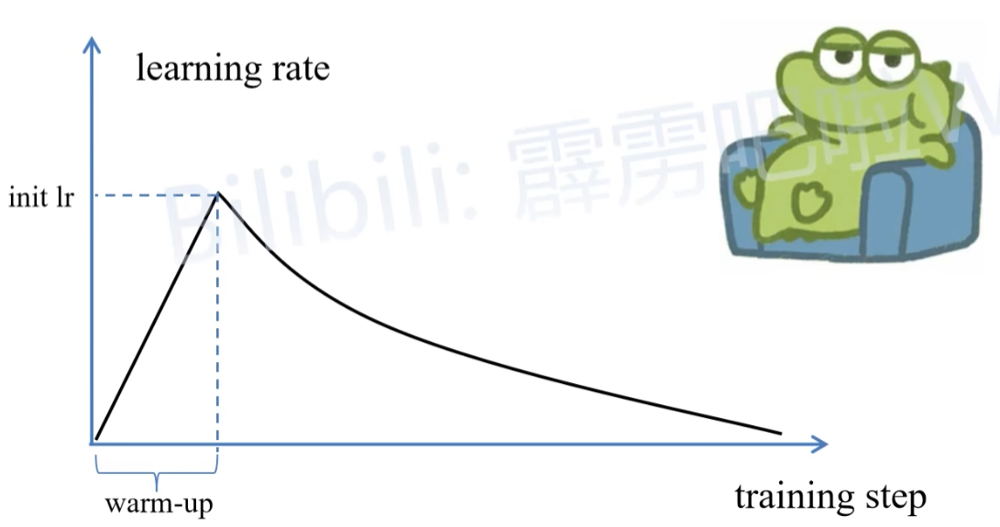

# $LR$ 学习率

1.1 当初始学习率过大导致训练不稳定——>warm up 

# $T$ 温度

$T$≥0 是一个控制我们**希望从语言模型中得到多少随机性的温度参数**：

- $T$=0：确定性地在每个位置 i 选择最可能的令牌 
- $T$=1：从纯语言模型“正常（normally）”采样
- $T$=∞：从整个词汇表上的均匀分布中采样,

当 $T$ 值较高时，我们会获得更平均的概率分布，生成的结果更具随机性；反之，当 $T$值较低时，模型会更倾向于生成概率较高的令牌。