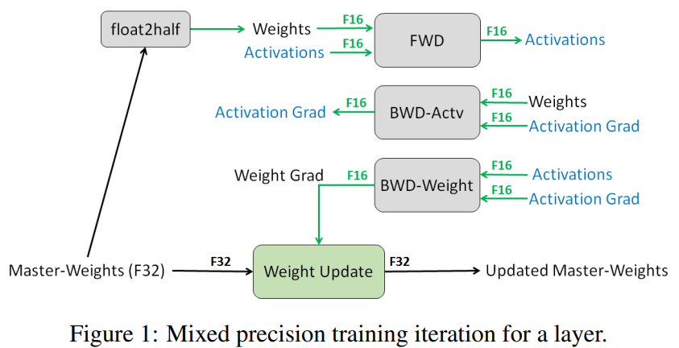

## CRF


# 1 Transformer


1. <u>Transformer原理</u>

   Transformer中抛弃了传统的CNN和RNN，整个网络结构完全是由Attention机制组成。 作者采用Attention机制的原因是RNN（或者LSTM，GRU等）的计算是顺序的，RNN相关算法只能从左向右依次计算或者从右向左依次计算，这种机制带来了两个问题：

   1）时间片 t 的计算依赖 t−1 时刻的计算结果，这样限制了模型的并行能力；
   2）顺序计算的过程中信息会丢失，尽管LSTM等门机制的结构一定程度上缓解了长期依赖的问题，但是对于特别长期的依赖现象，LSTM依旧无能为力。

   Transformer的提出解决了上面两个问题：

   1）首先它使用了Attention机制，将序列中的任意两个位置之间的距离是缩小为一个常量。
   2）其次它不是类似RNN的顺序结构，因此具有更好的并行性，符合现有的GPU框架。

2. <u>RNN LSTM transformer的区别和优缺点?</u>

   |                    | RNN                                                    | LSTM                                     | Transformer                                                  |
   | ------------------ | ------------------------------------------------------ | ---------------------------------------- | ------------------------------------------------------------ |
   | 结构               | 具有循环结构，神经元输出不仅传递到下一层，还反馈给自身 | RNN改进，引入门控机制来缓解RNN中信息丢失 | 摒弃循环结构，引入Attention机制                              |
   | 处理方式           | 按时间步顺序处理数据                                   | 按时间步顺序处理数据                     | 借助Attention，并行计算                                      |
   | 捕捉长距离依赖关系 | 难                                                     | 难                                       | 能                                                           |
   | 优点               | 结构简单，适合时间序列预测任务                         | 缓解了梯度消失和爆炸；适合机器翻译任务   | 并行能力强；能有效捕捉长期依赖关系；注意力可解释性高；适合自然语言处理任务 |
   | 缺点               | 难以捕捉依赖关系；容易梯度消失和爆炸；无法并行；效率低 | 门多容易过拟合；训练时间长               | 计算和内存消耗高；短序列容易过拟合                           |

3. <u> 谈谈对Attention的理解？</u>

   Attention主要用于处理序列数据。核心思想是在处理序列数据时，网络应该有选择的筛选出】【少量重要信息并聚焦到这些重要信息上，而忽略不重要的部分，它通过学习不同部分的权重，将输入的序列中的重要部分显式地加权，从而使得模型可以更好地关注与输出有关的信息。

2. Attention的计算步骤?

   ①**计算查询（Query）**：查询是当前时间步的输入，用于和序列中其他位置的信息进行比较。

   ②**计算键（Key）和值（Value）**：键表示序列中其他位置的信息，值是对应位置的表示。键和值用来和查询进行比较。
   ③**计算注意力权重**：通过将查询和键进行内积运算，然后应用softmax函数，得到注意力权重。这些权重表示了在当前时间步，模型应该关注序列中其他位置的重要程度。
   ④**加权求和**：根据注意力权重将值进行加权求和，得到当前时间步的输出。

5. Attention机制和传统的Seq2Seq模型有什么区别？⭐

   传统的Seq2Seq模型**只使用编码器来捕捉输入序列的信息，而解码器只从编码器的最后状态中获取信息，并将其用于生成输出序列**。
   而Attention机制则允许解码器在生成每个输出时，根据输入序列的不同部分给予不同的注意力，从而使得模型更好地关注到输入序列中的重要信息。

4. <u>self-attention 和 target-attention的区别？</u>

   self-attention是指在序列数据中，**将当前位置与其他位置之间的关系建模(==关注序列内部的关系==)**。它通过计算每个位置与其他所有位置之间的相关性得分，从而为每个位置分配一个权重。这使得模型能够根据输入序列的不同部分的重要性，自适应地选择要关注的信息。

   target-attention则是指将**注意力机制应用于目标（或查询）和一组相关对象之间的关系(==关注目标与其他对象之间的关系==)**。它用于将目标与其他相关对象进行比较，并将注意力分配给与目标最相关的对象。这种类型的注意力通常用于任务如机器翻译中的编码-解码模型，其中需要将源语言的信息对齐到目标语言。


​     target attention:
   

5.  <u>self-attention 在计算的过程中，如何对padding位做mask？</u>

   构建 Mask 矩阵:在输入序列中，padding 位通常会被设置为一个特殊的值（比如 0）。可以创建一个 mask 矩阵，标记出 padding 位置，将这些位置的值设为负无穷（-inf），其他位置设为 0。这种矩阵与输入的 query-key 权重矩阵形状相同。然后将mask矩阵与query-key 点积得到的注意力得分矩阵相加。

6. <u>深度学习中Attention与全连接层的区别何在？</u>

   Attention中定义了QKV，而全链接层没有什么Query和Key的概念，只有一个Value。**而在Query和Key中，我认为Query又相对更重要，因为Query是一个锚点，Attention Score便是从过计算与这个锚点的距离算出来的**。任何Attention based algorithm里都会有Query这个概念，但全连接显然没有。

   全连接的作用的是**对一个实体进行从一个特征空间到另一个特征空间的映射**，而注意力机制是要**对来自同一个特征空间的多个实体进行整合**。
   全连接的权重对应的是**一个实体**上的每个特征的重要性，而注意力机制的输出结果是**各个实体**的重要性。

   比如说，一个单词“love”在从200维的特征空间转换到100维的特征空间时，使用的是全连接，不需要注意力机制，因为特征空间每一维的意义是固定的。而如果我们面对的是词组"i love you”，需要对三个200维的实体特征进行整合，整合为一个200维的实体，此时就要考虑到实体间的位置可能发生变化，我们下次收到的句子可能是"love you i”，从而需要一个与位置无关的方案。

7. <u>transformer中multi-head attention中每个head为什么要进行降维？</u>⭐

   对每个head进行降维是**为了增加模型的表达能力和效率。**

   使用多个注意力头，Transformer可以并行地学习多种不同的特征表示，从而增强了模型的表示能力。然而，在使用多个注意力头的同时，注意力机制的计算复杂度也会增加。原始的Scaled Dot-Product Attention的计算复杂度为O($d^2​$)，其中d是输入向量的维度。如果使用h个注意力头，计算复杂度将增加到O(h$d^2​$)。这可能会导致Transformer在处理大规模输入时变得非常耗时。为了缓解计算复杂度的问题，Transformer中在每个head上通过线性变换被映射到一个较低维度的空间,从而实现降维。降维后的Transformer可以在**保持较高的表达能力的同时，大大减少计算复杂度**。
   **提高模型的稳定性和泛化能力：**多头注意力的多视角特征捕捉能力也有助于减少模型在训练过程中对某些特定模式的过度依赖，进而提升模型的泛化能力。

   **增强学习能力和表示空间**：多个头的独立线性变换增加了模型的表示能力，帮助其学习更复杂的特征。

8. <u>transformer在哪里做了权重共享，为什么可以做权重共享？</u>⭐

   **Encoder和Decoder间的Embedding层权重共享**：Transformer词表用了bpe来处理，英语和德语同属日耳曼语族，有很多相同的subword，可以共享类似的语义。

   **Decoder中Embedding层和FC层权重共享**：Decoder中的Embedding层和FC层有点像互为逆过程，Embedding层可以说是通过one-hot去取到对应的embedding向量，FC层可以说是相反的，通过向量（定义为 x）去得到它可能是某个词的softmax概率，取概率最大（贪婪情况下）的作为预测值。

9. <u>transformer的点积模型做缩放的原因是什么？</u>

   为了控制注意力权重的尺度，以避免在计算过程中出现梯度爆炸的问题。

10. <u>Transformer为什么Q和K使用不同的权重矩阵生成，为何不能使用同一个值进行自身的点乘？</u>⭐

  ①使用Q/K/V不相同可以保证在不同空间进行投影，增强了表达能力，提高了泛化能力。

  ②同时，由softmax函数的性质决定，实质做的是一个soft版本的arg max操作，得到的向量接近一个one-hot向量（接近程度根据这组数的数量级有所不同）。如果令Q=K，那么得到的模型大概率会得到一个类似单位矩阵的attention矩阵，**这样self-attention就退化成一个point-wise线性映射**。这样至少是违反了设计的初衷。

11. <u>Transformer计算Attention的时候为何选择点乘而不是加法？两者计算复杂度和效果上有什么区别？</u>⭐

    ① **点乘计算效率更高**，可以通过矩阵乘法进行并行优化，尤其适合大规模的模型训练和推理。

    ② 在效果上，**点乘注意力能够有效衡量向量的相似性**，尤其在高维度向量时，通过缩放避免数值不稳定问题，而加法注意力由于非线性操作的引入，效果上并无显著提升，且计算更为复杂。

12. <u>为什么在进行softmax之前需要对Attention进行scaled（为什么除以dk的平方根）？⭐</u>

    ①QK的点积会随着维度的增大而增大，如果softmax内计算的数数量级太大，会输出近似one-hot编码的形式，导致梯度消失的问题，所以需要scale。 **/**  当输入信息的维度 d 比较高，点积模型的值通常有比较大方差，从而导致 softmax函数的梯度会比较小。因此，缩放点积模型可以较好地解决这一问题。

    ②至于为什么需要用维度开根号，假设向量q，k满足各分量独立同分布，$\mu$=0，$\sigma$=1，那么qk点积$\mu$=0，$\sigma$=d，从统计学计算，如果让qk点积的方差控制在1，需要将其除以d的平方根，使得softmax更加平滑。

    ③ 除以根号d而不是d：**方差控制**：假设服从独立同分布，如果除以d,方差会变成1/d；**梯度稳定**：如果除以d,点积的值会变得非常小，会使得模型难以学习到有意义的东西。

13. <u>简单介绍一下Transformer的位置编码？有什么意义和优缺点？</u>

    因为self-attention是位置无关的，无论句子的顺序是什么样的，通过self-attention计算的token的hidden embedding都是一样的，这显然不符合人类的思维。因此要有一个办法能够在模型中表达出一个token的位置信息，transformer使用了固定的positional encoding来表示token在句子中的绝对位置信息。

14. <u>为什么transformer块使用LayerNorm而不是BN？LN 在Transformer的位置是哪里？</u>

    LN：针对每个样本序列进行Norm，没有样本间的依赖。对一个序列的不同特征维度进行Norm

    CV使用BN是认为channel维度的信息对cv方面有重要意义，如果对channel维度也归一化会造成不同通道信息一定的损失。而同理nlp领域认为句子长度不一致，并且各个batch的信息没什么关系，因此只考虑句子内信息的归一化，也就是LN。

    

    ​

15. <u>简答讲一下BatchNorm技术，以及它的优缺点。</u>

    优点：
    	①可以解决内部协变量偏移，简单来说训练过程中，各层分布不同，增大了学习难度，BN缓解了这个问题。当然后来也有论文证明BN有作用和这个没关系，而是可以使**损失平面更加的平滑，从而加快的收敛速度。**
    	②缓解了**梯度饱和问题**（如果使用sigmoid激活函数的话），加快收敛。

    缺点：
    ①batch_size较小的时候，效果差。这一点很容易理解。BN的过程，使用 整个batch中样本的均值和方差来模拟全部数据的均值和方差，在batch_size 较小的时候，效果肯定不好。
    ② BN 在RNN中效果比较差。

16. <u>Decoder阶段的多头自注意力和encoder的多头自注意力有什么区别？</u>

    **结构上**：Encoder端的Block主要包括两个模块：MHA、FFN；

    Decoder端的Block主要包括三个模块：MHA交互模块，Mask MHA，以及一个前馈神经网络模块(FFN)；

    **功能上**：Transformer中encoder是双向的，是编码器；decoder是单向的，是解码器，可以用于生成任务。

17. <u>Transformer的并行化提现在哪个地方？Decoder端可以做并行化吗？</u>

    Encoder侧：模块之间是串行的，一个模块计算的结果做为下一个模块的输入，互相之前有依赖关系。从每个模块的角度来说，注意力层和前馈神经层这两个子模块单独来看都是可以并行的，不同单词之间是没有依赖关系的。

    Decode引入sequence mask就是为了并行化训练，Decoder推理过程没有并行，只能一个一个的解码，很类似于RNN，这个时刻的输入依赖于上一个时刻的输出。

18.  <u>什么是 长度外推问题？</u>

    大模型在训练时和预测时的输入长度不一致，导致模型的泛化能力下降的问题。

    长度外推性=train short, test long

    **train short**：1）受限于训练成本；2）大部分文本的长度不会特别长，训练时的max_length特别特别大其实意义不大（长尾）。

    **test long**：这里long是指比训练时的max_length长，希望不用微调就能在长文本上也有不错的效果。

19. <u>长度外推问题 的解决方法有哪些？</u>

    ① **进制表示**。我们将整数n以一个三维向量[a,b,c]来输入，a,b,c分别是n的百位、十位、个位。这样，我们既缩小了数字的跨度，又没有缩小相邻数字的差距，代价了增加了输入的维度——刚好，神经网络擅长处理高维数据。

    ② **直接外推**。假如原来位置编码用三维向量表示，那外插就是直接增加一维。

    ③ **线性插值**。

    ④ **进制转化**。

    总结：直接外推的效果不大行；内插如果不微调，效果也很差；NTK-RoPE不微调就取得了不平凡（但有所下降）的外推结果；加入logn来集中注意力确实有帮助。参考：https://spaces.ac.cn/archives/9675

20. <u>LN在LLMs中得分不同位置有什么区别？</u>

    

    Post-LN:在深层的Transformer中，后层归一化可能导致梯度范数逐渐增大，从而使得深层模型训练不稳定。

    Pre-LN:相比于Post-LN，Pre-LN在深层的梯度范数近似相等，使得深层Transformer的训练更稳定，有助于缓解训练不稳定的问题，但模型效果略差。

    Sandwich-LN:某些模型（如Cogview）使用这种结构来避免值爆炸的问题。但可能会导致训练不稳定，甚至训练崩溃。

21. <u>Transformer的position embedding和BERT的position embedding的区别？</u>

    Transformer的位置编码是一个固定值，因此只能标记位置，但是不能标记这个位置有什么用。
    BERT的位置编码是可学习的Embedding，因此不仅可以标记位置，还可以学习到这个位置有什么用。
    BERT选择这么做的原因可能是，相比于Transformer，BERT训练所用的数据量充足，完全可以让模型自己学习。

22. <u>Transformer训练的Dropout是如何设定的，位置在哪里？Dropout 在测试的需要有什么需要注意的吗？</u>

    第一次：(1) embedding 的 output

    第二次： (2) attention softmax(q*k/sart(d)) 的输出

    第三次： (3) attention 层的输出

    第四次： (4) ffn 的输出

23. <u>Adam 为什么要有 FP32 的模型参数备份？</u>

    ①  防止精度丢失：在使用混合精度训练时，模型参数通常以 FP16 格式进行更新。FP16 的表示范围有限（如很小的值可能会被舍入为零），这可能导致精度丢失或数值不稳定。通过保留一份 FP32 格式的模型参数备份，可以保证参数更新的精度，特别是在计算动量和二阶矩时。

    ② 参数更新的稳定性：Adam 优化器需要进行一系列的数学运算，包括动量和学习率缩放。这些运算如果使用 FP16 可能会造成数值误差积累，从而影响模型的训练效果。FP32 的备份参数可以保证运算的稳定性。

    参考：https://zhuanlan.zhihu.com/p/681926704

    

24. <u>attention计算时还有哪些scale处理?</u>

    缩放点积，除以根号dk;

    稀疏矩阵中用温度调节softmax输出分布的陡峭程度。

    对softmax之后的结果添加权重；

    对Q\K\V进行归一化；

    T5中对K进行相对位置编码。

    

25. <u>attention中softmax函数作用、公式、为什么有减去最大值的处理？换个函数还能这样处理吗？</u>

    作用：用于将点积结果转化为概率分布，帮助模型根据输入特征的相对重要性计算加权值。

    公式：$\text{softmax}(z_i) = \frac{e^{z_i}}{\sum_{j=1}^n e^{z_j}}$

    减去最大值的处理？：数值溢出问题、是因为当$z_i$很大时，会导致数值超出浮点数表示范围。拣取最大值有利于数值稳定性，结果也不会发生影响。

    这里会有三次写入三次写出，6次GPU通信。

    怎么降低softxmax的GPU访存复杂度？

    流式计算---》

26. <u>解释数值上溢、下溢问题</u>。

    数值上溢：计算结果的绝对值大于浮点数系统的最大可表示范围时

    解决：Softmax缩放；对数变换

    下溢问题：计算结果接近零但绝对值小于浮点数系统的最小可表示范围时，数值下溢发生。

    解决：对数变换；正则化处理

27. <u>绝对位置编码、相对位置编码、旋转位置编码</u>

    ① 绝对位置编码

    优点：实现简单

    缺点：没有外推性，即如果预训练最大长度为512的话，那么最多就只能处理长度为512的句子，再长就处理不了了。

    ② 相对位置编码

    优点：在刻画长距离语义关系时，不仅可以有效过滤无关信息，也为传递有价值的语义关联提供了渠道。

    ​	   能够更好地处理序列的局部结构，因为它关注的是元素之间的相对位置。

    缺点：计算效率低下；

    ​	   KV Cache 使用的复杂性。由于每个附加token都会改变每个其他token的嵌入，这使得 Transformer 中KV Cache的有效使用变得复杂。**使用 KV Cache 的一项要求是已经生成的单词的位置编码， 在生成新单词时不改变（绝对位置编码）**。因此相对位置编码不适合推理，因为每个标记的嵌入会随着每个新时间步的变化而变化。    

    ③ 旋转位置编码

    优点：用旋转矩阵对绝对位置进行编码，同时将明确的相对位置依赖性纳入到self-attention的表述中。也就是说RoPE“吸收”了绝对位置编码和相对位置编码两者的优点。和相对位置编码相比，RoPE 具有更好的**外推性**。

    缺点：

28. <u>说明大模型预训练过程中如何处理长文本输入，以及所采用的技术（如滑动窗口、递归机制等）对模型性能和计算资源的影响。</u>

    **滑动窗口机制**：使用滑动窗口技术逐步处理文本，将当前窗口中的内容与前一个窗口的内容进行结合，以保持上下文。（计算资源需求高；性能好，但效率低）

    **分段处理与递归机制：**将长文本分段处理，每段生成的输出嵌入用于后续段落的输入。类似递归机制，将前面段落的编码作为上下文信息传递给后续段落。可扩展至任意长度，节省显存（计算资源需求中；易丢失信息，需平衡性能与资源）

    **Sparse Attention：**只计算输入序列中非连续或选定关键位置的注意力（计算资源需求低；长文本任务表现优越）

    **分块处理**：将长文本分成多个块进行处理，每个块大小在上下文窗口内；然后将处理结果合并或通过某种方法连接。（计算资源需求低；长距离依赖建模较差）

29. 介绍一下多头自注意力机制？它和自注意力机制有什么区别？

    自注意力机制是Transformer的核心机制，用于计算序列每个元素与其它元素之间的关系。

    而多头子注意力机制则是自注意力机制的扩展，采用多个head来提升模型的表达能力，并行能力，计算效率，提高鲁棒性，适应复杂任务

30. ?

31. ？

32. ？

33. ？

26. ?


【参考】

https://www.zhihu.com/people/an-luo-77-81
https://zhuanlan.zhihu.com/p/554814230


# 2 LLM

1. <u> 什么是生成式模型？什么是大语言模型？区别与联系？</u>

   ​

2. <u>Word2Vec中为什么使用负采样(negtive sample)？</u>

   **加速了模型计算+保证了模型训练的效果**。因为，对于训练语言模型来说，softmax层非常难算，毕竟你要预测的是当前位置是哪个词，那么这个类别数就等同于词典规模，因此动辄几万几十万的类别数。但是，如果我们的目标不在于训练一个精准的语言模型，而只是为了训练得到语言模型的副产物-词向量。那么其实只需要用这里隐含的一个计算代价更小的“子任务”就好啦。即，不直接让模型从整个词表找最可能的词了，而是直接给定这个词（即正例）和几个随机采样的噪声词（即采样出来的负例），只要模型能从这里面找出正确的词就认为完成目标啦（ 模型每次只需要更新采样的词的权重，不用更新所有的权重）。

3. <u>为什么现在的LLM都是Decoder-only的架构？</u>⭐⭐

   任务通用性、训练效率、推理效率、模型规模扩展、任务适用性、数据利用率

   ①首先淘汰掉BERT这种encoder-only，因为它用masked language modeling预训练，不擅长做生成任务，做NLUQ(自然语言理解任务)一般也需要有监督的下游数据微调: 相比之下decoder-only的模型用next token prediction%预训练，兼顾理解和生成，在各种下游任务上的zero-shot和few-shot泛化性能都很好。
   ②**Encoder的双向注意力会存在低秩问题，这可能会削弱模型表达能力**，就生成任务而言，引入双向注意力并无实质好处。而Encoder-Decoder架构（机器翻译、文本摘要任务）之所以能够在某些场景下表现更好，大概只是因为它多了一倍参数。所以，在同等参数量、同等推理成本下，Decoder-only架构就是最优选择了。

   ③**decoder-only 模型在没有任何 tuning 数据的情况下、zero-shot 表现最好，而 encoder-decoder 则需要在一定量的标注数据上做 multitask finetuning 才能激发最佳性能。** 而目前的Large LM的训练范式还是在大规模语料上做自监督学习，很显然，Zero-Shot性能更好的decoder-only架构才能更好地利用这些无标注数据。此外，Instruct GPT在自监督学习外还引入了RLHF作辅助学习。RLHF本身也不需要人工提供任务特定的标注数据，仅需要在LLM生成的结果上作排序。虽然目前没有太多有关RLHF + encoder-decoder的相关实验，直觉上RLHF带来的提升可能还是不如multitask finetuning，毕竟前者本质只是ranking、引入监督信号没有后者强。

   ④**效率问题。**decoder-only支持一直复用KV-Cache，对多轮对话更友好，因为每个Token的表示之和它之前的输入有关，而encoder-decoder和PrefixLM就难以做到。

4. <u>涌现能力是啥原因？</u>

   涌现能力（Emergent Ability）是指模型在训练过程中能够生成出令人惊喜、创造性和新颖的内容或行为。原因：

   ①**任务的评价指标不够平滑。**如果评价指标要求很严格，要求一字不错才算对，那么Emoji_movie(情感分析或情绪识别)任务我们就会看到涌现现象的出现。但是，如果我们把问题形式换成多选题，就是给出几个候选答案，让LLM选，那么随着模型不断增大，任务效果在持续稳定变好，但涌现现象消失。

   ②**复杂任务** **vs** **子任务。**展现出涌现现象的任务有一个**共性**，就是任务往往是由多个子任务构成的复杂任务。也就是说，最终任务过于复杂，如果仔细分析，可以看出它由多个子任务构成，这时候，子任务效果往往随着模型增大，符合 Scaling Law(规模法则)，而最终任务则体现为涌现现象。

   ③**用 Grokking （顿悟）来解释涌现。**对于某个任务T，尽管我们看到的预训练数据总量是巨大的，但是与T相关的训练数据其实数量很少。当我们推大模型规模的时候，往往会伴随着增加预训练数据的数据量操作，这样，当模型规模达到某个点的时候，与任务T相关的数据量，突然就达到了最小要求临界点，于是我们就看到了这个任务产生了Grokking现象。

5. <u>什么是LLMs复读机问题？</u>

   LLMs复读机问题（LLMs Parroting Problem）是指大型语言模型在生成文本时过度依赖输入文本的复制，而缺乏创造性和独特性。当面对一个问题或指令时，模型可能会简单地复制输入文本的一部分或全部内容，并将其作为生成的输出，而不是提供有意义或新颖的回应。

6. <u>为什么会出现 LLMs 复读机问题？</u>

   ① **数据偏差**。大型语言模型通常是通过预训练阶段使用大规模无标签数据进行训练的。如果训练数据中存在大量的重复文本或者某些特定的句子或短语出现频率较高，模型在生成文本时可能会倾向于复制这些常见的模式。

   ② **训练目标的限制**。大型语言模型的训练通常是基于自监督学习的方法，通过预测下一个词或掩盖词来学习语言模型。这样的训练目标可能使得模型更倾向于生成与输入相似的文本，导致复读机问题的出现。

   ③ **缺乏多样性的训练数据。**虽然大型语言模型可以处理大规模的数据，但如果训练数据中缺乏多样性的语言表达和语境，模型可能无法学习到足够的多样性和创造性，导致复读机问题的出现。

   ④ **模型结构和参数设置。**大型语言模型的结构和参数设置也可能对复读机问题产生影响。例如，模型的注意力机制和生成策略可能导致模型更倾向于复制输入的文本。

   ⑤ **信息熵的角度：**当词堆叠的文本的信息熵很高时，下一个词的预测就很难预测，softmax的分布也会倾向于平稳，也就是说模型也预测不出来下一个词应该是什么。因此模型会倾向从前面的word里面挑选。

7. <u>如何缓解 LLMs 复读机问题？</u>

   ①**多样性训练数据。**在训练阶段，使用多样性的语料库来训练模型，避免数据偏差和重复文本的问题。这可以包括从不同领域、不同来源和不同风格的文本中获取数据。
   ②**引入噪声。**在生成文本时，引入一些随机性或噪声，例如通过采样不同的词或短语，或者引入随机的变换操作，以增加生成文本的多样性。这可以通过在生成过程中对模型的输出进行采样或添加随机性来实现。
   ③**参数调整。**温度参数、Beam搜索调整、Repetition Penalty、Unlikelihood Training、penalty_alpha、no_repeat_ngram_size(暴力)【model.generate参数包括输入、长度限制、多样性、惩罚、解码策略】
   
   ⑤**后处理和过滤。**对生成的文本进行后处理和过滤，去除重复的句子或短语，以提高生成文本的质量和多样性。可以使用文本相似度计算方法或规则来检测和去除重复的文本。
   ⑥**人工干预和控制。**对于关键任务或敏感场景，可以引入人工干预和控制机制，对生成的文本进行审查和筛选，确保生成结果的准确性和多样性。

   需要注意的是，缓解LLMs复读机问题是一个复杂的任务，没有一种通用的解决方案。不同的方法可能适用于不同的场景和任务，需要根据具体情况进行选择和调整。此外，解决复读机问题还需要综合考虑数据、训练目标、模型架构和生成策略等多个因素，需要进一步的研究和实践来提高大型语言模型的生成文本多样性和创造性。

8. <u>LLMs输入句子长度理论上可以无限长吗？</u>

   理论上来说，LLMs（大型语言模型）可以处理任意长度的输入句子，但实际上存在一些限制和挑战。

   ①**计算资源**。生成长句子需要更多的计算资源，包括内存和计算时间。
   ②**模型训练和推理**。在训练阶段，处理长句子可能会导致梯度消失或梯度爆炸的问题，影响模型的收敛性和训练效果。在推理阶段，生成长句子可能会增加模型的错误率和生成时间。
   ③**上下文建模**。LLMs是基于上下文建模的模型，长句子的上下文可能会更加复杂和深层。模型需要能够捕捉长句子中的语义和语法结构，以生成准确和连贯的文本。

9. <u>如何让大模型处理更长的文本？</u>

   ①**分块处理**。将长文本分割成较短的片段，然后逐个片段输入模型进行处理。这样可以避免长文本对模型内存和计算资源的压力。在处理分块文本时，可以使用重叠的方式，即将相邻片段的一部分重叠，以保持上下文的连贯性。
   ②**层次建模**。通过引入层次结构，将长文本划分为更小的单元。例如，可以将文本分为段落、句子或子句等层次，然后逐层输入模型进行处理。这样可以减少每个单元的长度，提高模型处理长文本的能力。
   ③**部分生成**。如果只需要模型生成文本的一部分，而不是整个文本，可以只输入部分文本作为上下文，然后让模型生成所需的部分。例如，输入前一部分文本，让模型生成后续的内容。
   ④**注意力机制**。注意力机制可以帮助模型关注输入中的重要部分，可以用于处理长文本时的上下文建模。通过引入注意力机制，模型可以更好地捕捉长文本中的关键信息。
   ⑤**模型结构优化**。通过优化模型结构和参数设置，可以提高模型处理长文本的能力。例如，可以增加模型的层数或参数量，以增加模型的表达能力。还可以使用更高效的模型架构，如Transformer等，以提高长文本的处理效率。

10. <u>SFT需要训练Token数？</u>

   少量高质量、多样性的数据，也可以训练出效果优秀的SFT模型

11. 预训练数据 Token 重复 是否影响 模型性能？

    ① 多轮epoch的训练会降低模型性能；
    ② 更大规模的数据集会缓解重复epochs对模型性能下降的影响；
    ③ 提高数据集的质量也无法挽救重复训练带来的过拟合；
    ④ 小计算量模型的过拟合趋势与大计算量的差不多；
    ⑤ 多样的训练目标不一定减轻多Epoch的性能下降；
    ⑥ Dropout是一个被大语言模型忽视的正则技术，虽然慢，但是可以降低多epochs的影响；
    ⑦ 在训练过程中逐渐使用dropout是有效的策略；

12. <u>为什么大模型推理时显存涨的那么多还一直占着？</u>

    ①**模型参数占用显存**：大语言模型参数需要存储在显存中以供推理使用。因此，在推理过程中，模型参数会占用相当大的显存空间。
    ②**输入数据占用显存**：进行推理时，需要将输入数据加载到显存中。对于大语言模型而言，输入数据通常也会占用较大的显存空间，尤其是对于较长的文本输入。
    ③**中间计算结果占用显存**：在推理过程中，模型会进行一系列的计算操作，生成中间结果。这些中间结果也需要存储在显存中，以便后续计算使用。
    ④**内存管理策略**：某些深度学习框架在推理时采用了一种延迟释放显存的策略，即显存不会立即释放，而是保留一段时间以备后续使用。这种策略可以减少显存的分配和释放频率，提高推理效率，但也会导致显存一直占用的现象。

13. <u>推理速度上，INT8和FP16比起来怎么样？</u>

    ①在大语言模型的推理速度上，使用INT8（8位整数量化）和FP16（半精度浮点数）相对于FP32（单精度浮点数）可以带来一定的加速效果。这是因为INT8和FP16的数据类型在表示数据时所需的内存和计算资源较少，从而可以加快推理速度。
    ②INT8在相同的内存空间下可以存储更多的数据，从而可以在相同的计算资源下进行更多的并行计算。这可以提高每秒推理操作数（Operations Per Second，OPS）的数量，加速推理速度。
    ③FP16在相对较小的数据范围内进行计算，因此在相同的计算资源下可以执行更多的计算操作。虽然FP16的精度相对较低，但对于某些应用场景，如图像处理和语音识别等，FP16的精度已经足够满足需求。

14. <u>大模型生成时的参数怎么设置？</u>

    ①**Temperature**：用于调整随机从生成模型中抽样的程度，使得相同的提示可能会产生不同的输出。温度为 0 将始终产生相同的输出，该参数设置越高随机性越大。
    ②**波束搜索宽度**：波束搜索是许多 NLP 和语音识别模型中常用的一种算法，作为在给定可能选项的情况下选择最佳输出的最终决策步骤。波束搜索宽度是一个参数，用于确定算法在搜索的每个步骤中应该考虑的候选数量。
    ③**Top p**：动态设置tokens候选列表的大小**。**  将可能性之和不超过特定值的top tokens列入候选名单。 Top p 通常设置为较高的值（如 0.75），目的是限制可能被采样的低概率 token 的长度。
    ④**Top k**：允许其他高分tokens有机会被选中**。**  这种采样引入的随机性有助于在很多情况下生成的质量。 Top k 参数设置为 3 则意味着选择前三个tokens。

15. 有哪些省内存的大语言模型训练/微调/推理方法？

    参数共享（共享相同的嵌入层或注意力机制）、梯度累积（多个小批次的梯度累积起来，然后进行一次参数更新）、梯度裁剪（限制梯度的大小，避免梯度爆炸，从而减少内存使用）、分布式训练（将训练过程分布到多台机器或多个设备上，可以减少单个设备的内存占用）、量化（将模型参数从高精度表示（如FP32）转换为低精度表示）、剪枝（去除冗余或不重要的模型参数，可以减少模型的内存占用）、蒸馏（使用较小的模型（教师模型）来指导训练较大的模型（学生模型），可以从教师模型中提取知识，减少内存占用）、分块处理（在推理过程中，可以将较长的输入序列分成多个较短的子序列进行处理。） 

16. <u>如何让大模型输出合规化？</u>

    ①**数据清理和预处理**：在进行模型训练之前，对输入数据进行清理和预处理，以确保数据符合合规要求。这可能包括去除敏感信息、匿名化处理、数据脱敏等操作。
    ②**引入合规性约束**：在模型训练过程中，可以引入合规性约束，以确保模型输出符合法律和道德要求。例如，可以在训练过程中使用合规性指标或损失函数来约束模型的输出。
    ③**限制模型访问权限**：对于一些特定的应用场景，可以通过限制模型的访问权限来确保输出的合规性。只允许授权用户或特定角色访问模型，以保护敏感信息和确保合规性。
    ④**解释模型决策过程**：为了满足合规性要求，可以对模型的决策过程进行解释和解释。通过提供透明的解释，可以使用户或相关方了解模型是如何做出决策的，并评估决策的合规性。
    ⑤**审查和验证模型**：在模型训练和部署之前，进行审查和验证以确保模型的输出符合合规要求。这可能涉及到法律专业人士、伦理专家或相关领域的专业人士的参与。
    ⑥**监控和更新模型**：持续监控模型的输出，并根据合规要求进行必要的更新和调整。及时发现和解决合规性问题，确保模型的输出一直保持合规。
    ⑦**合规培训和教育**：为使用模型的人员提供合规培训和教育，使其了解合规要求，并正确使用模型以确保合规性。
    合规性要求因特定领域、应用和地区而异，因此在实施上述方法时，需要根据具体情况进行调整和定制。同时，合规性是一个动态的过程，需要与法律、伦理和社会要求的变化保持同步。

17. <u>有了ZeRO系列，为什么还需要3D并行？</u>

    根据ZeRO论文， 尽管张量并行的显存更省一点， 张量并行的通信量实在太高， 只能限于节点内 （有NVLINK） 。**如果节点间张量并行， 显卡的利用率会低到5%**

    但是， 根据Megatron-LM2的论文， 当显卡数量增加到千量级， ZeRO3是明显不如3D并行的。

18. <u>多任务学习各loss 差异过大怎样处理？</u>

    通过动态调整损失权重、使用任务特定的 损失函数、改变模型架构或引入正则化等方法来处理。 目标是平衡各任务的贡献， 以便更好 地训练模型。


19. <u>分类问题为什么用交叉熵损失函数不用均方误差 （MSE）？</u>

    CE通常在**分类问题**中使用，而均方误差 （MSE） 损失函数通常用于**回归问题**。 这是因为分类问题和回归问题具有不同的特点和需求。

    分类问题的输出为**类别的概率分布**。CE可以度量两个概率分布之间的差异，使得模型更好地拟合真实的类别分布。它对概率的细微差异更敏感， 可以更好地区分不同的类别。

    均方误差（MSE）损失函数更适用于回归问题， 其中目标是**预测连续数值而不是类别**。MSE 损失函数度量预测值与真实值之间的差异的平方， 适用于连续数值的回归问题。它对概率的细微差异不够敏感，而且在分类问题中通常需要使用激活函数 （如 sigmoid 或 softmax）将输出映射到概率空间， 使得MSE 的数学性质不再适用。


20. <u>什么是信息增益？</u>

    信息增益是在决策树算法中用于选择最佳特征的一种评价指标。**信息增益是原始集合的熵与 特定特征下的条件熵之间的差异。（以某特征划分数据集前后的熵的差值）。**信息增益越大， 意味着使用该特征进行划分可以更好地减少样 本集合的不确定性， 提高分类的准确性

21. <u>如果softmax 的e 次方超过float 的值了怎么办？</u>

    将分子分母同时除以 x 中的最大值


22. <u>除了 cosin 还有哪些算相似度的方法？</u>

    除了**余弦相似度** （cosine similarity） 之外， 常见的相似度计算方法还包括**欧氏距离**、**曼哈顿距离**、**Jaccard 相似度**、**皮尔逊相关系数**等。

23. <u>了解对比学习（Contrastive Learning）嘛？</u> 

    通过**对比正反两方面的实例来提取有意义的表征**。它利用的假设是，在学习到的嵌入空间中，相似的实例应靠得更近，而不相似的实例应离得更远。对比学习分为监督对比学习(SCL)和自监督对比学习(SSCL)


24. <u>对比学习负样本是否重要？ 负样本构造成本过高应该怎么解决？</u>

    对比学习中负样本的重要性取决于具体的任务和数据。负样本可以**帮助模型学习到样本之间的区分度**， 从而提高模型的性能和泛化能力。

    为了解决负样本构造成本过高的问题， 可以考虑以下方法：
    ① **设计更高效的负样本生成算法或采样策略**：例如， 可以利用数据增强技术生成合成的负样本， 或者使用近似采样方法选择与正样本相似但不相同的负样本。
    ② **确定关键负样本**： 根据具体任务的特点， 可以重点关注一些关键的负样本， 而不是对所有负样本进行详细的构造。这样可以降低构造成本， 同时仍然能够有效训练模型。
    ③ **迁移学习和预训练模型**： 利用预训练模型或迁移学习的方法，可以在其他领域或任务中利用 已有的负样本构造成果, 减少重复的负样本构造工作。

25. <u>分布式训练框架选择？</u>

    多用DeepSpeed， 少用 Pytorch 原生的 torch run。在节点数量较少的情况下， 使用何种训练 框架并不是特别重要； 然而，一旦涉及到数百个节点，DeepSpeed 显现出其强大之处， 其**简便的启动和便于性能分析**的特点使其成为理想之选。


26. <u>LLMs 训练时有哪些有用的建议？</u>

    ① **弹性容错和自动重启机制**：大模型训练往往需要训练很久。弹性容错能让你在机器故障的情况下依然继续 重启训练； 自动重启能让你在训练中断之后立刻重启训练。毕竟，大模型时代节约时间就是节约钱。
    ② **定期保存模型**：训练的时候每隔一段时间做个checkpointing， 这样如果训练中断还能从上次的断点来恢复训练。
    ③ **想清楚再开始训练**：训练一次大模型的成本很高的。在训练之前先想清楚这次训练的目的， 记录训练参数和中间 过程结果， 少做重复劳动。
    ④ **关注GPU 使用效率**：更准确地评估 GPU 利用率， 需要关注TFLOPS 和吞吐率等指标， 这些监控 在 DeepSpeed 框架中都得以整合。
    ⑤ **不同的训练框架对同一个模型影响不同**：比如使用 Huggingface Transformers 和 DeepSpeed 训练 OPT-30 相对于使用Alpa 对于资源的消耗会低不少。
    ⑥ **环境问题**：针对已有的环境进行分布式训练环境搭建时， 一定要注意之前环境的python、pip、virtualenv、 setuptools 的版本。
    ⑦ **升级GLIBC 等底层库问题**：遇到需要升级 GLIBC 等底层库需要升级的提示时，一定要慎重， 不要轻易升级， 否则， 可 能会造成系统宕机或很多命令无法操作等情况。

27. <u>模型大小如何选择？</u>

    基于相对较小规模参数的模型（6B/7B/13B) 进行的优化，再进行 大规模模型（如：OPT-13b/30b...）的尝试，便于出现问题时进行排查。13B 模型经过指令精调之后的模型效果也能够到达GPT4 的90%的效果。

28. <u>为什么要增量预训练？</u>

    预训练学知识，指令微调学格式，强化学习对齐人类偏好。所以要想大模型有领域知识， 得增量预训练。 （靠指令微调记知识不靠谱， 不是几十w 条数据能做到的。）


29. <u>进行增量预训练 需要做哪些准备工作？</u>

    ① 选择模型底座：主流LLaMA，次选BLOOM

    ② 数据收集：刚开始实践的时候， 不需要太多样本， 先收集GB 量级的领域文本跑通流程即可。

    ③ 数据清洗：数据治理可能是 chatgpt 魔法的最关键的部分，最基础的是把网页爬取数据中的广 告清理掉。Falcon 论文里介绍了数据清洗的手段

30. load_in_8bit和 prepare_model_for_int8_training含义和区别

    | **特性**                 | **load_in_8bit**                 | **prepare_model_for_int8_training**        |
    | ------------------------ | -------------------------------- | ------------------------------------------ |
    | **主要用途**             | 推理优化                         | 训练优化(使用LLM.int8())                   |
    | **是否支持训练**         | 否                               | 是                                         |
    | **操作对象**             | 全模型权重                       | 部分权重（如线性层）                       |
    | **是否影响模型权重精度** | 是，权重全量化为 int8            | 混合精度（部分权重量化，部分保持浮点格式） |
    | **典型应用场景**         | 推理阶段，减少显存占用，加速推理 | 微调阶段，减少显存占用，支持量化感知训练   |
prepare_model_for_int8_training是对在Lora微调中使用LLM.int80进行了适配用来提高训练的稳定性，主要包括：
 - layernorm层保留FP32精度
 - 输出层保留FP32精度保证解码时随机sample的差异性

31. ​

    ​

29. ？

30. ？

31. ？

32. ？


一些分布式训练题目https://wdndev.github.io/llm_interview_note/#/04.%E5%88%86%E5%B8%83%E5%BC%8F%E8%AE%AD%E7%BB%83/%E5%88%86%E5%B8%83%E5%BC%8F%E8%AE%AD%E7%BB%83%E9%A2%98%E7%9B%AE/%E5%88%86%E5%B8%83%E5%BC%8F%E8%AE%AD%E7%BB%83%E9%A2%98%E7%9B%AE

# 3 BERT

1. <u>请简述自然语言处理(NLP)的主要研究目标是什么？</u>

   NLP的主要研究目标是使计算机能够**理解、解释和生成**人类语言

2. <u>什么是BERT模型，它为什么重要？</u>

   BERT是一种**预训练语言表示的模型**，全称为Bidirectional Encoder Representations from Transformers。它重要是因为通过大量的**语料库预训练**，BERT能够理解语言中的上下文，显著提升了包括问答系统、情感分析等在内的NLP任务的性能。
   **BERT的重要意义在于给大量的NLP任务提供了一个泛化能力很强的预训练模型**

3. <u>请解释什么是Tokenization以及它在BERT中的作用。</u>⭐

   在BERT中，Tokenization是必要的，因为模型是基于[tokens](https://zhida.zhihu.com/search?q=tokens&zhida_source=entity&is_preview=1)进行训练和理解文本的。Tokenization是将文本转字符编码，以及分割成一系列的tokens（如单词、字符或子词）的过程。Tokenization可以让BERT 有效**应对未登录词**、控制词汇表规模，并保证模型能更好地**理解自然语言的上下文**,以及**提高模型效率**。

   **应对未登录词**：通过子词分解，BERT 可以处理大量未在训练中见过的单词，提高模型的泛化能力。

   **保持上下文一致性**：BERT 的 tokenization 与其双向编码机制（同时考虑左右上下文）配合，使得模型可以更好地理解上下文中词汇的意义。

   **提高模型效率**：通过使用子词拆分，BERT 能够保持词汇表的规模相对较小，避免了传统的稀疏表示问题。

   具体流程包括：①通过基本分词BasicTokenzer，将句子拆分成单词、标点符号等基本成分（转小写0由用户决定）；②子词分解WordPieceTokenizer，将基本分词进一步分成词汇表中出现的词（子词能够有效处理未登录词、控制词汇表规模）；③将这些tokens映射到词汇表中对应的ID。

   ```python
   class FullTokenizer(object):
     """Runs end-to-end tokenziation."""
     def __init__(self, vocab_file, do_lower_case=True):
       self.vocab = load_vocab(vocab_file) # 创建vocab字典
       self.inv_vocab = {v: k for k, v in self.vocab.items()} # 将 self.vocab 反转
       self.basic_tokenizer=BasicTokenizer(do_lower_case=do_lower_case)
       self.wordpiece_tokenizer = WordpieceTokenizer(vocab=self.vocab) 

     def tokenize(self, text):
       split_tokens = []
       for token in self.basic_tokenizer.tokenize(text):
         for sub_token in self.wordpiece_tokenizer.tokenize(token):
           split_tokens.append(sub_token)
   ```

4. <u>BERT模型如何处理单词的上下文信息？</u>

   BERT使用**双向Transformer编码器**，能够考虑到单词在句子中的前后位置，从而捕捉到单词的上下文信息。

5. <u>什么是预训练模型，为什么它们对NLP很重要？</u>

   预训练模型是在大规模数据集上训练得到的模型，可以被用来在特定任务上进行微调。它们对NLP重要，因为可以利用**预训练模型的通用语言表示能力**来提高小数据集任务的性能。

6. <u>请描述BERT的微调过程及其重要性。</u>

   在微调过程中，BERT模型在特定任务的数据集上进行进一步训练，通过少量的迭代调整预训练模型的权重以适应特定任务。这一过程是重要的，因为它允许模型利用在预训练阶段学习到的丰富语言表示，针对具体任务做出优化。

7. <u>请简述BERT的训练过程。</u>

   BERT的训练过程包括两个阶段：预训练和微调。预训练阶段，BERT在大量文本上通过两种任务学习语言模型：**掩码语言模型（MLM）**和**下一个句子预测（NSP）**。微调阶段，BERT在特定任务的数据集上进行细调，以优化任务相关的性能。

8. <u>解释BERT中的掩码语言模型（MLM）任务是如何工作的。</u>

   【回答】在掩码语言模型任务中，输入文本的一部分tokens被随机替换为特殊的**"[MASK]"**标记。BERT的目标是预测这些被掩码的tokens原来的词，这要求BERT理解并利用上下文信息。

   【具体】在将单词序列输入给 BERT 之前，每个序列中有 15％ (经验性的选择)的单词被 [MASK] token 替换。 然后模型尝试基于序列中其他未被 mask 的单词的上下文来预测被掩盖的原单词。在BERT的实验中，15%的WordPiece Token会被随机Mask掉。在训练模型时，一个句子会被多次喂到模型中用于参数学习，但是Google并没有在每次都mask掉这些单词，而是在确定要Mask掉的单词之后，80%的概率会直接替换为[Mask]，10%的概率将其替换为其它任意单词，10%的概率会保留原始Token。

   ​	80% 的 tokens 会被替换为 [MASK] token：是 Masked LM 中的主要部分，可以在不泄露 label 的情况下融合真双向语义信息；

   ​	10% 的 tokens 会称替换为随机的 token ：因为需要在最后一层随机替换的这个 token 位去预测它真实的词，而模型并不知道这个 token 位是被随机替换的，就迫使模型尽量在每一个词上都学习到一个 全局语境下的表征，因而也能够让 BERT 获得更好的语境相关的词向量（**这正是解决一词多义的最重要特性**）；

   ​	10% 的 tokens 会保持不变但需要被预测 ：这样能够给模型一定的 bias ，相当于是额外的奖励，将模型对于词的表征能够拉向词的真实表征。

9. <u>什么是下一个句子预测（NSP）任务，BERT如何利用它？</u>

   【回答】在下一个句子预测任务中，BERT被给予两个句子作为输入，并需要预测第二个句子是否是第一个句子的逻辑后继。这种训练有助于BERT理解句子间的关系，对于一些如问答和自然语言推理等任务特别有用。

   【具体】在训练期间，50％ 的输入对在原始文档中是前后关系，另外 50％ 中是从语料库中随机组成的，并且是与第一句断开的。

   ​	在第一个句子的开头插入 `[CLS]` 标记，表示该特征用于分类模型，对非分类模型，该符号可以省去，在每个句子的末尾插入 `[SEP]` 标记，表示分句符号，用于断开输入语料中的两个句子。

   【补充】为什么选 `[CLS]` ？经过BERT的12层，每次词的embedding融合了所有词的信息，可以去更好的表示自己的语义。而 [CLS] 位本身没有语义，经过12层，得到的是attention后所有词的加权平均，相比其他正常词，可以更好的表征句子语义。

10. <u>BERT模型的哪些特性使其在处理NLP任务时表现出色？</u>

    BERT模型的关键特性包括**双向性**，能够捕捉到单词的全局上下文信息；**预训练方法+微调架构**，通过大量文本学习通用的语言表示，提高了模型对于特定任务的适应性和性能。**高质量的词表示**，与传统的词嵌入（如 Word2Vec、GloVe）不同，它根据句子上下文生成动态的词向量，同一个词在不同上下文中的多义性。

11. <u>BERT如何处理词汇外(OOV)词问题？</u>

    BERT通过使用WordpieceTokenizer嵌入，将未知词分解成已知的[子词单元](https://zhida.zhihu.com/search?q=%E5%AD%90%E8%AF%8D%E5%8D%95%E5%85%83&zhida_source=entity&is_preview=1)来处理OOV问题，这样即便是未见过的词也能够通过其子词单元获得合理的表示。

12. <u>解释什么是自注意力机制，以及它在BERT模型中的作用。</u> 

    自注意力机制是一种让模型在处理一个序列时能够考虑到序列中所有元素的机制。在BERT中，这使得每个单词能够根据整个输入文本的信息来调整自己的表示，增强了模型捕捉上下文信息的能力。

13. BERT与其它预训练模型（如GPT）有什么不同？

    BERT的主要区别在于**其双向的训练方式**，使其能够更好地理解上下文信息。而GPT等其他模型则**采用单向或顺序的训练方式**。此外，BERT引入了**掩码语言模型和下一个句子预测**这两种预训练任务，而GPT主要依赖于**语言模型任务**。

    |                        |                             BERT                             |                             GPT                              |                             ELMo                             |
    | ---------------------- | :----------------------------------------------------------: | :----------------------------------------------------------: | :----------------------------------------------------------: |
    | 不同点-特征提取器      |              采用Transformer架构中的Encoder模块              |              采用Transformer架构中的Decoder模块              | 采用两部分**双层双向LSTM**进行特征提取，然后再进行特征拼接来融合语义信息。 |
    | 不同点-单/双向语言模型 | 双向语言模型， Encoder只采用了padding mask，可以同时看到context上下文信息 | 单向语言模型， Decoder采用了look-ahead mask ，只能看到context before上文信息 |                  ELMo没有采用Transformer。                   |
    | 优点                   | 使用了双向Transformer提取特征，使得模型能力大幅提升; 适合用于语言嵌入表达，语言理解方面的任务 | 使用了Transformer提取特征, 使得模型能力大幅提升;适合用于生成式的任务 |   根据上下文动态调整word embedding，可以解决多义词的问题。   |
    | 缺点                   | 模型过于庞大, 参数量太多, 需要的数据和算力要求过高, 应用场景要求高；不适合用于生成式的任务 |           只使用了单向Decoder，无法融合未来的信息            |   LSTM提取特征的能力/ 融合上下文特征的能力弱于Transformer    |

14. <u>什么是Fine-tuning在BERT中的作用，它与预训练有何不同？</u>

    Fine-tuning是在特定任务上调整BERT预训练模型的过程，通过这一过程，模型能够适应并优化于具体任务。与预训练阶段在大规模通用数据集上学习不同，Fine-tuning专注于特定任务的数据，需要较少的数据和迭代次数。

15. <u>如何评估BERT模型在特定NLP任务上的性能？</u>

    BERT模型的性能通常通过特定任务的标准评估指标来衡量，如**准确率**、**召回率**、**F1**得分等。对于不同任务，还可能使用特定的评估指标，如问答任务的精确匹配（**EM**）得分，或自然语言推理任务的准确率。

16. <u>BERT模型在训练时面临的主要挑战是什么？</u>

    BERT模型在训练时面临的主要挑战包括高昂的计算成本和内存需求，因为**模型极其庞大且训练数据量巨大**。此外，**过拟合和调整预训练模型**以适应特定任务也是挑战之一。

17. <u>如何解决BERT训练中的过拟合问题？</u>

    解决过拟合问题的策略包括使用**更多的训练数据**、应用**正则化技术**（如dropout）、以及**早停法**（即在验证集上性能不再提升时停止训练）。

18. <u>BERT模型的哪些变种或改进版本你熟悉？</u>

    BERT的变种包括**RoBERTa**（通过更多数据和更长时间训练优化了BERT）、**ALBERT**（通过参数共享减少模型大小提高训练效率）、以及**DistilBERT**（通过模型蒸馏减小模型大小，提高推理速度）。这些变种旨在优化原始BERT的某些方面，如训练效率、模型大小或性能。

19. <u>在实际应用中，如何选择合适的BERT模型变种？</u>

    选择合适的BERT模型变种需要考虑任务的具体需求，如性能、计算资源、推理速度等。对于资源受限的应用，可能更倾向于使用ALBERT或DistilBERT；而对于追求最高性能的场景，RoBERTa或原始的BERT可能是更好的选择。

20. <u>在BERT中，位置编码的作用是什么？</u>

    位置编码在BERT中的作用是提供给模型关于单词在句子中位置的信息。由于BERT使用的是自注意力机制，它本身**不具备处理序列顺序的能力**，位置编码通过加入额外的信息来帮助模型理解**词序**。

    ​	位置嵌入（Position Embedding）：位置嵌入是指将单词的位置信息编码成特征向量，位置嵌入是向模型中引入单词位置关系的至关重要的一环；

    ​	WordPiece 嵌入：WordPiece是指将单词划分成一组有限的公共子词单元，能在单词的有效性和字符的灵活性之间取得一个折中的平衡。例如上图的示例中‘playing’被拆分成了‘play’和‘ing’；

    ​	分割嵌入（Segment Embedding）：用于区分两个句子，例如B是否是A的下文（对话场景，问答场景等）。对于句子对，第一个句子的特征值是0，第二个句子的特征值是1。」

21. <u>什么是层次归一化（Layer Normalization），它在BERT中扮演什么角色？</u>

    层次归一化是一种技术，用于在神经网络的每一层内部标准化激活值的分布，以稳定学习过程。在BERT中，它有助于处理不同层之间激活值分布的差异，**提高训练稳定性和效率**。

22. <u>解释BERT中的Query、Key、Value在自注意力机制中的作用。</u>

    在自注意力机制中，Query、Key、Value分别代表查询、键和值。模型使用Query与每个Key计算相似度得分，然后这些得分被用来**加权相应的Value**(防止内积在维度很大时变得过大，导致softmax函数进入梯度较小的区域，从而降低梯度消失的风险)，以此来生成加权后的输出，反映了输入中不同部分的重要性。

23. <u>如何在小数据集上有效地使用BERT模型？</u>

    在小数据集上有效使用BERT模型的策略包括使用更多的**正则化**手段防止过拟合、采用**知识蒸馏**方法减少模型复杂度、以及使用**预训练的模型进行微调**而不是从头开始训练。

25. <u>BERT模型在情感分析任务中的应用是什么？</u>

    在情感分析任务中，BERT模型可以通过预训练学习到的语言表示来**理解文本的情感倾向**，然后在特定的情感分析数据集上进行**微调**，以准确分类文本的**情感正负面**。

26. <u>如何使用BERT进行文本相似度计算？</u>

    通常将两段文本分别输入到模型中，然后使用模型输出的**特征向量**计算两者之间的相似度，如通过**余弦相似度**等度量。

27. <u>BERT在问答系统中是如何工作的？</u>

    在问答系统中，BERT可以接受一个问题和一个文本段落作为输入，然后模型预测段落中的一个答案跨度，即答案开始和结束的位置。

28. <u>什么是对抗训练，它在提高BERT模型鲁棒性中的作用是什么？</u>

    对抗训练是一种通过向模型输入加入**微小扰动（对抗样本）**来训练模型的技术，目的是**提高模型对输入扰动的鲁棒性**。在BERT中，这有助于提高模型对于自然语言处理任务的**泛化能力和鲁棒性**。

28. <u>解释什么是联邦学习，以及它如何与BERT结合使用</u>

    联邦学习是一种分布式机器学习方法，允许多个设备或服务器在不共享数据的情况下共同训练模型。与BERT结合使用时，联邦学习可以在保护隐私的同时，利用分布式数据源提高模型的训练效率和性能。

31. <u>BERT如何应用于自动文本摘要生成？</u>

    在自动文本摘要任务中，BERT可以分析输入文本的**主要内容和结构**，然后生成包含关键信息的简短摘要。这通常通过训练模型识别文本中的**关键句子或短语**，然后组合它们来形成摘要实现。

32. <u>解释什么是自监督学习，它在BERT模型训练中的应用。</u>

    自监督学习是一种无需人工标注数据的训练方法，模型通过预测输入数据中的某些部分来学习。BERT的预训练就是一种自监督学习，通过掩码语言模型和下一个句子预测任务，模型能够学习丰富的语言表示。

33. <u>BERT用字粒度和词粒度的优缺点有哪些？</u>

    字粒度（Character-level）：

    ​	**优点：**字粒度可以处理任意字符串，包括未登录词OOV，不需要像词粒度那样遇到未登录词就忽略或使用特殊标记。对于少见词和低频词，字粒度可以学习更丰富的字符级别表示，使得模型能够更好地捕捉词汇的细粒度信息。
    	**缺点：**计算复杂度高：使用字粒度会导致输入序列的长度大大增加，进而增加模型的计算复杂度和内存消耗。需要更多的训练数据：字粒度模型对于少见词和低频词需要更多的训练数据来学习有效的字符级别表示，否则可能会导致过拟合。

    词粒度（Word-level）：

    ​	**优点：**计算效率高：使用词粒度可以大大减少输入序列的长度，从而降低模型的计算复杂度和内存消耗。学习到更加稳定的词级别表示：词粒度模型可以学习到更加稳定的词级别表示，特别是对于高频词和常见词，有更好的表示能力。
    	**缺点：**处理未登录词（OOV）：词粒度模型无法处理未登录词，遇到未登录词时需要采用特殊处理（如使用未登录词的特殊标记或直接忽略）。对于多音字等形态复杂的词汇，可能无法准确捕捉其细粒度的信息。

34. <u>BERT的Encoder与Decoder掩码有什么区别？</u>

    Encoder主要使用**自注意力掩码+填充掩码**，而Decoder除了**自注意力掩码+编码器-解码器注意力掩码**来避免未来位置信息的泄露。这些掩码操作保证了Transformer在处理自然语言序列时能够准确、有效地进行计算，从而获得更好的表现。

35. <u>BERT非线性的来源在哪里？</u>

    **前馈神经网络层：**在BERT的Encoder中，每个自注意力层之后都跟着一个前馈神经网络层。前馈神经网络层是全连接的神经网络，通常包括一个线性变换和一个非线性的激活函数，如gelu。这样的非线性激活函数引入了非线性变换，使得模型能够学习更加复杂的特征表示。

    **self-attention layer：**在自注意力层中，查询（Query）、键（Key）、值（Value）之间的点积得分会经过softmax操作，形成注意力权重，然后将这些权重与值向量相乘得到每个位置的自注意输出。这个过程中涉及了softmax操作，使得模型的计算是非线性的。

36. <u>BERT训练时使用的学习率 warm-up 策略是怎样的？为什么要这么做？</u>

    【策略】在训练开始的若干个步骤（通常是一小部分训练数据的迭代次数）内，**将学习率逐渐从一个较小的初始值增加到预定的最大学习率**。在这个过程中，学习率的变化是线性的，即学习率在warm-up阶段的每个步骤按固定的步幅逐渐增加。学习率warm-up的目的是为了解决BERT在训练初期的两个问题：

    **①不稳定性：**在训练初期，由于模型参数的随机初始化以及模型的复杂性，模型可能处于一个较不稳定的状态。此时使用较大的学习率可能导致模型的参数变动太大，使得模型很难收敛，学习率warm-up可以在这个阶段将学习率保持较小，提高模型训练的稳定性。
    **②避免过拟合：**BERT模型往往需要较长的训练时间来获得高质量的表示。如果在训练的早期阶段就使用较大的学习率，可能会导致模型在训练初期就过度拟合训练数据，降低模型的泛化能力。通过学习率warm-up，在训练初期使用较小的学习率，可以避免过度拟合，等模型逐渐稳定后再使用较大的学习率进行更快的收敛。

37. <u>在BERT应用中，如何解决长文本问题？</u>

    **①截断与填充**：将长文本截断为固定长度或者进行填充。BERT模型的输入是一个固定长度的序列，因此当输入的文本长度超过模型的最大输入长度时，需要进行截断或者填充。通常，可以根据任务的要求，选择适当的最大长度，并对文本进行截断或者填充，使其满足模型输入的要求。

    **②Sliding Window**：将长文本分成多个短文本，然后分别输入BERT模型。这种方法被称为Sliding Window技术。具体来说，将长文本按照固定的步长切分成多个片段，然后分别输入BERT模型进行处理。每个片段的输出可以进行进一步的汇总或者融合，得到最终的表示。

    **③Hierarchical Model**：使用分层模型来处理长文本，其中底层模型用于处理短文本片段，然后将不同片段的表示进行汇总或者融合得到整个长文本的表示。这样的分层模型可以充分利用BERT模型的表示能力，同时处理长文本。

    **④Longformer、BigBird等模型**：使用专门针对长文本的模型，如Longformer和BigBird。这些模型采用了不同的注意力机制，以处理超长序列，并且通常在处理长文本时具有更高的效率。

    **⑤Document-Level Model**：将文本看作是一个整体，而不是将其拆分成句子或段落，然后输入BERT模型进行处理。这样的文档级模型可以更好地捕捉整个文档的上下文信息，但需要更多的计算资源。

38. <u>bert的mask为何不学习transformer在attention处进行屏蔽score的技巧？</u>

    BERT和transformer的目标不一致，bert是语言的预训练模型，需要充分考虑上下文的关系，而transformer主要考虑句子中第i个元素与前i-1个元素的关系。

39. <u>为什么说ELMO是伪双向，BERT是真双向？</u>

    ELMo是伪双向，只是将左到右，右到左的信息加起来，而且用的是lstm，同时缺点也是显而易见的，模型参数太多，而且模型太大，少量数据训练时，容易过拟合。

    BERT的预训练模型中，预训练任务是一个MLM ，通过随机的把句子中的单词替换成mask标签， 然后对单词进行预测。

40. <u>BERT和Transformer Encoder的差异有哪些？</u>

    与Transformer本身的Encoder端相比，多了Segment Embeddings。原因：Bert会处理句对分类、问答等任务，这里会出现句对关系，而两个句子是有先后顺序关系的，如果不考虑，就会出现词袋子之类的问题（如：武松打虎 和 虎打武松 是一个意思了~），因此Bert加入了句子向量。

41. <u>BERT模型在处理文本时，会在输入序列的开头添加一个特殊的[CLS]标记。这个标记是做什么的？具体怎么使用？</u>

    文本分类任务（接一个softmax层）、聚合上下文信息

42. <u>BERT 的缺点？可以从预训练方法角度解答。</u>⭐

    ① MLM在预训练时引入人工[MASK]标记，但微调阶段（如下游任务）中不存在该标记，导致模型需要适应未见的输入模式。

    ② NSP任务缺乏细粒度关系建模能力，尽管句子间的二分类关系（是否相连），无法捕捉更复杂的句间关系。

    ③ 非自回归架构的生成能力受限。

43. RoBERTa 相比 BERT 有哪些改进？

    动态掩码:由于BERT在训练过程中，同一个句子在不同epoch中掩码模式固定，导致模型可能记住掩码位置而非学习上下文。

    去掉NSP任务

    更大的BSZ和更长的训练时间

    更高质量和更大规模的数据

    WordPiece  ===》 BPE

44. ？

44. ？

45. ?

46. ?

47. ​

42. ？
    【参考】

     https://zhuanlan.zhihu.com/p/690588915

    ​


# 4 DeepSeek

1. 低维的潜在向量的维度应该如何取值，这个维度和原始token的嵌入维度是否存在比例关系，如果存在的话，比例通常设置多少？依据什么来设置

   在 Multi-Head Latent Attention (MLA)中，低维潜在向量的维度$d$（用于压缩K和V的潜在向量维度）和$d^{'}$（用于压缩Q的潜在向量维度）是关键的超参数，它们直接影响模型的压缩效果和性能。

2. DeepSeekMoE比MoE有哪些改进?

   细粒度专家分割：1门控+N多个专家  ==>  1门控+S个共享专家+M个小专家(s+m=n)

   共享专家隔离：共享专家学通用知识，小专家学专业领域知识

   MoE负载均衡问题：传统容易导致专家分配重叠，其他专家无法训练   ==>  引入可动态调整的偏差项，并将其添加到选择专家分数的中来确定top-k路由。负载高,偏差↓。负载低,偏差↑。

3. 解释一下Multi-head Latent Attention中的低秩联合压缩是什么？有什么作用。

   **低秩联合压缩的含义：**

   现有大模型推理虽然使用了KV Cache来提升推理时的速度，但也呆了高显存占用的问题。

   MLA中的低秩联合压缩就是将输入序列中的键K和值V通过一个下投影矩阵压缩为维度远远小于输入Token维度的压缩潜在向量。在推理阶段，只需要缓存这些压缩潜在向量，进行注意力计算时，再通过上投影矩阵还原出键和值。

   **低秩联合压缩的作用：**

   ① 降低KV缓存占用：显著减少了推理阶段的KV缓存大小。如在DeepSeek-V2中，通过这种方式使缓存参数数量大幅降低，极大缓解了高显存占用问题，使得模型可以支持更大的Batchsize和更长的序列长度。
   ② 提升推理效率：减少了需要处理和存储的数据量，降低了计算复杂度，从而加快了模型的推理速度，让模型在生成文本等任务时能够更快速地给出结果。
   ③ 节省计算资源：由于减少了数据处理量，在模型训练和推理过程中，对计算资源的需求也相应降低，降低了对硬件设备的要求，或者在相同硬件条件下可以更高效地运行模型，节省了计算成本。
   ④ 保证模型性能：通过合理的低秩联合压缩以及配套的解耦RoPE策略等，可以在减少KV缓存和计算量的同时，保证模型对序列中上下文信息的敏感性，使模型性能不受到明显影响，甚至在一些情况下还能有所提升。

4. MLA对KV Cache进行了什么优化？

   MLA-Query生成：将输入高位的向量压缩到低维，然后将低维再升维切分：一部分用于ROPE，一部分不用于ROPE，最后拼接

   MLA-Key生成：将输入高位的向量压缩到低维：一部分用于K-ROPE，一部分用于低维K/V不做ROPE。然后将低维K/V升维，升维的K与K-ROPE拼接。

   在MLA中只需要缓存低维度的KV，因为MLA经过升维具有恢复KV的能力。

5. 冷启动（Cold Start）阶段是什么？

   冷启动是指在模型或系统初始运行阶段，由于缺乏足够的历史数据或用户行为信息，而面临难以做出智能决策或提供个性化服务的问题。

   容易出现在**强化学习训练初期**。

   冷启动数据的收集方式：

   - 使用少量示例提示（few-shot prompting）生成长链思维。
   - 直接提示模型生成详细的答案，并加入反思和验证步骤。
   - 从 DeepSeek-R1-Zero 的输出中收集数据，并通过人工后处理优化结果。

6. ？

7. ？

8. ？

9. /

10. 、

11. /

12. ​

# RAG

1. RAG原理

   LLM训练的数据是具有时效性的，在面对最新数据时会面临幻觉问题，导致大模型能力下降。RAG则通过检索外部信息获得额外语料，并结合ICL来改进LLM生成的记过。

2. RAG优化

   索引优化：chunk优化、

   检索源优化：KG

   Query优化：Query改写、Query纠错

   Embedding优化

   检索过程优化：迭代检索、递归检索、自适应检索

3. RAG指标优化

   检索阶段优化

   | **指标**                | **优化手段**                                                 |
   | ----------------------- | ------------------------------------------------------------ |
   | **Recall@K**            | - 混合召回（稀疏+稠密）- 扩大检索范围（K从10→50）- 查询扩展（同义词/LLM改写） |
   | **MRR（平均倒数排名）** | - 引入重排序模型（如Cross-Encoder）- 难负例挖掘（Hard Negative Mining） |
   | **检索延迟**            | - 量化向量（FP16→INT8）- 近似最近邻（HNSW/IVF-PQ）           |

   生成阶段优化

   | **指标**       | **优化手段**                                                 |
   | -------------- | ------------------------------------------------------------ |
   | **BLEU/ROUGE** | - 微调生成模型（如T5/GPT）- 动态上下文截断（保留最相关段落） |
   | **事实准确性** | - 检索结果置信度过滤- 添加引用验证（生成时标记来源段落）     |
   | **多样性**     | - Temperature Sampling调整（0.7→1.2）- Beam Search结合Top-p采样 |

   端到端优化技巧

   - **【反馈闭环】**：
     记录用户对生成结果的点击/修正数据，反哺检索模型（Fine-tuning Dense Retriever）。

   - **【动态上下文管理】**：
     根据生成中间结果动态触发二次检索（Iterative Retrieval）。

   - **【领域适配】**：
     在垂直领域（医疗/法律）使用领域专用检索模型（如BioBERT） + 领域语料微调生成模型。

     ​

   工程化优化

   - **【缓存机制】**：
     对高频查询缓存检索结果，减少重复计算。

   - **【异步流水线】**：
     并行执行检索与生成（检索时预加载生成模型）。

   - **【量化与蒸馏】**：
     将检索模型和生成模型量化（如4-bit），或用蒸馏小模型（TinyLLM）替代。

     ​

3.  RAG评估

   评估目标：检索和生成。检索质量的话：MRR、命中率、召回率

   ​					   生成质量的话：准确率和Rouge-L

   评估维度（3个质量4个基本）：

   上下文相关性：衡量从知识库中检索出的<u>上下文信息</u>和<u>用户问题</u>的相关程度。

   答案忠实性：衡量<u>生成的答案</u>是否忠实于检索到的<u>上下文信息</u>。

   答案相关性：衡量<u>生成的答案</u>与<u>用户问题</u>的相关程度

   噪声鲁棒性：RAG对输入中噪声的容忍和处理能力。

   否定拒绝：模型识别不合理、无法回答和不应该回答的能力

   信息融合：模型整合不同信息片段的能力

   反事实鲁棒性：当输入出现反事实假设，模型应该正确的处理并给出合理的回应

   ​

4. 对于特殊信息rag怎么搞，图表是怎么处理

   ​

5. RAG切分方法

   ① 固定大小块：按预定义的字符数/单词数/ Token 数量对文本进行切分，同时保留一定的重叠部分。（实现简单，但可能会将句子截断，从而导致信息分散在不同的块中。）

   ② 语义分块：根据有意义的单元对文档进行分段。（这种方法能够保持语言的自然流畅性。）

   ③ 递归分块：基于内在分隔符（如段落或章节）进行分块。如果某个块的大小超过限制，则将其进一步分割为更小的块。

   ④ 基于文档结构的分块：

   ⑤ 基于 LLM 的分块：使用提示引导 LLM 生成有意义的分块。（然而，它的计算成本较高，并受限于 LLM 的上下文长度）

6. RAG缺点

   检索模块的局限性

   - 依赖知识库质量；
   - 检索模型的匹配能力不足：常用的检索方法（如基于 BM25 或向量化的语义检索）可能会错失重要的长尾知识或难以处理复杂的自然语言查询、检索与生成之间的语义鸿沟可能导致检索到的内容与用户查询语义不匹配
   - 噪声和冗余问题：检索到的内容中可能包含噪声信息（如不相关段落）或重复内容

   生成模块的不足

   依赖检索结果

   上下文融合挑战

   知识更新的滞后

   ​

   

7. 如果RAG分块后的数据还是很长如何解决？

   再次分块、提取摘要、动态上下文选择、层次化分块和检索

8. ？

9. ？

# 数据库

1. NOSQL和SQL的区别？

2. redis数据结构及其应用场景？

   String 类型：缓存对象、常规计数、分布式锁、共享 session 信息等。

   List 类型：消息队列（但是有两个问题：1. 生产者需要自行实现全局唯一 ID；2. 不能以消费组形式消费数据）等。

   Hash 类型：缓存对象、购物车等。

   Set 类型：聚合计算（并集、交集、差集）场景，比如点赞、共同关注、抽奖活动等。

   Zset 类型：排序场景，比如排行榜、电话和姓名排序等。

   BitMap（2.2 版新增）：二值状态统计的场景，比如签到、判断用户登陆状态、连续签到用户总数等；

   HyperLogLog（2.8 版新增）：海量数据基数统计的场景，比如百万级网页 UV 计数等；

   GEO（3.2 版新增）：存储地理位置信息的场景，比如滴滴叫车；

   Stream（5.0 版新增）：消息队列，相比于基于 List 类型实现的消息队列，有这两个特有的特性：自动生成全局唯一消息ID，支持以消费组形式消费数据。

3. redis中Zset 底层是怎么实现的？

   Zset 类型的底层数据结构是由压缩列表或跳表实现的：

   ① 如果有序集合的元素个数小于 128 个，并且每个元素的值小于 64 字节时，Redis 会使用**压缩列表**作为 Zset 类型的底层数据结构；(Redis 7.0 中压缩列表由listpack 数据结构来实现)

   ② 如果有序集合的元素不满足上面的条件，Redis 会使用**跳表**作为 Zset 类型的底层数据结构；

   ​

4. ？

5. ？

6. ？

7. ​


# 机器学习

# 数据结构

1. 常见的队列有哪些及应用场景？

   顺序队列：如学校食堂打饭排队系统，可简单模拟学生排队打饭的过程，新学生在队尾加入，打到饭的学生从队头离开。

   链式队列：<u>常用于处理数据量不确定、需要频繁进行插入和删除操作的场景</u>，如操作系统中的进程调度，新进程可以随时在队尾加入等待队列，就绪的进程从队头取出执行。

   循环队列：<u>常用于数据缓冲区的管理</u>，如音频、视频数据的缓冲，数据以循环的方式存入缓冲区，消费端从队头取出数据进行处理，保证数据的连续和稳定。

   双端队列：在一些需要频繁在两端进行数据操作的场景中非常有用，如在浏览器的页面浏览历史记录中，用户可以向前和向后浏览页面，新访问的页面可以从队头或队尾插入，浏览过的页面可以从两端删除。

   优先级队列：<u>在任务调度系统中，不同任务可能具有不同的优先级，优先级高的任务需要优先执行</u>，如操作系统中的进程调度，实时性要求高的进程具有较高的优先级，会优先被调度执行。

2. 平衡二叉树和红黑树

   目的：缩短插入、删除、修改和查找（插入、删除、修改都包括查找操作）节点的时间。

   平衡的特性：左右两个子树的高度差（平衡因子）的绝对值不超过1、左右两个子树都是一棵平衡二叉树

   红黑树特性：每个节点都有一个颜色，红色或黑色、根节点是黑色的、每个叶子节点（NIL节点）都是黑色的、如果一个节点是红色的，则它的两个子节点都是黑色的、从根节点到叶子节点或空子节点的每条路径上，黑色节点的数量是相同的

   AVL 树是严格的平衡二叉搜索树。红黑树是一种弱平衡的二叉搜索树。

   查询对比：红黑树的高度通常比 AVL 树略高，其查询性能可能会略逊于 AVL 树。

   插入/删除对比：AVL 树在插入新节点后需要通过多次旋转操作来重新平衡树。红黑树在插入新节点后，只需要进行少量的颜色调整和最多两次旋转操作就能恢复平衡。

   平衡开销：红黑树低于AVL 树。

3. 什么地方用了红黑树和跳表吗？

   - epoll 用了红黑树来保存监听的 socket
   - redis 用了跳表来实现 zset

4. B+树和B树？

   检索路径：B树非叶子节点也存有目标数据，查找时可以在任意一个节点终止。B+树中所有数据都在叶子节点。

   叶子节点结构：B树中叶子节点之间没有特别的链接，彼此独立。B+树中叶子节点通过指针连接，形成一个有序链表，便于范围查询和顺序访问。

   非叶子节点内容：B树中非叶子节点存储数据和索引。B+树中非叶子节点只存储索引。因此，当数据量比较大时，相对于B树，B+树的层高更少，查找效率也就更高。

   高效地范围查询：B+树叶子节点采用的是双链表连接，适合 MySQL 中常见的基于范围的顺序查找，而 B 树在进行范围查询时需要进行中序遍历，性能较差。

5. 堆是什么？

   堆是一颗完全二叉树，这样实现的堆也被称为二叉堆。

6. LRU是什么？如何实现？

   LRU 是一种缓存淘汰算法，当缓存空间已满时，优先淘汰最长时间未被访问的数据。

   思想：哈希表+双向链表结合，可以在 O(1) 的时间复杂度内实现数据的插入、查找和删除操作。

   步骤：

   使用哈希表存储数据的键值对，键：缓存的键，值：对应的节点；

   使用双向链表存储数据节点，链头：最近访问节点，链尾：最久未访问的节点；

   当数据被访问时，如果数据存在于缓存中，则将对应节点移动到链表头部；如果数据不存在于缓存中，则将数据添加到缓存中，同时创建一个新节点并插入到链表头部。

   当缓存空间已满时，需要淘汰最久未访问的节点，即链表尾部的节点；

7. ？

8. ？

9. ？

10. ？

11. ？

12. ？

13. ？

# N 网友大厂面经记录

1. <u>介绍RLHF和RAG</u>

   RLHF

   【定义】通常在SFT之后进行，是通过**人类反馈**来优化模型行为的一种强化学习方法，旨在让模型生成的内容更符合人类的偏好和期望，更符合人类道德、价值观。

   【过程】① **生成候选输出**：模型生成多个可能的输出。

   ​		② **人类反馈**：让人类评审员对这些输出进行打分或排序，标注哪些输出更符合预期。

   ​		③ **奖励模型训练**：基于人类反馈训练一个“奖励模型”，它能够自动评估模型输出的质量。

   ​		④ **强化学习优化**：使用强化学习算法（如PPO）调整模型参数，优化其策略以获得更高的“奖励”（即更符合人类偏好的输出）。

   【局限】RLHF过程需要大量人类反馈，RLHF 的训练成本较高。

    RAG

   【定义】RAG是一种结合信息检索和文本生成的大型语言模型（LLM）架构。RAG 通过将预训练的语言生成模型（如 GPT）与信息检索组件结合，使得模型可以动态地从外部知识库中检索相关信息，并将这些信息融入到生成的文本中，可以提高LLM在特定垂直领域的表现。

2. <u>常见的分词器(Tokenizer)方法</u>

   分三级：词 字符 子词

   词：优点 + 缺点 + 代表模型

   字符：优点 + 缺点 + 代表模型

   子词：优点 + 缺点 + BPE/BBPE/ULM/WordPiece/SentencePiece + 代表模型

3. <u>常说的涌现能力和幻觉分别是指什么？</u>

   涌现能力（Emergent Ability）是指模型在训练过程中能够生成出令人惊喜、创造性和新颖的内容或行为。原因：①**任务的评价指标不够平滑。**②**复杂任务vs子任务。**③**用 Grokking （顿悟）来解释涌现。**

   幻觉：在语言模型的背景下，幻觉指的是**一本正经的胡说八道**：看似流畅自然的表述，实则不符合事实或者是错误的。

   原因：源与目标的差异；无意识源与目标的差异；有意识源目标的差异；训练数据的重复性；数据噪声的影响；解码策略的选择；模型参数知识偏向；训练与实际应用中的解码差异；

   解决：数据（使用更高质量数据+清洗+RAG）+训练（参数调整+对齐策略）+推理（后处理）

4. <u>介绍LLaMA系列，最新v3的亮点是什么？</u>

   llama1

   llama2：SFT+RLHF

   llama3：多模态、端侧+边缘设备、

5. <u>介绍SFT（Supervised Fine-Tuning）</u>

   **微调**是一种迁移学习的方法，用于在一个预训练模型的基础上，通过在特定任务的数据上进行有监督训练，来适应该任务的要求并提高模型性能。

   微调的核心目标在于实现知识的精细化灌输与指令系统的精确匹配，所以SFT的重点是学习样式和指令，而非知识注入。

   微调主要分为全参数微调、增量式prefix p、重参数LORA、指定式Bitfit、混合式，下面详细说一下这两个方式的特点和技巧。

6. <u>LLaMA输入句子长度理论上可以无限长吗？</u>

   理论上可以。 但是受到  计算资源、模型训练和推理、上下文建模(更加复杂和更加有深度)

7. <u>同为半精度，FP16和BF16有什么区别？为什么现在用BF16更多一些?</u>

   浮点数： S+E+M。fp32=1+8+23.fp16=1+5+10. bf16=+1+8+7

   ① bf16具备fp32的数值表示范围，只是数值精确度略低于fp16，避免了fp16的析出、下溢问题。

   ② 有助于训练稳定性，bf16在反向传播时梯度更稳定，不太需要额外的loss scaling技巧。

   ③ 硬件友好：BF转FP32，只需要尾数M补0，计算效率更高

8. <u>transformer和llama的LN有什么区别，手写RMSNorm？</u>

   transformer是标准的LN。llama的LN是RMSNorm。

   

9. <u>FFN有什么不同，写Relu和SwiGLU</u>

   使用的SwiGLU替换ReLU最重要的原因是SwiGLU可以更好的捕获序列的特征。

   **信息选择性**：SwiGLU通过门控机制，使得模型能够选择性地通过信息，从而提高模型的表达能力。
   **平滑激活**：Swish通过引入Sigmoid函数，使得激活函数在输入的正负区间内都具有平滑性，从而提高模型的稳定性。
   **非单调性**：Swish的非单调性使得SwiGLU能够捕捉到更复杂的模式，比ReLU等单调激活函数更具表现力。

   

10. <u>数据清洗流程</u>

11. <u>质量过滤用什么模型</u>

12. <u>PPL公式是什么</u>

    定义+公式+与交叉熵关系+性质

13. <u>BERT的预训练任务、embedding</u>

    预训练任务：MLM+NSP

    embedding：token + position + Segment 

14. <u>讲讲位置编码</u>

    定义+ 

    固定位置编码：简单、计算高效，不需要训练参数；固定编码可能不适合非常长的序列或动态调整需求

    相对位置编码：

    LLaMA 3 使用 RoPE 提升长上下文建模能力，而 BERT 使用固定位置编码适合短文本分类。

15. <u>你认为好的prompt的范式是什么</u>

    

16. <u>端到端的大模型和多个小模型，各自的优缺点是什么</u>

    端到端大模型—优点：

    ①**通用性强**：端到端的大模型通过大规模训练，能够处理多种任务，无需为每个任务单独设计模型，降低了开发和部署成本。

    ②**跨任务迁移**：通过预训练和少量微调，大模型可以快速适配新任务。

    ③**统一架构**：单一模型减少了多模型集成复杂性，易于维护和优化，适合云端或高性能硬件（如 GPU 集群）部署。

    端到端大模型—缺点：

    计算资源需求高；延迟和效率问题；过拟合风险；部署复杂性；

    多个小模型—优点：

    ①**高效资源利用**：参数少，计算和内存需求低，适合边缘设备（或资源受限环境，推理速度快，延迟低。

    ②**任务专优**：每个小模型可以针对特定任务优化，性能在局部任务上可能超过大模型的子模块。

    ③**灵活性**：可以根据任务需求动态组合或更新小模型，易于扩展和维护，适合快速迭代或领域特定应用。

    ④**成本低**：训练和部署成本远低于大模型，适合预算有限的团队或小型项目。

    多个小模型—缺点：

    通用性差；性能限制；数据需求(可能需要独立的高质量任务数据)

17. <u>讲讲deepspeed几个阶段,分别分片什么、代价是什么</u>

    ZeRO-0：只数据并行

    ZeRO-1：对O状态分片;  内存占用减少；计算效率基本不变；通信开销P基本不变

    ZeRO-2：对O+G状态分片；内存需求进一步减少；计算效率基本不变；通信量1.5P倍

    ZeRO-3：对O+G+P状态分片；内存需求降至最低；计算效率基本不变；通信量最高3P

18. <u>模型训练时间如何估计?</u>

    $\frac{\text{总计算量}=8*模型参数量*token数量}{\text{GPU数量} \times \text{每个GPU的峰值FLOPS} \times \text{GPU利用率}}$

    例如，对于GPT-3-175B模型，在300B tokens的数据上训练，使用1024张A100 GPU，A100的峰值性能为312TFlops，设GPU利用率为0.45

    $\text{训练时间} = \frac{8 \times 175 \times 10^9 \times 300 \times 10^9}{1024 \times 312 \times 10^{12} \times 0.45} \approx 2921340 \text{秒} \approx 34 \text{天} $

19. <u>DP和DDP的区别</u>

    DP是单进程多线程的，只能在单机上工作；DDP是多进程的，可以在多级多卡上工作。DP通常比DDP慢，主要原因有：1）DP是单进程的，受到GIL（全局解释器锁，只允许一个线程保持 Python 解释器的控制权。）的限制；2）DP每个step都需要拷贝模型，以及划分数据和收集输出；

    DDP可以与模型并行相结合；

    DP的通信成本随着卡数线性增长，DDP支持Ring-AllReduce，通信成本是固定的。

20. <u>训练过程如何做模型监控？</u>

    **实时监控**：使用 WandB 或 TensorBoard 实时跟踪损失、资源使用，设置警报（例如 NaN 损失或内存溢出）。

    **周期性评估**：每 N 步或每 epoch 评估验证集性能，生成样本进行人工检查

    **日志归档**：将所有监控数据保存到数据库（如 MLflow、WandB），便于后续分析和复现。

    **分布式优化**：在 DeepSpeed 或 FSDP 中监控通信延迟，确保负载均衡。

21. <u>预训练和SFT区别，以及如何评估</u>？

    **区别**

    目标（通用大模型，任务适配模型）、数据上（海量数据自监督/无监督，小规模数据监督）、计算成本（极高，较低）、参数更新、输出

    ​

    **评估**

    预训练分为内部评估+外部评估

    内部评估指标 ：PPL衡量模型在验证集上的**语言建模能力**

    外部评估：在下游任务上进行零样本（Zero-Shot）或少样本（Few-Shot）测试，评估模型的**泛化能力**。GLUE、零样本MMLU准确率

    SFT：

    分类任务：ACC、F1、AUC

    生成任务：PPL

    指令遵循：IFEval、人类评估、 LLM-as-a-Judge评分。

    偏好优化： WinRate

    重点是**任务性能和生成质量**，使用**标注数据和任务特定指标**（如 IFEval、Win Rate）

22. <u>decoding策略</u>

    贪婪策略、beam search、随机策略、top-p、yop-k、joint策略、tempeature控制

23. <u>encoder-decoder、encoder、decoder区别</u>

    结构+输出+任务类型+典型模型+计算复杂度+上下文能力

24. <u>讲一下文本输入大模型到输出的过程</u>

    分词，编码，Transformer 处理，迭代生成，解码，后处理

25. <u>LLM 推理阶段的参数有哪些，解释一下？</u>

    generate()方法中max_length / max_new_tokens、temperature([0.1,2.0])、top_k、top_p、repetition_penalty([0.1,2.0]。值 > 1.0 减少重复，值 < 1.0 增加重复）、do_sample(False:使用贪婪搜索，设置为 True 启用采样)

26. <u>Llama 的中文能力不太行，怎么解决？中文词表扩充怎么做的？</u>

    中文词表扩充。

    步骤：

    预处理：对LLaMA tokenizer扩充自定义的词表；
    预训练一阶段：冻结transformer参数，仅训练embedding，在尽量不干扰原模型的情况下适配新增的中文词向量。

    预训练二阶段：使用 LoRA 技术，为模型添加LoRA权重（adapter），训练embedding的同时也更新LoRA参数。
    指令精调：

27. <u>Qwen的模型结构是怎么样的，相比于LLaMA，DeepSeek有什么区别</u>

    模型结构+分词器（LLaMA-BPE）+位置编码ROPE+正则化RMSNORM+激活函数（SwiGLU）+ 优化器adaw

28. 对于超长上下文业界一般是怎么做的，你知道Qwen是怎么做的吗

    ① 通过调整位置编码直接增加模型支持的上下文长度。如NTK插值（平衡长短上下文）和YaRN（支持超长上下文）。

    ② 稀疏注意力机制。使用稀疏注意力（如滑动窗口、全局注意力混合）减少计算复杂度，只关注部分关键 token。

    ② RAG。将长文档分块存储到外部数据库，使用检索器（如基于向量搜索）提取与查询最相关的片段，输入到模型的上下文窗口中。

    ③ 分块处理与分层推理。将长上下文分块，逐步处理每块并提炼中间结果，最后汇总。

    Qwen：ROPE+NTK，稀疏注意力机制DspaAttention，分阶段训练策略（一阶段短上下文微调，二阶段混合长短上下文训练，三阶段长度外推），推理优化(vLLM + Chunked Prefill)
    

29. 除了DeepSpeed，在训练和推理的时候，显存不足还有什么优化方法吗，
    FlashAttention具体是怎么做的

    训练优化：Flash Attention、混合精度训练、重计算、MQA、梯度累计

    推理优化：offload、KV cache、pageettention、zero、

30. 全量微调与高效微调的区别

    参数更新范围+计算资源+训练时间

    <u>全量微调</u>

    优点：可以最大化模型对任务的适配能力，性能通常更高；适合任务数据分布与预训练**数据差异较大**时。

    缺点：在小数据集上容易过拟合；可能破坏预训练时的泛化能力。切换任务时存储开销大。

    <u>高效微调</u>

    优点：参数效率高，存储成本低；保留预训练模型的泛化能力，适合小数据集或多任务场景；可以快速切换任务，只需加载基础模型和特定任务的参数，灵活性高。

    缺点：性能可能略低于全量微调，特别是在任务复杂度高时。

31. LangChain相关

    <u>什么是 LangChain？</u>

    LangChain 是一个开源框架，旨在简化与大语言模型（LLM）交互、构建复杂 AI 应用（如聊天机器人、知识库问答系统、自动化代理）的开发过程。

    <u>LangChain 包含哪些核心概念？</u>

    Chains、Prompts、Model、Memory、Agents、Tools、Retrievers、Output Parsers

    <u>什么是 LangChain Agent？</u>

    angChain Agent 是一种智能代理，能够动态选择和调用工具、执行多步骤推理，基于 LLM 的输出做出决策。它是 LangChain 的核心功能之一，特别适用于需要复杂逻辑或外部交互的任务。

    <u>LangChain 支持哪些功能？</u>

    链式推理、提示工程、记忆管理、代理、RAG、工具集成等。

32. <u>如何解决PPO的训练过程同时存在4个模型（2训练，2推理），对计算资源的</u>
    <u>要求较高问题?</u>

33. <u>如何解决人工产生的偏好数据集成本比较高，很难量产的问题？</u>

    RLAIF：其核心在于通过AI模型监督其他AI模型，即在SFT阶段，从初始模型中采样，然后生成自我批评与修正，然后根据修正后的反应微调原始模型。在RL阶段，从微调模型中采样，使用一个模型来评估生成的样本，并从这个AI偏好数据集训练一个偏好模型。然后使用偏好模型作为奖励信号对RL进行训练，即RL form AI Feedback；
    RRHF（Rank Response from Human Feedback）不需要强化学习，可以利用不同语言模型生成的回复，包括ChatGPT等训练模型。RRHF通过对回复进行评分，并通过排名损失来回复与人类偏好对齐。RRHF训练好的模型可以同时作为生成语言模型和奖励模型使用。

34. <u>如何解决三个阶段的训练（SFT>RM>PPO）过程较长，更新迭代较慢问题？</u>

    1、LIMA（Less Is More for Alignment）即浅层对齐假说，即一个模型的知识和能力几乎完全是在预训练中学习的，而对齐则是教会它与用户交互时如何选择子分布。如果假说正确，对齐主要有关于学习方式，那么该假说的一个推论是，人们可以用相当少的样本充分调整预训练的语言模型。因此，该工作假设，对齐可以是一个简单的过程，模型学习与用户互动的风格或格式，以揭示在预训练中已获得的知识和能力。
    2、Maybe Only0.5% Data Is Needed，主要只从数据角度来讨论如何降低LLM训练阶段的成本，提高数据效率。为了实现该目的，我们可以从现有的数据中识别出最有价值的核心样本来帮助模型获取下游任务的知识，并仅用少量数据实现更好的性能。

35. <u>deepspeed和megatron区别</u>

    |   区别   |             Deepspeed              |                 megatron                  |
    | :------: | :--------------------------------: | :---------------------------------------: |
    |   背景   |                微软                |                  NVIDIA                   |
    | 核心目标 | 优化分布式训练的内存效率和计算性能 | 实现大规模 Transformer 模型的模型并行训练 |
    | 技术特点 |         Zero、PP、通用优化         |          多种并行、特化优化训练           |

36. <u>了解强化学习吗，跟SFT有什么区别?</u>

    强化学习是一种机器学习范式，核心是通过**试错**（trial-and-error）让智能体（agent）在环境中学习最优策略。

    SFT 是监督学习的一种应用，特指在预训练模型（通常是大语言模型，LLM）的基础上，使用**标注数据**进一步微调，使其更好地完成特定任务。

    RL；SFT

    学习方式：试错驱动，主动学习；被动学习

    数据集形式：

    反馈机制：奖励信号；损失函数计算的梯度

    计算复杂性：成本高，训练不稳定；成本低，训练相对稳定

    目标：最大化累积奖励；最小化预测误差

37. <u>训练时为什么要mask，推理时也需要吗？两处有什么区别？</u>

    训练时使用mask：掩盖未来的信息防止泄露；padding填充；特殊任务MLM

    推理时：自回归生成需要mask；非生成任务不需要mask

38. <u>推理时的sequence length和训练时一样吗？</u>

    训练时：设置最大序列长度

    推理时：递增长度，灵活不固定

39. 讲一下prompt书写的经验，如何判断prompt是否达标，如何改进prompt

    明确目标、清晰表达、提供上下文；

    输出是否宽泛；输出是否不完整；输出是否无关或跑题；

40. L1(lasso)和L2(Ridge)正则的区别

    

    

    ​

    L1正则化的等值线是由参数的绝对值之和构成的**菱形**（抽象成只有两个参数）。

    等高线⚪表示目标损失函数，即经验风险

    ​

    ① 稀疏性不同

    L1：倾向于生成稀疏模型。在高维数据中，会将不重要特征的权重压缩为0。（L1正则化的损失函数包含参数的绝对值之和作为正则化项。在优化过程中，当正则化参数 λ足够大时，优化算法会倾向于将一些参数的值减小到零，因为这样可以最小化整体的损失函数（等高线⚪）。而绝对值函数的导数在零点处不连续，这使得优化过程中某些参数很容易变成零，从而产生稀疏性。）

    L2：将所有的特征压缩到一个小的范围内

    ② 解的少数性不同

    L1：在某些情况下，可能存在多个解。

    L2：通常具有少数解，尤其是当特征数量少于样本数量时。

    ③ 计算复杂性不同

    L1： 由于它倾向于产生稀疏模型，所以在某些算法中可能更难优化。

    L2：数学上更易处理和优化，因为它的梯度是连续的。

    ④ 对于异常值的鲁棒性不同

    L1：对异常值更鲁棒，因为它不会过分地惩罚大的权重。

    L2：异常值可能不那么鲁棒，因为它会对大的权重施加更大的惩罚。

41. 为什么GRPO训练开始时Loss是0？

    在trl中实现的single step update的GRPO中，损失函数等于beta倍平均KL散度。在一开始，policy model和ref model的输出概率一致的，因此KL=0，损失为0。

    为什么Loss的更新方向是增长方向的，不是（策略）梯度下降吗？loss为0，难道已经到达最优点了吗？

    初始化时，policy和reference policy相同，loss为0，随着训练进行，policy偏离reference policy，loss上升。但是事实上Loss确实是朝着梯度反方向更新的，只是问题1的推导只是在标量上进行计算，优势A也是具有梯度的。

42. Critique Model分数设置的距离？

    评分维度：相关性、流畅度、准确性、信息行、简洁性

    分数范围：0-1、0~5

    分数设置：

    **Single-wise** 模式：为每个答案设置具体分数，反映其质量。

    **Pair-wise** 模式：只需标注优劣关系（例如，1表示更优，0表示更差）。

43. 在构建critique model时，除了pair-wise和single-wise方式，还有哪些可行的方式?它们各自的优缺点是什么?

    List-wise（列表式）、Rule-based（基于规则）、Hybrid（混合式）、Self-Critique（自批判）

    

44. 在实际训练中，对比 PPO 和 DPO，哪个效果更好？

    ICML 2024论文：Is DPO Superior to PPO for LLM Alignment? A Comprehensive Study

    理论和实践上PPO效果都肯定是更优的，但DPO本身在训练过程中耗费的资源和成本肯定是更低的。LLaMa3就将多种方式进行迭代式训练对齐。

    DPO：

    相比于 PPO，DPO 使用离线数据而非在线采样数据训练。经分析，DPO 算法会导致训练出的模型对训练数据分布之外的输出产生偏好，在某些情况下产生不可预料的回复。

    为了提升 DPO 算法的能力，研究团队总结了两个关键技术：**在 RLHF 训练前进行额外的 SFT 训练，以及使用在线采样数据而非离线数据**。

    PPO：

    发挥 PPO 最大能力的三个关键点：使用大的批大小、优势归一化、对 reference model 使用指数移动平均进行更新

45. 结合算法原理和实际应用场景，分析造成 PPO 和 DPO 效果差异的原因是什么？

    **PPO 的优势**在于探索能力和对复杂环境的适应性，但代价是训练复杂度和对奖励模型的依赖。

    **DPO 的优势**在于简单高效和对静态数据的直接利用，但缺乏动态调整能力。

46. sft 和 pretrain 在训练方式和数据组成形式上有哪些区别？

    训练方式上无区别。数据组成形式区别如下：

    pretrain 每条数据满编 max_seq_length，sft 数据原长多长就是多长。

    sft 会引入 pretrain 未见过的 special_token 学习新语义，且让模型见到 eos_token（pretrain 模型因未见过无法停止生成），借助 special_token 把语料切分成不同角色。

    sft 的 prompt 不做 loss，但如果 prompt 独一无二可省去 loss_mask 环节，要考虑 session 数据是每个 answer 都算 loss 还是只对最后一轮 answer 算 loss。

47. sft 和 pretrain 的训练目的有何不同？

    pretrain 是学习知识，是在背书；sft 是学习指令 follow 能力，是在做题。sft 阶段不应强行做知识注入，否则通用能力掉点明显。

48. 大模型 SFT 训练过程中欠拟合如何解决？

    若是未学会训练数据，需检查数据完整性、准确性和分布合理性，进行修正和补充；

    若是无法泛化，要分析模型复杂度和正则化方法。然后可调整训练参数，如增加训练轮数、合理调整学习率和批量大小。同时优化数据处理，采用数据增强技术增加数据多样性，进行特征工程提高可学习性。还可采用集成学习方法，如模型集成或堆叠。此外，要检查模型架构，选择合适网络结构，必要时添加跳跃连接。

49. 对于内容不好但是指令遵循好的response和内容很好但是指令质量遵循不好的response，你认为奖励模型应该给谁高分？

    我认为奖励模型应该如何评分取决于具体任务目标和应用场景。

    如果任务更要求“严格遵循指令”，那么指令遵循性会更有权重。

    如果任务更要求“输出质量”（如信息准确性、逻辑性），那么内容质量会被优先考虑。

50. Lora的秩为什么可以比较低？

    预训练权重矩阵本身具有低秩特性，任务更新只需捕捉少量关键方向。

    微调任务的局部性意味着只需小规模调整，而非全局重构。

    过参数化的冗余允许低秩近似高效表达所需变化。

51. 大模型微调选择Chat还是Base？

    选择Chat或Base模型的核心在于任务与数据的匹配性。

    **Base模型**作为未经特定任务优化的预训练基座模型，具备广泛的泛化能力和语言生成能力。适合需要进一步微调以适应特定领域或**非对话型**任务（如文本分类、摘要、实体识别等），尤其是**数据量较大**（如10万样本）时，可减少灾难性遗忘风险。

    **Chat模型**是基于Base模型通过监督微调(SFT)和强化学习(RLHF)优化，专为多轮对话设计，具备更强的上下文理解与连贯回复能力。若任务本身是**对话型**（如客服机器人、虚拟助手）且**数据量较小**（如5千样本），可直接进行微调，以继承其对话优化特性。

52. 针对不同模型结构，LoRA的参数初始化策略是否需要调整，为什么?

    需要调整。LoRA 的核心思想是通过在预训练模型的基础上添加低秩更新矩阵来适配下游任务，而初始化策略直接影响这些新增参数的收敛速度、训练稳定性以及最终性能。比如：

    模型权重的分布差异：

    层间功能差异：

    任务特性与适配目标：

53. 除了LoRA，还有哪些基于低秩分解的大模型微调方法？它们与LoRA相比，在
    参数更新方式和模型性能恢复方面有什么异同？

    Adapter、Prefix Tuning、Prefix Tuning

54. 在大模型训练过程中，如何选择合适的优化器（如Adam、SGD等）？不同优化器对模型收敛速度和最终性能的影响机制是什么？

    模型规模和复杂度：小模型选择SGD；大模型，复杂任务适合Adam、AdamW.

    任务特性：分类任务都不错；生成任务Adam、AdamW因其稳定的收敛特性更适合。

    学习率的调整需求：SGD对学习率调整敏感；Adam动态调整学习率，对初始学习率的依赖较小。

55. R1在SFT时冷启动的目的？

    DeepSeek-R1-Zero： 直接在基础模型上应用强化学习，不使用任何 SFT 数据。

    **目的是为了解决 DeepSeek-R1-Zero 在训练早期出现的训练不稳定问题。**

    冷启动阶段使用少量高质量的 CoT 数据对基础模型进行微调，作为 RL 训练的初始起点。侧重点是让模型掌握基本的 CoT 推理能力，并使模型的输出更具可读性。

    探索了几种策略：利用长思维回答作为 few-shot 示例，直接提示模型生成包含反思和验证步骤的详细答案，以及收集 DeepSeek-R1-Zero 的输出并通过人工标注者进行细化。

56. 拷打PPO算法，为什么PPO算法要用优势函数来评估？为什么不能直接用reward？

    优势函数 A(s,a)=Q(s,a)−V(s) 衡量的是在状态 s下采取动作 a 的相对价值，而不是绝对价值。也就是说当前动作相对于平均水平的优劣，帮助算法更好地理解哪些动作是真正有益的。

    优势函数结合了蒙特卡洛回报（MC，$\lambda=1$）和时序差分（TD$\lambda=0$）的优点，能够更准确地评估动作的价值。

    直接使用reward会导致**策略更新过于短视**，无法有效利用长期收益信息。

    直接使用reward会导致**在某些任务中reward信号变得稀疏**（如围棋中只有终局才有reward），直接使用reward会导致策略更新效率低下。优势函数通过引入状态值函数 V(s)，能够更好地利用中间状态的信息。

    直接使用reward会**导致梯度方差较大，训练过程不稳定**。优势函数通过减去基线（baseline）减少了方差，使梯度更新更加平滑。

    Reward通常只反映即时反馈，无法有效利用长期收益信息。优势函数结合了蒙特卡洛回报（MC）和时序差分（TD）的优点，能够更准确地评估动作的长期价值。

57. DPO和PPO的区别，讲一下DPO的优化目标?

    

58. 如果 Critic 模型固定不更新，会有什么后果？为什么需要更新 Critic 模型？

    1）价值估计偏差。Critic 的作用是提供对当前策略下状态价值的准确估计。如果 Critic 不更新，其参数会停留在初始状态，无法适应策略模型的变化，就会导致Critic 的价值估计逐渐偏离真实值，导致优势函数计算不准确。

    2）策略更新失效。策略模型（Actor）的更新依赖 Critic 提供的优势函数。如果 Critic 不更新，策略模型可能朝着错误的方向优化，甚至导致训练发散。

    3）训练效率下降。Critic 的过时估计会引入噪声，策略模型需要更多样本才能收敛。会导致训练时间显著增加，最终性能可能无法达到最优。

    更新 Critic 模型：适应策略变化，及时的评估新策略的状态价值；保持优势函数有效性数 $A(s,a)=Q(s,a)−V(s)$；提升训练稳定性。

58. 怎么理解online 和offline 以及on policy和off policy？

    **Online Learning**：在学习过程中，智能体直接与环境实时交互，每一步选择动作、接收环境反馈（奖励和下一个状态），并立即用这些新鲜数据更新其策略或价值函数。

    **Offline Learning**：事先从一个固定的数据集（通常是之前交互产生的）中学习，不与环境实时互动。这个数据集可以是通过专家演示、历史记录或其他代理的行为收集的。

    **On-Policy Learning**：在On-Policy学习中，代理学习并改进当前正在执行的策略。它会根据当前策略收集的数据进行学习，因此策略的改进可能会受到当前策略的限制。On-Policy方法通常用于需要连续决策和探索的情境。【**数据采样策略 与 当前正在学习/更新的策略 相同。**智能体执行的行为策略就是要学习或评估的目标策略】

    **Off-Policy Learning**：在Off-Policy学习中，代理学习一个策略，但同时也可以使用来自不同策略的经验数据。这使得代理可以更灵活地学习，并且可以更有效地重用以前的经验。Off-Policy方法通常更具有样本效率，因为它们可以更好地利用之前的经验。【**数据采样策略 与 学习/评估的目标策略 不必相同。**智能体执行的行为策略就是要学习或评估的目标策略】

    Online和Offline 是关于数据收集和学习的时机。Online是在与环境互动时学习，Offline是在与环境互动之前或之后学习。
    On-Policy和Off-Policy 判断二者类别的一个重要手段是看计算时序差分的价值目标的数据是否来自当前的策略。

59. 序列中每一个Token的Embedding在经过很多层Self-Attention之后会变得相似的问题以及对应的原因？

    在深度 Transformer 模型中，序列经过多个层的 Self-Attention 操作后，序列中每个 Token 的 Embedding 可能会变得越来越相似，这种现象通常被称为 **信息模糊（Information Bottleneck）** 或 **Token Embedding 收敛现象**。

    原因：

    Self-Attention 的均值效应：在Self-Attention 中token的表示是序列中其它token的加权求和。当Attention的权重趋于均匀化，每个token的表征也会逐渐相似。

    模型深度的累积效应：Transformer 会使用残差链接，每一层的输出成为下一层的输入。如果某一层的输出开始失去区分度，这种趋势就会在后面层逐渐放大，最终导致Embedding 收敛。

    归一化操作的影响：LayerNorm会对所有token世家约束，使他们的分布更接近，加剧趋同情况。

60. 为什么SFT之后还需要RLHF?

    因为SFT存在局限性：无法处理复杂的目标，如对其人类价值观、安全性问题、缺乏动态的反馈（人类用户的实际反馈无法直接用于改进模型）。

    因此有了RLHF可以 对齐人类偏好、处理复杂的任务、动态优化、减少有害的输出。

61. 大模型的灾难性遗忘问题怎么解决?

    **记忆演练法：**存储少量旧任务知识，和新任务一起重训练。特点：效果好、易实现，但需要额外存储空间。

    **模型结构法：**各个任务设置不同参数路径，减少互相影响。特点：模型参数有限，参数路径易重叠无法持续增加。

    **参数正则法：**根据先验知识，给模型参数的更新施加约束。特点：不存储任何信息，过度依赖正则化，效果较差；

62. LLM训练中遇到Loss突增如何解决?

    ① 从尖峰前100步跳过200-500数据；GLM130B

    ② loss spike的出现与梯度更新幅度，优化器中ε 大小，batch大小这三个条件密切相关。（更换Batch成本高、减小LR治标不治本、ε 减小/=0）

63. 训练和推理的流程

    训练分为预训练和后训练。

    预训练包括：架构和目标确定=》数据集的构建工程（收集，去重，过滤）=》训练

    后训练包括：微调和强化学习

64. 介绍下vllm

    大模型推理面临两大核心挑战：计算复杂度高和内存瓶颈。

    而vllm是面向大模型推理的高效推理框架，能在显著提升推理速度的同时高效的管理GPU内存，提高了显存利用率

    创新之处：

    连续批处理：不同于之前的静态批处理和动态批处理，分配的GPU会有空闲的没法的到充分利用，所以vllm提出了连续批处理，一旦一个batch中的某个seq完成生成，发射了一个end-of-seq token，就可以在其位置插入新的seq继续生成token，提高了GPU利用率。

    PagedAttention 机制：解决传统kv_cache静态预分配显存导致显存浪费和长序列场景下内存碎片化严重，参考操作系统虚拟内存分页管理，对kv_cache分配管理（逻辑上连续，物理上不连续），动态分配不同物理页给不同序列，同一提示的多个生成任务共享物理页（相同部分引用增加，即将生成的不同部分会分配新的block）。

    API部署模型服务：启动API服务+模型+模型服务名称（用于curl请求）+数据类型+IP+端口+GPU数量+最大上下文长度+...

    curl请求处理：

    python -m vllm.entrypoints.api_server \启动API服务端
        --model medical-model \
        --served-model-name doctor \
        --dtype=auto \
        --port 8000 \
        --host 0.0.0.0 \
        --gpu-memory-utilization 0.8 \
        --max-model-len 2048 \
        -tp 2 &


    curl http://localhost:8000/v1/chat/completions \
      -H "Content-Type: application/json" \
      -d '{
          "model": "doctor",
          "messages": [
              {"role": "system", "content": "You are a helpful assistant."},
              {"role": "user", "content": "介绍北京"}
          ],
          "max_tokens": 120,
          "temperature": 0
      }'

65. bge模型怎么训练的？

    核心目标：生成 【高质量语义向量】。

    BGE模型训练分为两个阶段：

    1) RetroMAE预训练（自监督学习）：通过重构掩码文本，学习深层语义表示

    对输入文本随机掩码（mask率30%~50%），通过 **双塔编码器**（轻量级Encoder+强大Decoder）进行重建：

    - **Encoder**：生成句子嵌入（低维度）
    - **Decoder**：基于嵌入向量重建原始文本（强制编码器捕获关键语义）
    - **关键创新**：Decoder仅使用 **【部分位置注意力】**（如仅关注首尾token），迫使Encoder保留更多全局信息

    2) 对比学习微调（监督学习）：优化嵌入空间结构

    - **【数据构造策略】**：

      - **正样本**：通过文本改写、回译、同义替换生成
      - **负样本**：
        - **随机负例**：同一batch内其他样本
        - **难负例（Hard Negative）**：语义相近但不完全匹配的样本（如相似主题但不同答案的问题）
        - **跨领域负例**：从其他领域采样（增强泛化性）

    - **【损失函数设计】**：

      采用 **Information Noise-Contrastive Estimation(InfoNCE) Loss** 的改进版本，引入 **【动态温度系数】**：

      ​                                               $L=−log \frac{⁡e^{s(q,k+)/τ}}{∑_{i=1}^Ne^{s(q,ki)/τ}}$

      - τ 动态调整：根据当前batch样本的相似度分布自动调节（防止梯度爆炸消失）
      - Margin-based 优化：对难负例增加惩罚项，拉开与正例的距离


    (3) 大规模负采样技术
    【跨GPU负采样】：
    在分布式训练中，聚合所有GPU上的嵌入向量构建全局负样本池（单个batch可获取数万负例）
    
    【异步更新缓存库】：
    维护一个负例队列，每次训练用最新模型生成负例并更新队列（保证负例多样性）

66. 如果grpo采样没有得到理想的结果，应该怎么解决，哪一步可能出问题？

     GRPO（假设为梯度相关策略优化方法）采样未达预期效果 时，需从 【采样过程】、【梯度估计】、【策略更新】 三大环节逐层排查。以下是关键问题点与解决方案：

    采样阶段问题诊断：(1) 探索不足导致样本偏差（轨迹样本重复率高，策略陷入局部最优）；(2) 长尾样本缺失（关键稀有事件未被采样）；
    
    梯度估计阶段问题：(1) 高方差导致梯度震荡；(2) 偏差引入误导更新；
    
    策略更新阶段问题：(1) 更新步长不当；(2) 目标函数设计缺陷；
    
    工程实现常见陷阱：(1) 代码级Bug；(2) 分布式采样同步问题；
    
    超参数调优优先级：LR、BS、折扣因子γ、熵系数β、GAE参数λ
    
    效果验证流程：单元测试、短轨迹过拟合、可视化分析、A/B测试

67. bm25算法原理，稀疏召回和稠密召回的优缺点是什么？rag过程中指标怎么提升？

    BM25算法原理

    【核心思想】BM25是基于OKapi TF-IDF改进的信息检索算法，广泛应用于估计长文档D和短查询Q的相关度。核心思想是基于词频(TF)和逆文档频率(IDF)，同时还引入了文档的长度信息来计算文档D和查询Q之间的相关性。

    

    【特点】

    - **【无监督】**：无需训练数据，直接基于统计计算。
    - **【稀疏向量】**：仅考虑查询词项与文档的匹配，忽略语义关联。
    - **【高效检索】**：支持倒排索引加速，适合亿级文档实时搜索。

    稀疏召回和稠密召回对比

    | **维度**     | **稀疏召回（BM25/BM25F）**                | **稠密召回（BERT/Dense Vector）**          |
    | ------------ | ----------------------------------------- | ------------------------------------------ |
    | **原理**     | 基于词项精确匹配，TF-IDF加权              | 基于语义嵌入，神经网络编码文本为稠密向量   |
    | **优点**     | - 无需训练数据- 可解释性强- 低延迟        | - 语义理解能力强- 支持模糊匹配- 可迁移性高 |
    | **缺点**     | - 无法处理同义词/语义变化- 长尾查询效果差 | - 依赖标注数据训练- 计算资源消耗高         |
    | **适用场景** | - 关键词明确的精确搜索- 冷启动阶段        | - 复杂语义查询（如问答/推荐）- 多语言场景  |
    | **典型应用** | Elasticsearch/Solr检索                    | FAISS/Annoy向量数据库                      |

    RAG指标优化

    ​	检索阶段优化

    | **指标**                | **优化手段**                                                 |
    | ----------------------- | ------------------------------------------------------------ |
    | **Recall@K**            | - 混合召回（稀疏+稠密）- 扩大检索范围（K从10→50）- 查询扩展（同义词/LLM改写） |
    | **MRR（平均倒数排名）** | - 引入重排序模型（如Cross-Encoder）- 难负例挖掘（Hard Negative Mining） |
    | **检索延迟**            | - 量化向量（FP16→INT8）- 近似最近邻（HNSW/IVF-PQ）           |

    ​	生成阶段优化 

    | **指标**       | **优化手段**                                                 |
    | -------------- | ------------------------------------------------------------ |
    | **BLEU/ROUGE** | - 微调生成模型（如T5/GPT）- 动态上下文截断（保留最相关段落） |
    | **事实准确性** | - 检索结果置信度过滤- 添加引用验证（生成时标记来源段落）     |
    | **多样性**     | - Temperature Sampling调整（0.7→1.2）- Beam Search结合Top-p采样 |

    ​	端到端优化技巧

    - **【反馈闭环】**：
      记录用户对生成结果的点击/修正数据，反哺检索模型（Fine-tuning Dense Retriever）。

    - **【动态上下文管理】**：
      根据生成中间结果动态触发二次检索（Iterative Retrieval）。

    - **【领域适配】**：
      在垂直领域（医疗/法律）使用领域专用检索模型（如BioBERT） + 领域语料微调生成模型。

      ​

      工程化优化

    - **【缓存机制】**：
      对高频查询缓存检索结果，减少重复计算。

    - **【异步流水线】**：
      并行执行检索与生成（检索时预加载生成模型）。

    - **【量化与蒸馏】**：
      将检索模型和生成模型量化（如4-bit），或用蒸馏小模型（TinyLLM）替代。

      ​

68. 投机采样是什么，什么情况下用投机采样才能效果好？

    ​

67. ？

68. ？

69. ？


# HR面

面试官下午好，我叫徐文品，目前就读于南京邮电大学计算机专业的研二生，很高兴能够参加这次面试。研究生期间，我主要围绕着医疗领域配合导师开展项目工作，同时也从项目中得到了很多锻炼。

**首先，我培养了自己良好的自我学习能力和自驱力。**在研0期间，我提前入组，主动学习深度学习基础知识，积极鱼跃企业项目，主导眼底图像多视角拼接算法实现并配合企业完成算法推理加速部署、专利和软著撰写。

**其次，我培养了自己良好的工程思维和习惯。**在研一期间，我负责开发验证3D医学图像分割算法，并评估其预后价值，并且产出三篇论文在被审稿中。为了后期代码更好地复用到别的淋巴瘤亚种以及肺癌等病灶上，我也从数据预处理、分割模型优化、诊断模型优化各个阶段进行迭代优化，并撰写项目总结。

**最后，我能够快速地适应新技术和新任务。**研二期间，我从计算机视觉领域快速过渡到大语言模型领域，完成数字人完整架构设计、核心算法优化以及集成语音技术实现数字人，并根据指标能够明确可优化的痛点。

以上就是我的自我介绍，很荣幸能够与您进行面试交流，也很期待能成为贵公司的一员，与优秀的人一起共事，与前辈们一起为公司创造价值，谢谢。


1. 你了解我们公司吗？/为什么选我们公司

   （快手）

   【业务】是领先的内容社区及社交平台，主要做中国短视频和直播应用（2011开始）；

   【使命】致力于成为全球最痴迷于为客户创造价值的公司；

   【理念】致力于创造一个温暖和信任的社区，让更多普通人拥有表达和被看见的机会。

   【价值观】<u>痴迷客户</u>、创新务实、最高标准、担当敢为、坦诚清晰；

   【培养体系】 3+1体系，实习生有mentor指导，会提供专业技能、职业技能及、职业通用技能以及思维能力的培养。

   【实习福利】餐补和租房补...

2. 岗位了解程度

   面我的部门核心目标：负责快手极致的质量和开发效能提升。具体业务：①用户给出任务，让大模型完成这个复杂的任务，提高使用者任务效率；②用大模型对给定的数据生成代码，生成excel；③针对人偷懒的部分，全部收集起来，让大模型去解决。

3. 个人与岗位的匹配程度。

   业务上，对业务是已初步了解且充满感兴趣；

   项目经历上，分析项目目标，拆解需求，然后制定计划，快速开发验证一个demo模型，然后进一步沟通，是否是对方想要的，不是就继续设计demo，是就开始根据模型的输出指标去优化各个模型的环节。这个过程中，我会尝试传统成熟的技术以及融入最新的研究成果（CVPR等等）做对比。而整个项目，我觉得我是与应用算法的职位描述相匹配的。

4. 自己最大的优点

   自我学习和自我驱动力强。面对一个挑战，也许会遇到不熟悉的业务，但是我会冷静下去分析项目目标，拆解需求，然后制定计划，快速开发验证一个demo模型，然后进一步沟通，是否是对方想要的，不是就继续设计demo，是就开始根据模型的输出指标去优化各个模型的环节。这个过程中，我会尝试传统成熟的技术以及融入最新的研究成果（CVPR等等）做对比，去不断迭代优化，直至完成目标。完成之后也会做项目总结，以便下次回顾和复用，特别在处理紧急任务时。

5. 自己的缺点

   容易紧张，导致表达不清晰。所以，我一版会提前准备一些可能的应对方案，模拟几次，心里过几次。

6. 遇到的挑战

   医学院给了影像和临床表格数据==》评估其预后价值，融入AI，让AI赋能！

7. 职业发展规划

   知识累计、业务素质、能力提升、团队协作等方向提升

8. 有更好的offer你还会选择我们吗？

   公司的前景和实力；业务的匹配程度；个人长期职业规划上；

9. 反问

   面我的部门规模多大；

   后续结果大概啥时候出来；如果可以的话，能3天内告知下结果吗？五一假期把租房问题解决了以及配合你们 的一些入职流程工作。

   您比较看重新人的核心能力是什么？

10. ？

11. ？

12. ？

# Python

1. python中写好一个函数,怎样进行打包

   whl

2. <u>解释python中的装饰器（@decorate）</u>

   装饰器就是一个返回函数的函数。使用简洁，直接在函数定义上方加上@decorator 语法糖。

   常用于：

   **代码复用**：装饰器可以将某些跨多个函数或类的功能（如日志、权限校验、缓存等）提取出来，以便于复用，避免重复代码。

   **增强代码的可维护性**：装饰器使得附加功能与主功能分离，从而使代码更清晰，容易理解与维护。通过装饰器，修改或增加功能时无需修改原有函数或类的实现。

   **关注点分离**：装饰器让你可以将不同的功能分开处理，将与业务逻辑无关的操作（如日志记录、性能监控等）从核心业务代码中剥离出来。

   **灵活性和扩展性**：使用装饰器可以灵活地动态修改函数或方法的行为，而无需修改函数本身的代码。

3. 默认情况下python函数return会返回什么？

   如果一个函数没有显式地使用 return 语句返回任何值，或者 return 语句后面没有指定返回值，那么该函数默认会返回 None。

4. python函数的参数变量带*，表示这个变量是什么类型？进一步讲type(args)会返回什么？

   参数变量带 * 是一种特殊的语法，表示该参数是**可变参数**（variadic argument）。

   **作用**：将调用函数时传入的多个参数打包成一个元组。

   ​	    允许函数接受任意数量的位置参数。

   ​	    它只收集位置参数，不包括关键字参数

   ***args**：收集位置参数，组成**元组**。

   ***\*kwargs**：收集关键字参数，解析**字典**（dict）kv对。

5. python函数的不带*的参数变量是什么类型？

   不带 * 的参数是固定数量的，调用时必须提供对应数量的实参，否则会抛出 TypeError。类型取决于传入的值决定。

6. 解释一下python的闭包。

   闭包现象：内层函数用到了他上（上上/上上上/...）一层函数里的变量或者一些东西。

   而这个g()就是闭包函数，即一个可以访问别的函数作用域里面东西的函数

   ```python
   def f():
       a=5
       def g():
           print(a)
           ....
   ```

7. 口头说下python中lambda（匿名函数）怎么写。

   lambda 参数 冒号 表达式

8. 用python语言中的try捕获两数相除的异常。

   ```
   def divide_numbers(a, b):
       try:
           result = a / b
           print(f"结果是: {result}")
       except ZeroDivisionError:
           print("错误：除数不能为零！")
       except TypeError:
           print("错误：输入必须是数字！")
       except Exception as e:
           print(f"发生未知错误: {e}")

   # 测试用例
   divide_numbers(10, 2)    # 正常情况
   divide_numbers(10, 0)    # 除以零
   divide_numbers(10, "a")  # 类型错误
   ```

9. 用python语言实现用户类，类中有两个变量：年龄和性别，并将构建好的类用python调度打印其信息。

   ```
   # 定义 User 类
   class User:
       def __init__(self, age, gender):
           self.age = age      # 年龄变量
           self.gender = gender  # 性别变量
       
       # 定义一个方法来打印用户信息
       def display_info(self):
           print(f"年龄: {self.age}, 性别: {self.gender}")

   # 实例化 User 类
   user1 = User(25, "男")
   user2 = User(30, "女")

   # 调用方法打印信息
   user1.display_info()
   user2.display_info()

   # 或者直接访问属性打印
   print(f"用户1 - 年龄: {user1.age}, 性别: {user1.gender}")
   print(f"用户2 - 年龄: {user2.age}, 性别: {user2.gender}")
   ```

10. 进程和线程的区别

   根本区别：进程是OS资源分配的基本单位；线程是CPU任务调度的基本单位

   资源开销：进程都独立的代码和数据空间；线程是同一类线程共享代码和数据空间。

   包含关系：线程是进程的一部分

   内存分配：进程资源独立；线程共享本进程的资源

   影响关系：一个进程崩溃，不会印象其他进程；但一个线程崩溃会导致整个进程都死掉。多进程比多线程健壮

11. python多线程

    ```
    import threading
    def my_function():
        # 这里放置你想要线程执行的代码
        print("线程开始执行...")
        # do something
        print("线程执行结束...")
        
    # thread.start_new_thread ( function, args[, kwargs] )
    my_thread = threading.Thread(target=my_function)
    my_thread.start()
    ```

12. python深拷贝、浅拷贝

    浅拷贝：不会递归地复制子对象，而只复制最外层的对象。

    如：list1 = [1, 2, 3, [4, 5]]。拷贝之后，外层地址不同，但内层地址相同

    深拷贝：创建一个新的对象，并递归地复制所有子对象，即从顶层对象开始，直到最底层的所有元素和子元素都被复制。

    不可变类型  深拷贝/浅拷贝 之后，相同地址

    不可变类型中包括可变 深拷贝/浅拷贝 之后，地址完全不同

13. Python能不能函数重载？

    不能。

    函数重载指的是在同一作用域内定义多个同名函数，但这些函数的参数数量或者参数类型有所不同。在调用时，系统会依据传入的参数情况来决定调用哪个函数。

    Python 是动态类型语言，在函数定义时无需声明参数类型，而且函数调用时可传入任意类型的参数。

    替代方案：可以采用 不定数量的*args位置参数和**kwargs关键字参数

14. _init_和_new_的区别？

    **__new__方法**：这是一个静态方法，主要负责创建并返回一个新的对象实例。在对象实例化时，`__new__`会先被调用，它接收的第一个参数是类本身（即`cls`），其余参数会传递给`__init__`方法。侧重于对象的创建。

    **__init__方法**：属于实例方法，主要用于对新创建的对象进行初始化操作，像设置对象的属性等。`__init__`在`__new__`方法返回实例后被调用，它接收的第一个参数是新创建的对象实例（即`self`）。侧重于对象的初始化。

15. 堆和栈的区别？

    分配方式：堆是动态分配内存，由程序员手动申请和释放，通常用于存储动态数据结构和对象。栈是静态分配内存，由编译器自动分配和释放，用于存储函数的局部变量和函数调用信息。

    内存管理：堆的管理不当会导内存泄露和内存溢出。栈编译器管理，遵循后进先出的原则，变量的生命周期由其作用域决定，函数调用时分配内存，返回时释放。

    大小和速度：堆通常比栈大，内存空间大，动态分配和释放内存需要时间开销，比栈慢。

16. ？

17. ？

18. ？

19. ？

20. ？

13. ？

# 手撕

MHA、MQA、GQA、LNorm、RMSNorm、Softmax、CE、KL

线性回归、逻辑回归

# N+1

S

阿里巴巴、腾讯(复活甲)、字节跳动、京东、美团、网易、华为、百度、快手(复活甲,投递)、滴滴、拼多多、小米

A

新浪（X）、搜狐（投）、亚马逊、大疆（X）、爱奇艺（X）、携程（测评）、完美世界、Bilibili、OPPO（投）、VIVO（3.6）、360、小红书、去哪儿、唯品会、喜马拉雅、映客直播、英语流利说、盛趣游戏、极米、知乎（X）、三七互娱、途牛（X）、汇量科技、领英、优信集团、烽火通信、金山云、苏宁易购、巨人网络、奇安信、猫眼电影、虎牙直播（X）、达达集团、逸仙电商、Insta360、饿了么（投）、搜狗、美图（X）、猎豹移动、豆瓣、游族、亚信科技、百词斩、Shopee（投）、自如、海康威视（投）、新东方、阅文集团、高德（投）、旷视科技、商汤科技、一加（X）、好未来、科大讯飞、FunPlus趣加、欢聚集团、汽车之家、贝壳（投）、网宿科技、同花顺、第四范式、拳头游戏、紫龙游戏（X）、畅游、4399（X）、36kr、芒果TV（X）、斗鱼（X）、微店、乐其网络、Keep（X）、SHEIN（X）、作业帮（投）、蜻蜓FM、莉莉丝游戏、传音控股、猿辅导（X）、Tap4Fun、友塔游戏、聚美优品、虎扑（X）、爱彼迎Airbnb、跟谁学、NIO蔚来、理想汽车（投）、小鹏汽车（X）、龙图游戏、平安科技（X）、水滴集团、陌陌（X）、BIGO、哈啰出行（投递）、安克创新、英雄互娱（X）

B

首汽约车、趣头条、车好多集团、WIFI万能钥匙、墨迹天气、新浪乐居、蘑菇街、印象笔记、创梦天地、探探（X）、深信服、轻松筹、千聊、西山居游戏（投）、同程（X）、得到、camera360、春雨医生、酷我音乐、Momenta、便利蜂、新世相、地平线（无）、得物APP、虎嗅、GrowingIO、壹心娱乐、梨视频、有赞、昆仑万维、VIPKID、菜鸟网络、什么值得买、一点资讯、美菜网、超级物种、口碑网（X）、新氧、比特大陆、浩方科技、多益网络、UC浏览器、慧聪网、易车网、马蜂窝、梧桐车联、酷狗、迅雷、掌趣科技、考虫网、好枫青芸、NetAPoter、乐学、微盟、Fordeal、吉比特、快看漫画、触宝、寺库、爱学习、咪咕、Farfetch、博智林机器人、零境网络、有货、鹰角网络（挂）、金证股份、奥比中光、转转（X）、玩动网络、58同城（投）、丁香园、爱回收、环球易购、中青旅遨游网、博雅互动、大智慧、当当网（X）、一起教育、坚果科技、米哈游（挂）

C

橘子娱乐、浩鲸、平安好学、第一视频集团、年糕妈妈、酷家乐、51talk、果壳网、世纪佳缘、涂鸦智能、七麦、阿凡题、松果出行、HOLLAGroup、搜房网、荔枝FM、达令家、超级课程表、即刻app、宝宝树、梦芭莎、敦煌网、安居客、雪球公司、唱吧、小电科技、智慧树、小盒科技、绿洲游戏、街电科技、糖豆app、珍爱网、编程猫、沪江、掌门教育、花生好车、别样app、河狸家、1号店、十点读书、中视广信、衣二三、多点mall、大麦网、云测、蜜芽、国技互联、中经网、e代驾、维音中国、头条百科、伴鱼、新东网科技、更美app、猫途鹰、颖通集团、人人游戏、边锋、妙克信息、洋葱数学、红布林、点触科技

N

游酷盛世、北森、MOVA科技、蚂蚁（复活甲）、

​                                                                                          **面试**

**面试挂：**雪梦科技、

北森：测评—挂】

米哈游：投递—挂】

拼多多：投递—挂】

饿了吗：投递—笔试—挂】

交通银行：投递—

美的：投递—笔试—AI面试—

Qualcomm：投递—笔试(04-01 19:00)—

美团：投递—笔试—

海康：投递—测评—

交银金融科技:投递—测评—

西山居：投递—

字节跳动：投递—

蚂蚁：投递—

MOVA科技：测评—

网易：投递—

腾讯：投递—测评—

快手：投递—

B站：投递—

作业帮：投递—

Momenta：投递—

OPPO：投递—

58同城：投递—